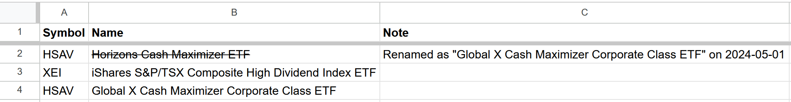
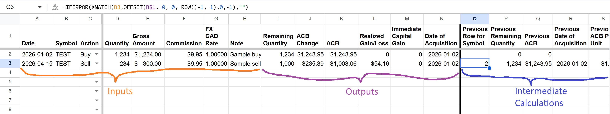
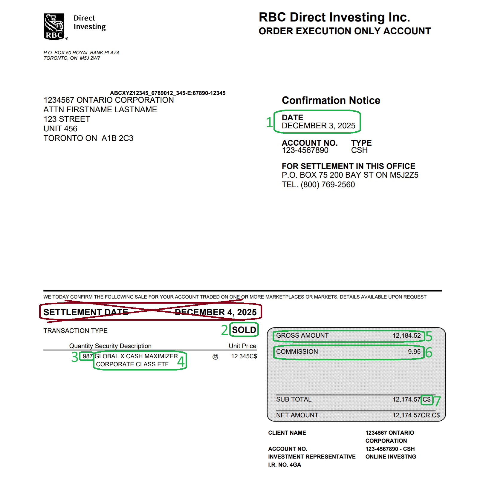

# Adjusted Cost Base (ACB) - Tracking

**Who this is for**: owners of a Canadian-controlled private corporation (CCPC) who hold investments in a corporate trading account.

This document focuses on the mechanics of tracking ACB.  
For a general overview see: [Adjusted Cost Base](Adjusted-Cost-Base.md)  

Tracking the ACB can be done with a single spreadsheet (one transaction per row).  
The primary place where this information is reported is T2 Schedule 6 (S6), but it can also be useful for reconciling brokerage statements.  

Limitations:
- Template handles transactions for Buy/Sell/ROC/Phantom
- Any other transaction types require custom handling
- This document only covers stocks and ETFs; other types of investments (real estate, etc.) are out of scope and might have different or additional rules  
- Tax information can change over time; the following is my understanding as of 2026 (see [Adjusted Cost Base](Adjusted-Cost-Base.md) for background)  

# Investment identification - security master

You need to identify investments for record keeping and T2 reporting.  

There are a number of different ways to identify an investment security:
- S6 asks for "Name of corporation in which the shares were held" and "Description of property"
- CDS similarly uses the fund name for the PDFs, but internally also contains "SYMBOL/SYMBOLE"
- Brokerage confirmations and statements will typically contain the security name, and may also contain the symbol
- Brokerage website typically highlights the symbol, possibly with a listing-specific suffix (e.g. ".TO")
- There are standardized ways of identifying an investment:
  - CUSIP is a nine-character alphanumeric code that uniquely identifies a North American financial security
  - ISIN is a 12 character global standard, it's less commonly used in North America
  - These might show up on some brokerage confirmations/statements, but they are not emphasized, with their main use being internal to the capital markets system

From time to time, it's possible for company/ETF names and their ticker symbols to change:  
- For example *Horizons ETFs* rebranded as *Global X* in 2024
- You might see a transaction line in your brokerage statement, where the old name/symbol is subtracted and the new name/symbol is added
- This is a purely cosmetic change, your ACB is not impacted
- You are responsible for keeping track of the latest name/symbol, and for correctly continuing the ACB calculation 

In common usage, it's easiest to refer to investments by their ticker symbol (e.g. this is what you'll see in online stock charts).  
In order to quickly determine the correct symbol and corresponding name, you can maintain a "Security Master".  
It is only used internally to facilitate consistent reporting, so it can be as minimal as Symbol / Name / Note:

# Spreadsheet template

Any spreadsheet software could be used (Excel, LibreOffice Calc, etc.), the example here uses Google Sheets.  

Go to the following, and click "Use Template" (top right) to create your own copy:  
https://docs.google.com/spreadsheets/d/1AV3RLfGw6l3G_az_2OpUHxRmTm5MwmkwPJHoPyNEBAM/template/preview

Screenshot:

You can keep this as a separate workbook, or as a single sheet within a larger workbook (if that is more convenient).  

# Inputs: what information is used

Inputs (from investment confirmations and T3):
- `Date`:
  - Buy/Sell: trade date (not settlement date)
  - ROC/Phantom: payment/distribution date
- `Symbol`: ETF or stock ticker
- `Action`: Buy, Sell, ROC, Phantom
- `Quantity`:
  - Shares or units
  - Use 0 or blank for ROC and Phantom
- `Gross Amount`:
  - Transaction currency amount, excluding commission
  - Buy: purchase amount
  - Sell: proceeds of disposition
  - ROC/Phantom: adjustment amount
- `Commission`:
  - Transaction currency fee charged by brokerage
  - Can leave blank if zero, which happens with ROC/Phantom, and sometimes for Buy/Sell depending on brokerage and security
- `FX CAD Rate`:
  - CAD per 1 unit of transaction currency (e.g. if 1 USD = 1.36 CAD, enter 1.36)
  - If transaction is denominated in CAD, use 1.0 or leave blank
  - Source: Bank of Canada indicative midpoint rate for the trade date (or payment date for ROC/Phantom); see [Adjusted-Cost-Base.md](Adjusted-Cost-Base.md) for the rate convention
  - If the BoC does not publish a rate for that date (e.g. a US-only trading day), use the rate from the nearest prior business day on which the BoC did publish
- `Note`:
  - Free-form text to capture any auxiliary information (e.g. if the given entry was audited)
  - Can leave blank if there is nothing particularly noteworthy about transaction

# Inputs: data entry

Rows must be entered in transaction order for each Symbol.  

Trading confirmation reporting is brokerage specific, you might see something slightly different.  
However, the basic elements highlighted (or equivalent variants) are common to all.

Example of Trade Confirmation (Sell, CAD):  

- #1 `Date`: trade date; do not use settlement date (crossed out above)
- #2 `Action`:
  - "Sell" for the example above (which labels the TRANSACTION TYPE = SOLD)
  - "Buy" can appear as "Bought" or similar
  - ROC / Phantom are entered from T3 slips (not trade confirmations)
- #3 `Quantity`
- #4 `Symbol`:
  - Might not be mentioned explicitly (as in above example, where only security name is provided)
  - Can be looked up (e.g. via Google), or maintained in a "Security Master" spreadsheet
- #5 `Gross Amount`
- #6 `Commission`
- #7 `FX CAD Rate`
  - Exchange rate might not be shown on trade confirmation
  - Currency is typically specified (as in above example, where "C$" means CAD)
  - If currency is not specified and you are not sure what it is, confirm it with your brokerage
  - If currency is CAD, then `FX CAD Rate` can be blank (or equivalently 1.0)
  - Exchange rate from CAD to the foreign currency is available on the Bank of Canada website (see [Adjusted-Cost-Base.md](Adjusted-Cost-Base.md) for the rate convention):  
    https://www.bankofcanada.ca/rates/exchange/daily-exchange-rates-lookup/

# Outputs: where to use them and how are they calculated

Outputs (cumulative per symbol):
- `Remaining Quantity` = `Previous Remaining Quantity` + `Quantity Change`  
  Can be used to match quantity in investment statements and brokerage website
- `ACB` = `Previous ACB` + `ACB Change`
- `ACB of Units Sold` = IF(`Action` = "Sell", `Quantity` * `Previous ACB Per Unit`, 0)  
  Entered in T2 S6
- `Capital Gain/Loss` = IF(`Action` = "Sell", `Net Proceeds CAD` - `ACB of Units Sold`, 0)
- `Deemed Capital Gain` = IF(`Action` = "ROC", MAX(0, `Gross Amount CAD` - `Previous ACB`), 0)  
  Reported in T2 S6 (as a separate line)
- `Date of Acquisition` =  
  &ensp; IF(AND(`Action` = "Buy", `Previous Remaining Quantity` = 0), `Date`, `Previous Date of Acquisition`)  
  Earliest date of continuous holding for the current pooled position, used in S6

# Intermediate calculations

- `Previous Row for Symbol` =  
  &ensp; IFERROR(  
  &ensp; &ensp; XMATCH(  
  &ensp; &ensp; &ensp; `Symbol`,  
  &ensp; &ensp; &ensp; OFFSET(`Symbol`$1, 0, 0, ROW() - 1, 1),  
  &ensp; &ensp; &ensp; 0, -1),  
  &ensp; &ensp; "")
- `Previous Remaining Quantity` =  
  &ensp; IF(`Previous Row for Symbol` = "", 0,  
  &ensp; &ensp; INDEX(`Remaining Quantity`:column, `Previous Row for Symbol`))
- `Previous ACB` =  
  &ensp; IF(`Previous Row for Symbol` = "", 0,  
  &ensp; &ensp; INDEX(`ACB`:column, `Previous Row for Symbol`))
- `Previous Date of Acquisition` =  
  &ensp; IF(`Previous Row for Symbol` = "", "",  
  &ensp; &ensp; INDEX(`Date of Acquisition`:column, `Previous Row for Symbol`))
- `Previous ACB Per Unit` =  
  &ensp; IF(`Previous Remaining Quantity` = 0, 0, `Previous ACB` / `Previous Remaining Quantity`)
- `Gross Amount CAD` = `Gross Amount` * `FX CAD Rate`
- `Commission CAD` = `Commission` * `FX CAD Rate`
- `Net Cost CAD` = IF(`Action` = "Buy", `Gross Amount CAD` + `Commission CAD`, 0)
- `Quantity Change` = IF(`Action` = "Buy", `Quantity`, IF(`Action` = "Sell", -`Quantity`, 0))
- `Net Proceeds CAD` = IF(`Action` = "Sell", `Gross Amount CAD` - `Commission CAD`, 0)
- `ACB Change - Buy` = IF(`Action` = "Buy", `Net Cost CAD`, 0)
- `ACB Change - Sell` = IF(`Action` = "Sell", -`ACB of Units Sold`, 0)
- `ACB Change - ROC` = IF(`Action` = "ROC",  
  &ensp; IF(`Gross Amount CAD` >= 0, -MIN(`Gross Amount CAD`, `Previous ACB`), -`Gross Amount CAD`), 0)
  - MIN caps the ACB reduction at the remaining ACB; any ROC that exceeds the remaining ACB is a deemed capital gain (ITA s.40(3)), tracked in the `Deemed Capital Gain` output column
- `ACB Change - Phantom` = IF(`Action` = "Phantom", `Gross Amount CAD`, 0)
- `ACB Change` = `ACB Change - Buy` + `ACB Change - Sell` + `ACB Change - ROC` + `ACB Change - Phantom`

# Notes

- For Buy, the commission increases ACB; for Sell, the commission reduces proceeds and is not part of ACB
- For ROC, keep the sign from the slip: a positive amount reduces ACB, and a negative amount increases ACB
- For T3 Box 21, only the phantom (non-cash) portion belongs in a Phantom row; the cash portion does not change ACB
- If a T3 slip aggregates multiple ROC or phantom distributions, split them into separate dated rows whenever possible, especially if there were intervening sales or FX differences
- Use the trade-date FX rate for Buy, Sell, and their commissions; use the payment/distribution-date FX rate for ROC and Phantom
- ACB cannot go below zero, if positive ROC is larger than `Previous ACB`, the excess is `Deemed Capital Gain` and `ACB` becomes zero
- `Remaining Quantity` should never go negative; if a sale would exceed current holdings, fix the input rather than allowing a negative balance
- If you fully dispose of a position and later buy it again, the `Date of Acquisition` resets on the new purchase
- This minimal template does not automate superficial loss, stock splits, or spin-offs; handle those with manual row edits:
  - Stock split: insert a memo row on the effective date — adjust `Quantity` to the post-split total (ACB unchanged, per-unit ACB recalculates automatically)
  - Spin-off: close the parent position with a zero-proceeds Sell on the effective date, then open two new Buy rows (one for the parent, one for the new entity) with quantities and ACB allocated based on relative fair market values on that date; see [Adjusted-Cost-Base.md](Adjusted-Cost-Base.md) for the allocation rule
  - Superficial loss: the denied loss is not deducted; instead add it to the ACB of the substituted property via a manual Buy-like row (no quantity change, ACB increase only)
- DRIP can be entered as Buy with `Commission` = 0; use the payment/reinvestment date (when the units are credited to your account) as `Date`, and the FX rate for that same date

# Related

- [Adjusted-Cost-Base.md](Adjusted-Cost-Base.md) — foundational ACB concepts, FX rate convention, and pooling rules this template implements
- [Bank of Canada daily exchange rates](https://www.bankofcanada.ca/rates/exchange/daily-exchange-rates-lookup/) — source for FX CAD Rate values

# Citations

- ITA [s.47(1)](https://laws-lois.justice.gc.ca/eng/acts/I-3.3/section-47.html) — pooled average cost (WAC) mandatory for identical properties

