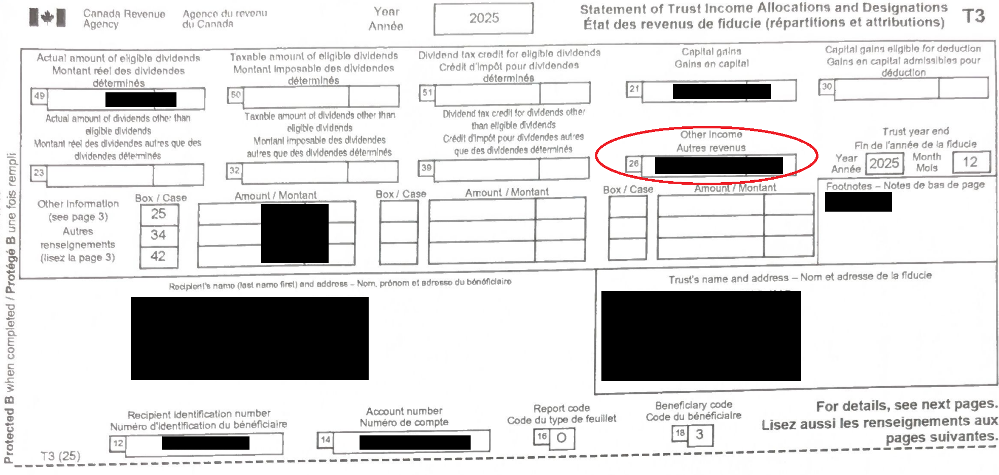
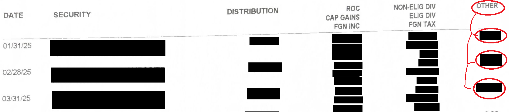
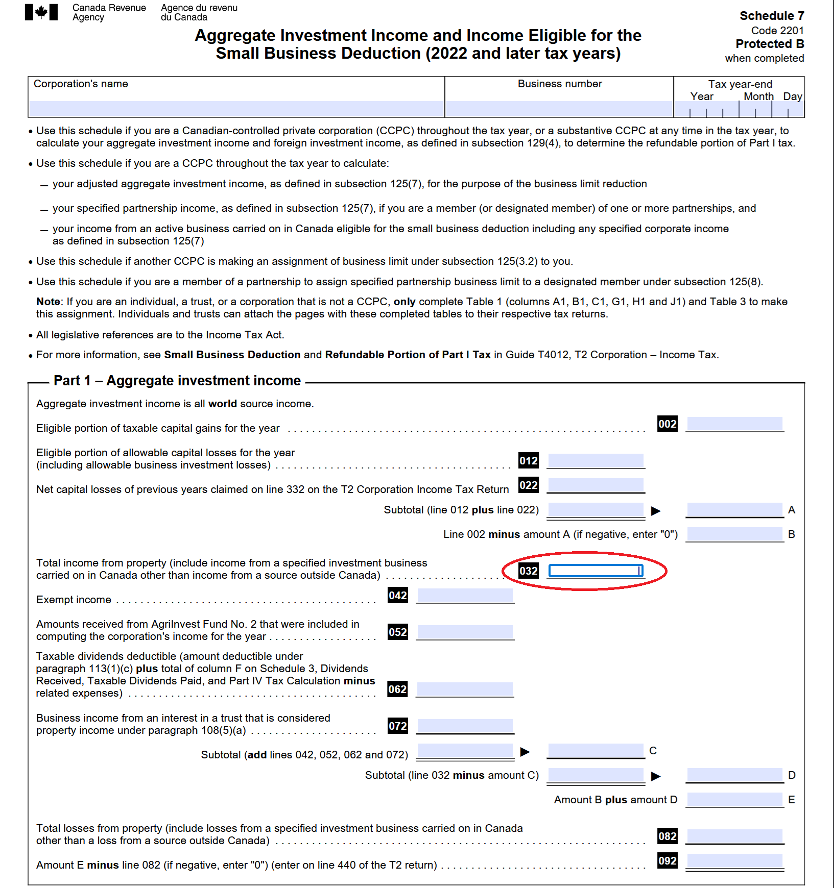
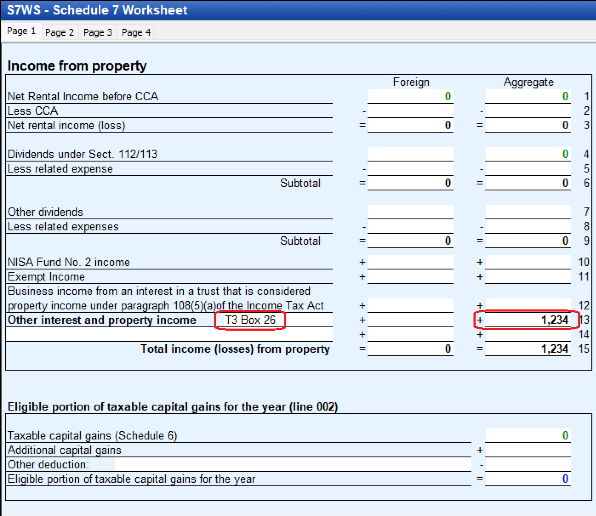

# T3 Box 26 - Other Income

See parent document: [T3](T3.md)  
**Who this is for**: owners of a Canadian-controlled private corporation (CCPC) who receive a T3 with box 26 amounts.  

CRA rules for corporate tax filing do not spell out granular details about what exactly to do with each T3 box.  
Presented here is one particular bookkeeping convention which is compatible with CRA requirements.  
If you choose a different bookkeeping convention, make sure that it is: consistently applied, logically self-consistent, and is consistent with T2 treatment.  

Limitations:
- This document only covers ETFs structured as a trust; other types of investments (e.g. direct real estate holdings or non-ETF trust investments) are out of scope and might have different or additional rules
- It is assumed that the corporation is resident in Canada, and the trust that issued the T3 is a vanilla ETF (e.g. VCN)
- Tax information can change over time; the following is my understanding as of 2026

# What does it look like

In the tax package from your brokerage, you might also find per-distribution details:  

If you need the underlying breakdown and did not receive it from your brokerage, you may also be able to find it here:  
https://ctbsext.posttrade.cds.ca/ctbsExt/external-landing  
You can also use this to calculate expected values to validate the T3 amounts.  

# Meaning and tax treatment

T3 Box 26 is *other income* allocated to a beneficiary of a trust.  
*Other income* can sit alongside other T3 income types in a single cash distribution.  

For example:
- If: your company holds an ETF structured as a trust, such as VCN
- When: the company receives a passive income distribution
- Then: a portion of that could be designated as T3 Box 26

In some contexts, *other income* is referred to as *property income*:
- Real estate rentals can generate T3 Box 26 *other income* (e.g. REIT ETF)
- However, it can also come from sources unrelated to real estate; *property income* is a tax term

Broadly speaking, income can be classified in different ways:
- *active* business vs *passive* non-business (i.e. investments or property rental)
- *ordinary* income taxed at 100% vs *preferential* treatment as capital gains (inclusion rate) or dividends (gross-up and credit)
- *resident* domestic recipient vs *non-resident* foreign recipient (outside the scope of this document)
- *Canadian-source* domestic payer vs *foreign-source* foreign payer
- *trust* issuer with T3 vs *corporation* that issues T5

Some examples of income that can show up in T3 Box 26 from a vanilla ETF:
- Canadian bonds - Canadian-sourced interest
- Canadian REITs - Primarily rental/property income
- Securities lending - Fee the ETF earns by lending out its shares

Active business carried on by the trust can also appear in Box 26, but does not apply to an ETF structured as a mutual fund trust (which cannot carry on a non-investment business without losing that status).

In general, the T3 Box 26 amount is a residual bucket and can represent both active and passive income:
- Whether the amount is treated as Active Business Income (ABI) or Aggregate Investment Income (AII) has tax consequences
- For a publicly traded ETF structured as a trust, Box 26 is typically AII:
  - There is no easy public official confirmation that a particular T3 Box 26 amount is not AII
  - Some checks you can perform that increase the likelihood that the T3 Box 26 amount is AII:
    - Locate the investment in Canadian Tax Breakdown Reporting Service: https://ctbsext.posttrade.cds.ca/ctbsExt/external-landing
    - Download the PDF, and confirm that the T3 Box 26 amount matches what is labelled "Other Income (Investment Income)"
    - You can also locate the prospectus, search for "Income Tax Considerations" or "Taxation of the Fund", and confirm it qualifies as a "mutual fund trust"
    - A mutual fund trust is meant to be an investment vehicle and generally cannot carry on a non-investment business if it wants to maintain that status
    - You can look for any T3 slip attachments or issuer tax notes related to T3 Box 26 (typically published on the ETF sponsor's website alongside the annual tax breakdown, e.g. under "Tax Information" or "Distributions")
    - These items support the conservative filing position for a plain-vanilla ETF, but they are not by themselves a binding CRA determination
  - There is usually no practical basis to treat Box 26 as ABI absent unusually strong issuer-specific facts
- In rare fact-specific situations, the AII result can be different, but that is outside the plain-vanilla ETF scope covered here
- If the T3 Box 26 amount is reported as AII, but arguably should have been treated as ABI, then you might pay higher tax than necessary:
  - This is a legally conservative filing position, but it can mean paying more tax than necessary
  - For simplicity, in this document we assume the amount is AII; this can result in paying slightly more tax than the alternative

For the plain-vanilla ETF case covered here, we can say:
- T3 Box 26 from an ETF represents *passive* investment income from a *trust*
- It is 100% taxable as *ordinary income* from a *Canadian-source*
- Other treatment of T3 Box 26 (e.g. from a trust with unusual non-plain-vanilla facts) is outside the scope of this document

Note that the slip type depends on the legal structure of the issuer:
- A trust or mutual fund trust generally reports through a T3
- A corporation may report certain investment income amounts through a T5
- The same broad economic idea of "ordinary income" does not by itself determine the slip type; the issuer's legal structure is significant

T3 Box 26 does not receive preferential tax treatment:
- T3 Box 26 income is subject to Part I tax
- Interest and *other income* are part of the corporate income calculation
- It does not benefit from the Capital Gains Inclusion Rate (Box 21), dividend tax treatment (Box 49), or change the cost base (Box 42)

How Box 26 can affect AII and NERDTOH:
- Generally:
  - ITA s.104(13) includes in the beneficiary's income amounts from the trust that became payable
  - ITA s.108(5)(a) generally deems those trust-beneficiary amounts to be income from a property that is an interest in the trust
  - ITA s.129(4) also carves out income that would not have been income from property but for ITA s.108(5)(a), so not every Box 26 amount from every trust necessarily feeds AII and NERDTOH in the same way
- For a vanilla index ETF that is structured as a mutual fund trust:
  - Box 26 will usually behave like property income and is commonly treated as part of Aggregate Investment Income (AII)
  - If an amount is part of AII for a CCPC, it can then contribute to Non-Eligible Refundable Dividend Tax on Hand (NERDTOH) through the broader formula in ITA s.129(4)
  - AII over $50,000 grinds the small business deduction under ITA [s.125(5.1)](https://laws-lois.justice.gc.ca/eng/acts/I-3.3/section-125.html): every dollar of AII above $50,000 reduces the $500,000 SBD business limit by $5, fully eliminating it at $150,000 of AII; active business income above the reduced limit is taxed at the general corporate rate instead of the small-business rate
  - The portion of Part I tax on AII that flows into NERDTOH (30⅔% of AII per s.129(4)) is recovered only when the corporation pays a non-eligible dividend

In terms of specific tax treatment, there are several concepts:
- Income Tax Act: the legal rules - what counts as income, dividends, capital gains, property income, etc.
- T2 return + schedules: reporting mechanism for the tax rules
- Bookkeeping + financial statements: your underlying records and classifications
- GIFI: CRA standardized coding for filing financial statements (income statement, balance sheet) with the T2

Practical treatment for T3 Box 26 from a vanilla index ETF (e.g. VCN or XEI):
- Include it in corporate income; it rolls up to GIFI 8299 on "Schedule 125 - Income statement information"
- Enter it as part of net income from property: Box 32 in Part 1 of Schedule 7 to calculate "Aggregate Investment Income" (AII)
- For Box 26 from a trust that is not a mutual fund trust (e.g. certain commercial or income trusts), or from a trust with active business income, the AII classification and Schedule 7 treatment may differ — outside the scope of this document

For the GIFI code:
- GIFI 8299 (Revenue) is a calculation, CRA does not mandate a specific GIFI code
- The following could all be consistent with CRA guidelines:
  - GIFI 8090 (Investment revenue)
  - GIFI 8230 (Other revenue)
  - GIFI 8094 (Interest from other Canadian sources), which rolls up to GIFI 8090, but only when the T3 Box 26 amount is actual interest (e.g. bond index ETF like ZAG)
- This document uses GIFI 8090 (Investment revenue), with a subaccount "Other investment income" (coded 8090-2)
- If the corporation also earns direct interest income (e.g. GIC interest, savings account interest), use GIFI 8094 for that amount and GIFI 8090 (ledger subaccount 8090-2) for the T3 Box 26 amount — keeping them in separate ledger accounts makes the Schedule 125 reconciliation cleaner and avoids mixing T3-sourced income with directly earned interest

For the Schedule 7 Box 32:
- Your T2 tax software will typically calculate this number
- CRA does not specify a standardized way to enter the information that goes into calculating Schedule 7 (S7) Box 32
- T2 software packages will typically have a "Schedule 7 Worksheet", which is proprietary to each T2 software
- If your software uses a Schedule 7 worksheet, you will need to enter the T3 Box 26 amount there (see example below)

# Relevant general ledger accounts

For the broader ledger tree, see: [T3](T3.md)  

Accounts typically involved in the T3 Box 26 workflow:
<table>
  <thead>
    <tr><th>Account</th><th>Code</th><th>Description</th></tr>
  </thead>
  <tbody>
    <tr><td>Assets</td><td>2599-valid</td><td></td></tr>
    <tr><td nowrap>&ensp; └ Current Assets</td><td>1599-calc</td><td></td></tr>
    <tr><td nowrap>&ensp; &ensp; └ Cash and deposits</td><td>1000</td><td></td></tr>
    <tr><td nowrap>&ensp; &ensp; &ensp; └ Deposits - investment</td><td>1002-2</td><td>Cash sitting in investment account</td></tr>
    <tr><td nowrap>&ensp; &ensp; └ Accounts receivable</td><td>1060-parent</td><td></td></tr>
    <tr><td nowrap>&ensp; &ensp; &ensp; └ Investment distributions receivable</td><td>1060-1</td><td>Distributions from investments declared in December but paid in January</td></tr>
    <tr><td>Revenue</td><td>8299-valid</td><td></td></tr>
    <tr><td nowrap>&ensp; └ Investment revenue</td><td>8090-parent</td><td></td></tr>
    <tr><td nowrap>&ensp; &ensp; └ Investment revenue - detail accounts</td><td>8090</td><td>Roll up into GIFI 8090</td></tr>
    <tr><td nowrap>&ensp; &ensp; &ensp; └ Investment revenue adjustment</td><td>8090-1</td><td>Plug when T3/T5 different vs investment account</td></tr>
    <tr><td nowrap>&ensp; &ensp; &ensp; └ Other investment income</td><td>8090-2</td><td>T3 box 26 Other income</td></tr>
    <tr><td nowrap>&ensp; &ensp; &ensp; └ TBD investment distributions</td><td>8090-3</td><td>Unclassified passive income (pending T3 in March) | eligible dividend / foreign / roc / interest income / etc.</td></tr>
    <tr><td nowrap>&ensp; &ensp; └ Interest from other Canadian sources</td><td>8094</td><td>Finance income, guaranteed investment certificates interest, interest on overpaid taxes, and loan interest</td></tr>
  </tbody>
</table>

In the ledger account tree, we want to roll up to the GIFI codes, but also add subaccounts where the codes are not granular enough (with -&lt;suffix&gt;).  
When filing GIFI coded financial statements, each code is considered individually, for example: 8090 is separate from 8094, even though 8094 is under 8090 in the hierarchy.  
GIFI codes: https://www.canada.ca/en/revenue-agency/services/forms-publications/publications/rc4088/general-index-financial-information-gifi.html

Note that CRA does not mandate specific GIFI account usage; what is presented here is one reasonable convention.  

# Ledger entries

Since CRA does not require specific ledger entries, here we adopt a particular bookkeeping convention that would generally be considered reasonable.  

During the year, distributions can be parked in a temporary account such as `TBD investment distributions` (8090-3).  
When the T3 arrives, the temporary entries can be reclassified to the final treatment for each box.  

If a distribution is properly receivable before year-end but the cash is paid in the following year, a receivable entry can be used for an accrual.  

If the amount is receivable before year-end and paid later:
- On the receivable date:
  - Debit: `Investment distributions receivable` (1060-1)
  - Credit: `TBD investment distributions` (8090-3)
- When the cash is paid:
  - Debit: `Deposits - investment` (1002-2)
  - Credit: `Investment distributions receivable` (1060-1)

If receipt and final classification are all within the same tax year, a simpler temporary entry can be used:
- Debit: `Deposits - investment` (1002-2)
- Credit: `TBD investment distributions` (8090-3)

When the T3 confirms the Box 26 amount, reclassify the temporary treatment:
- Debit: `TBD investment distributions` (8090-3)
- Credit: `Other investment income` (8090-2)

If the investment is generating Canadian interest income, such as a bond ETF, then:
- `Interest from other Canadian sources` (GIFI 8094) could be more appropriate
- If you choose to use this, make sure to do it consistently

# T2 schedule mapping

Income statement (Schedule 125) convention:
- `Other investment income` (GIFI 8090, using ledger subaccount 8090-2)

Balance-sheet (Schedule 100) convention:
- `Investment distributions receivable` (GIFI 1060, using ledger subaccount 1060-1) if receivable at year-end; or
- `Deposits - investment` (GIFI 1002, rolling up to 1000, using ledger subaccount 1002-2) once paid

Schedule 7 (assuming the classification is passive property income, as from a publicly traded ETF structured as a mutual fund trust):
- T2 Schedule 7, Part 1 Box 32: Aggregate investment income / Total income from property
- This is often done through a proprietary worksheet provided by the T2 software

# Software workflow example - FutureTax 2025.2

For Schedule 7 Box 32, some T2 software provides a worksheet for other interest and property income.  

If your software has such a worksheet:
- Label the entry clearly (for example "T3 Box 26") so it is easy to trace back to the slip
- Put the T3 Box 26 amount in the property-income area rather than in the dividend or foreign-income area

In FutureTax, the worksheet can be opened by double-clicking the Schedule 7 field, and looks like this:  

# Related

For the broader ledger tree, see the "Relevant general ledger accounts" section in [T3](T3.md).
For ACB interactions (Box 42 / ROC reducing ACB), see [Adjusted-Cost-Base.md](Adjusted-Cost-Base.md).

# Citations

- Income Tax Act (R.S.C., 1985, c. 1 (5th Supp.)):
  - [s.104](https://laws-lois.justice.gc.ca/eng/acts/I-3.3/section-104.html) - trust income allocations and amounts becoming payable to beneficiaries
  - [s.108](https://laws-lois.justice.gc.ca/eng/acts/I-3.3/section-108.html) - trust definitions and the deeming rule in s.108(5) for beneficiary income from a trust interest
  - [s.125](https://laws-lois.justice.gc.ca/eng/acts/I-3.3/section-125.html) - small business deduction and business-limit framework
  - [s.129](https://laws-lois.justice.gc.ca/eng/acts/I-3.3/section-129.html) - dividend refund mechanism, aggregate investment income, and non-eligible RDTOH
- CRA Form T3 - Statement of Trust Income Allocations and Designations: https://www.canada.ca/en/revenue-agency/services/forms-publications/forms/t3.html
- CRA T2 Schedule 7: https://www.canada.ca/en/revenue-agency/services/forms-publications/forms/t2sch7.html
- CRA RC4088 - General Index of Financial Information (GIFI): https://www.canada.ca/en/revenue-agency/services/forms-publications/publications/rc4088/general-index-financial-information-gifi.html
- CDS Canadian Tax Breakdown Reporting Service (CTBS): https://ctbsext.posttrade.cds.ca/ctbsExt/external-landing
