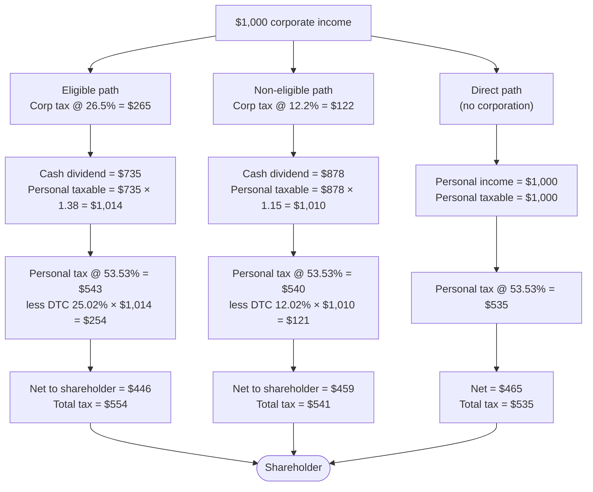

# Tax Integration

**Who this is for**: owners of a Canadian-controlled private corporation (CCPC) paying themselves dividends and trying to understand how the corporate-side and personal-side tax fit together.  

Limitations:
- Focus is on a single owner-manager shareholder of a CCPC; multiple share classes, family-trust structures, and estate-freeze arrangements are out of scope
- The shareholder is assumed to be a Canadian-resident *individual*; non-resident treatment is touched on only for capital dividends
- This page focuses on dividend integration; salary integration is trivial (deductible to the corporation, taxed once on the personal side as employment income)
- The salary-vs-dividend remuneration tradeoff (CPP, RRSP, payroll, WSIB) is out of scope; this page covers the dividend path only
- Tax information can change over time
- The following is my understanding as of 2026

## What is integration

*Integration* is the principle linking corporate and personal tax:
- There are two ways that a dollar of income can be earned:
  - Directly as an individual (personal income tax)
  - Flowing through a CCPC and out to shareholders (combined corporate + personal tax)
- The total tax for the above two scenarios should be roughly equal
- In effect, corporate income that is paid out as a dividend is not "double-taxed"

## Gross-up and dividend tax credit

The mechanism is the *dividend gross-up and tax credit*.  
When the corporation pays a dividend, the shareholder:
- Grosses up the cash dividend to a notional pre-corporate-tax amount
- Pays personal tax on the grossed-up amount
- Claims a *dividend tax credit* (DTC) calibrated to offset the corporate tax the corporation already paid

The federal gross-up and credit come from ITA [s.82(1)](https://laws-lois.justice.gc.ca/eng/acts/I-3.3/section-82.html) and [s.121](https://laws-lois.justice.gc.ca/eng/acts/I-3.3/section-121.html).  
Each province offers its own DTC at its own rate, so total integration depends on the shareholder's province of residence and marginal personal rate.  
Integration is approximate; different provinces and income sources produce small over- or under-taxation.  

## Integration by dividend flavour

*Eligible dividend*:
- Gross-up: 38% of cash dividend (ITA s.82(1))
- Federal DTC: 15.0198% of the grossed-up (taxable) amount (ITA s.121)
- The gross-up reflects the full general-rate corporate tax (~15% federal + the provincial general rate)
- Eligible dividends carry the lowest combined corp+personal tax of the two taxable flavours, when the corporation actually paid tax at the general rate

*Non-eligible dividend*:
- Gross-up: 15% of cash dividend (ITA s.82(1))
- Federal DTC: 9.0301% of the grossed-up amount (ITA s.121)
- The smaller gross-up and credit reflect the lower SBD-rate corporate tax the corporation paid before distributing
- Combined corp+personal tax is calibrated to the SBD corp rate; the actual relative position vs. an eligible dividend depends on the shareholder's province

*Capital dividend*:
- Not included in the shareholder's income at all (ITA [s.83(2)(b)](https://laws-lois.justice.gc.ca/eng/acts/I-3.3/section-83.html))
- No gross-up, no DTC, not reported on the T1
- The "tax already paid" at the corporate level is the tax on the *taxable* portion of the underlying capital gain; the *non-taxable* portion is what flows out tax-free as the capital dividend
- Integration on capital gains earned in a CCPC is imperfect: the AII path (taxable half taxed at ~50%, partly refunded via NERDTOH on payout of a non-eligible dividend) typically leaves a small "tax cost" vs. realizing the gain personally, depending on province
- For non-resident shareholders this treatment does not apply: Part XIII withholding still applies (default 25%, often reduced by treaty)

## Corp-side preference order

For an owner-manager who has access to all three accounts, the integration framework gives a corp-side preference order:
1. *Capital dividend* first (tax-free to the shareholder; constrained only by CDA balance and the s.83(2) election)
2. *Eligible dividend* next (lower combined tax than non-eligible; available only to the extent of GRIP)
3. *Non-eligible dividend* as the residual (always available; highest combined tax)

Often CDA and GRIP are both empty; the only available option is a non-eligible dividend.  

## Worked example

Assumptions: $1,000 of corporate income, Ontario, shareholder at top marginal rate (53.53%).  
Combined corporate rates: SBD 12.2% (federal 9% + Ontario 3.2%), general 26.5% (federal 15% + Ontario 11.5%).  
DTC rates as % of the grossed-up (taxable) amount: eligible 25.02% (federal 15.02% + Ontario 10.0%), non-eligible 12.02% (federal 9.03% + Ontario 2.99%).  

Reading the bottom row:
- Direct: total tax \$535, net \$465 — the integration target
- Non-eligible: total tax \$541, net \$459 — slight under-integration (~\$6 leakage)
- Eligible: total tax \$554, net \$446 — slight under-integration (~\$19 leakage)

The leakage on the eligible path is larger here because Ontario's combined general corporate rate (26.5%) plus the DTC don't perfectly match the gross-up's notional 27.5% corporate rate, and the DTC isn't fully tuned to the top marginal personal bracket.  
In other provinces, or at lower personal rates, the ranking between eligible and non-eligible can flip.  

## Related

- [Small Business Tax Overview](Small-Business-Tax-Overview.md)
- [Shareholder Dividends](Shareholder-Dividends.md)
- [Capital Dividend Account](Capital-Dividend-Account.md)

## Citations

- Income Tax Act (R.S.C., 1985, c. 1 (5th Supp.)):
  - [s.82(1)](https://laws-lois.justice.gc.ca/eng/acts/I-3.3/section-82.html) - dividend gross-up on the personal return
  - [s.121](https://laws-lois.justice.gc.ca/eng/acts/I-3.3/section-121.html) - federal dividend tax credit
  - [s.83(2)](https://laws-lois.justice.gc.ca/eng/acts/I-3.3/section-83.html) - capital dividend election; s.83(2)(b) excludes the capital dividend from the shareholder's income
  - [s.212(2)](https://laws-lois.justice.gc.ca/eng/acts/I-3.3/section-212.html) - Part XIII withholding tax on dividends paid to non-residents (including capital dividends)
- CRA - Canadian income tax rates for individuals (federal and provincial brackets, including provincial DTC rates): https://www.canada.ca/en/revenue-agency/services/tax/individuals/frequently-asked-questions-individuals/canadian-income-tax-rates-individuals-current-previous-years.html
