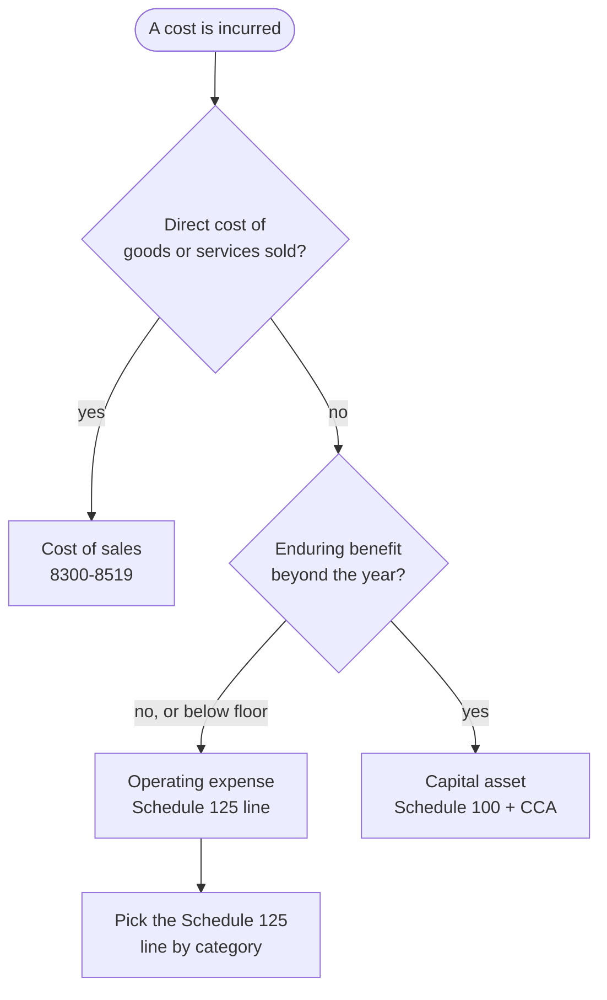

STATUS: AI GENERATED, REVIEW IN PROGRESS

# Expense Classification

**Who this is for**:
- Owners of a Canadian-controlled private corporation (CCPC) who post costs to GIFI codes for the books and the T2

Every cost the corporation incurs lands on a *GIFI* code.  
GIFI is the *General Index of Financial Information*, CRA's standardized chart of accounts (RC4088).  
Operating expenses are reported on Schedule 125 (the income statement).  
Capital assets sit on Schedule 100 (the balance sheet) and are deducted over time through capital cost allowance.  
This page covers the income-statement side.  
It works through whether a cost is a current expense or a capital asset, and which Schedule 125 line it belongs on.  
For the definition of GIFI itself see [Glossary](../Overview/Glossary.md); for the balance-sheet and CCA side see [Capital Cost Allowance](../Operations/Cost-Recovery/Capital-Cost-Allowance/Capital-Cost-Allowance.md).  

Limitations:
- Covers the operating-expense lines an owner-managed service or consulting CCPC actually uses
  - The full RC4088 listing has hundreds of codes for industries out of scope here
- GIFI codes and CRA rules can change; verify a code against the current RC4088 before filing
- The following is my understanding as of 2026

## GIFI and Schedule 125

- *Schedule 125* (S125): the income statement — revenue (codes 8000–8299) and expenses (8300–9369)
  - Farming codes 9370–9899 are out of scope here
- *Schedule 100* (S100): the balance sheet — assets, liabilities, and equity (codes 1000–3849)
- Operating expenses occupy the 8520–9369 band
  - Cost of sales sits separately at 8300–8519 (see [Cost of Sales Is Separate](#cost-of-sales-is-separate))
- *GIFI-Short* (Form T1178): a condensed GIFI form for smaller corporations
  - It uses the same code numbers, so the line you pick here is the same either way
- Codes come in rollup and detail pairs; reporting at the rollup level is fine for a small corp
  - `9150` Computer-related expenses is a rollup, `9152` Internet a detail beneath it

Pick the most specific line that fits, and use the same line for the same kind of cost every year.  
Consistency matters more than the choice between two defensible lines.  

## Capitalize or Expense

The first decision for any cost is whether it is consumed now or delivers an enduring benefit:

- *Current expense*: consumed within the year (rent, subscriptions, supplies, professional fees) → Schedule 125
  - Deducted in full this year under the ITA [s.9(1)](https://laws-lois.justice.gc.ca/eng/acts/I-3.3/section-9.html) profit computation
  - Subject to the income-earning-purpose limitation in [s.18(1)(a)](https://laws-lois.justice.gc.ca/eng/acts/I-3.3/section-18.html)
- *Capital asset*: lasting benefit beyond the year (a laptop, equipment, a perpetual software licence) → Schedule 100
  - Deducted over time as CCA (ITA [s.18(1)(b)](https://laws-lois.justice.gc.ca/eng/acts/I-3.3/section-18.html), [s.20(1)(a)](https://laws-lois.justice.gc.ca/eng/acts/I-3.3/section-20.html))

A small corp typically sets a *capitalization floor* (commonly $500).  
Purchases below it are expensed even if they last, to avoid tracking trivial assets.  
The floor is a bookkeeping policy applied consistently, not a statutory threshold.  

For CCA classes, the half-year rule, and the Accelerated Investment Incentive, see [Capital Cost Allowance](../Operations/Cost-Recovery/Capital-Cost-Allowance/Capital-Cost-Allowance.md).  
For what gets folded into the cost of an asset or inventory rather than expensed, see [Cost Recovery](../Operations/Cost-Recovery/Cost-Recovery.md).  

## Operating-Expense Reference (Schedule 125)

The lines an owner-managed service or consulting CCPC reaches for, with what belongs on each.  
Titles are from RC4088; the full index has many more.  

| Code | Title | What goes here |
|------|-------|----------------|
| `8520` | Advertising and promotion | advertising, website and ad spend, promotional material |
| `8523` | Meals and entertainment | client meals and entertainment (income-tax deduction limited to 50%, ITA [s.67.1](https://laws-lois.justice.gc.ca/eng/acts/I-3.3/section-67.1.html)) |
| `8690` | Insurance | commercial general liability, professional liability (errors and omissions), property insurance |
| `8710` | Interest and bank charges | interest, bank fees, merchant charges (`8715` Bank charges is the detail line) |
| `8760` | Business taxes, licences, and memberships | business licences, professional dues, association memberships |
| `8810` | Office expenses | general office costs with no more specific line |
| `8811` | Office stationery and supplies | paper, printer supplies, postage |
| `8860` | Professional fees | outside professionals; details: `8861` Legal, `8862` Accounting, `8863` Consulting |
| `8871` | Management and administration fees | management or admin fees paid to another party |
| `8910` | Rental | rent for office or equipment (`8911` Real estate rental, `8914` Equipment rental) |
| `8960` | Repairs and maintenance | repairs to business property and equipment |
| `9060` | Salaries and wages | employee pay; `9064` Directors fees, `9065` Management salaries, `9066` Employee salaries |
| `9110` | Sub-contracts | contract or sub-contract labour (an independent contractor, not an employee) |
| `9130` | Supplies | consumable supplies; `9131` Small tools for tools below the capitalization floor |
| `9150` | Computer-related expenses | software and SaaS subscriptions, hosting, expensed peripherals; `9152` Internet |
| `9180` | Property taxes | property tax on business real estate |
| `9200` | Travel expenses | business travel, lodging, transportation (`9201` Meetings and conventions) |
| `9220` | Utilities | electricity, water, heat, fuel; `9225` Telephone and telecommunications for connectivity |
| `9270` | Other expenses | costs with no more specific line; a catch-all, not a default |
| `9281` | Vehicle expenses | fuel, insurance, repairs, and running costs of a business vehicle |

Placement notes:
- *Salary vs sub-contract vs management fee*: the payee picks the line
  - An employee → `9060`; an arm's-length contractor → `9110`; a management fee to a related service entity → `8871`
  - The distinction drives source-deduction and T4 / T4A obligations, not just the code
- *Telephone and internet*: a standalone connectivity cost can sit at `9225` (telecom) or `9152` (internet)
  - Pick one and keep it there
- *Other expenses*: use `9270` only when nothing more specific fits; a reviewer reads a large "Other" balance as miscoding

## Computer and Software Costs

This is where owner-managers most often hesitate.  
The split follows the capitalize-or-expense fork:

- *SaaS and cloud subscriptions* (Microsoft 365, GitHub, an AI-assistant subscription, hosting): `9150`
  - A recurring service consumed as you go → an operating expense; never capitalized, regardless of annual cost
- *Expensed hardware and peripherals* below the capitalization floor (a $120 keyboard, a $300 monitor): `9150`
  - Or `9131` Small tools under Supplies; pick a convention and stay with it
- *Capitalized hardware* (a laptop, a workstation): a capital asset → Schedule 100 `1774` Computer equipment/software
  - Then CCA as Class 50
- *Standalone application software* bought outright (a perpetual licence): capital → Class 12
  - 100% rate, but the half-year rule applies
  - Systems software bundled with hardware follows the hardware into Class 50

A recurring software subscription (month-to-month or annual SaaS) is `9150`.  
The laptop you run it on is `1774` and depreciates.  
`8810` Office expenses is a defensible alternative home for software, but `9150` is the more precise line.  
For the asset-side mechanics (Class 50, Class 12, the half-year rule, the AIIP), see [Capital Cost Allowance](../Operations/Cost-Recovery/Capital-Cost-Allowance/Capital-Cost-Allowance.md).  

## HST and the Booked Amount

The GIFI line a cost goes on never changes with the HST method; the *amount* booked to that line does.

- *Regular method*: post the expense net of HST and claim the HST as an input tax credit
  - The HST sits in `HST receivable`, not in the expense
- *Quick Method*: no input tax credit is claimed on operating purchases, so the HST stays in the cost
  - Post the tax-included total to the expense line
  - Capital purchases keep their ITC even under the Quick Method

Worked example (an annual software subscription billed in CAD at $1,000 + 13% HST = $1,130, Ontario):

Regular method:
- Debit `Computer-related expenses` (GIFI 9150) = $1,000
- Debit `HST receivable` = $130
- Credit `Cash` = $1,130

Quick Method:
- Debit `Computer-related expenses` (GIFI 9150) = $1,130
- Credit `Cash` = $1,130

Under the Quick Method the deductible expense is $1,130 instead of $1,000.  
The unclaimed HST rides along in the expense, the trade-off for keeping the remittance spread on the revenue side.  
For the method rules, eligibility, and the revenue-side mechanics, see [HST](../Operations/HST.md#quick-method).  

## Cost of Sales Is Separate

Costs that go directly into producing the goods or services sold are *cost of sales*, not operating expenses.  
They are reported in a distinct Schedule 125 block (8300–8519) and rolled to `8518` Cost of sales.  
The block holds opening and closing inventory, purchases, direct wages, sub-contracts, and freight-in.  
A pure service consultant with no inventory usually has nothing here.  
For inventory costing, the COGS identity, and which channel a cost belongs to, see [Inventory and COGS](../Operations/Cost-Recovery/Inventory-And-COGS.md) and [Cost Recovery](../Operations/Cost-Recovery/Cost-Recovery.md).  

## Related

- [Ledger and Accounts](Ledger-And-Accounts.md)
- [Cost Recovery](../Operations/Cost-Recovery/Cost-Recovery.md)
- [Capital Cost Allowance](../Operations/Cost-Recovery/Capital-Cost-Allowance/Capital-Cost-Allowance.md)
- [Inventory and COGS](../Operations/Cost-Recovery/Inventory-And-COGS.md)
- [HST](../Operations/HST.md)
- [Foreign Currency](Foreign-Currency/Foreign-Currency.md)
- [Small Business Tax Overview](../Overview/Small-Business-Tax.md)
- [Glossary](../Overview/Glossary.md)

## Citations

- CRA RC4088, *General Index of Financial Information (GIFI)*: the complete code listing
- CRA T4012, *T2 Corporation Income Tax Guide*: Schedule 125 and Schedule 100 reporting
- CRA T2 *Schedule 125*, Income Statement Information; Form *T1178*, GIFI-Short
- Income Tax Act:
  - [s.9(1)](https://laws-lois.justice.gc.ca/eng/acts/I-3.3/section-9.html) - profit computation
  - [s.18(1)(a)](https://laws-lois.justice.gc.ca/eng/acts/I-3.3/section-18.html) - general limitation, income-earning purpose
  - [s.18(1)(b)](https://laws-lois.justice.gc.ca/eng/acts/I-3.3/section-18.html) - capital outlay
  - [s.20(1)(a)](https://laws-lois.justice.gc.ca/eng/acts/I-3.3/section-20.html) - CCA
  - [s.67.1](https://laws-lois.justice.gc.ca/eng/acts/I-3.3/section-67.1.html) - meals and entertainment 50% limit
- Excise Tax Act [s.227](https://laws-lois.justice.gc.ca/eng/acts/E-15/section-227.html) (Quick Method)

## TODO

- Verify every code against the current RC4088 at sign-off
- Confirm the 8910-area rent boundary (8910 Rental vs 8911 Real estate rental vs 8912 Occupancy costs)
  - Check against how the corp's lease is structured
- Settle a house convention for telephone and internet (`9225` vs `9152`); apply it across worked examples in other pages
