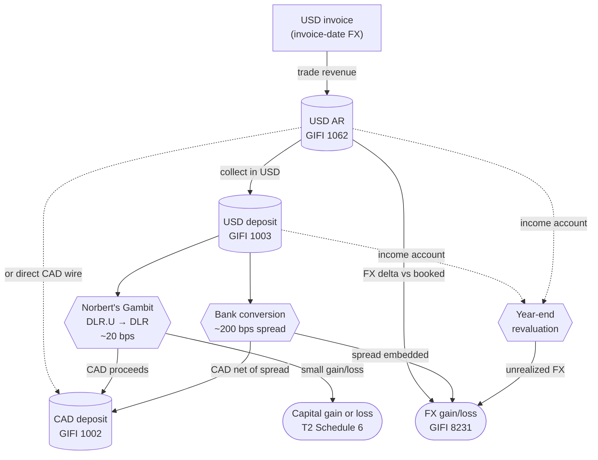

STATUS: AI GENERATED, REVIEW IN PROGRESS

# Foreign Currency <!-- [done] -->

**Who this is for**:
- Owners of a Canadian-controlled private corporation (CCPC) with USD accounts, invoicing, investments, or conversions

**TLDR**:
- Corporate tax is reported in CAD; USD-native accounts are translated at year-end to the balance sheet (Schedule 100)
- When a ledger entry converts a foreign amount to CAD, this guide uses the *Bank of Canada* (BoC) rate
  - Amounts already converted to CAD (the bank's settlement of a conversion, a T-slip) are booked as-is
- FX rate convention follows the *transaction date*:
  - Invoice date for revenue; trade date for securities and commissions; payment date for distributions
  - Year-end closing rate for revaluation of *monetary items*
- FX gain/loss *character* follows the underlying transaction:
  - *Income account*: operating receivables, payables, and cash from operations
  - *Capital account*: foreign securities and USD held to acquire securities
- This guide uses a *multi-currency native* bookkeeping convention (see [Bookkeeping convention](Bookkeeping-Convention.md)):
  - Each ledger account has one native currency; cross-currency entries bridge through per-currency FX accounts
  - Year-end revaluation nets the FX accounts into *Foreign exchange gains/losses* on the income statement (Schedule 125)
- Converting CAD↔USD at your bank can be expensive; *Norbert's Gambit* avoids the spread via a corporate trading account
- Invoices to a non-resident US customer for services are *zero-rated* GST/HST
  - Excise Tax Act, Schedule VI, Part V; full mechanics in [HST](../../Operations/HST/HST.md)

Limitations:
- Focus is on CAD↔USD for a typical owner-managed CCPC consultant or investor
  - Other currency pairs (EUR, GBP) follow the same mechanics by analogy but specific rates and broker products differ
- *Functional currency* election (ITA s.261) is out of scope
  - It is a multinational filing for corporations whose primary books-and-records currency is not CAD
- Foreign-securities slips and ACB mechanics live in [T3](../../Investments/T3/T3.md) and [Adjusted Cost Base](../../Investments/Adjusted-Cost-Base/Adjusted-Cost-Base.md); this page covers only the FX layer
  - T3 covers Box 25/34 foreign income and the Schedule 21 foreign tax credit
- *Hedging* (forward contracts, currency swaps) and derivative tax mechanics are out of scope
- Broker support for Norbert's Gambit can change
  - Broker notes on the [Norbert's Gambit](Norberts-Gambit.md) sub-page reflect their 2026 state
- Tax rules change over time (e.g. the proposed increase of the capital gains inclusion rate to 2/3 was cancelled)
- The following is my understanding as of 2026

## Sub-Pages

This page is a hub; these are the sub-pages:
- [FX rates and character](FX-Rates-And-Character.md): reporting currency, which rate to use when, and income- vs capital-account FX
- [Bookkeeping convention](Bookkeeping-Convention.md): the multi-currency and single-currency ledger conventions, and the GIFI account map
- [Getting paid in USD](Getting-Paid-In-USD.md): invoicing US clients, year-end retranslation, zero-rated/taxable HST, and W-8BEN-E
- [Bank conversions](Bank-Conversions.md): the embedded CAD↔USD spread and how it surfaces at revaluation
- [Norbert's Gambit](Norberts-Gambit.md): efficient USD↔CAD conversion via DLR / DLR.U
- [Year-end USD deposit](Year-End-USD-Deposit.md): year-end treatment of a USD cash balance

## Currency Flow

## Edge Cases

- *USD-denominated capital assets*: foreign securities in a corporate trading account follow [Adjusted Cost Base](../../Investments/Adjusted-Cost-Base/Adjusted-Cost-Base.md)
  - Trade-date FX for purchases, sales, and commissions; payment-date FX for distributions
  - The FX layer here is the ACB workflow's mirror image
- *Foreign tax withheld on USD distributions*: see [T3](../../Investments/T3/T3.md) for the Box 25 / Box 34 walkthrough
  - Withholding tax is grossed up on Schedule 7; the foreign tax credit is claimed on Schedule 21
- *USD credit card paying CAD bills*: the foreign-currency liability is settled at the statement-conversion FX
  - Record at the transaction date; recognize the FX gain or loss on statement settlement
- *Triangular conversions* (USD → EUR → CAD): each leg is a separate disposition; out of scope here
  - The intermediate currency is itself property
- *Hedging instruments* (forward contracts, currency swaps): out of scope
  - Can produce capital- or income-account FX depending on the underlying purpose
- *Functional currency election* (ITA s.261): mentioned in [FX rates and character](FX-Rates-And-Character.md); not re-explained here
- *Cross-listed equities* (same security on TSX and NYSE, e.g. RY): [Norbert's Gambit](Norberts-Gambit.md) also works using these names
  - Unit-value risk during the journal window is real: the underlying is an equity, not USD cash
  - DLR / DLR.U avoids this risk and is the practical default
- *Brokerage cash sweep* in USD: typically pays a small USD-denominated yield
  - The yield is foreign interest income; its FX follows the payment-date convention

## Related

- [Small Business Tax Overview](../../Overview/Small-Business-Tax.md)
- [Adjusted Cost Base](../../Investments/Adjusted-Cost-Base/Adjusted-Cost-Base.md)
- [Adjusted Cost Base — Tracking](../../Investments/Adjusted-Cost-Base/Adjusted-Cost-Base-Tracking.md)
- [T3](../../Investments/T3/T3.md)
- [T5008](../../Investments/T5008/T5008.md)
- [T1135](../../Investments/T1135.md)
- [HST](../../Operations/HST/HST.md)
- [Ledger and Accounts](../Ledger-And-Accounts.md)
- [Expense Classification](../Expense-Classification.md)
- [Inventory](../../Operations/Cost-Recovery/Inventory-And-COGS.md)
- [Glossary](../../Overview/Glossary.md)
- [Whole-dollar rounding](../../Filing-And-CRA/Whole-Dollar-Rounding.md)

## Citations

- Income Tax Act (R.S.C., 1985, c. 1 (5th Supp.)):
  - [s.38](https://laws-lois.justice.gc.ca/eng/acts/I-3.3/section-38.html) - taxable capital gain inclusion rate (one-half)
  - [s.39(1)](https://laws-lois.justice.gc.ca/eng/acts/I-3.3/section-39.html) - capital gain and loss definitions (including a disposition of foreign currency on capital account)
  - [s.39(1.1)](https://laws-lois.justice.gc.ca/eng/acts/I-3.3/section-39.html) - $200 personal FX de minimis (individuals only; does not apply to corporations)
  - [s.39(2)](https://laws-lois.justice.gc.ca/eng/acts/I-3.3/section-39.html) - capital FX gain or loss without a disposition, such as settling a foreign-currency capital obligation
    - A disposition of foreign currency itself is a s.39(1)/s.40 capital gain
  - [s.40(1)](https://laws-lois.justice.gc.ca/eng/acts/I-3.3/section-40.html) - general capital-gain-on-disposition formula
  - [s.47(1)](https://laws-lois.justice.gc.ca/eng/acts/I-3.3/section-47.html) - identical-properties pooling (relevant for DLR / DLR.U as the same fund)
  - [s.54](https://laws-lois.justice.gc.ca/eng/acts/I-3.3/section-54.html) - definition of "adjusted cost base"
  - [s.261](https://laws-lois.justice.gc.ca/eng/acts/I-3.3/section-261.html) - functional currency election and acceptable exchange-rate sources
- Excise Tax Act (R.S.C., 1985, c. E-15):
  - Schedule VI, Part V, section 7 - zero-rated general services to non-residents
  - Schedule VI, Part V, section 23 - zero-rated advisory, professional, or consulting services to non-residents
  - [s.148](https://laws-lois.justice.gc.ca/eng/acts/E-15/section-148.html) - small-supplier threshold (zero-rated supplies count toward the $30,000 test)
  - [s.159](https://laws-lois.justice.gc.ca/eng/acts/E-15/section-159.html) - conversion of foreign-currency consideration to CAD at the HST tax-point date
  - [s.168(1)](https://laws-lois.justice.gc.ca/eng/acts/E-15/section-168.html) - HST payable on the earlier of payment and consideration becoming due (the tax-point date)
- CRA publications:
  - CRA archived IT-95R - *Foreign Exchange Gains and Losses* (paragraphs 8 and 9 on accrual vs settlement for income-account vs capital-account FX): https://www.canada.ca/en/revenue-agency/services/forms-publications/publications/it95r/archived-foreign-exchange-gains-losses.html
  - CRA Income Tax Folio S5-F4-C1 - *Income Tax Reporting Currency*: https://www.canada.ca/en/revenue-agency/services/tax/technical-information/income-tax/income-tax-folios-index/series-5-international-residency/series-5-international-residency-folio-4-foreign-currency/income-tax-folio-s5-f4-c1-income-tax-reporting-currency.html
  - CRA GST/HST Memorandum 4.5.3 - *Exports — Services and Intellectual Property*: https://www.canada.ca/en/revenue-agency/services/forms-publications/publications/4-5-3/exports-services-intangible-personal-property.html
  - CRA GST/HST Memorandum 4.5.1 - *Exports — Determining Residence Status*: https://www.canada.ca/en/revenue-agency/services/forms-publications/publications/4-5-1/exports-determining-residence-status.html
  - CRA RC4022 - *General Information for GST/HST Registrants*: https://www.canada.ca/en/revenue-agency/services/forms-publications/publications/rc4022/general-information-gst-hst-registrants.html
  - CRA RC4058 - *Quick Method of Accounting for GST/HST*: https://www.canada.ca/en/revenue-agency/services/forms-publications/publications/rc4058/quick-method-accounting-gst-hst.html
  - CRA RC4088 - *General Index of Financial Information (GIFI)*: https://www.canada.ca/en/revenue-agency/services/forms-publications/publications/rc4088/general-index-financial-information-gifi.html
  - CRA T2 Schedule 6 - *Summary of Dispositions of Capital Property*: https://www.canada.ca/en/revenue-agency/services/forms-publications/forms/t2sch6.html
  - CRA Form T1296 - *Election, or Revocation of an Election, to Report in a Functional Currency*: https://www.canada.ca/en/revenue-agency/services/forms-publications/forms/t1296.html
- Bank of Canada daily exchange rates: https://www.bankofcanada.ca/rates/exchange/daily-exchange-rates/

## Links

- finiki — *Norbert's gambit*: https://www.finiki.org/wiki/Norbert%27s_gambit
- Canadian Couch Potato — *Taxable Consequences of Norbert's Gambit*: https://canadiancouchpotato.com/2015/02/26/taxable-consequences-of-norberts-gambit/
- Global X — DLR product page: https://www.globalx.ca/product/dlr
- Canadian Securities Administrators — T+1 settlement announcement: https://www.securities-administrators.ca/news/canadian-securities-regulators-announce-move-to-t1-settlement-cycle/
- IRS Form W-8BEN-E (PDF): https://www.irs.gov/pub/irs-pdf/fw8bene.pdf

## TODO

- Zero-rated and taxable-supply HST notes now cross-link [HST](../../Operations/HST/HST.md) (tax-point and s.159 conversion)
  - Revisit the overlap on a maintainer sign-off pass
- Add FX-specific terms to [Glossary](../../Overview/Glossary.md) on a separate maintainer pass:
  - BoC daily rate, functional currency election, income-account FX, capital-account FX, monetary item
  - Multi-currency bookkeeping convention, FX trading account, Norbert's Gambit, journal (broker)
  - Settlement-date rate, realized FX, unrealized FX
- Worked example for a USD payable to a foreign supplier (the mirror of the USD-AR example)
  - Useful for inventory-importing CCPCs; partly covered in [Inventory](../../Operations/Cost-Recovery/Inventory-And-COGS.md) Example 2
- A short companion section, if and when the maintainer signs off this page, comparing two workflows:
  - Bank-statement-driven: record at the bank's actual settlement rate, reconcile to BoC monthly
  - BoC-driven: record at the BoC daily rate, reconcile to the bank at year-end
