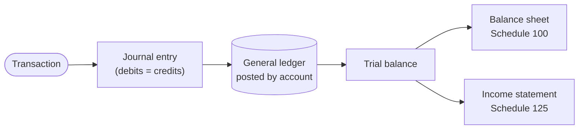

STATUS: AI GENERATED, REVIEW IN PROGRESS

# Ledger and Accounts

**Who this is for**:
- Owners of a Canadian-controlled private corporation (CCPC) who keep the corporation's double-entry books themselves

Every figure on the T2 traces back to the corporation's *books*.  
The books are the running double-entry record of every transaction in the year.  
This page is the mechanics:
- How an entry is written, and why debits equal credits
- How the ledger rolls into a trial balance
- How the chart of accounts maps to the GIFI schedules

For *which* line a cost belongs on, and whether it is an expense or a capital asset, see [Expense Classification](Expense-Classification.md).  

Limitations:
- Double-entry and the chart of accounts are bookkeeping conventions, not statutory rules, except where cited
  - The duty to keep books at all is ITA s.230
- Covers an owner-managed service or consulting CCPC kept on accrual + tax basis; other arrangements are out of scope
- GIFI codes can change; verify a code against the current RC4088 before filing
- The following is my understanding as of 2026


## The Accounting Equation

The whole system rests on one identity:

`Assets = Liabilities + Equity`

Everything the corporation owns (assets) is financed by what it owes (liabilities) or by the owners' stake (equity).  
The identity holds after *every* transaction, because each transaction is recorded in two places that keep it balanced.  

Equity itself moves with the year's results:

`Equity = share capital + retained earnings`  
`Retained earnings = opening + revenue − expenses − dividends`

Revenue, expenses, and dividends are sub-balances of equity that the books track separately during the year.  
At year-end they fold into retained earnings (the *close*).  

A transaction travels the same path every time on its way to the T2:




## Accounts and the Five Types

Every account in the chart of accounts is one of five types.  
The type fixes which financial statement the account lands on and which side increases it:
- *Asset*: something the corporation owns or is owed (cash, accounts receivable, equipment); balance sheet, Schedule 100
- *Liability*: something the corporation owes (a payable, an HST balance, a shareholder loan); balance sheet, Schedule 100
- *Equity*: the owners' residual stake (share capital, retained earnings); balance sheet, Schedule 100
- *Revenue*: amounts earned (sales, investment income); income statement, Schedule 125
- *Expense*: amounts consumed in earning revenue (rent, software, salaries); income statement, Schedule 125

Cost of sales is a sixth label in everyday use.  
It is a kind of expense, reported in its own income-statement block (`8300`–`8519`).  
A pure service consultant usually has none.  
See [Inventory and COGS](../Operations/Cost-Recovery/Inventory-And-COGS.md).  

Permanent vs temporary accounts:
- *Permanent* balance-sheet accounts (assets, liabilities, equity) carry their balance forward year to year
- *Temporary* income-statement accounts (revenue and expenses) start each year at zero
  - At year-end their net (the year's net income) is closed into retained earnings
  - A declared dividend is closed the same way


## Debits and Credits

Every entry has at least one *debit* (left side) and one *credit* (right side), and the two sides are equal.  
Debit and credit mean only "left" and "right" — neither is inherently an increase or a decrease.  
What a debit does depends on the account type:

| Account type | Increased by | Decreased by | Normal balance |
|---|---|---|---|
| Asset | debit | credit | debit |
| Expense | debit | credit | debit |
| Liability | credit | debit | credit |
| Equity | credit | debit | credit |
| Revenue | credit | debit | credit |

The pattern mirrors the equation.  
Assets (left of the `=`) grow with debits; liabilities and equity (right of the `=`) grow with credits.  
Expenses are debits because they reduce equity; revenue is a credit because it builds equity.  

The iron rule: on every entry, total debits = total credits.  
There is no valid one-sided entry; if the two sides differ, the entry is wrong.  

An account's running record is often drawn as a *T-account*.  
Debits go on the left, credits on the right; the balance is the net.  
Paying $500 of office rent in cash touches two of them:

```
        Rent (8910)            Deposits (1002-1)
   Dr        |   Cr            Dr         |   Cr
   500       |                            |   500
```

One debit, one credit, equal sides.  


## Journal Entries and the General Ledger

A *journal entry* records one transaction in the order it happened.  
This guide writes entries as a dated description followed by the debit and credit lines:

Apr 30, pay April office rent by cheque:
- Debit `Rent` (GIFI 8910) = $500
- Credit `Deposits` = $500

*Posting* copies each line to its account in the *general ledger*.  
The ledger is the same entries reorganized by account, so every account shows its running balance.  
The journal is chronological; the ledger is by account; they hold the same data two ways.  

A *trial balance* lists every ledger account with its balance in a debit or credit column, and totals the two columns.  
Because every entry had equal debits and credits, the two totals must be equal.  
A trial balance that does not balance signals a posting error.  
The two-column tie is the proof step before anything rolls up to a financial statement.  

At the *year-end close*, the temporary accounts (revenue, expenses, dividends) are zeroed into retained earnings.  
After the close only permanent accounts carry forward.  
`Assets = Liabilities + Equity` holds on the closing balance sheet.  
The full procedure — monthly reconciliations through the closing entries — is on [Period Close](Period-Close.md).  


## A Worked Set of Books

A first fiscal year for a one-owner consulting CCPC, regular HST method, 13% HST (Ontario).  
For the Quick Method's effect on the booked amounts, see [HST](../Operations/HST/HST-Quick-Method.md) and [Expense Classification](Expense-Classification.md#hst-and-the-booked-amount).  

The year's transactions:

1. Incorporate and inject share capital (the owner subscribes for common shares for $10,000 cash):
   - Debit `Deposits` (GIFI 1002-1) = $10,000
   - Credit `Common shares` (GIFI 3500) = $10,000
2. Buy a laptop, $2,000 + $260 HST, from the corporate account (a capital asset, not an expense):
   - Debit `Computer equipment/software` (GIFI 1774) = $2,000
   - Debit `HST receivable` = $260
   - Credit `Deposits` = $2,260
3. Invoice a client for $8,000 of services + $1,040 HST, on account:
   - Debit `Trade accounts receivable` (GIFI 1062) = $9,040
   - Credit `Trade sales of goods and services` (GIFI 8000) = $8,000
   - Credit `HST collected` = $1,040
4. Pay an annual software subscription, $1,000 + $130 HST (an operating expense):
   - Debit `Computer-related expenses` (GIFI 9150) = $1,000
   - Debit `HST receivable` = $130
   - Credit `Deposits` = $1,130
5. Collect the client invoice, $9,040 received:
   - Debit `Deposits` = $9,040
   - Credit `Trade accounts receivable` (GIFI 1062) = $9,040
6. Declare a $3,000 dividend, not yet paid:
   - Debit `Dividends declared` (GIFI 3700) = $3,000
   - Credit `Dividends payable` (GIFI 2962) = $3,000

The `Deposits` account, posted to its T-account:

```
                   Deposits (1002-1)
   Dr (debit)              |   Cr (credit)
   10,000  (1) capital     |    2,260  (2) laptop
    9,040  (5) collection  |    1,130  (4) software
   --------------------    |   --------------------
   balance 15,650          |
```

The trial balance after all six entries (`Trade accounts receivable` nets to zero and drops off):

| Account | GIFI | Debit | Credit |
|---|---|------:|-------:|
| Deposits | `1002-1` | 15,650 | |
| HST receivable | — | 390 | |
| Computer equipment/software | `1774` | 2,000 | |
| Computer-related expenses | `9150` | 1,000 | |
| Dividends declared | `3700` | 3,000 | |
| Common shares | `3500` | | 10,000 |
| HST collected | — | | 1,040 |
| Trade sales of goods and services | `8000` | | 8,000 |
| Dividends payable | `2962` | | 3,000 |
| **Total** | | **22,040** | **22,040** |

The two columns tie at $22,040, so the books are internally consistent.  

Reading the result onto the two statements:
- Income statement: revenue $8,000 − expenses $1,000 = net income $7,000
- Retained earnings: $0 opening + $7,000 net income − $3,000 dividend = $4,000
- Balance sheet: assets $18,040 = liabilities $4,040 + equity $14,000
  - Assets: $15,650 + $390 + $2,000; liabilities: $1,040 + $3,000; equity: $10,000 + $4,000

`HST collected` ($1,040) net of `HST receivable` ($390) leaves $650 owing to CRA.  
That is the net HST the regular-method return remits; see [HST](../Operations/HST/HST.md).  


## Chart of Accounts

A *chart of accounts* is the corporation's own list of named accounts.  
The names and structure are your choice, but each account must map to a GIFI code for Schedules 100 and 125.  
The balance sheet (Schedule 100) runs `1000`–`3849`; the income statement (Schedule 125) runs `8000`–`9999`.  
The full chart — every account used across this guide, with its GIFI code and notes — is
[Chart of Accounts](Chart-Of-Accounts.md).  

The guide sometimes splits one GIFI line into per-currency or per-purpose *internal sub-codes*, written `NNNN-N`
(`1002-1` for the main CAD chequing account, `8231-1` / `8231-2` for the CAD and USD sides of FX gains).  
They are bookkeeping sub-accounts only, never themselves GIFI codes, and roll up to the parent line for filing.  
For which line a cost belongs on, see [Expense Classification](Expense-Classification.md).  


## Plugs and Plug Accounts

A *plug* is a figure you derive as the residual needed to make something balance.  
It is not recorded directly from a source document.  
A *plug account* is an account set up to absorb such a residual.  

Plugs are legitimate and common, as long as the residual is small and you know what it represents:
- *Cost of sales under a periodic system*: with no per-sale inventory update, COGS is plugged at year-end
  - Opening inventory + purchases − closing inventory (from the count); `8518` Cost of sales is that plug
  - See [Inventory and COGS](../Operations/Cost-Recovery/Inventory-And-COGS.md)
- *Whole-dollar rounding residual*: rounding each line to the dollar can throw a subtotal off by a dollar or two
  - One designated line absorbs it (retained earnings `3849` on the balance sheet, net income on the income statement)
  - See [Whole-dollar rounding](../Filing-And-CRA/Whole-Dollar-Rounding.md)
- *Foreign-exchange bridge*: a realized FX gain or loss is the residual between two translations of one amount
  - The transaction-date rate vs the settlement-date rate
  - It lands in `8231` Foreign exchange gains/losses (the per-currency `8231-1` / `8231-2` bridges)
  - See [Foreign Currency](Foreign-Currency/Foreign-Currency.md)
- *Suspense / clearing account*: a temporary holding account for an entry you cannot yet classify
  - An unidentified deposit, a pending distribution; cleared to its real account once known
- *Opening-balance equity*: when first setting up books, the entry that makes opening assets and liabilities balance
  - It lands in an equity plug, then is reclassified to share capital and retained earnings
- *Investment differences*: the T3s, the ACB tracker, and the broker statement disagree
  - Three kinds, each with its own account: cost base, income, and cash or opening-balance true-ups
  - See [T3 — Classifying Investment Differences](../Investments/T3/T3.md#classifying-investment-differences)

The discipline: a plug should be small and explained.  
A large or growing plug is a symptom of a posting error or a missing entry, not something to bury.  
Typical cases: a suspense account that never clears, a rounding line carrying real dollars, or one plug mixing kinds.  
Investigate it before it reaches the trial balance.  

An equity account is not a plug for income or expense.  
Parking an income item in equity (in `Contributed surplus`, say) to spare a Schedule 1 adjustment misstates income.  
The misstatement hits both the year it is parked and the year it is released.  


## Cutover From Legacy Books

Books kept before adopting this guide's conventions may be only partly explainable.  
Examples: earlier years in spreadsheets, or years imported into ledger software as summaries.  
Start the conventions at a cutover date instead of reworking every earlier year.  

1. *Pick the cutover date*: the start of an open year whose opening balances tie to the last filed return
   - The opening balance sheet equals the closing column of the filed Schedule 100
   - The filed years' books stay as filed
2. *Agree each opening balance to a source*: a statement, the ACB tracker, the CCA schedule, a loan agreement
   - A balance with no source is a *legacy residue*; list it with its origin
3. *Isolate the residues*: move each into a clearly named legacy account on the same GIFI line
   - Post nothing new to a legacy account
   - New differences follow this guide's conventions, in their own accounts
4. *Mark verified periods*: use the software's reconciliation flags (GnuCash's *Reconcile*, for example)
   - Verified and legacy postings then stay distinguishable inside the ledger
5. *Resolve each residue once*: trace it to its cause, or record it as a documented prior-period correction

A prior-period correction:
- Goes through retained earnings, never through the year's income statement
  - Schedule 100 carries it on `3720` Prior period adjustments, in the retained-earnings continuity
  - [Misfiled Incorporation Costs](../Operations/Cost-Recovery/Capital-Cost-Allowance/Capital-Cost-Allowance.md#misfiled-incorporation-costs) applies the same rule to a phantom asset
- Needs its own equity account in ledger software that never closes the books (GnuCash, for example)
  - Map it to `3720`, and report only the year's activity, as with [dividends declared](Period-Close.md#closing-the-year)
- Corrects the books, not a filed return
  - A `3720` entry changes no taxable income, because Schedule 1 starts from net income
  - A residue that was a tax error in a filed year needs that year reassessed
    - For example, unreported income, or a non-deductible cost that was deducted
    - See [Amending a Filed T2](../Filing-And-CRA/CRA-Administration.md#amending-a-filed-t2)  


## Classifying a Transaction

Writing the entry and choosing the account are two steps.  
This page covers the first: making a balanced entry that posts to the ledger.  
The second is [Expense Classification](Expense-Classification.md).  
That page decides which GIFI line a cost belongs on, and whether it is an operating expense or a capital asset.  
Decide the accounts there, then record the debits and credits here.  


## Related

- [Chart of Accounts](Chart-Of-Accounts.md)
- [Period Close](Period-Close.md)
- [Expense Classification](Expense-Classification.md)
- [Small Business Tax Overview](../Overview/Small-Business-Tax.md)
- [Cost Recovery](../Operations/Cost-Recovery/Cost-Recovery.md)
- [Inventory and COGS](../Operations/Cost-Recovery/Inventory-And-COGS.md)
- [HST](../Operations/HST/HST.md)
- [Foreign Currency](Foreign-Currency/Foreign-Currency.md)
- [Whole-dollar rounding](../Filing-And-CRA/Whole-Dollar-Rounding.md)
- [Concept map](../Overview/Concept-Map.md)
- [Glossary](../Overview/Glossary.md)


## Citations

- CRA RC4088 - General Index of Financial Information (GIFI): the chart-of-accounts code listing - https://www.canada.ca/en/revenue-agency/services/forms-publications/publications/rc4088/general-index-financial-information-gifi.html
- CRA T4012 - T2 Corporation Income Tax Guide: Schedule 100 and Schedule 125 reporting - https://www.canada.ca/en/revenue-agency/services/forms-publications/publications/t4012/t2-corporation-income-tax-guide.html
- CRA T2 SCH 100 - Balance Sheet Information: https://www.canada.ca/en/revenue-agency/services/forms-publications/forms/t2sch100.html
- CRA T2 SCH 125 - Income Statement Information: https://www.canada.ca/en/revenue-agency/services/forms-publications/forms/t2sch125.html
- Income Tax Act [s.230](https://laws-lois.justice.gc.ca/eng/acts/I-3.3/section-230.html) - duty to keep books and records
