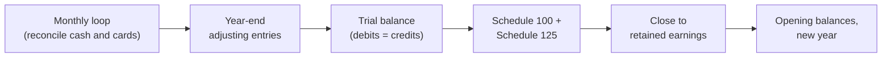

STATUS: AI GENERATED, REVIEW IN PROGRESS

# Period Close

**Who this is for**:
- Owners of a Canadian-controlled private corporation (CCPC) who keep the books and need the monthly and year-end routine

**TLDR**: reconcile every cash and card account monthly; at year-end post the adjusting set in order, prove the trial balance, and close the temporary accounts into retained earnings.

[Ledger and Accounts](Ledger-And-Accounts.md) covers how an entry is written and posted.  
This page is the routine that runs on top: what to do on the first of the month, and in what order after year-end.  
Each reconciliation the routine calls is worked on its own page; this page sequences them.  

Limitations:
- The close sequence is bookkeeping convention, not statute, except where cited
  - The duty to keep adequate books and records at all is ITA [s.230](https://laws-lois.justice.gc.ca/eng/acts/I-3.3/section-230.html)
- Covers an owner-managed CCPC kept on accrual + tax basis in a spreadsheet or simple ledger software
- Accounting-software close automation is out of scope; the steps assume manual entries
- The following is my understanding as of 2026

## The Two Loops

The close runs at two frequencies:
- *Monthly*: reconcile the cash and card accounts against their statements, and clear anything unexplained
- *Year-end*: post the adjusting entries, prove the trial balance, produce the statements, and close the year

The monthly loop is what keeps the year-end small.  
A difference caught in the month it arises is one statement page to re-check; the same difference at year-end is twelve.  

## Bank Reconciliation

A *bank reconciliation* proves the ledger `Deposits` account against the bank statement for the same date.  
The two rarely match on their face, because each side knows things the other does not yet:
- *Outstanding cheques*: written and booked, but not yet cleared by the bank
- *Deposits in transit*: received and booked, but not yet credited by the bank
- *Unbooked bank items*: service fees, interest, or an NSF reversal on the statement but not yet in the ledger

Adjust each side for what it is missing; the two adjusted balances must be equal.  

Worked example, April 30:

| Side | Amount |
|---|------:|
| Bank statement balance | $13,050 |
| Less: outstanding cheque #42 (rent) | −$700 |
| Plus: deposit in transit (client e-transfer, Apr 30) | +$500 |
| **Adjusted bank balance** | **$12,850** |
| Ledger `Deposits` (1002-1) balance | $12,865 |
| Less: April service fee, on the statement only | −$15 |
| **Adjusted book balance** | **$12,850** |

The two sides tie at $12,850.  
The bank-side items need no entry — they clear on their own.  
The book-side items do; post the fee the statement revealed:
- Debit `Interest and bank charges` (GIFI 8710) = $15
- Credit `Deposits` (1002-1) = $15

A difference that survives the known reconciling items means a posting error: a transposed figure, a missed entry, or a duplicate.  
Find it in the month it arose — compare the statement line by line against the ledger postings for that account.  
Carrying an unexplained difference forward as a plug buries the error; see [Plugs](Ledger-And-Accounts.md#plugs-and-plug-accounts).  

## Credit-Card Reconciliation

The corporate credit card reconciles the same way, against its own statement:
- The ledger account is the `Credit card payable` sub-account of `2620` (see [Ledger and Accounts](Ledger-And-Accounts.md#chart-of-accounts))
- Each statement charge should already be posted as Debit expense / Credit `Credit card payable`
- The payment to the card is Debit `Credit card payable` / Credit `Deposits` — not an expense
  - Booking the card payment to an expense line double-counts every charge; this is the most common card-posting error
- Reconciling items are charges posted in the ledger but not yet on the statement (timing), plus interest or annual fees on the statement but not yet booked

A personal charge on the corporate card does not classify as an expense.  
Post it to the shareholder-loan account; see [Owner-Corporation Transactions](../Paying-Yourself/Owner-Corporation-Transactions.md).  

## The Monthly Loop

Work down the same short list each month:
- Pull the month's bank and credit-card statements
- Reconcile each cash account ([Bank Reconciliation](#bank-reconciliation)) and each card ([Credit-Card Reconciliation](#credit-card-reconciliation))
- Post what the reconciliations revealed (fees, interest, missed entries)
- Review `Trade accounts receivable` (1062) against outstanding invoices; chase what is overdue
- Review `Amounts payable` (2620) against unpaid bills
- Confirm the HST control accounts move in step with the month's sales and purchases (see [HST Bookkeeping](../Operations/HST/HST-Bookkeeping.md#bookkeeping-accounts))
- Clear any suspense balance to its real account

An HST filing or instalment falls due on its own calendar, not the close's; see [HST Registration and Filing](../Operations/HST/HST-Registration-And-Filing.md).  

## Year-End Adjusting Entries

After the final month's loop, post the *adjusting entries* — the entries that exist only because the year is ending.  
Each is owned by its own page; the order below keeps later entries from disturbing earlier ones:

1. *Accrued expenses*: costs incurred by year-end but not yet billed (the accountant's fee, utilities)
   - Debit the expense line, Credit `2620` Amounts payable and accrued liabilities
2. *Accrued revenue*: work delivered but not yet invoiced at year-end
   - Debit `1062` (or an accrued-receivable account), Credit revenue; see [Deferred Revenue](../Operations/Deferred-Revenue.md) for the mirror case of billing ahead of the work
3. *Prepaid release*: expire the portion of each prepaid that the year consumed (ITA s.18(9))
   - See [Prepaid Expenses](Expense-Classification.md#prepaid-expenses)
4. *Bad-debt allowance and write-offs*: see [Receivables and Bad Debts](../Operations/Receivables-And-Bad-Debts.md)
5. *Inventory count and the COGS plug*: see [Inventory and COGS](../Operations/Cost-Recovery/Inventory-And-COGS.md#year-end-reconciliation)
6. *Amortization*: book depreciation to `8670`; the tax deduction is CCA, tracked separately
   - See [CCA Tracking](../Operations/Cost-Recovery/Capital-Cost-Allowance/CCA-Tracking.md)
7. *FX retranslation*: restate foreign-currency monetary balances at the year-end rate
   - See [Year-End USD Deposit](Foreign-Currency/Year-End-USD-Deposit.md)
8. *Investment tie-out*: match the ledger to the broker statements and book accrued distributions
   - See [Investments](../Investments/Investments.md) and [T3](../Investments/T3/T3.md#matching-ledger-vs-brokerage-account)
9. *Owner-manager bonus accrual*, if declaring one: see [Payroll](../Paying-Yourself/Payroll.md#owner-manager-remuneration)
10. *HST control netting*: net `HST collected` and `HST receivable` to `1483` or `2680` (see [HST Bookkeeping](../Operations/HST/HST-Bookkeeping.md))
11. *Tax provision*: book the year's corporate tax as Debit `9990` / Credit `2680`
    - Computed last, because it depends on the income every earlier entry settled
    - See [CRA Administration](../Filing-And-CRA/CRA-Administration.md#booking-the-tax-cycle)

The tax provision is circular on its face — the T2 needs the statements, the statements need the provision.  
In practice: finish entries 1–10, compute tax on the resulting income, post entry 11, and re-run the trial balance.  

## Proving the Trial Balance

List every account with its balance in a debit or credit column and total the columns (see [Ledger and Accounts](Ledger-And-Accounts.md#journal-entries-and-the-general-ledger)).  
The totals must be equal; if they differ, a posting is one-sided or mistyped.  

Checks beyond the column tie:
- Every reconciliation-backed balance matches its outside document: bank and card statements, the broker statement, the inventory count sheet
- The HST control accounts net to what the HST return for the straddling period will show
- No suspense or clearing account carries a balance into the statements
- Signs make sense: contra accounts (`1063`, `1741`-series accumulated amortization) carry credits; a debit in `2620` means an overpayment, not a liability
- Whole-dollar rounding is absorbed on the designated lines; see [Whole-Dollar Rounding](../Filing-And-CRA/Whole-Dollar-Rounding.md)

The proved trial balance is what rolls up to Schedule 100 and Schedule 125.  

## Closing the Year

The *closing entries* zero the temporary accounts into retained earnings:
- Close each revenue account: Debit revenue, Credit `Retained earnings` (3600)
- Close each expense account: Debit `Retained earnings`, Credit the expense
- Close `Dividends declared` (3700): Debit `Retained earnings`, Credit `3700`

The net of the first two steps is the year's net income landing in equity.  
The GIFI continuity states the same movement: `3660` Start + `3680` Net income − `3700` Dividends declared = `3849` End.  
On the filed Schedule 100, `3680` must equal Schedule 125's `9999`.  

In a spreadsheet ledger the "entries" may be implicit — a new year's sheet that starts revenue and expenses at zero.  
The requirement is the result, not the mechanism: temporary accounts at zero, retained earnings carrying the year.  

## Opening the New Year

- Every permanent (balance-sheet) account opens at its closing balance: cash, receivables, equipment, payables, loans, equity
- Every temporary account opens at zero
- The opening balance sheet equals the prior year's closing one; next year's Schedule 100 comparative column must reproduce it
- Balances that continue accruing pick up where they left off: the UCC pools ([CCA Tracking](../Operations/Cost-Recovery/Capital-Cost-Allowance/CCA-Tracking.md)), the ACB ledger ([Adjusted Cost Base](../Investments/Adjusted-Cost-Base/Adjusted-Cost-Base.md)), and the prepaid schedule

## Year-End Checklist

Work down in order once the last monthly loop is done:

- [ ] Final month's bank and card reconciliations tie
- [ ] Accrued expenses and accrued revenue posted
- [ ] Prepaids released to expense
- [ ] Bad-debt allowance reviewed; known-bad accounts written off
- [ ] Inventory counted; COGS plugged and booked
- [ ] Amortization booked; CCA schedule updated
- [ ] Foreign-currency balances retranslated at the year-end rate
- [ ] Ledger tied to the broker statement; accrued distributions booked
- [ ] Bonus accrual posted, if any
- [ ] HST control accounts netted
- [ ] Tax provision computed and posted
- [ ] Trial balance proved; suspense accounts empty
- [ ] Statements rolled up to Schedule 100 / Schedule 125
- [ ] Temporary accounts closed; opening balances carried forward

## Related

- [Ledger and Accounts](Ledger-And-Accounts.md)
- [Expense Classification](Expense-Classification.md)
- [HST Bookkeeping](../Operations/HST/HST-Bookkeeping.md)
- [Inventory and COGS](../Operations/Cost-Recovery/Inventory-And-COGS.md)
- [CCA Tracking](../Operations/Cost-Recovery/Capital-Cost-Allowance/CCA-Tracking.md)
- [Foreign Currency](Foreign-Currency/Foreign-Currency.md)
- [Investments](../Investments/Investments.md)
- [Receivables and Bad Debts](../Operations/Receivables-And-Bad-Debts.md)
- [CRA Administration](../Filing-And-CRA/CRA-Administration.md)
- [Whole-Dollar Rounding](../Filing-And-CRA/Whole-Dollar-Rounding.md)

## Citations

- Income Tax Act [s.230](https://laws-lois.justice.gc.ca/eng/acts/I-3.3/section-230.html) - duty to keep books and records
- Income Tax Act [s.18(9)](https://laws-lois.justice.gc.ca/eng/acts/I-3.3/section-18.html) - prepaid expenses deferred to the year they relate to
- CRA RC4088 - General Index of Financial Information (GIFI) - https://www.canada.ca/en/revenue-agency/services/forms-publications/publications/rc4088/general-index-financial-information-gifi.html
- CRA T4012 - T2 Corporation Income Tax Guide, Schedule 100 / Schedule 125 reporting - https://www.canada.ca/en/revenue-agency/services/forms-publications/publications/t4012/t2-corporation-income-tax-guide.html

## TODO

- Confirm the accrued-revenue account convention (1062 vs a dedicated accrued-receivable line) against how the invoicing pages book it
