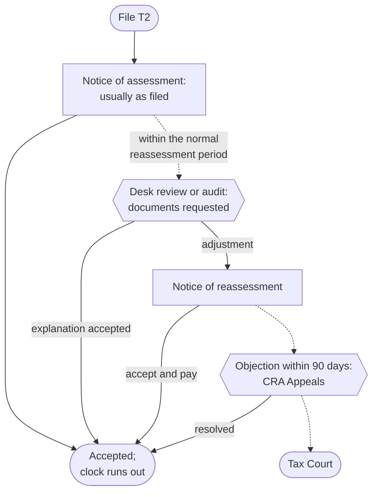

STATUS: AI GENERATED, REVIEW IN PROGRESS

# CRA Administration

**Who this is for**:
- Owners of a Canadian-controlled private corporation (CCPC)
- Handling what comes after the return is filed: assessments, reviews, adjustments, objections, and the books that back them

**TLDR**:
- The T2 is self-assessed: the *notice of assessment* usually accepts the return as filed, and CRA's checking happens afterwards, inside the *normal reassessment period* (3 years for a CCPC)
- Reconcile every notice of (re)assessment to the books; differences adjust the tax expense in the year the notice arrives
- Arrears interest and penalties are never deductible; refund interest is taxable income
- A desk review letter is answered with documents by its deadline, not with arguments; an unanswered letter becomes a reassessment
- Disagreeing with a reassessment has a 90-day clock: file a notice of objection, or the assessment stands
- Keep books and records 6 years from the end of the last tax year they relate to

Limitations:
- Scope is income tax (the RC account); GST/HST assessments and reviews follow parallel mechanics under the Excise Tax Act and are touched on, not worked through
- Full audit defence and Tax Court procedure are out of scope beyond orientation; both are professional-advice territory
- Payroll examinations (PIER reviews are in [Payroll](Payroll/Payroll.md)) and slip-filing penalties (in [Small Business Tax Overview](Small-Business-Tax-Overview.md#filing-deadlines-and-instalments)) are covered on their own pages
- The following is my understanding as of 2026

## The assessment cycle

Corporate tax is self-assessed: the corporation computes its own tax, files, and pays; CRA assesses first and verifies later.  

The notice of assessment (NOA):
- Arrives in My Business Account after the T2 is processed; CRA has been moving business correspondence to online mail by default, so check the mail preference and register for email notifications so a notice or review letter is not missed
- Usually matches the return as filed; an initial NOA is not CRA agreement with the numbers, only the starting point of the reassessment clock
- Compare it line by line against the filed T2; a changed line comes with an explanation paragraph on the notice

## Booking the tax cycle

The corporation's income tax flows through two accounts (see [Ledger and Accounts](Ledger-And-Accounts.md)):
- `Current income taxes` (`9990`): expense
- `Taxes payable` (`2680`): liability; instalments post here as debits, so the balance nets to what is still owed

Year-end accrual, FY2026 tax estimated at $9,760 with $8,000 of instalments already paid during the year:

| Account | Debit | Credit |
|---|---|---|
| `Current income taxes` (`9990`) | 9,760.00 | |
| `Taxes payable` (`2680`) | | 9,760.00 |

The instalment payments during the year were each booked as Dr `Taxes payable` / Cr `Cash`, so `2680` now shows the $1,760 balance due; paying it by the balance-due date clears the account (see [Payment](Payment/Payment.md)).  

When the NOA assesses a different amount (say $9,900, $140 more):

| Account | Debit | Credit |
|---|---|---|
| `Current income taxes` (`9990`) | 140.00 | |
| `Taxes payable` (`2680`) | | 140.00 |

Interest and penalties on the notice:
- Arrears interest and penalties are not deductible (ITA [s.18(1)(t)](https://laws-lois.justice.gc.ca/eng/acts/I-3.3/section-18.html)): book them to `Interest and bank charges` (`8710`) and add them back on Schedule 1
- Refund interest CRA pays is taxable interest income in the year received

The true-up posts in the year the notice arrives; do not reopen a closed year's books for it.  

## The reassessment clock

CRA can reassess a CCPC's tax year within the *normal reassessment period*: 3 years from the date of the original notice of assessment (ITA [s.152(3.1)](https://laws-lois.justice.gc.ca/eng/acts/I-3.3/section-152.html)).  

The clock stretches or disappears in specific cases:
- *Loss carryback*: the year a loss was carried back to stays open 3 extra years for adjustments related to the carryback (s.152(4)(b))
- *T1135 not filed with foreign income omitted*: 3 extra years (see [T1135](T1135.md))
- *Misrepresentation* attributable to neglect, carelessness, wilful default, or fraud: no time limit (s.152(4)(a)(i))
- *Waiver*: the corporation can sign one (Form T2029) to keep a specific issue open past the deadline, usually during an audit negotiation; it is revocable on 6 months' notice

The clock cuts both ways:
- After it runs out, the year is *statute-barred*: CRA cannot reassess it, and the corporation cannot get money back from it
- A refund-side correction (a missed deduction, an overstated income line) must be requested while the year is still open; the 10-year relief window that individuals have for refunds does not extend to corporations
- Review old years for missed claims before their third anniversary, not after

## Interest and penalties

All rates key off the quarterly *prescribed rate* (Income Tax Regulations [s.4301](https://laws-lois.justice.gc.ca/eng/regulations/C.R.C.,_c._945/section-4301.html), set from 90-day T-bill yields):
- *Arrears interest*: prescribed rate + 4%, compounded daily, from the balance-due date
- *Refund interest* for a corporation: the plain prescribed rate, compounded daily
- The 4-point spread means a disputed balance is expensive to leave unpaid (see the objection section below)

The penalties an owner-managed corporation actually meets:
- *Late-filed T2 with a balance owing*: 5% of the unpaid tax plus 1% per full month late, up to 12 months (ITA [s.162(1)](https://laws-lois.justice.gc.ca/eng/acts/I-3.3/section-162.html)); a repeat failure after a demand doubles the rates (s.162(2))
- *Late-filed T2 with no balance owing*: no s.162(1) penalty (it is a percentage of nil), but the year still must be filed to start the clocks and preserve carryovers
- *Instalment interest*, and an instalment penalty when that interest tops $1,000 (ITA [s.163.1](https://laws-lois.justice.gc.ca/eng/acts/I-3.3/section-163.1.html))
- *Information-slip and T1135 penalties*: flat-rate, no tax owing required; see [Filing deadlines](Small-Business-Tax-Overview.md#filing-deadlines-and-instalments) and [T1135](T1135.md)

## Reviews and audits

A *desk review* (processing review) is a letter asking for the backup behind specific lines: a GIFI expense line, a schedule figure, an ITC.  

Handling one:
- Respond by the letter's deadline (typically 30 days) through *Submit documents* in My Business Account, quoting the letter's case or reference number
- Send documents, not essays: the invoices, statements, and ledger extracts behind the questioned line, with a short covering note mapping each document to the line
- Ask for more time before the deadline if gathering takes longer; silence is the one losing move — an unanswered letter becomes a reassessment denying the line
- This is where the bookkeeping discipline pays off: a ledger whose lines trace to filed source documents turns a review into an afternoon

A *full audit* is broader: an auditor examines the books and records, and has statutory authority to inspect them and require answers (ITA [s.231.1](https://laws-lois.justice.gc.ca/eng/acts/I-3.3/section-231.html)).  
Cooperate on documents, keep answers factual, and involve an accountant early; audit defence is out of scope here.  

Authorizing a representative (an accountant) for the RC account is done in My Business Account; the authorization is per program account and survives until revoked.  

## Records retention

The duty to keep books and records at all is ITA [s.230](https://laws-lois.justice.gc.ca/eng/acts/I-3.3/section-230.html); the retention clock is 6 years from the end of the last tax year the record relates to (s.230(4), Income Tax Regulations [s.5800](https://laws-lois.justice.gc.ca/eng/regulations/C.R.C.,_c._945/section-5800.html)).  

What that means in practice:
- *Transaction records* (invoices, receipts, bank and brokerage statements, contracts, the ledger itself): 6 years from the end of the tax year they relate to
- *Long-lived records*: a record supporting a balance that persists — an [ACB tracker](Adjusted-Cost-Base/Adjusted-Cost-Base-Tracking.md), a [CCA asset register](Cost-Recovery/Capital-Cost-Allowance/CCA-Tracking.md), the [loss continuity schedule](Losses.md#carrying-forward) — relates to every year the balance is alive, so its 6 years start when the balance is finally used up
- *Permanent corporate records* (minute book, share registers, articles): keep until 2 years after dissolution (Regulations s.5800)
- Electronic records are fine; keep them readable and in Canada (or get CRA's written permission otherwise)
- Destroying records early needs CRA consent (Form T137); the practical answer for a small corporation is to keep everything digital and never destroy

## Amending a filed T2

There is no separate amendment form: a change to a filed year is a *requested reassessment*.  

How to request one:
- File an amended T2 through the same certified software (marked amended), or send the request with the changed schedules through My Business Account
- State what changes and why; attach the corrected schedule, not the whole reasoning
- The request must land within the normal reassessment period; a statute-barred year cannot be reopened downward (see [the reassessment clock](#the-reassessment-clock))
- A carryback is not an amendment: it goes on the loss-year Schedule 4 (see [Losses](Losses.md#carrying-back))

Amending information slips is separate from the T2: amended T4s are covered in [Payroll](Payroll/Payroll.md), amended T5s in [Bookkeeping and information slips](Dividends/Bookkeeping-And-Slips.md).  

## Objections

An objection is the formal disagreement with an assessment or reassessment; it moves the file from the auditor to CRA *Appeals*.  

Mechanics:
- Deadline: 90 days from the date on the notice (ITA [s.165(1)](https://laws-lois.justice.gc.ca/eng/acts/I-3.3/section-165.html)); a corporation does not get the extra one-year window individuals have
- Missed the deadline: apply for an extension within the following year (ITA [s.166.1](https://laws-lois.justice.gc.ca/eng/acts/I-3.3/section-166.1.html)); extensions are discretionary, so treat 90 days as the real deadline
- File through My Business Account (*file a notice of objection*) or Form T400A; state the facts, the issue, and the relief sought
- First try the cheaper route: many disputes are resolved by calling the number on the notice or submitting the missing document — an objection is for genuine disagreement, not a missed reply

Money while the dispute runs:
- For a CCPC, CRA generally cannot take collection action on the disputed income-tax amount while the objection is open (ITA [s.225.1](https://laws-lois.justice.gc.ca/eng/acts/I-3.3/section-225.1.html))
- Arrears interest keeps compounding at prescribed + 4% the whole time; paying the disputed amount stops the interest and is refunded with interest if the objection succeeds
- An objection decided against the corporation can be appealed to the Tax Court of Canada; the informal procedure covers smaller amounts (up to $25,000 of federal tax in dispute per year) without requiring counsel

A nil assessment cannot be objected to; for a loss year, the lever is a loss determination (see [Losses](Losses.md#the-loss-year-on-the-t2)).  

## Relief programs

*Taxpayer relief* (ITA [s.220(3.1)](https://laws-lois.justice.gc.ca/eng/acts/I-3.3/section-220.html)):
- CRA can cancel or waive interest and penalties (never the tax itself) up to 10 years back
- Grounds: CRA error or delay, circumstances beyond the corporation's control, or inability to pay
- Apply on Form RC4288 with the supporting story and documents; the decision is discretionary

*Voluntary Disclosures Program* (VDP):
- For unfiled returns, unfiled slips or T1135s, or unreported income CRA has not yet asked about
- A valid disclosure must be voluntary (before CRA contact on the issue), complete, and include payment or a payment arrangement
- Relief is penalty relief and partial interest relief; the tax is always payable
- Apply on Form RC199; for anything material, have a professional shape the disclosure first

## Related

- [Payment](Payment/Payment.md)
- [Losses](Losses.md)
- [T1135](T1135.md)
- [Payroll](Payroll/Payroll.md)
- [Small Business Tax Overview](Small-Business-Tax-Overview.md)
- [Ledger and Accounts](Ledger-And-Accounts.md)
- [HST](HST.md)

## Citations

- Income Tax Act (R.S.C., 1985, c. 1 (5th Supp.)):
  - [s.18(1)(t)](https://laws-lois.justice.gc.ca/eng/acts/I-3.3/section-18.html) - no deduction for amounts paid under the ITA (arrears interest, penalties)
  - [s.152(3.1)](https://laws-lois.justice.gc.ca/eng/acts/I-3.3/section-152.html) - normal reassessment period (3 years for a CCPC); [s.152(4)](https://laws-lois.justice.gc.ca/eng/acts/I-3.3/section-152.html) - exceptions: misrepresentation, waiver, carryback-related, foreign-reporting failures
  - [s.162(1)](https://laws-lois.justice.gc.ca/eng/acts/I-3.3/section-162.html) - late-filing penalty (5% + 1%/month to 12 months); s.162(2) - repeated failure (10% + 2%/month to 20 months)
  - [s.163.1](https://laws-lois.justice.gc.ca/eng/acts/I-3.3/section-163.1.html) - instalment penalty when instalment interest exceeds $1,000
  - [s.165(1)](https://laws-lois.justice.gc.ca/eng/acts/I-3.3/section-165.html) - notice of objection, 90-day deadline; [s.166.1](https://laws-lois.justice.gc.ca/eng/acts/I-3.3/section-166.1.html) - extension application within one further year
  - [s.220(3.1)](https://laws-lois.justice.gc.ca/eng/acts/I-3.3/section-220.html) - taxpayer relief: waiver of interest and penalties within 10 years
  - [s.225.1](https://laws-lois.justice.gc.ca/eng/acts/I-3.3/section-225.1.html) - collection restrictions while an objection or appeal is outstanding
  - [s.230](https://laws-lois.justice.gc.ca/eng/acts/I-3.3/section-230.html) - duty to keep books and records; s.230(4) - retention period
  - [s.231.1](https://laws-lois.justice.gc.ca/eng/acts/I-3.3/section-231.html) - audit inspection authority
- Income Tax Regulations (C.R.C., c. 945):
  - [s.4301](https://laws-lois.justice.gc.ca/eng/regulations/C.R.C.,_c._945/section-4301.html) - prescribed interest rates (arrears = base + 4%; corporate refunds = base)
  - [s.5800](https://laws-lois.justice.gc.ca/eng/regulations/C.R.C.,_c._945/section-5800.html) - retention periods, including permanent corporate records until 2 years after dissolution
- CRA forms and guidance:
  - T400A - Notice of Objection: https://www.canada.ca/en/revenue-agency/services/forms-publications/forms/t400a.html
  - T2029 - Waiver in Respect of the Normal Reassessment Period: https://www.canada.ca/en/revenue-agency/services/forms-publications/forms/t2029.html
  - RC4288 - Request for Taxpayer Relief: https://www.canada.ca/en/revenue-agency/services/forms-publications/forms/rc4288.html
  - RC199 - Voluntary Disclosures Program Application: https://www.canada.ca/en/revenue-agency/services/forms-publications/forms/rc199.html
  - T137 - Request for Destruction of Records: https://www.canada.ca/en/revenue-agency/services/forms-publications/forms/t137.html
  - CRA - Prescribed interest rates: https://www.canada.ca/en/revenue-agency/services/tax/prescribed-interest-rates.html
  - IC00-1 - Voluntary Disclosures Program: https://www.canada.ca/en/revenue-agency/services/forms-publications/publications/ic00-1r6.html

## TODO

- Verify the online-mail-by-default transition for business correspondence and state the effective date once confirmed
- Verify the corporate amended-T2 channels against current T4012 wording (amended return via certified software vs written request) and whether electronic amended T2s are accepted for all years
- Verify that the 10-year refund window (s.164(1.5)) is limited to individuals and graduated rate estates, supporting the "statute-barred cuts both ways" claim for corporations
- Verify the Tax Court informal-procedure monetary limit ($25,000 federal tax per year) against the current Tax Court of Canada Act figure
- Verify the s.225.1 collection-restriction scope for a CCPC (the large-corporation 50% carve-out does not apply) before sign-off
- Confirm the long-lived-records interpretation (retention clock starts when the supported balance is exhausted) against CRA's records-retention guidance (IC78-10)
- Split candidates once the page matures: a records-retention page (if it grows past a section), and an objections walkthrough with My Business Account screenshots
