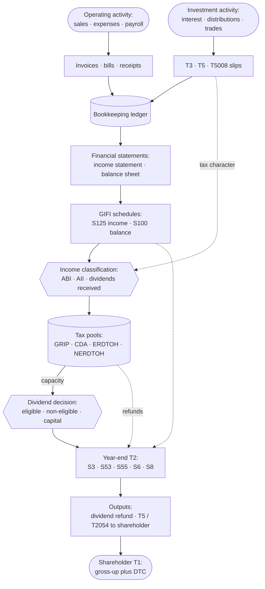
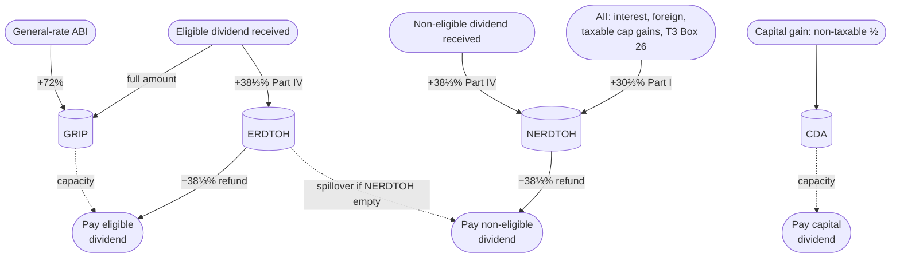
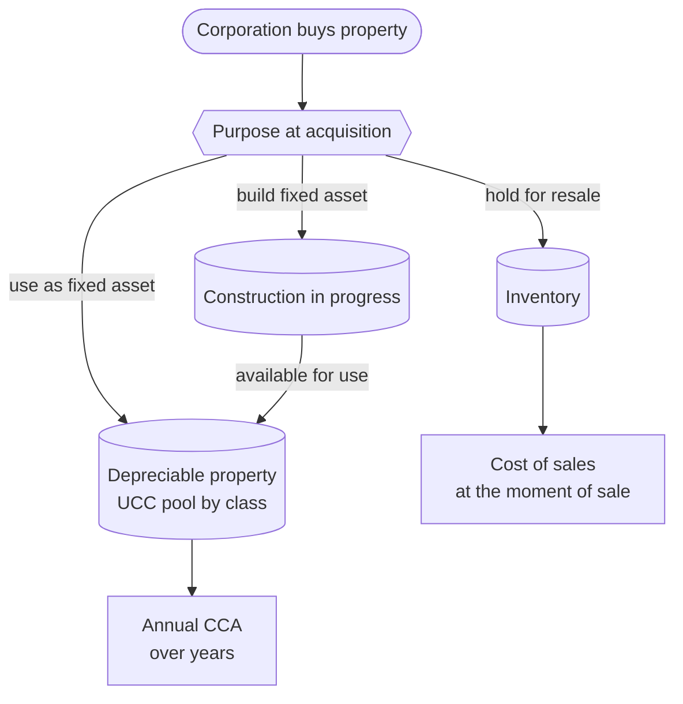

STATUS: AI GENERATED, REVIEW IN PROGRESS

# Concept map <!-- [done] -->

**Who this is for**:
- Anyone who wants to see how the pieces of this guide fit together before diving into a single topic

**TLDR**:
- Small business tax is presented from five aspects, with most concepts belonging to just one:
  - *Kinds of things* (trees): income, dividends, and purchases each sort into a hierarchy of types
  - *Running balances* (state): pools like GRIP, CDA, ERDTOH, and NERDTOH that carry forward year to year
  - *Events*: the year's transactions — earning income, receiving or paying a dividend, buying or selling an asset
  - *Effects*: the fixed rules mapping each event to the balances it moves
  - *The yearly flow* (a pipeline): slip → bookkeeping → pool → T2 → dividend → personal return

Limitations:
- This is an overview; rates and numbers are illustrative (Ontario, 2026)
- Diagrams are deliberately high-level; they drop edge cases that the detailed pages cover
- The following is my understanding as of 2026

## From business activity to shareholder return <!-- [done] -->

- Operating activity and investment slips both post to the books
- The books roll up into financial statements, then GIFI schedules on the T2
- Classified income fills the tax pools
- Pools drive the year-end return and the dividend decision

Details:
- [Small Business Tax Overview](Small-Business-Tax-Overview.md): more detailed flowchart and other references
- [Bookkeeping, the general ledger, and GIFI](Small-Business-Tax-Overview.md#bookkeeping-the-general-ledger-and-gifi): books → financial statements → GIFI mapping  

## Income classification <!-- [done] -->

How a dollar of corporate income is classified, and which pool it feeds:
- *Active business income* (ABI)
  - First $500K, at the SBD rate → retained earnings
  - Portion at the general rate → GRIP (+72%)
- *Aggregate investment income* (AII)
  - Interest and foreign income → NERDTOH (+30⅔%)
  - Capital gains → taxable ½ to NERDTOH, non-taxable ½ to CDA
- *Dividends received* from other corporations
  - Eligible → GRIP and ERDTOH
  - Non-eligible → NERDTOH

Details: [Small Business Tax Overview — active vs investment income](Small-Business-Tax-Overview.md#active-vs-investment-income).  

## Tax pools: GRIP, CDA, ERDTOH, NERDTOH <!-- [done] -->

GRIP, CDA, ERDTOH, and NERDTOH are:
- *Running balances* the corporation carries forward year to year
- Income is added, and paying a dividend is subtracted  

Legend:
- Solid arrows into a pool are what fills it during the year
- Solid arrows out are the refund it releases when a dividend is paid
- Dotted arrows are capacity or spillover (not cash)  

Details:
- [ERDTOH and NERDTOH](Dividends/ERDTOH-NERDTOH.md)
- [Dividends — GRIP](Dividends/Dividends.md#grip---capacity-for-eligible-dividends)
- [Capital Dividend Account](Capital-Dividend-Account/Capital-Dividend-Account.md)

## Cost-recovery channels <!-- [done] -->

Every purchase eventually becomes a tax deduction.  
How that happens depends on why it was purchased: to resell, to use as a long-term asset, or to build into a long-term asset.  

Details: [Cost Recovery](Cost-Recovery/Cost-Recovery.md) (full flow with disposition, recapture, terminal loss, and change of use).  

## Dividend flavours: Eligible, Non-eligible, Capital <!-- [done] -->

These are the three flavours a corporation can *pay* out to its shareholders.  
Dividends it *receives* (on a T3 or T5) are covered under [Income classification](#income-classification).  

Federal rates shown; a provincial dividend tax credit applies on top:
- Ontario: 10% eligible, 2.9863% non-eligible of the grossed-up amount in 2026.  

| Attribute | Eligible | Non-eligible | Capital                                                |
|---|---|---|--------------------------------------------------------|
| Source pool | GRIP | SBD-rate retained earnings (default) | CDA                                                    |
| Corp action required | Designation (s.89(14)), at or before payment | None | Election (s.83(2)) on Form T2054, at or before payment |
| Personal gross-up | 38% | 15% | none (tax-free)                                        |
| Federal DTC | 15.0198% of grossed-up | 9.0301% of grossed-up | none                                                   |
| Refund pool drawn | ERDTOH | NERDTOH, then ERDTOH spillover | none                                                   |
| Excess-dividend penalty | Part III.1, 20% (s.185.1) | none | Part III, 60% (s.184(2))                               |
| Slip issued to shareholder | T5 | T5 | none (notify; corporation files T2054)                 |

Details: [Dividends — three flavours](Dividends/Dividends.md#three-dividend-flavours-eligible-non-eligible-capital), [Tax Integration](Tax-Integration.md) (gross-up and DTC mechanics).  

## Event → pool effects

The rule layer: a fixed map from each event to the pool balances it moves.  
This is the *matrix* at the heart of the corporate side — the four pools as columns, events as rows, cells as the delta.  

| Event | GRIP | CDA | ERDTOH | NERDTOH |
|---|---|---|---|---|
| Earn general-rate ABI | +72% of ABI | — | — | — |
| Earn AII (interest, foreign) | — | — | — | +30⅔% of AII |
| Realize capital gain | — | +non-taxable ½ | — | +30⅔% of taxable ½ |
| Realize capital loss | — | −non-taxable ½ (floored at 0) | — | — |
| Receive eligible dividend | +full amount | — | +38⅓% Part IV | — |
| Receive non-eligible dividend | — | — | — | +38⅓% Part IV |
| Pay eligible dividend | −amount | — | −38⅓% refund | — |
| Pay non-eligible dividend | — | — | − spillover after NERDTOH | −38⅓% refund (first) |
| Pay capital dividend | — | −amount | — | — |

Notes: a capital gain's taxable half is part of AII, which is why it also adds to NERDTOH; received dividends from a *connected* corporation differ (Part IV is tied to the payer's own refund). The 72% factor, the 30⅔% Part I rate, and the 38⅓% Part IV / refund rate are fixed by statute (see Citations).  

The upstream balances each live on a single page, so they are not a cross-pool matrix — each event touches one aggregate:

| Event | Aggregate | Effect | Owns the detail |
|---|---|---|---|
| Buy security | ACB (per security) | + cost and commissions (trade-date FX) | [ACB](Adjusted-Cost-Base/Adjusted-Cost-Base.md) |
| Return of capital (T3 Box 42) | ACB | − distribution | [ACB](Adjusted-Cost-Base/Adjusted-Cost-Base.md) |
| Sell security | ACB | remove sold units; realize gain or loss | [T5008](T5008/T5008.md) |
| Acquire depreciable asset | UCC (per class) | + capital cost (half-year on net additions) | [CCA](Cost-Recovery/Capital-Cost-Allowance.md) |
| Claim CCA | UCC | − CCA for the year | [CCA](Cost-Recovery/Capital-Cost-Allowance.md) |
| Dispose depreciable asset | UCC | − lesser of proceeds or cost; recapture or terminal loss | [CCA](Cost-Recovery/Capital-Cost-Allowance.md) |
| Buy inventory | Inventory | + landed cost | [Inventory](Cost-Recovery/Inventory-And-COGS.md) |
| Sell inventory | Inventory | − unit cost (to COGS) | [Inventory](Cost-Recovery/Inventory-And-COGS.md) |
| Incur construction cost | CIP | + materials and labour | [Materials and CIP](Cost-Recovery/Materials-And-CIP.md) |
| Available for use | CIP → UCC | transfer balance to a CCA class | [Materials and CIP](Cost-Recovery/Materials-And-CIP.md) |

Realizing a gain or loss is where the two halves meet: the disposition event closes an ACB or UCC balance and, in the same step, feeds the pool matrix above.  

## How the concepts relate

The same map, classified by the *shape* of each relationship — which is which:
- *Trees* (is-a / part-of): the income taxonomy, the three dividend flavours, the three cost-recovery channels, the CCA classes, and the T-slip / T2-schedule catalogues
- *State* (event-sourced balances): GRIP, CDA, ERDTOH, NERDTOH, ACB per security, UCC per class, inventory, CIP, and retained earnings — each is `opening + fold(year's events) → closing`, carried forward
- *Process flow* (a DAG): the yearly pipeline from slips through bookkeeping and pools to the T2, the dividend, and the personal return
- *Matrices* (combined attributes): the dividend flavour × attribute table, and the event × pool effect table
- *Cross-cutting graph edges* (genuinely networked, not a clean tree or flow):
  - The NERDTOH → ERDTOH spillover ordering when a non-eligible dividend is paid
  - AII's triple role: it fills NERDTOH, grinds the SBD over $50,000, and (by pushing ABI to the general rate) indirectly fills GRIP
  - Province → dividend tax credit, applied on top of every federal DTC
  - FX translation, HST recoverability, and whole-dollar rounding as aspects that touch every dollar amount on every page

## Related

- [Small Business Tax Overview](Small-Business-Tax-Overview.md)
- [Tax Integration](Tax-Integration.md)
- [Dividends](Dividends/Dividends.md)
- [Capital Dividend Account](Capital-Dividend-Account/Capital-Dividend-Account.md)
- [Cost Recovery](Cost-Recovery/Cost-Recovery.md)
- [Adjusted Cost Base](Adjusted-Cost-Base/Adjusted-Cost-Base.md)
- [Glossary](Glossary.md)

## Citations

Full citations live on each page; the rates here come from:
- Income Tax Act (R.S.C., 1985, c. 1 (5th Supp.)):
  - [s.82(1)](https://laws-lois.justice.gc.ca/eng/acts/I-3.3/section-82.html) - dividend gross-up (38% eligible, 15% non-eligible)
  - [s.83(2)](https://laws-lois.justice.gc.ca/eng/acts/I-3.3/section-83.html) - capital dividend election; [s.184(2)](https://laws-lois.justice.gc.ca/eng/acts/I-3.3/section-184.html) - 60% Part III tax on over-elections
  - [s.89(1)](https://laws-lois.justice.gc.ca/eng/acts/I-3.3/section-89.html) - GRIP, CDA, ERDTOH, NERDTOH definitions and the 0.72 general-rate factor; [s.89(14)](https://laws-lois.justice.gc.ca/eng/acts/I-3.3/section-89.html) - eligible designation
  - [s.121](https://laws-lois.justice.gc.ca/eng/acts/I-3.3/section-121.html) - federal dividend tax credit (15.0198% eligible, 9.0301% non-eligible)
  - [s.125(5.1)](https://laws-lois.justice.gc.ca/eng/acts/I-3.3/section-125.html) - SBD grind on AII over $50,000
  - [s.129](https://laws-lois.justice.gc.ca/eng/acts/I-3.3/section-129.html) - dividend refund (s.129(1)); 30⅔% Part I on AII and the 38⅓% pool rates (s.129(4))
  - [s.185.1](https://laws-lois.justice.gc.ca/eng/acts/I-3.3/section-185.1.html) - 20% Part III.1 tax on excessive eligible designations
  - [s.186(1)](https://laws-lois.justice.gc.ca/eng/acts/I-3.3/section-186.html) - 38⅓% Part IV tax on dividends received
