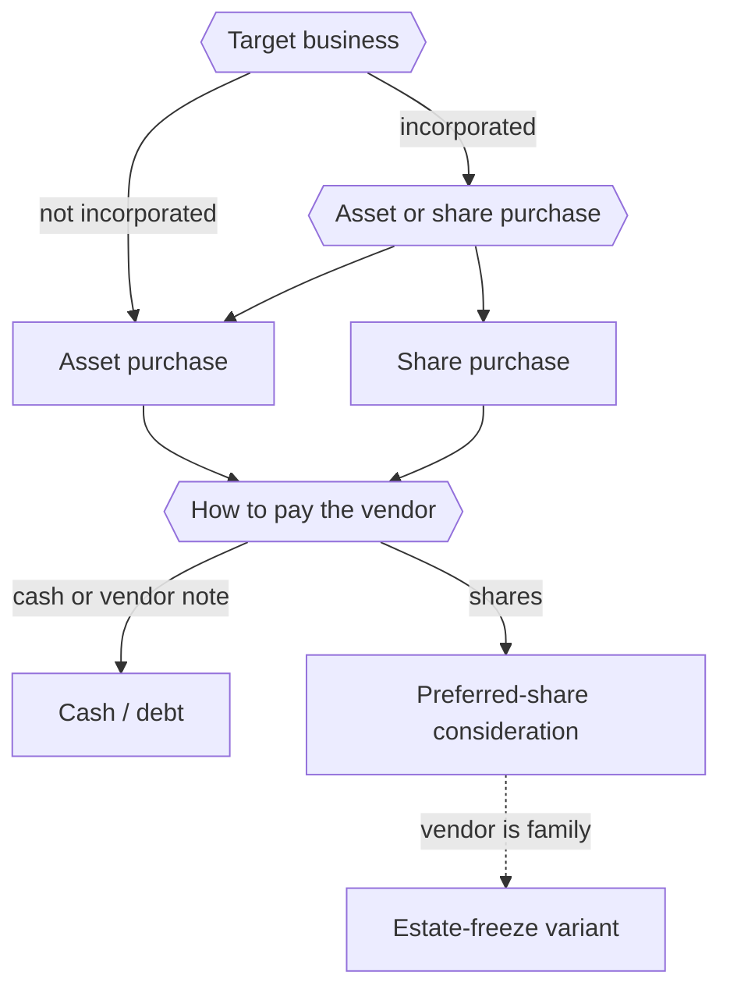

STATUS: AI GENERATED, REVIEW IN PROGRESS

# Business Acquisition

**Who this is for**:
- Owner of a Canadian-controlled private corporation (CCPC) with retained earnings
- Want to buy an existing business and pay the previous owners over time
- The previous owners may be third parties or family, and may take payment in shares rather than cash

**TLDR**:
- Two structural forks decide the deal: *asset purchase versus share purchase*, and *cash versus share consideration*
- Paying the vendors with *preferred shares* of the buyer corporation turns the purchase price into equity the corporation redeems over time from retained earnings
- When the vendors are family, the same machinery is an *estate freeze*
- These transactions need a tax advisor and a lawyer; this page is orientation, not a procedure

Limitations:
- This is an orientation page; every transaction here needs professional tax and legal advice before it is done
- Business valuation, the general anti-avoidance rule (GAAR), and provincial corporate-law detail are named but not worked through
- The buyer is assumed to be a Canadian-resident CCPC; cross-border and non-resident vendors are out of scope
- Share-capital vocabulary (classes, paid-up capital, redeemable/retractable shares) is assumed; see [Share Capital](../Corporate-Structure/Share-Capital.md)
- The following is my understanding as of 2026

## The Scenario

The starting position has two corporations' worth of moving parts:
- An *existing business* you want to buy; it may or may not be incorporated
- Your *existing corporation*, holding retained earnings you can put toward the purchase

The goal is to buy the business and pay the previous owners, without having to hand over the whole price in cash on day one.  
The route this page focuses on is paying the vendors with *preferred shares* of your corporation, then redeeming those shares over the following years out of the corporation's earnings.  

This is a *vendor take-back* done in equity rather than as a loan.  
It defers the vendors' tax, spreads the corporation's cash outflow over years, and, when the vendors are family, doubles as a succession plan.  

## Two Forks

Every version of the deal is a combination of two choices.  

*Structure* (what you buy):
- If the target is not incorporated, there are only assets to buy
- If the target is incorporated, you can buy its assets or its shares; the vendor and the buyer usually prefer opposite answers (see [Asset vs Share Purchase](Asset-vs-Share.md))

*Consideration* (how you pay):
- Cash, or a promissory note (debt the corporation pays down over time)
- Preferred shares of the buyer corporation, redeemed over time (see [Preferred-Share Consideration](Preferred-Share-Consideration.md))

## Paying with Preferred Shares

The core of the scenario is the share-consideration route.  
The buyer corporation issues redeemable, retractable preferred shares to the vendors with a fixed redemption value equal to the agreed price, then redeems them over time as cash allows.  

The detail is on [Preferred-Share Consideration](Preferred-Share-Consideration.md): the s.85 rollover that defers the vendors' gain, how the shares' paid-up capital is set, and the deemed dividend that arises on each redemption.  

## The Family Case

When the previous owners are a parent (or another family member) selling to the next generation, the same preferred-share machinery is an *estate freeze*.  
The freeze fixes today's value into the parent's preferred shares, lets future growth accrue to the child's new common shares, and funds the parent's retirement by redeeming the preferred shares over time.  

The family case carries its own anti-avoidance rules (ITA s.84.1) and a specific relieving exception for genuine intergenerational transfers; see [Estate Freeze](Estate-Freeze.md).  

## Professional Advice

Everything on these pages is set up by professionals, not as do-it-yourself bookkeeping.  
Get tax and legal advice before:
- *Valuing* the business; the preferred shares' redemption value depends on a defensible valuation, usually with a *price-adjustment clause* in case CRA disputes it
- *Choosing the structure*; asset versus share, and the order of the steps, changes the tax for both sides
- *Filing the elections*; the s.85 rollover (Form T2057) has a strict filing deadline, and a s.86 reorganization must be structured correctly to defer the gain
- *Relying on the intergenerational exception or the lifetime capital gains exemption*; both have detailed conditions that must be met before and after closing
- *Testing for GAAR*; surplus-stripping and freeze transactions are an area CRA scrutinizes

## Related

- [Asset vs Share Purchase](Asset-vs-Share.md)
- [Preferred-Share Consideration](Preferred-Share-Consideration.md)
- [Estate Freeze](Estate-Freeze.md)
- [Share Capital](../Corporate-Structure/Share-Capital.md)
- [Dividends](../../Paying-Yourself/Dividends/Dividends.md)
- [Owner-Corporation Transactions](../../Paying-Yourself/Owner-Corporation-Transactions.md)
- [Capital Dividend Account](../../Investments/Capital-Dividend-Account/Capital-Dividend-Account.md)

## Citations

- Income Tax Act (R.S.C., 1985, c. 1 (5th Supp.)):
  - [s.85(1)](https://laws-lois.justice.gc.ca/eng/acts/I-3.3/section-85.html) - tax-deferred rollover of property to a corporation for share consideration
  - [s.84(3)](https://laws-lois.justice.gc.ca/eng/acts/I-3.3/section-84.html) - deemed dividend on redemption of shares above paid-up capital
  - [s.84.1](https://laws-lois.justice.gc.ca/eng/acts/I-3.3/section-84.1.html) - anti-surplus-stripping on non-arm's-length transfers of shares, and the intergenerational-transfer exception
  - [s.110.6](https://laws-lois.justice.gc.ca/eng/acts/I-3.3/section-110.6.html) - lifetime capital gains exemption on qualified small business corporation shares
- CRA - Form T2057, Election on Disposition of Property by a Taxpayer to a Taxable Canadian Corporation: https://www.canada.ca/en/revenue-agency/services/forms-publications/forms/t2057.html
