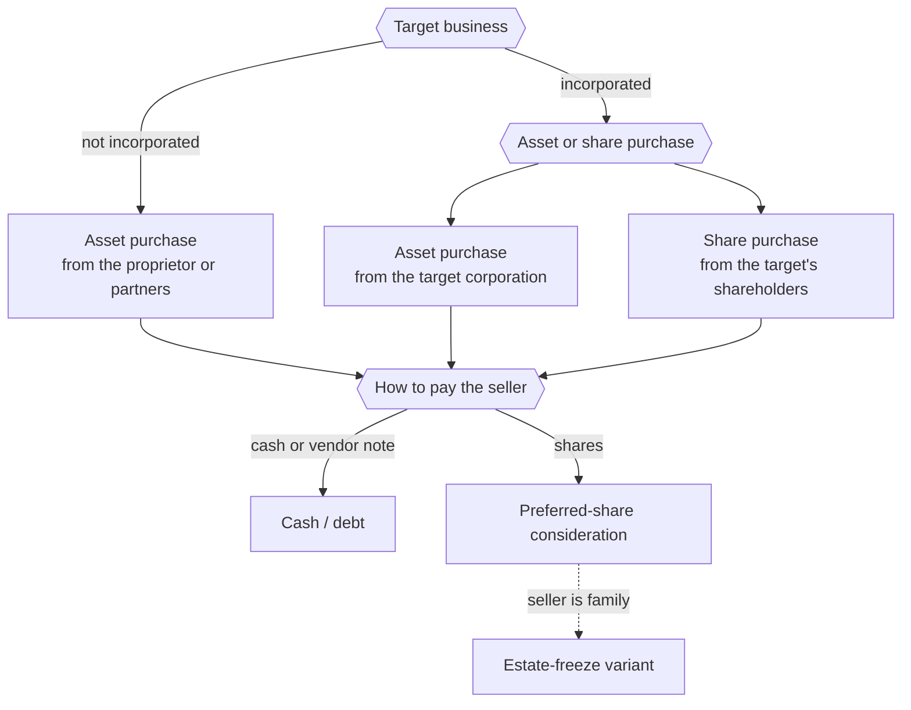

STATUS: AI GENERATED, REVIEW IN PROGRESS

# Business Acquisition

**Who this is for**:
- Owner of a Canadian-controlled private corporation (CCPC) with accumulated profits
- Want to buy an existing business and pay the previous owners over time
- The previous owners may be third parties or family, and may take payment in shares rather than cash

**TLDR**:
- Two structural forks decide the deal: *asset purchase versus share purchase*, and *cash versus share consideration*
- Paying the seller with *preferred shares* of the buyer corporation turns the purchase price into equity
  - The corporation redeems that equity over time as cash allows, subject to the corporate-law solvency tests
- Who the seller is depends on the structure: the target's shareholders, an unincorporated proprietor, or the
  *target corporation itself* on an incorporated-target asset sale
- When the vendors are family, the same machinery is an *estate freeze*
- These transactions need a tax advisor and a lawyer; this page is orientation, not a procedure

Limitations:
- This is an orientation page; every transaction here needs professional tax and legal advice before it is done
- Business valuation, the general anti-avoidance rule (GAAR), and provincial corporate-law detail are out of scope
  - They are named but not worked through
- The buyer is assumed to be a Canadian-resident CCPC; cross-border and non-resident vendors are out of scope
- Share-capital vocabulary (classes, paid-up capital, redeemable/retractable shares) is assumed; see [Share Capital](../Corporate-Structure/Share-Capital.md)
- The following is my understanding as of 2026

## Acquisition Scenario

The starting position has two corporations' worth of moving parts:
- An *existing business* you want to buy; it may or may not be incorporated
- Your *existing corporation*, with accumulated profits and the cash flow to fund a purchase
  - Retained earnings measures profit earned and not yet distributed; it is an equity balance, not a fund of money
  - A purchase, a dividend, or a redemption needs actual liquidity, and has to clear the statute's solvency tests

The goal is to buy the business and pay the seller, without handing over the whole price in cash on day one.  
The route this page focuses on is paying with *preferred shares* of your corporation.  
The corporation then redeems those shares over the following years as cash permits.  

This is a *vendor take-back* done in equity rather than as a loan.  
It defers the vendors' tax and spreads the corporation's cash outflow over years.  
When the vendors are family, it doubles as a succession plan.  

## Purchase Structure and Consideration

Every version of the deal is a combination of two choices.  

*Structure* (what you buy, and from whom):
- If the target is not incorporated, there are only assets to buy, and the proprietor or partners are the sellers
- If the target is incorporated, you can buy its shares from its shareholders, or its assets from the corporation
  - The vendor and the buyer usually prefer opposite answers (see [Asset vs Share Purchase](Asset-vs-Share.md))
- The three routes are not interchangeable, because they have different counterparties:
  - *Share purchase*: the shareholders sell and receive the consideration
  - *Unincorporated asset purchase*: the proprietor or partners transfer the assets and receive the consideration
  - *Incorporated-target asset purchase*: the **target corporation** owns the assets, so it is the transferor and it
    receives the cash or the s.85 shares — not its shareholders
    - The target pays tax on its own disposition, and a second layer falls due when its owners extract the proceeds
    - Preferred shares issued on this route sit on the target's balance sheet

*Consideration* (how you pay):
- Cash, or a promissory note (debt the corporation pays down over time)
- Preferred shares of the buyer corporation, redeemed over time (see [Preferred-Share Consideration](Preferred-Share-Consideration.md))

## Paying with Preferred Shares

The core of the scenario is the share-consideration route.  
The buyer corporation issues redeemable, retractable preferred shares to the vendors.  
Their fixed redemption value equals the agreed price; the corporation redeems them over time as cash allows.  

The detail is on [Preferred-Share Consideration](Preferred-Share-Consideration.md):
- The s.85 rollover that defers the vendors' gain
- How the shares' paid-up capital is set
- The deemed dividend that arises on each redemption

## The Family Case

The previous owners may be a parent (or another family member) selling to the next generation.  
In that case the same preferred-share machinery is an *estate freeze*.  
The freeze fixes today's value into the parent's preferred shares.  
Future growth accrues to the child's new common shares.  
Redeeming the preferred shares over time funds the parent's retirement.  

The family case carries its own anti-avoidance rules (ITA s.84.1).  
A specific relieving exception covers genuine intergenerational transfers; see [Estate Freeze](Estate-Freeze.md).  

## Professional Advice

Everything on these pages is set up by professionals, not as do-it-yourself bookkeeping.  
Get tax and legal advice before:
- *Valuing* the business: the preferred shares' redemption value depends on a defensible valuation
  - Usually with a *price-adjustment clause* in case CRA disputes it
- *Choosing the structure*: asset vs share, and the order of the steps, changes the tax for both sides
- *Filing the elections*: the s.85 rollover (Form T2057) has a strict filing deadline
  - A s.86 reorganization must be structured correctly to defer the gain
- *Relying on the intergenerational exception or the lifetime capital gains exemption*
  - Both have detailed conditions that must be met before and after closing
- *Testing for GAAR*: surplus-stripping and freeze transactions are an area CRA scrutinizes

## Related

- [Asset vs Share Purchase](Asset-vs-Share.md)
- [Preferred-Share Consideration](Preferred-Share-Consideration.md)
- [Estate Freeze](Estate-Freeze.md)
- [Share Capital](../Corporate-Structure/Share-Capital.md)
- [Dividends](../../Paying-Yourself/Dividends/Dividends.md)
- [Owner-Corporation Transactions](../../Paying-Yourself/Owner-Corporation-Transactions.md)
- [Capital Dividend Account](../../Investments/Capital-Dividend-Account/Capital-Dividend-Account.md)

## Citations

- Income Tax Act (R.S.C., 1985, c. 1 (5th Supp.)):
  - [s.85(1)](https://laws-lois.justice.gc.ca/eng/acts/I-3.3/section-85.html) - tax-deferred rollover of property to a corporation for share consideration
  - [s.84(3)](https://laws-lois.justice.gc.ca/eng/acts/I-3.3/section-84.html) - deemed dividend on redemption of shares above paid-up capital
  - [s.84.1](https://laws-lois.justice.gc.ca/eng/acts/I-3.3/section-84.1.html) - anti-surplus-stripping on non-arm's-length share transfers, and the intergenerational-transfer exception
  - [s.110.6](https://laws-lois.justice.gc.ca/eng/acts/I-3.3/section-110.6.html) - lifetime capital gains exemption on qualified small business corporation shares
- CRA - Form T2057, Election on Disposition of Property by a Taxpayer to a Taxable Canadian Corporation: https://www.canada.ca/en/revenue-agency/services/forms-publications/forms/t2057.html
