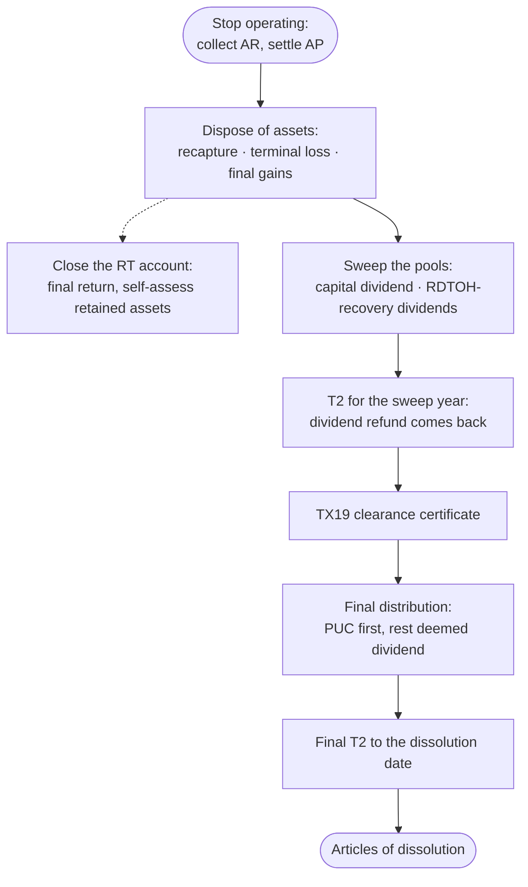

STATUS: AI GENERATED, REVIEW IN PROGRESS

# Winding Down

**Who this is for**:
- Owners of a Canadian-controlled private corporation (CCPC) closing it for good
  - Retirement, the end of a consulting practice, a business that has run its course

**TLDR**:
- Dissolution kills the tax pools: CDA, ERDTOH, NERDTOH, and GRIP balances left behind are lost
  - The wind-down is sequenced to drain them first
- The clean order: stop operating → dispose of assets → sweep the pools with final dividends
  - Then collect the refunds → distribute what is left → dissolve
- The final distribution above paid-up capital is a *deemed dividend* (ITA s.84(2)), not a capital gain
- Distributing before the corporation's taxes are settled makes the directors personally liable
  - The s.159 clearance-certificate rule
- Dissolve last: a dissolved corporation cannot cash a refund cheque

Limitations:
- Scope is the solvent, voluntary wind-down of an owner-managed CCPC
  - Insolvency and creditor arrangements are out of scope
- Selling the business instead of closing it is [Business Acquisition](Business-Acquisition/Business-Acquisition.md) (including the share-sale exit and the LCGE)
- The s.88(2) winding-up mechanics are described at orientation level
  - A wind-up with material assets, accrued gains, or multiple share classes is professional-advice territory
- Corporate-law liquidation (special resolution, liquidator, notices to creditors) is touched on, not worked through
- The following is my understanding as of 2026

## The Wind-Down Sequence

The order exists because each step feeds the next:
- Asset dispositions crystallize the last capital gains, topping up CDA and NERDTOH one final time
- The pool sweep needs those final balances; the dividend refund needs the sweep-year T2 assessed
- The final distribution needs the refund cash in the bank
- The clearance certificate must precede the final distribution
  - Distributing first exposes the directors to personal liability under s.159(3)
- The dissolution needs everything else done, because it ends the corporation's ability to act

Spreading the sweep dividends over two or three personal tax years can beat one lump.  
The wind-down horizon is a planning input, not an afterthought.  

## Disposing of Assets

Each asset leaves by sale, or by distribution to the owner:
- A *sale* closes out UCC and ACB normally: recapture or terminal loss per class, capital gain or loss per security
  - See [CCA — Recapture and terminal loss](../Operations/Cost-Recovery/Capital-Cost-Allowance/Capital-Cost-Allowance.md#recapture-and-terminal-loss), [T5008](../Investments/T5008/T5008.md)
- A *distribution in kind* to the shareholder is a deemed disposition at fair market value (ITA [s.69(5)](https://laws-lois.justice.gc.ca/eng/acts/I-3.3/section-69.html))
  - Same recapture and gain results as a sale, without the cash
- Final capital gains add their non-taxable half to [CDA](../Investments/Capital-Dividend-Account/Capital-Dividend-Account.md) and their taxable half to income (and so to NERDTOH)
  - The last pool top-up before the sweep

Settle the debts, including the shareholder loan:
- A `Due to shareholder` (`2780`) balance repays tax-free and should be paid out before the final distribution math
  - It is a debt, not a distribution

## Closing the GST/HST Account

Cancel the RT registration once commercial activity has ceased (see [HST](../Operations/HST/HST.md)):
- File the final return for the period ending on the cancellation date
- Property still held on deregistration triggers GST/HST on the final return, so deregister after the assets are gone:
  - Non-capital property is deemed sold at fair market value
  - Capital property (computers, furniture) instead self-assesses on its basic tax content
    - Under the change-in-use rules (ETA [s.171(3)](https://laws-lois.justice.gc.ca/eng/acts/E-15/section-171.html))
- A payroll account closes with its own end-of-business rules
  - Remit the final source deductions and file the final T4s promptly after the last pay
  - The T4001 end-of-business deadlines are days, not months

## Sweeping the Tax Pools

Pool balances cannot be transferred, sold, or inherited; whatever is left at dissolution is gone.  
That is the stranding problem; see [Dividends — Stranded GRIP and ERDTOH](../Paying-Yourself/Dividends/Dividends.md#stranded-grip-and-erdtoh).  

The sweep, in order of value:
- *CDA first*: elect and pay a capital dividend for the full balance (Form T2054, see [Capital Dividend Account](../Investments/Capital-Dividend-Account/Capital-Dividend-Account.md))
  - It is tax-free money and the easiest to leave behind by accident
  - Check the balance immediately before the election, and again immediately before the dividend becomes payable
    - An *unrecorded pre-election* capital loss reduces the balance that was actually available, and can reveal that
      the election was excessive
    - A loss realized *after* the election affects only the later balance; nothing reaches back
- *NERDTOH and ERDTOH next*: pay taxable dividends sized so the refunds drain both accounts
  - A non-eligible dividend of `NERDTOH ÷ 38⅓%` recovers the full balance (see [ERDTOH and NERDTOH](../Paying-Yourself/Dividends/ERDTOH-NERDTOH.md))
- *GRIP and the eligible dividend*: size the two flavours separately; each pool answers to a different dividend type:
  - Keep the NERDTOH-draining dividend above non-eligible
    - An eligible dividend draws a refund only from ERDTOH (ITA [s.129(1)](https://laws-lois.justice.gc.ca/eng/acts/I-3.3/section-129.html)), never from NERDTOH
  - Designate an eligible dividend up to the GRIP balance (the Part III.1 ceiling)
    - Ideally at least `ERDTOH ÷ 38⅓%` so ERDTOH drains too
  - GRIP designated beyond that draws no further refund, but still captures the lower personal rate on the way out

The refund needs two live things:
- A T2 filed for the dividend year within 3 years (ITA [s.129(1)](https://laws-lois.justice.gc.ca/eng/acts/I-3.3/section-129.html))
- A corporation still around to receive the money
  - Sweep in the second-last year, collect the refund, and keep the final stub year trivial

## The Final Distribution

What remains after the sweep goes out in two slices:
- *Paid-up capital* comes back first, without a deemed dividend — typically the nominal $100 subscription
  - See [Share Capital — PUC](Corporate-Structure/Share-Capital.md#paid-up-capital-puc)
  - It is tax-free only to the extent of the shareholder's ACB in the shares; beyond that it is a capital gain (ITA [s.40(3)](https://laws-lois.justice.gc.ca/eng/acts/I-3.3/section-40.html))
  - For founder shares subscribed for cash and never touched, ACB equals PUC and nothing arises
- Everything above PUC is a *deemed dividend* on the winding-up (ITA [s.84(2)](https://laws-lois.justice.gc.ca/eng/acts/I-3.3/section-84.html))
  - Taxed as a dividend, not as a capital gain on the shares
- The deemed dividend is non-eligible by default; it can be designated eligible against remaining GRIP
  - ITA [s.88(2)](https://laws-lois.justice.gc.ca/eng/acts/I-3.3/section-88.html) lets a remaining CDA balance be elected as a capital-dividend component of the distribution
  - The reason to still verify all pool balances before this step
- Report it on a T5 like any other dividend (see [Bookkeeping and information slips](../Paying-Yourself/Dividends/Bookkeeping-And-Slips.md))

The clearance certificate governs the timing:
- Directors who distribute property before obtaining a certificate under ITA [s.159(2)](https://laws-lois.justice.gc.ca/eng/acts/I-3.3/section-159.html) are personally liable
  - The liability covers the corporation's unpaid taxes up to the value distributed (s.159(3))
- Request it on Form TX19 after all returns *due to date* are filed and assessed
  - Processing takes months, so it is the wind-down's long pole
- The certificate confirms taxes are paid; it does not change them

## The Final T2 and Dissolution

- The last tax year ends on the dissolution date
  - The final T2 is due 6 months later, and marks the return as final up to dissolution
- File the corporate registry's *articles of dissolution* only after the distributions and refunds are done
  - Federally under CBCA [s.210](https://laws-lois.justice.gc.ca/eng/acts/C-44/section-210.html)
  - In Ontario, Minister of Finance consent is still required, but the registry requests it automatically
    - Automatic since the Ontario Business Registry launched (2021-10-19); no separate consent letter to obtain first
  - The Ontario articles carry the OBCA s.238(1) statements
    - Debts, obligations, and liabilities discharged or provided for
- Close the remaining program accounts (RZ after the last T5 filing, RC last of all)

After dissolution:
- Once dissolved, **all** records (transactional ones included) must be kept until 2 years after dissolution
  - Reg 5800(1)(b) sweeps the transaction records into that 2-year clock, displacing their going-concern 6-year default
- Keeping everything digital costs nothing, so the practical default is to retain beyond that 2-year minimum
  - See [CRA Administration](../Filing-And-CRA/CRA-Administration.md#records-retention)
- Director liability for unremitted source deductions and GST/HST survives dissolution
  - ITA [s.227.1](https://laws-lois.justice.gc.ca/eng/acts/I-3.3/section-227.1.html), ETA [s.323](https://laws-lois.justice.gc.ca/eng/acts/E-15/section-323.html); a two-year limitation applies after ceasing to be a director
- Property missed in the wind-up vests in the Crown (CBCA [s.228](https://laws-lois.justice.gc.ca/eng/acts/C-44/section-228.html))
  - Recovering it means reviving the corporation
  - The reason the final distribution checklist includes every bank account, deposit, and refund

## Worked Example

A consulting CCPC winds down with $150,000 cash after settling all debts.  
Its balances: PUC $100, CDA $20,000, NERDTOH $5,000, GRIP $0.  

Year 1 (the sweep year):
- Capital dividend: elect on T2054 and pay $20,000 → tax-free to the owner, CDA $0
- Non-eligible dividend: $5,000 ÷ 38⅓% = $13,043 → NERDTOH refund $5,000 on the year's T2
- Cash after the sweep and the refund: $150,000 − $20,000 − $13,043 + $5,000 = $121,957

Year 2 (the stub year):
- File TX19 after the sweep-year T2 is assessed; receive the clearance certificate
- Final distribution: $100 PUC back with no deemed dividend, and tax-free here because the founder's share ACB is
  also $100; $121,857 deemed non-eligible dividend (s.84(2)), T5 issued
- File the final T2 to the dissolution date (trivial: no income), then articles of dissolution

Skipping the sweep would have cost real money.  
The $20,000 CDA (tax-free capacity) and the $5,000 NERDTOH refund both die with the corporation.  

## Related

- [Dividends](../Paying-Yourself/Dividends/Dividends.md)
- [Capital Dividend Account](../Investments/Capital-Dividend-Account/Capital-Dividend-Account.md)
- [ERDTOH and NERDTOH](../Paying-Yourself/Dividends/ERDTOH-NERDTOH.md)
- [Share Capital](Corporate-Structure/Share-Capital.md)
- [Capital Cost Allowance](../Operations/Cost-Recovery/Capital-Cost-Allowance/Capital-Cost-Allowance.md)
- [CRA Administration](../Filing-And-CRA/CRA-Administration.md)
- [Business Acquisition](Business-Acquisition/Business-Acquisition.md)
- [Starting Up](Starting-Up.md)

## Citations

- Income Tax Act (R.S.C., 1985, c. 1 (5th Supp.)):
  - [s.84(2)](https://laws-lois.justice.gc.ca/eng/acts/I-3.3/section-84.html) - deemed dividend on a distribution on winding-up, above paid-up capital
  - [s.88(2)](https://laws-lois.justice.gc.ca/eng/acts/I-3.3/section-88.html) - winding-up of a Canadian corporation: deemed separate dividends, including the capital-dividend component
  - [s.69(5)](https://laws-lois.justice.gc.ca/eng/acts/I-3.3/section-69.html) - deemed fair-market-value disposition on property distributed on winding-up
  - [s.129(1)](https://laws-lois.justice.gc.ca/eng/acts/I-3.3/section-129.html) - dividend refund; requires the return filed within 3 years
  - [s.159(2)](https://laws-lois.justice.gc.ca/eng/acts/I-3.3/section-159.html), [s.159(3)](https://laws-lois.justice.gc.ca/eng/acts/I-3.3/section-159.html) - clearance certificate before distribution; personal liability of the legal representative
  - [s.227.1](https://laws-lois.justice.gc.ca/eng/acts/I-3.3/section-227.1.html) - director liability for unremitted source deductions
- Excise Tax Act (R.S.C., 1985, c. E-15):
  - [s.171](https://laws-lois.justice.gc.ca/eng/acts/E-15/section-171.html) - ceasing to be a registrant: deemed disposition of property held
  - [s.323](https://laws-lois.justice.gc.ca/eng/acts/E-15/section-323.html) - director liability for unremitted net tax
- Canada Business Corporations Act (R.S.C., 1985, c. C-44):
  - [s.210](https://laws-lois.justice.gc.ca/eng/acts/C-44/section-210.html) - voluntary dissolution; [s.228](https://laws-lois.justice.gc.ca/eng/acts/C-44/section-228.html) - undistributed property vests in the Crown
- Ontario Business Corporations Act (R.S.O. 1990, c. B.16):
  - [s.238](https://www.ontario.ca/laws/statute/90b16) - voluntary dissolution where the corporation has commenced business
    - The articles' discharged-or-provided-for statements
  - Director's Notice BCA 3-001 - Dissolution of a Business Corporation: https://forms.mgcs.gov.on.ca/dataset/994f27bc-c3e6-41fb-9244-22f87221506e/resource/9f4ed416-9b7e-4e42-b2b2-14a9132660d0/download/on00217e.pdf
    - Effective 2021-10-19; Minister of Finance consent auto-forwarded by the registry
- CRA forms:
  - TX19 - Asking for a Clearance Certificate: https://www.canada.ca/en/revenue-agency/services/forms-publications/forms/tx19.html
  - T2054 - Election for a Capital Dividend Under Subsection 83(2): https://www.canada.ca/en/revenue-agency/services/forms-publications/forms/t2054.html

## TODO

- Verify the s.88(2) deemed-dividend components before sign-off
  - The capital-dividend election on the wind-up dividend, and the eligible designation of the remainder
  - The worked example deliberately sweeps CDA before the final distribution to avoid leaning on it
- Verify the ETA s.171 deregistration deemed-disposition scope (which property self-assesses) against CRA guide RC4022
- Verify the payroll end-of-business deadlines (final remittance within 7 days, T4s within 30 days) against T4001
  - Add the figures to the Payroll page
- Verify the T2 jacket final-return indicator line number
- Confirm whether a GST/HST clearance mechanism separate from TX19 applies on dissolution
- Add a two-year sweep variant to the worked example (splitting the dividends across personal tax years)
  - With personal-tax figures once the Ontario 2026 rates are settled
