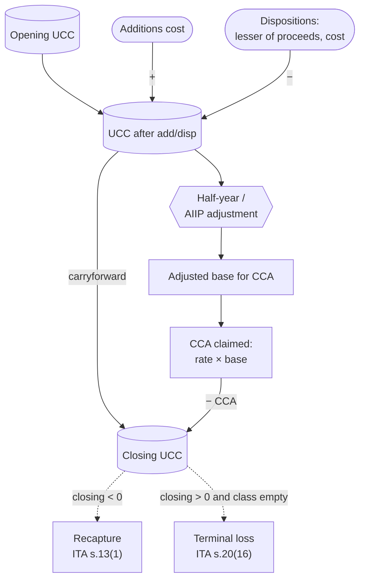

STATUS: AI GENERATED, REVIEW IN PROGRESS

# Capital Cost Allowance (CCA)

**Who this is for**: owners of a Canadian-controlled private corporation (CCPC) who purchase depreciable property (computers, furniture, vehicles, leasehold improvements, intangibles) and need to translate those purchases into the right ledger entries, T2 Schedule 8 columns, and Schedule 1 reconciliation.

**TLDR**:
- *Capital Cost Allowance* (CCA) is the federal income tax version of depreciation; accounting depreciation is not deductible under ITA [s.18(1)(b)](https://laws-lois.justice.gc.ca/eng/acts/I-3.3/section-18.html) so it is added back on Schedule 1; CCA is the matching deduction under [s.20(1)(a)](https://laws-lois.justice.gc.ca/eng/acts/I-3.3/section-20.html)
- Capital purchases are pooled by *class*; each class has a fixed rate set by Regulation 1100; most are *declining balance*
- The running pool balance is the *undepreciated capital cost* (UCC); CCA for a year = rate × adjusted UCC base
- The *half-year rule* gives only half-rate CCA on net additions in the year of acquisition; several classes are exempt; the *Accelerated Investment Incentive* (AIIP, 2018–2027) modifies this transitionally
- On disposal, UCC is reduced by the lesser of (proceeds, original cost); a negative ending balance is *recapture* (income), a positive balance with no asset left in the class is a *terminal loss* (deduction)
- CCA is *discretionary*: you can claim any amount from $0 up to the maximum, and unused UCC carries forward indefinitely
- Small items below the corp's capitalization policy (often $500) and incorporation expenses up to $3,000 are expensed immediately rather than capitalized

Limitations:
- Focus is on a typical owner-managed CCPC operating in Canada
- Manufacturing and processing (Class 53), clean-energy (Classes 43.1 / 43.2), and resource regimes are touched on but not worked through
- Buildings (Class 1 / 3 / 6) are touched on, not covered in depth
- The additional 2% / 6% election under Regulation 1101(5b.1) is out of scope
- Change-of-use deemed dispositions (ITA s.13(7)) are out of scope beyond a pointer
- Leasing-income property rules (Regulation 1100(15)) and the *specified energy property* rules are out of scope
- Provincial CCA forms (Quebec TP-130.B, Alberta AT1 Schedule 13) are out of scope; federal Schedule 8 is the focus
- Tax information can change (e.g. AIIP phase-out percentages, vehicle limits)
- The following is my understanding as of 2026

## In this folder

- [Cost Recovery](Cost-Recovery.md): overview of the three cost-recovery channels, concept map, and shared acquisition-cost / available-for-use / change-of-use rules
- [Inventory](Inventory.md): goods held for resale
- [Materials and CIP](Materials-And-CIP.md): self-constructed fixed assets feeding into a CCA class

## What CCA is

*Capital Cost Allowance* is the deduction allowed under ITA [s.20(1)(a)](https://laws-lois.justice.gc.ca/eng/acts/I-3.3/section-20.html) for the wear-and-tear of depreciable property used to earn business income.  
Accounting depreciation booked under your basis of accounting is not deductible (ITA [s.18(1)(b)](https://laws-lois.justice.gc.ca/eng/acts/I-3.3/section-18.html)); the books add it back on T2 Schedule 1 and substitute the CCA figure computed on T2 Schedule 8.  
Effect: book and tax fixed-asset balances diverge over the asset's life and re-converge on disposal.  

The statutory framework:
- ITA s.20(1)(a) — permission to deduct CCA, with the rate left to regulation
- Income Tax Regulations Part XI and Schedule II — the actual rates and class definitions
- ITA [s.13](https://laws-lois.justice.gc.ca/eng/acts/I-3.3/section-13.html) — recapture, UCC definition, and the available-for-use rules
- ITA [s.20(16)](https://laws-lois.justice.gc.ca/eng/acts/I-3.3/section-20.html) — terminal loss

## Classes and rates

Common classes for an owner-managed CCPC:
- *Class 50* (55%, declining balance): computers, peripherals, networking equipment acquired after Mar 18 2007; half-year rule applies
- *Class 8* (20%, declining): office furniture, photocopiers, tools costing $500 or more, equipment not in another class; half-year applies — the catch-all
- *Class 10* (30%, declining): motor vehicles, vans, light trucks, pickup trucks under the passenger-vehicle cost threshold; one shared pool for all vehicles
- *Class 10.1* (30%, declining): passenger vehicles whose cost exceeds the prescribed limit ($39,000 + sales taxes in 2026, up from $38,000 in 2025); each vehicle goes in *its own separate Class 10.1*; no recapture, no terminal loss, half-CCA in year of disposition under Regulation 1100(2.5)
- *Class 12* (100%, no half-year for most items): small tools costing under $500, kitchen utensils, uniforms, application software (other than systems software); the half-year rule does apply to dies, jigs, moulds, and the cutting or shaping part of a machine
- *Class 13* (straight-line over lease term + first renewal; minimum 5 years, maximum 40 years): leasehold improvements; half-year applies
- *Class 14* (straight-line over remaining legal life): limited-life intangibles (patents, franchises, licences with a fixed term); no half-year
- *Class 14.1* (5%, declining): goodwill, incorporation expenses over $3,000, customer lists, unlimited-life intangibles; half-year applies; replaced the pre-2017 *eligible capital property* (ECP) regime
- *Class 54* (30%, declining): zero-emission passenger vehicles, cost capped at $61,000 + taxes
- *Class 55* (40%, declining): zero-emission vehicles otherwise in Class 16 (taxis, courier trucks)
- *Class 53* (50%, declining): manufacturing and processing machinery and equipment

Classes touched on but not worked through here:
- Class 1 (4%, declining): buildings; +2% allowance for non-residential, +6% for an M&P building, elected via Regulation 1101(5b.1); see CRA T4012
- Classes 43.1 / 43.2: clean-energy equipment
- Class 56: zero-emission automotive equipment

CRA's [Classes of depreciable property](https://www.canada.ca/en/revenue-agency/services/tax/businesses/topics/sole-proprietorships-partnerships/report-business-income-expenses/claiming-capital-cost-allowance/classes-depreciable-property.html) page has the full list; the table above covers what an owner-managed CCPC most often touches.

## Pool mechanics (UCC)

For a class, the *undepreciated capital cost* (UCC) is the running balance of pooled cost minus all CCA previously claimed and minus the cost-side of dispositions (ITA [s.13(21)](https://laws-lois.justice.gc.ca/eng/acts/I-3.3/section-13.html)).  
Each class has its own pool. The shape of a year-end calculation:
- Opening UCC (last year's closing balance after CCA)
- Plus: cost of additions in the year that are available for use (s.13(26))
- Minus: lesser of (proceeds, original cost) for each disposition in the year
- Minus: investment tax credits claimed prior year (s.13(7.1)) — relevant if the corp is also claiming SR&ED
- = adjusted UCC base
- Apply the half-year adjustment to net additions (unless the class is exempt)
- CCA = rate × (adjusted UCC base after half-year adjustment)
- Closing UCC = adjusted UCC base before half-year minus CCA claimed

## Half-year rule and AIIP

The *half-year rule* (Regulation 1100(2)) lets you claim CCA on only half the net additions in the year of acquisition.  
Net additions = (cost of additions) − (lesser of proceeds, cost for dispositions).  

Classes exempt from the half-year rule include 12 (most items), 13, 14, 23, 24, 27, 29, 34, and 52.  

The *Accelerated Investment Incentive* (AIIP) is a transitional regime that applied to property acquired after Nov 20 2018 and available for use before 2028:
- For half-year-rule and non-half-year-rule CCA classes, the first-year deduction was enhanced (the half-year rule was suspended and an additional uplift applied)
- For *full-expensing* classes (Class 53 M&P, 43.1 / 43.2 clean energy, 54 / 55 / 56 zero-emission vehicles), 100% of cost was deductible in the first year

Both were subject to phase-out for property available for use after 2023. The phase-out percentages have been adjusted multiple times by federal budget bills, so they are not quoted here.  
Before claiming, verify the current applicable rate on CRA's [Accelerated Investment Incentive](https://www.canada.ca/en/revenue-agency/services/tax/businesses/topics/sole-proprietorships-partnerships/report-business-income-expenses/claiming-capital-cost-allowance/accelerated-investment-incentive.html) page.  
The enhanced deduction ends for property available for use after 2027.  

A separate *Immediate Expensing Measure* (the "$1.5M rule") allowed CCPCs to fully expense up to $1.5 million per year of *Designated Immediate Expensing Property* (DIEP) across most CCA classes other than 1–6, 14.1, 17, 47, 49, and 51. It applied only to CCPC-acquired property available for use before 2024 and is not available for new acquisitions in 2026. A Dec 2024 amendment removed the short-fiscal-year proration for any past DIEP claims, retroactive to fiscal years ending on or after Apr 19 2021.

## Available-for-use rule

CCA cannot be claimed on a class addition until the property is *available for use* (ITA [s.13(26)–(32)](https://laws-lois.justice.gc.ca/eng/acts/I-3.3/section-13.html)). The cost is in the pool from the acquisition date, but the half-year-adjusted base feeds CCA only once it is available for use.

For non-buildings (s.13(27)), the earliest of:
- First time it is used to earn income
- Capable of producing a commercially saleable product or service
- End of the second tax year after acquisition (the rolling-two-year / 357-day rule)

For buildings (s.13(28)), the earliest of:
- All or substantially all (~90%) of the building first used for its intended purpose
- Construction substantially complete

See [Cost Recovery — Available for use](Cost-Recovery.md#available-for-use) for the cross-channel framing, including how the same trigger applies to a CIP balance transferring into a CCA class.

## Acquisitions and dispositions

What goes into capital cost (the *A* element in the s.13(21) UCC formula):
- Purchase price
- PST and unrecoverable HST (e.g. if the corp is not registered, or the input is non-claimable)
- Freight, installation, customs duty, professional fees directly attributable to bringing the asset into use
- GST/HST is excluded if the corp claimed an input tax credit (ITC); otherwise it is included

What does not get capitalized:
- Recurring repairs and maintenance: operating expense
- Software licences with a term of one year or less: operating expense
- Items priced below the corporation's capitalization threshold policy (the *de minimis* policy, typically $500 to $2,500)

The same capitalize-vs-expense rules apply across all three cost-recovery channels; see [Cost Recovery — Acquisition cost](Cost-Recovery.md#acquisition-cost-what-gets-capitalized).

Dispositions:
- *Proceeds of disposition* per s.13(21) = sale price + insurance proceeds + compensation for damage or expropriation
- UCC reduction = lesser of (proceeds, original cost); this cap means any "gain" above original cost is a capital gain on T2 Schedule 6, not recapture on Schedule 8
- Trade-ins: the fair-market trade-in value is the proceeds for the old asset; the cash payment plus trade-in credit is the cost of the new asset
- Replacement-property rules (ITA [s.44](https://laws-lois.justice.gc.ca/eng/acts/I-3.3/section-44.html), s.13(4)) can defer recapture; out of scope here, but relevant for involuntary dispositions (fire, theft, expropriation)

## Recapture and terminal loss

*Recapture* (ITA [s.13(1)](https://laws-lois.justice.gc.ca/eng/acts/I-3.3/section-13.html)): if closing UCC is negative at year-end (cumulative proceeds exceeded the remaining UCC), the negative balance is included in income for the year. UCC is reset to zero. Recapture is *active business income* when the asset was used in the active business, so it benefits from the *Small Business Deduction* (SBD) at the same rate as the underlying ABI.

*Terminal loss* (ITA s.20(16)): if closing UCC is positive *and* no property remains in the class, the residual UCC is deducted from income for the year.

Class 10.1 exception (ITA [s.20(16.1)](https://laws-lois.justice.gc.ca/eng/acts/I-3.3/section-20.html), Regulation 1100(2.5)):
- No recapture (the $39,000 cap already limited the deduction)
- No terminal loss (the loss above the cap is already excluded)
- Year of disposition: claim half the normal CCA as a final allowance, provided the vehicle was owned at the end of the previous tax year

Class 14.1 exception (s.20(16.1)(c)): no terminal loss unless the business ceases.  

Anti-replacement rule (s.20(16.1)(b)): no terminal loss if replacement property of the same class is acquired within 24 months.

## Special class rules to be careful about

- *Class 10.1*: each vehicle is a separate class; capped capital cost; no recapture or terminal loss; half-CCA on disposition (above)
- *Class 12 with half-year*: dies, jigs, moulds, and the cutting or shaping part of a machine *are* subject to the half-year rule even though most of Class 12 is not
- *Class 13*: straight-line over (lease term + first renewal), minimum 5 years, maximum 40 years; recompute the schedule if the lease is amended
- *Class 14*: straight-line over the actual remaining legal life of the intangible
- *Class 14.1*: 5% declining; pre-2017 CEC transitional balances use 7%; the first $3,000 of incorporation expenses is a one-time deduction, not Class 14.1
- *Class 50 vs Class 12 vs Class 8*: standalone application software is Class 12 (100%); systems software bundled with hardware is Class 50; hardware peripherals not bundled may go to Class 50 or Class 8 depending on durability and the corp's capitalization policy

## Short fiscal year

For a tax year shorter than 365 days (incorporation year, year of dissolution, fiscal-year change), CCA is prorated under Regulation 1100(3):
- Maximum CCA × (days in tax year / 365)

Exceptions to proration:
- Classes 12, 13, 14, 15
- DIEP immediate expensing — proration removed by the Dec 2024 amendment, retroactive to fiscal years ending on or after Apr 19 2021

## CCA is discretionary

There is no obligation to claim the maximum. CCA is computed up to the cap; the corporation may claim any amount from $0 to the cap; unclaimed CCA does not expire, it stays in UCC.  

Common reasons to claim less than the maximum:
- Loss year: preserve the deduction for a future year that produces tax at a higher marginal rate
- Non-capital loss already large enough to wipe out taxable income (non-capital losses expire after 20 years; UCC does not expire)
- Small-ABI year where claiming full CCA would lose value compared with deferring to a year taxed at the general rate
- AII grind planning: a year close to the $50,000 AII threshold where reducing net income would not change the SBD outcome

## Capitalize-vs-expense thresholds

Two thresholds shape what gets onto Schedule 8 in the first place:
- *De minimis bookkeeping policy*: many small CCPCs set a $500 (sometimes $1,000 or $2,500) capitalization floor in their own policy; below it, items are expensed regardless of useful life. This is a bookkeeping convention, not a CRA rule
- *Class 12 tools threshold*: tools and instruments costing under $500 automatically go to Class 12 at 100% (no half-year rule for most items), so a $300 monitor stand and a $600 office chair are taxed differently *by class*, not by policy
- *Incorporation expenses immediate-deduction threshold*: the first $3,000 of incorporation expenses is deductible immediately in the year incurred; only the excess is capitalized to Class 14.1
- *Tax-pool de minimis*: if a declining-balance pool gets to an immaterial balance, there is no statutory write-off threshold; the geometric tail continues until the class empties or the business ceases

These thresholds matter most for:
- Software bundled with hardware: systems software → Class 50; standalone application software → Class 12 (100%); SaaS subscriptions → operating expense (no capitalization at all)
- Home-office equipment: only the business-use portion of cost goes into UCC; the personal-use portion is a shareholder benefit (s.15) or simply not capitalized

## Bookkeeping and T2 schedules

In the books (accrual + tax basis, per [Small Business Tax Overview](../Small-Business-Tax-Overview.md)):
- At acquisition: debit the fixed-asset GIFI account (`Computer equipment` 1770, `Furniture and fixtures` 1780, `Motor vehicles` 1740, `Machinery and equipment` 1900, `Goodwill / intangibles` 1880-series); credit `Cash` or `Accounts payable`
- Tax-basis-only convention: skip monthly accounting depreciation entirely; book the CCA at year-end as the period charge (debit `Amortization of tangible assets` 8670 / credit the relevant accumulated-amortization account)
- GAAP-style books convention: book accounting depreciation monthly per the corp's policy; add it back on Schedule 1; deduct CCA from Schedule 8

T2 schedules involved with CCA:
- *Schedule 8* (T2 SCH8): the per-class CCA computation; columns include opening UCC, cost of additions, AIIP / ZEV adjustment, dispositions, UCC after additions and dispositions, half-year adjustment, CCA rate, CCA claimed, closing UCC; T2 software (FutureTax, TaxCycle, ProFile) keeps an asset register and rolls up to S8 automatically
- *S8 reconciliation worksheet* (S8RecWS in TaxCycle, "Reconcile Fixed Assets" in CCH iFirm): reconciles book fixed-asset balances on Schedule 100 to the tax UCC; useful as a sanity check
- *Schedule 1* (S1): reconciles book to tax — add back book amortization (GIFI 8670 and any other amortization lines); deduct CCA from S8
- *Schedule 100* (S100): balance sheet, with cost and accumulated-amortization GIFI codes
- *Schedule 125* (S125): income statement, with amortization expense on GIFI 8670

## Worked examples

Three multi-year walkthroughs covering the most common owner-managed CCPC scenarios.  
Each shows the ledger entries, the relevant Schedule 8 column, and the Schedule 1 reconciliation.  
Calendar fiscal year (Jan 1 to Dec 31) is assumed unless noted.

### Example 1: Class 50 laptop (IT consulting CCPC)

Setup: single-shareholder IT consulting CCPC. Buys a laptop for $4,520 (including 13% HST) on Mar 1 2026; the corp is HST-registered and claims the $520 ITC; capitalizes the $4,000 net to Class 50.  

IT-consulting-specific allocation calls:
- Systems software bundled with the laptop (Windows, drivers) → same Class 50; do not split
- Standalone application software (e.g. a $200 perpetual licence for an IDE) → Class 12 (100%; most Class 12 software is exempt from the half-year rule)
- SaaS subscriptions (Office 365, GitHub Copilot, AWS, JetBrains All-Products Pack) → operating expense via `Office supplies & subscriptions` or `Internet & cloud services`; never capitalized regardless of annual cost
- A separate $300 second monitor → arguably Class 12 (small tools < $500, treated as a standalone instrument) or Class 50 (computer peripheral, bundled with the laptop's role); pick a convention in the bookkeeping policy and apply it consistently

Year 1 (2026):

Mar 1 entry:
- Debit `Computer equipment - cost` (GIFI 1770) = $4,000
- Debit `HST receivable` = $520
- Credit `Cash` = $4,520

The laptop is available for use on Mar 1 (turned on, used to deliver consulting that day).  

Schedule 8 Class 50 row:
- Opening UCC: $0
- Cost of additions: $4,000
- Dispositions: $0
- AIIP enhanced first-year deduction may apply for 2026 acquisitions; verify the current multiplier on CRA's AIIP page
- Standard Class 50 declining-balance rate: 55%
- Without AIIP, the half-year adjustment would give a base of $2,000 and CCA of $2,000 × 55% = $1,100
- Closing UCC: $4,000 − CCA claimed

Year 2 (2027):

No transactions. Schedule 8 Class 50 row:
- Opening UCC: from year 1
- Additions: $0; dispositions: $0; half-year adjustment: none (no additions)
- CCA: 55% × opening UCC
- Closing UCC: opening UCC − CCA

Year 3 (2028): laptop sold for $400 cash on Aug 15 2028.

Aug 15 entry (book side, GAAP-style books):
- Debit `Cash` = $400
- Debit `Accumulated amortization - computer equipment` for the cumulative book amortization
- Credit `Computer equipment - cost` (GIFI 1770) = $4,000
- Plug the residual to `Gain on disposal of capital assets` (GIFI 8210) or `Loss on disposal of capital assets`

Schedule 8 Class 50 row:
- Opening UCC: from year 2
- Dispositions: $400 (lesser of proceeds $400 and original cost $4,000 = $400)
- Closing UCC: opening UCC − $400 − CCA claimed
- If the laptop was the only Class 50 asset and the resulting balance is positive, claim the residual as a *terminal loss* (ITA s.20(16))
- If the resulting balance is negative, the excess is *recapture* (ITA s.13(1))

Schedule 1 reconciliation for year 3:
- Add back: book amortization expense for the year and the accounting gain/loss on disposal
- Deduct: CCA from Schedule 8 (including any terminal loss)

### Example 2: Class 8 floor polisher (physical-service CCPC)

Setup: single-shareholder commercial cleaning CCPC. Buys a $1,800 floor polisher on Jun 15 2026; the corp is HST-registered and claims the $234 ITC; capitalizes $1,800 to Class 8.  

Why Class 8 and not 12: cost is at or above the $500 Class 12 tools threshold, so the tool-instrument exemption does not apply. No other class fits, so the catch-all Class 8 applies at 20% declining balance with the half-year rule.  

Year 1 (2026):

Jun 15 entry:
- Debit `Machinery and equipment - cost` (GIFI 1900) = $1,800
- Debit `HST receivable` = $234
- Credit `Cash` = $2,034

Schedule 8 Class 8 row:
- Opening UCC: $0
- Cost of additions: $1,800
- Dispositions: $0
- Without AIIP, half-year-adjusted base = $900, and CCA = 20% × $900 = $180
- Closing UCC: $1,800 − $180 = $1,620

Year 2 (2027) and onward (no further transactions in the class):
- Each year: CCA = 20% × opening UCC; the pool asymptotes to zero, never reaches it under pure declining balance
- Year 2 closing: $1,620 × 0.80 = $1,296
- Year 3 closing: $1,296 × 0.80 = $1,036.80
- After 5 years of full-rate CCA, ~$590 of UCC remains; after 10 years, ~$193

When to trigger a terminal loss: when the corp disposes of every piece of Class 8 property in the year, the residual UCC becomes a deduction (ITA s.20(16)). For a multi-asset pool, this is rarely useful; for a single-asset class that has been sold or scrapped, it cleans up the pool.  

For contrast: a $400 hand-tool bought the same year would be Class 12 (under the $500 threshold) and 100% deductible in year 1 — no pool, no tail. Splitting purchases just below $500 vs just above creates very different tax timing for similar-looking spend.

### Example 3: Class 14.1 incorporation expenses

Setup: corp is incorporated on Apr 1 2026 (first fiscal year Apr 1 2026 to Mar 31 2027) at a total cost of $4,200 in incorporation expenses (legal fees, name search, registry filing, minute book).  

Year 1 (first fiscal year):

The first $3,000 is *immediately deductible*; only the excess of $1,200 is capitalized to Class 14.1.

Apr 1 entry:
- Debit `Professional fees` (GIFI 8860) = $3,000
- Debit `Goodwill / intangible assets - cost` (GIFI 1880-series, e.g. 1881 for incorporation costs in your chart of accounts) = $1,200
- Credit `Cash` = $4,200

Schedule 8 Class 14.1 row:
- Opening UCC: $0
- Cost of additions: $1,200
- Half-year applies; adjusted base = $600
- Class 14.1 rate: 5%
- CCA: 5% × $600 = $30
- Closing UCC: $1,200 − $30 = $1,170

Short-fiscal-year note: this first fiscal year is exactly 365 days (Apr 1 2026 to Mar 31 2027 in a non-leap-year alignment), so no proration. If incorporation had been Oct 1 2026 with a Mar 31 2027 year-end, the first fiscal year would be 182 days and CCA would be prorated under Regulation 1100(3): $30 × (182 / 365) ≈ $14.96. Class 14.1 is *not* in the Regulation 1100(3) proration-exception list.

Year 2 onward:
- Each year: CCA = 5% × opening UCC
- Year 2 closing: $1,170 × 0.95 = $1,111.50
- Year 3 closing: $1,055.93
- After 20 years of full-rate CCA, ~$420 of UCC remains; the pool decays geometrically

What if incorporation expenses total *less than $3,000*: the entire amount is immediately deductible in year 1, nothing goes to Class 14.1, and Schedule 8 has no Class 14.1 entry. This is the common case for a corporation set up online for a few hundred dollars (e.g. through Ownr or a similar service).

What if a Class 14.1 UCC pool becomes immaterial: continue claiming the geometric tail year by year. There is no CRA "write off below $X" rule; the only ways to clear a Class 14.1 pool are:
- Acquire more Class 14.1 property and eventually dispose of all of it (rare for owner-managed CCPCs)
- The corporation ceases business (triggers terminal loss under the s.20(16.1)(c) cessation exception)
- The corporation winds up

Most owner-managed CCPCs simply carry the small residual on Schedule 8 indefinitely. Leaving a $50 line on S8 is correct — CRA expects pool continuity. Merging low-balance pools in the corp's own asset register is fine internally, but the S8 filing must still show the running UCC by class.

## Edge cases worth a short note

- *Personal-use proportion* on a vehicle: keep a kilometre log; the personal-use portion of CCA, fuel, insurance, and other vehicle costs is a shareholder benefit under ITA s.6 / s.15 and must be added to the shareholder's personal income
- *Investment Tax Credit recapture*: ITCs claimed against capital cost reduce UCC in the next year (s.13(7.1)); relevant for SR&ED claimants
- *Available-for-use 357-day delay*: cost of property bought in the last weeks of a fiscal year is capitalized but ineligible for CCA until next year if not yet in service
- *Non-arm's-length acquisitions*: deemed-cost rules in s.13(7)(e) cap UCC at the seller's UCC plus a fraction of any gain — common in family-CCPC transfers, share rollovers under s.85, and asset transfers between associated corporations

## Related

- [Cost Recovery](Cost-Recovery.md)
- [Materials and CIP](Materials-And-CIP.md)
- [Inventory](Inventory.md)
- [Small Business Tax Overview](../Small-Business-Tax-Overview.md)
- [Adjusted Cost Base](../Adjusted-Cost-Base/Adjusted-Cost-Base.md)
- [Capital Dividend Account](../Capital-Dividend-Account/Capital-Dividend-Account.md)
- [HST](../HST.md)
- [Glossary](../Glossary.md)

## Citations

- Income Tax Act (R.S.C., 1985, c. 1 (5th Supp.)): https://laws-lois.justice.gc.ca/eng/acts/I-3.3/
  - [s.13](https://laws-lois.justice.gc.ca/eng/acts/I-3.3/section-13.html) - recapture (s.13(1)); special rule for Class 10.1 (s.13(2)); change of use and partial use (s.13(7)); investment tax credit reduction of UCC (s.13(7.1)); UCC definition (s.13(21)); available-for-use rules (s.13(26)–(32))
  - [s.18(1)(b)](https://laws-lois.justice.gc.ca/eng/acts/I-3.3/section-18.html) - disallowance of accounting depreciation
  - [s.20(1)(a)](https://laws-lois.justice.gc.ca/eng/acts/I-3.3/section-20.html) - permission to deduct CCA per regulation
  - [s.20(16)](https://laws-lois.justice.gc.ca/eng/acts/I-3.3/section-20.html) - terminal loss
  - [s.20(16.1)](https://laws-lois.justice.gc.ca/eng/acts/I-3.3/section-20.html) - terminal-loss exceptions (Class 10.1, replacement property, Class 14.1 unless cessation)
  - [s.44](https://laws-lois.justice.gc.ca/eng/acts/I-3.3/section-44.html) - replacement-property election (deferring recapture or capital gain)
  - [s.85](https://laws-lois.justice.gc.ca/eng/acts/I-3.3/section-85.html) - rollover of property to a corporation (non-arm's-length deemed-cost mechanics)
- Income Tax Regulations (C.R.C., c. 945): https://laws-lois.justice.gc.ca/eng/regulations/C.R.C.,_c._945/
  - Part XI - capital cost allowances
  - Regulation 1100(1) - prescribed CCA rates by class
  - Regulation 1100(2) - half-year rule
  - Regulation 1100(2.5) - half-CCA on Class 10.1 disposition
  - Regulation 1100(3) - short-fiscal-year proration; exceptions
  - Regulation 1101(1af) - separate-class election for Class 10.1
  - Regulation 1101(5b.1) - separate-class election for non-residential building additional 2% / 6%
  - Regulation 1104(4) - AIIP / DIEP phase-out and definitions
  - Schedule II - class definitions
- CRA T4012 - T2 Corporation Income Tax Guide: https://www.canada.ca/en/revenue-agency/services/forms-publications/publications/t4012.html
- CRA T2 SCH8 - Capital Cost Allowance (CCA): https://www.canada.ca/en/revenue-agency/services/forms-publications/forms/t2sch8.html
- CRA Income Tax Folio S3-F4-C1 - General Discussion of Capital Cost Allowance: https://www.canada.ca/en/revenue-agency/services/tax/technical-information/income-tax/income-tax-folios-index/series-3-property-investments-savings-plans/series-3-property-investments-savings-plans-folio-4-capital-cost-allowance/income-tax-folio-s3-f4-c1-general-discussion-capital-cost-allowance.html
- CRA Classes of depreciable property: https://www.canada.ca/en/revenue-agency/services/tax/businesses/topics/sole-proprietorships-partnerships/report-business-income-expenses/claiming-capital-cost-allowance/classes-depreciable-property.html
- CRA Accelerated Investment Incentive: https://www.canada.ca/en/revenue-agency/services/tax/businesses/topics/sole-proprietorships-partnerships/report-business-income-expenses/claiming-capital-cost-allowance/accelerated-investment-incentive.html
- CRA RC4088 - General Index of Financial Information (GIFI): https://www.canada.ca/en/revenue-agency/services/forms-publications/publications/rc4088.html
