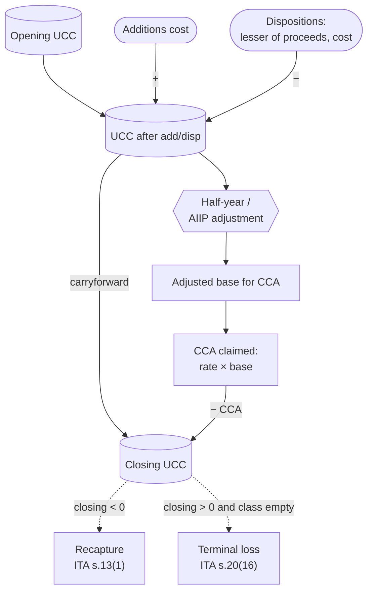

STATUS: AI GENERATED, REVIEW IN PROGRESS

# Capital Cost Allowance (CCA)

**Who this is for**: owners of a Canadian-controlled private corporation (CCPC) who purchase depreciable property (computers, furniture, vehicles, leasehold improvements, intangibles) and need to translate those purchases into the right ledger entries, T2 Schedule 8 columns, and Schedule 1 reconciliation.

**TLDR**:
- *Capital Cost Allowance* (CCA) is the federal income tax version of depreciation; accounting depreciation is not deductible under ITA [s.18(1)(b)](https://laws-lois.justice.gc.ca/eng/acts/I-3.3/section-18.html) so it is added back on Schedule 1; CCA is the matching deduction under [s.20(1)(a)](https://laws-lois.justice.gc.ca/eng/acts/I-3.3/section-20.html)
- Capital purchases are pooled by *class*; each class has a fixed rate set by Regulation 1100; most are *declining balance*
- The running pool balance is the *undepreciated capital cost* (UCC); CCA for a year = rate × adjusted UCC base
- The *half-year rule* gives only half-rate CCA on net additions in the year of acquisition; several classes are exempt; the *Accelerated Investment Incentive* (AIIP) overrides it with an enhanced first-year deduction
  - AIIP was reinstated by Bill C-15 for property acquired after 2024 and available for use before 2030
- On disposal, UCC is reduced by the lesser of (proceeds, original cost); a negative ending balance is *recapture* (income), a positive balance with no asset left in the class is a *terminal loss* (deduction)
- CCA is *discretionary*: you can claim any amount from $0 up to the maximum, and unused UCC carries forward indefinitely
- Small items below the corp's capitalization policy (often $500) and incorporation expenses up to $3,000 are expensed immediately rather than capitalized

Limitations:
- Focus is on a typical owner-managed CCPC operating in Canada
- Manufacturing and processing (Class 53), clean-energy (Classes 43.1 / 43.2), and resource regimes are touched on but not worked through
- Buildings (Class 1 / 3 / 6) are touched on, not covered in depth
- The additional 2% / 6% election under Regulation 1101(5b.1) is out of scope
- Change-of-use deemed dispositions (ITA s.13(7)) are touched on, not worked through
- Leasing-income property rules (Regulation 1100(15)) and the *specified energy property* rules are out of scope
- Provincial CCA forms (Quebec TP-130.B, Alberta AT1 Schedule 13) are out of scope; federal Schedule 8 is the focus
- Tax information can change (e.g. AIIP phase-out percentages, vehicle limits)
- The following is my understanding as of 2026

## Sub-pages

- [CCA Classification](CCA-Classification.md): which class a purchase goes in, the classes-and-rates table, and commonly confusing cases
- [CCA Worked examples](CCA-Examples.md): three multi-year walkthroughs with ledger entries and the matching T2 schedules
- [CCA Tracking](CCA-Tracking.md): the asset register and the exact per-class formulas for a spreadsheet

## What CCA is

*Capital Cost Allowance* is the deduction allowed under ITA [s.20(1)(a)](https://laws-lois.justice.gc.ca/eng/acts/I-3.3/section-20.html) for the wear-and-tear of depreciable property used to earn business income.  
Accounting depreciation booked under your basis of accounting is not deductible (ITA [s.18(1)(b)](https://laws-lois.justice.gc.ca/eng/acts/I-3.3/section-18.html)); the books add it back on T2 Schedule 1 and substitute the CCA figure computed on T2 Schedule 8.  
Book and tax fixed-asset balances diverge over the asset's life and re-converge on disposal.  

The statutory framework:
- ITA s.20(1)(a): permission to deduct CCA, with the rate left to regulation
- Income Tax Regulations Part XI and Schedule II: the actual rates and class definitions
- ITA [s.13](https://laws-lois.justice.gc.ca/eng/acts/I-3.3/section-13.html): recapture, UCC definition, and the available-for-use rules
- ITA [s.20(16)](https://laws-lois.justice.gc.ca/eng/acts/I-3.3/section-20.html): terminal loss

For the class list and how to pick a class, see [CCA Classification](CCA-Classification.md).

## Pool mechanics (UCC)

For a class, the *undepreciated capital cost* (UCC) is the running balance of pooled cost minus all CCA previously claimed and minus the cost-side of dispositions (ITA [s.13(21)](https://laws-lois.justice.gc.ca/eng/acts/I-3.3/section-13.html)).  
Each class has its own pool.  
The shape of a year-end calculation:
- Opening UCC (last year's closing balance after CCA)
- Plus: cost of additions in the year that are available for use (s.13(26))
- Minus: lesser of (proceeds, original cost) for each disposition in the year
- Minus: investment tax credits claimed prior year (s.13(7.1)), relevant if the corp is also claiming SR&ED
- = adjusted UCC base
- Apply the half-year adjustment to net additions (unless the class is exempt)
- CCA = rate × (adjusted UCC base after half-year adjustment)
- Closing UCC = adjusted UCC base before half-year minus CCA claimed

Tracking is per class, not per asset:
- The pool is a single UCC figure for the whole class; there is no UCC per item, and Schedule 8 carries one row per class
- Keep a separate *asset register* (item, class, cost, in-service date, disposal date, proceeds) as a reference: it tells you what is still in each class and feeds the *additions* and *dispositions* totals, but it is not the CCA computation; see [CCA Tracking](CCA-Tracking.md)
- The register grows with the number of items; the CCA math stays one row per class per year

For the exact spreadsheet formulas behind this diagram, see [CCA Tracking](CCA-Tracking.md).

## Half-year rule and AIIP

The *half-year rule* (Regulation 1100(2)) lets you claim CCA on only half the net additions in the year of acquisition.  
Net additions = (cost of additions) − (lesser of proceeds, cost for dispositions).  

Classes exempt from the half-year rule include 12 (most items), 13, 14, 23, 24, 27, 29, 34, and 52.  

The *Accelerated Investment Incentive* (AIIP) enhances the first-year CCA deduction by suspending the half-year rule and applying an uplift.  
It first applied to property acquired after Nov 20 2018, began phasing out for property available for use after 2023, and was scheduled to end after 2027.  
The 2024 Fall Economic Statement reinstated it, enacted by Bill C-15 (Budget Implementation Act, 2025, No. 1) on Royal Assent on Mar 26 2026.

As reinstated, for property acquired after 2024 (on or after Jan 1 2025) and available for use before 2030:
- For CCA classes otherwise subject to the half-year rule, the half-year rule is suspended and the first-year base is 150% of the net addition (three times the deduction the half-year rule alone would have allowed)
- For classes not subject to the half-year rule, the first-year deduction is one-and-a-half times the normal allowance
- For *full-expensing* classes (Class 53 M&P, 43.1 / 43.2 clean energy, 54 / 55 / 56 zero-emission vehicles), 100% of cost is deductible in the first year

A new phase-out runs from 2030 to 2033: the enhancement steps down for property available for use after 2029 and is fully eliminated for property available for use after 2033.  
The year-by-year step-down percentages are not quoted here.  
Before claiming, verify the current applicable rate on CRA's [Accelerated Investment Incentive](https://www.canada.ca/en/revenue-agency/services/tax/businesses/topics/sole-proprietorships-partnerships/report-business-income-expenses/claiming-capital-cost-allowance/accelerated-investment-incentive.html) page.  
The reinstated enhancement is available only for property acquired after 2024; earlier acquisitions fall under the original 2018 rules, which had wound down by 2027.  

A separate *Immediate Expensing Measure* (the "$1.5M rule") allowed CCPCs to fully expense up to $1.5 million per year of *Designated Immediate Expensing Property* (DIEP) across most CCA classes other than 1–6, 14.1, 17, 47, 49, and 51.  
It applied only to CCPC-acquired property available for use before 2024 and is not available for new acquisitions in 2026.  
A Dec 2024 amendment removed the separate short-fiscal-year proration of the *deduction* for past DIEP claims, retroactive to fiscal years ending on or after Apr 19 2021; the $1.5 million immediate-expensing limit itself still prorates for a short tax year under Regulation 1104(3.5)(b).

## Available-for-use rule

CCA cannot be claimed on a class addition until the property is *available for use* (ITA [s.13(26)–(32)](https://laws-lois.justice.gc.ca/eng/acts/I-3.3/section-13.html)).  
The cost is in the pool from the acquisition date, but the half-year-adjusted base feeds CCA only once it is available for use.

For non-buildings (s.13(27)), the earliest of:
- First time it is used to earn income
- Capable of producing a commercially saleable product or service
- Beginning of the second tax year after the acquisition year (the rolling-two-year / 357-day rule)

For buildings (s.13(28)), the earliest of:
- All or substantially all (~90%) of the building first used for its intended purpose
- Construction substantially complete
- Beginning of the second tax year after the acquisition year (the same 357-day rolling rule, s.13(28)(c))

See [Cost Recovery — Available for use](../Cost-Recovery.md#available-for-use) for the cross-channel framing, including how the same trigger applies to a CIP balance transferring into a CCA class.

## Acquisitions and dispositions

What goes into capital cost (the *A* element in the s.13(21) UCC formula):
- Purchase price
- PST and unrecoverable HST (e.g. if the corp is not registered, or the input is non-claimable)
- Freight, installation, customs duty, professional fees directly attributable to bringing the asset into use
- GST/HST is excluded if the corp claimed an input tax credit (ITC); otherwise it is included

What does not get capitalized:
- Recurring repairs and maintenance: operating expense
- Software licences with a term of one year or less: operating expense
- Items priced below the corporation's capitalization threshold policy (the *de minimis* policy, typically $500 to $2,500)

The same capitalize-vs-expense rules apply across all three cost-recovery channels; see [Cost Recovery — Acquisition cost](../Cost-Recovery.md#acquisition-cost-what-gets-capitalized).

Dispositions:
- *Proceeds of disposition* per s.13(21) = sale price + insurance proceeds + compensation for damage or expropriation
- UCC reduction = lesser of (proceeds, original cost); this cap means any "gain" above original cost is a capital gain on T2 Schedule 6, not recapture on Schedule 8
- Trade-ins: the fair-market trade-in value is the proceeds for the old asset; the cash payment plus trade-in credit is the cost of the new asset
- Replacement-property rules (ITA [s.44](https://laws-lois.justice.gc.ca/eng/acts/I-3.3/section-44.html), s.13(4)) can defer recapture; out of scope here, but relevant for involuntary dispositions (fire, theft, expropriation)

## Recapture and terminal loss

*Recapture* (ITA [s.13(1)](https://laws-lois.justice.gc.ca/eng/acts/I-3.3/section-13.html)): if closing UCC is negative at year-end (cumulative proceeds exceeded the remaining UCC), the negative balance is included in income for the year.  
UCC is reset to zero.  
Recapture is *active business income* when the asset was used in the active business, so it benefits from the *Small Business Deduction* (SBD) at the same rate as the underlying ABI.

*Terminal loss* (ITA s.20(16)): if closing UCC is positive *and* no property remains in the class, the residual UCC is deducted from income for the year.

Retiring or scrapping an asset:
- Throwing out or scrapping property is a *disposition* with proceeds equal to whatever you receive, often $0
- The pool drops by the lesser of (proceeds, original cost), so a $0 retirement subtracts nothing and the class keeps depreciating
- The terminal-loss trigger is the *class being empty* (every asset disposed of) with positive UCC: it turns on disposition, not on whether an asset still functions; a broken asset you keep is still property in the class
- $0 proceeds leave the entire residual to be deducted as the terminal loss once the class empties; any proceeds reduce that loss, and proceeds above the remaining UCC become *recapture* instead
- Because the class is one pool, no loss is recognized on a single retired item while other assets remain in the class

Class 10.1 exception (ITA [s.20(16.1)](https://laws-lois.justice.gc.ca/eng/acts/I-3.3/section-20.html), Regulation 1100(2.5)):
- No recapture (the $39,000 cap already limited the deduction)
- No terminal loss (the loss above the cap is already excluded)
- Year of disposition: claim half the normal CCA as a final allowance, provided the vehicle was owned at the end of the previous tax year

Class 14.1 exception (s.20(16.1)(c)): no terminal loss unless the business ceases.  

Former-property exception (s.20(16.1)(b)): a narrow rule tied to the s.13(4)/(4.2) former-property elections (franchises, concessions, licences).  
No terminal loss when a *similar* property is acquired within 24 months for the same fixed place and is still owned at year-end.  
It is not a general bar on claiming a terminal loss after replacing a same-class asset.

## Short fiscal year

For a tax year shorter than 365 days (incorporation year, year of dissolution, fiscal-year change), CCA is prorated under Regulation 1100(3):
- Maximum CCA × (days in tax year / 365)

Exceptions to proration:
- Classes 12, 13, 14, 15
- DIEP immediate-expensing *deduction*: the Dec 2024 amendment removed its short-year proration, retroactive to fiscal years ending on or after Apr 19 2021 (the $1.5M DIEP limit itself still prorates under Regulation 1104(3.5)(b))

## Discretionary CCA

There is no obligation to claim the maximum.  
CCA is computed up to the cap; the corporation may claim any amount from $0 to the cap; unclaimed CCA does not expire and stays in UCC.  

Common reasons to claim less than the maximum:
- Loss year: preserve the deduction for a future year that produces tax at a higher marginal rate
- Non-capital loss already large enough to wipe out taxable income (non-capital losses expire after 20 years; UCC does not expire)
- Small-ABI year where claiming full CCA would lose value compared with deferring to a year taxed at the general rate
- AII grind planning: a year close to the $50,000 AII threshold where reducing net income would not change the SBD outcome

The opposite move can also pay:
- A non-capital loss carries back 3 years as well as forward 20 (ITA [s.111(1)(a)](https://laws-lois.justice.gc.ca/eng/acts/I-3.3/section-111.html)), so claiming CCA to create or deepen a loss can recover tax already paid in the prior three years (requested on T2 Schedule 4)
- Worth it only when those prior years had tax to recover; a startup with no profitable history defers instead, leaving the deduction in UCC

## Capitalize-vs-expense thresholds

Several thresholds shape what gets onto Schedule 8 in the first place:
- *De minimis bookkeeping policy*: many small CCPCs set a $500 (sometimes $1,000 or $2,500) capitalization floor in their own policy; below it, items are expensed regardless of useful life
  - This is a bookkeeping convention, not a CRA rule
- *Incorporation expenses immediate-deduction threshold*: the first $3,000 of incorporation expenses is deductible immediately in the year incurred; only the excess is capitalized to Class 14.1
- *Tax-pool de minimis*: if a declining-balance pool gets to an immaterial balance, there is no statutory write-off threshold; the geometric tail continues until the class empties or the business ceases

These thresholds matter most for:
- Software bundled with hardware: systems software → Class 50; standalone application software → Class 12 (100%); SaaS subscriptions → operating expense, GIFI 9150 (no capitalization at all)
- Home-office equipment: only the business-use portion of cost goes into UCC; the personal-use portion is a shareholder benefit (s.15) or not capitalized

For certain classes, you can expense an item in the books rather than capitalize and amortize it.  
Where a class writes off the whole cost in the first year, capitalizing the item and expensing it results in the same deduction in the same year:
- *Which classes*: most of Class 12 (its half-year-exempt items) and the *full-expensing* classes under AIIP (53, 43.1 / 43.2, 54 / 55 / 56)
- *No spread*: nothing is amortized over later years, so the choice is bookkeeping mechanics, not timing, and expensing such an item directly costs no tax
- *Software exception*: Class 12 application software stays under the half-year rule, so outside the AIIP window it deducts over two years and the equivalence fails
- *When timing diverges*: only if the alternative is a declining-balance class (Class 8 at 20%, say), where the pool releases the cost over years; that gap is what the capitalization floor trades off
- *On disposal*: a pooled item's proceeds can return as recapture (capped at cost), while an expensed item's proceeds are simply income; rarely material for low-value resales

The de minimis floor is a policy choice within limits:
- The Income Tax Act sets no dollar threshold; the test is the general current-vs-capital distinction, and CRA tolerates expensing amounts too small to matter
- A floor of $500 to $2,500 is accepted if it is reasonable for the size of the business and applied consistently from year to year

Costs of setting the floor high:
- Expensing changes only *timing*: both routes deduct the full cost eventually, so a higher floor merely pulls the deduction earlier (a small gain on a sub-$2,500 item, smaller still while AIIP front-loads first-year CCA)
- Consistency cuts both ways: a high floor forces immediate expensing even in a loss year, where a non-capital loss expires after 20 years while undepreciated CCA never does
- "immaterial" scales with size: $2,500 is not credibly immaterial for a corp earning $40,000
- Over-expensing understates assets on any ASPE financial statements a bank or buyer relies on

Simplest tax-basis treatment: set a single $500 floor in a written policy, expense below it, capitalize at or above.  
$500 is the easiest figure to defend (it matches the Class 12 tools line) and leaves larger items in CCA, where the discretionary claim keeps year-to-year flexibility.  

Out of scope here:
- A higher floor (toward $2,500) for a larger, steadily-profitable corp with no external-reporting needs
- Deferring deductions in a loss or low-rate year by capitalizing instead of expensing
- GAAP/ASPE statement presentation, where capitalization affects reported assets and earnings

## Bookkeeping and T2 schedules

In the books (accrual + tax basis, per [Small Business Tax Overview](../../Small-Business-Tax-Overview.md)):
- At acquisition: debit the fixed-asset GIFI account (`Computer equipment` 1774, `Furniture and fixtures` 1787, `Motor vehicles` 1742, `Machinery and equipment` 1900, `Goodwill / intangibles` 2010-series, with goodwill at 2012); credit `Cash` or `Accounts payable`
- Tax-basis-only convention: skip monthly accounting depreciation entirely; book the CCA at year-end as the period charge (debit `Amortization of tangible assets` 8670 / credit the relevant accumulated-amortization account)
- GAAP-style books convention: book accounting depreciation monthly per the corp's policy; add it back on Schedule 1; deduct CCA from Schedule 8

T2 schedules involved with CCA:
- *Schedule 8* (T2 SCH8): the per-class CCA computation; columns include opening UCC, cost of additions, AIIP / ZEV adjustment, dispositions, UCC after additions and dispositions, half-year adjustment, CCA rate, CCA claimed, closing UCC; T2 software (FutureTax, TaxCycle, ProFile) keeps an asset register and rolls up to S8 automatically
- *S8 reconciliation worksheet* (S8RecWS in TaxCycle, "Reconcile Fixed Assets" in CCH iFirm): reconciles book fixed-asset balances on Schedule 100 to the tax UCC; useful as a sanity check
- *Schedule 1* (S1): reconciles book to tax by adding back book amortization (GIFI 8670 and any other amortization lines) and deducting CCA from S8
- *Schedule 100* (S100): balance sheet, with cost and accumulated-amortization GIFI codes
- *Schedule 125* (S125): income statement, with amortization expense on GIFI 8670

## Edge cases

- *Personal-use proportion* on a vehicle: keep a kilometre log; the personal-use portion of CCA, fuel, insurance, and other vehicle costs is a shareholder benefit under ITA s.6 / s.15 and must be added to the shareholder's personal income; see [Owner-corporation transactions](../../Owner-Corporation-Transactions.md) for the standby charge, operating cost benefit, and the personal-car allowance alternative
- *Investment Tax Credit recapture*: ITCs claimed against capital cost reduce UCC in the next year (s.13(7.1)); relevant for SR&ED claimants
- *Available-for-use 357-day delay*: cost of property bought in the last weeks of a fiscal year is capitalized but ineligible for CCA until next year if not yet in service
- *Non-arm's-length acquisitions*: deemed-cost rules in s.13(7)(e) cap UCC at the seller's UCC plus a fraction of any gain; common in family-CCPC transfers, share rollovers under s.85, and asset transfers between associated corporations

## Related

- [CCA Classification](CCA-Classification.md)
- [CCA Worked examples](CCA-Examples.md)
- [CCA Tracking](CCA-Tracking.md)
- [Cost Recovery](../Cost-Recovery.md)
- [Materials and CIP](../Materials-And-CIP.md)
- [Inventory](../Inventory-And-COGS.md)
- [Small Business Tax Overview](../../Small-Business-Tax-Overview.md)
- [Adjusted Cost Base](../../Adjusted-Cost-Base/Adjusted-Cost-Base.md)
- [Capital Dividend Account](../../Capital-Dividend-Account/Capital-Dividend-Account.md)
- [HST](../../HST.md)
- [Expense Classification](../../Expense-Classification.md)
- [Owner-corporation transactions](../../Owner-Corporation-Transactions.md)
- [Glossary](../../Glossary.md)
- [Whole-dollar rounding](../../Whole-Dollar-Rounding.md)

## Citations

- Income Tax Act (R.S.C., 1985, c. 1 (5th Supp.)): https://laws-lois.justice.gc.ca/eng/acts/I-3.3/
  - [s.13](https://laws-lois.justice.gc.ca/eng/acts/I-3.3/section-13.html) - recapture (s.13(1)); no recapture on a Class 10.1 passenger vehicle (s.13(2)); change of use and partial use (s.13(7)); investment tax credit reduction of UCC (s.13(7.1)); UCC definition (s.13(21)); available-for-use rules (s.13(26)–(32))
  - [s.18(1)(b)](https://laws-lois.justice.gc.ca/eng/acts/I-3.3/section-18.html) - disallowance of accounting depreciation
  - [s.20(1)(a)](https://laws-lois.justice.gc.ca/eng/acts/I-3.3/section-20.html) - permission to deduct CCA per regulation
  - [s.20(16)](https://laws-lois.justice.gc.ca/eng/acts/I-3.3/section-20.html) - terminal loss
  - [s.20(16.1)](https://laws-lois.justice.gc.ca/eng/acts/I-3.3/section-20.html) - terminal-loss exceptions (Class 10.1; s.13(4.3) former property; Class 14.1 unless cessation)
  - [s.44](https://laws-lois.justice.gc.ca/eng/acts/I-3.3/section-44.html) - replacement-property election (deferring recapture or capital gain)
  - [s.85](https://laws-lois.justice.gc.ca/eng/acts/I-3.3/section-85.html) - rollover of property to a corporation (non-arm's-length deemed-cost mechanics)
  - [s.111(1)(a)](https://laws-lois.justice.gc.ca/eng/acts/I-3.3/section-111.html) - non-capital loss carryover: 3 years back, 20 years forward
- Income Tax Regulations (C.R.C., c. 945): https://laws-lois.justice.gc.ca/eng/regulations/C.R.C.,_c._945/
  - Part XI - capital cost allowances
  - Regulation 1100(1) - prescribed CCA rates by class
  - Regulation 1100(2) - half-year rule
  - Regulation 1100(2.5) - half-CCA on Class 10.1 disposition
  - Regulation 1100(3) - short-fiscal-year proration; exceptions
  - Regulation 1101(1af) - separate class prescribed for each Class 10.1 vehicle
  - Regulation 1101(5b.1) - separate-class election for non-residential building additional 2% / 6%
  - Regulation 1104(4) - AIIP / DIEP phase-out and definitions
  - Schedule II - class definitions
- CRA T4012 - T2 Corporation Income Tax Guide: https://www.canada.ca/en/revenue-agency/services/forms-publications/publications/t4012.html
- CRA T2 SCH8 - Capital Cost Allowance (CCA): https://www.canada.ca/en/revenue-agency/services/forms-publications/forms/t2sch8.html
- CRA Income Tax Folio S3-F4-C1 - General Discussion of Capital Cost Allowance: https://www.canada.ca/en/revenue-agency/services/tax/technical-information/income-tax/income-tax-folios-index/series-3-property-investments-savings-plans/series-3-property-investments-savings-plans-folio-4-capital-cost-allowance/income-tax-folio-s3-f4-c1-general-discussion-capital-cost-allowance.html
- CRA Classes of depreciable property: https://www.canada.ca/en/revenue-agency/services/tax/businesses/topics/sole-proprietorships-partnerships/report-business-income-expenses/claiming-capital-cost-allowance/classes-depreciable-property.html
- CRA Accelerated Investment Incentive: https://www.canada.ca/en/revenue-agency/services/tax/businesses/topics/sole-proprietorships-partnerships/report-business-income-expenses/claiming-capital-cost-allowance/accelerated-investment-incentive.html
- CRA RC4088 - General Index of Financial Information (GIFI): https://www.canada.ca/en/revenue-agency/services/forms-publications/publications/rc4088.html
