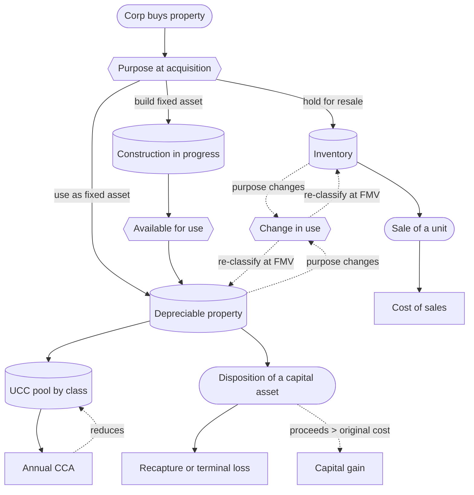

STATUS: AI GENERATED, REVIEW IN PROGRESS

# Cost Recovery \[done]

**Who this is for**:
- Owners of a Canadian-controlled private corporation (CCPC)
- Need to classify a purchase the corp made and determine how it gets deducted

**TLDR**:
- Every purchase a CCPC makes eventually becomes a deduction; the question is *which channel and when*
- Three channels:
  - *Cost of sales* (aka *Cost of Goods Sold*, COGS) for inventory at the moment of sale
  - *Capital Cost Allowance* (CCA) for depreciable property geometrically over years
  - *Construction in progress* (CIP) for self-constructed fixed assets, accumulating during the build then transferring to a CCA class on completion
- The channel is set by the corp's *purpose at acquisition*: hold for resale (inventory), use as a fixed asset (CCA), or build a fixed asset (CIP → CCA)
- A *change in use* later can move a property between channels at fair market value

Limitations:
- This page is an overview; the per-channel mechanics (LCM, half-year rule, UCC, recapture, terminal loss, available-for-use, CIP transfer entry) live on the three sub-pages
- Common cross-channel mechanics (HST recoverability on acquisition, FX translation at trade date, available-for-use, change-of-use) are summarized here and cross-referenced from the sub-pages
- Service-business work-in-process (s.10(11)), long-term construction contracts (percentage-of-completion under s.9; archived IT-92R2), real-estate developer inventory, manufacturing overhead absorption, and resource regimes are out of scope
- The following is my understanding as of 2026

## Three deduction channels \[done]

The deduction *channel* is set by purpose at acquisition.

*Inventory* (mechanics in [Inventory-And-COGS](Inventory-And-COGS.md)):
- Purpose: property held for sale, or held to produce property for sale (ITA [s.248(1)](https://laws-lois.justice.gc.ca/eng/acts/I-3.3/section-248.html))
- Cost: *landed cost* at acquisition (invoice price plus freight, duty, brokerage, and other costs of getting the unit to the corp's premises)
- Valuation: lower of cost or fair market value each year-end (ITA s.10(1))
- Deduction: COGS on Schedule 125 line 8518 at the moment a unit is sold

*Depreciable property* (mechanics in [Capital Cost Allowance](Capital-Cost-Allowance.md)):
- Purpose: long-lived assets the corp buys to use rather than resell
- Mechanics: ITA s.18(1)(b) blocks immediate deduction; ITA s.20(1)(a) re-opens it through CCA
- Cost: pooled in the class's *undepreciated capital cost* (UCC) under [s.13(21)](https://laws-lois.justice.gc.ca/eng/acts/I-3.3/section-13.html)
- Rate: per-class, set by Regulation 1100; geometric decline for most classes, straight-line for Classes 13 and 14
- Disposition: recapture (s.13(1)) or terminal loss (s.20(16)) closes the channel

*Self-constructed fixed asset* (mechanics in [Materials and CIP](Materials-And-CIP.md)):
- Purpose: Materials and contractor labour going into a fixed asset built for the corp's own use; *not* inventory (s.18(1)(b) still blocks immediate deduction)
- Mechanics: cost accumulates in a `Construction in progress` (CIP) balance-sheet asset
- Trigger: *available for use* (ITA s.13(26)–(27)) transfers the accumulated cost into the appropriate CCA class
- After transfer: standard CCA mechanics apply

## Inventory versus materials: same entry, different exit

Inventory and the materials that go into a self-constructed fixed asset are the two channels that look alike: both are balance-sheet asset accounts holding capitalized cost until it becomes a deduction, and the *same* physical item (a length of lumber) can land in either. The purchase entry is effectively identical. What separates them is the *exit*, not the entry.

What is the same:
- *Classification input*: purpose at acquisition decides the channel, not the item; the same lumber is inventory for a furniture-maker building chairs to sell and CIP for a corp building its own shed
- *Acquisition cost*: both capitalize the same landed-cost components under the shared rules in [Acquisition cost](#acquisition-cost-what-gets-capitalized)
- *Purchase entry*: debit the asset account, debit `HST receivable` for the recoverable ITC, credit cash or accounts payable
- *No deduction while parked*: dollars sitting in either account produce no deduction until they leave
- *Running weighted-average*: both can be tracked as an averaged pool; inventory averages because units sell one at a time, and a *shared* materials pool averages because several builds draw from it ([Materials and CIP — Multiple builds from a shared materials pool](Materials-And-CIP.md#multiple-builds-from-a-shared-materials-pool)); a single-build project needs no averaging at all

How they differ, all on the exit side:
- *What leaves, and when*: inventory leaves a few units at a time, each at a sale; materials leave as the whole accumulated cost of a finished asset, once, at available-for-use
- *Trigger*: a sale, versus *available for use* (s.13(26)–(27)) moving the cost into a CCA class
- *Where the cost lands*: `Cost of sales` on Schedule 125 (line 8518), versus a CCA class pool on Schedule 8
- *Deduction speed*: all at once at the moment of sale, versus geometrically over years through CCA
- *Year-end revaluation*: inventory is written down to fair market value under LCM (s.10(1)); a CIP balance carries at cost with no tax revaluation
- *Balance-sheet codes*: inventory on the 1120-series GIFI codes, versus the fixed-asset section (a CIP sub-account, then a CCA class line), never the 1120-series
- *Method lock*: the inventory cost-flow method is fixed year over year (s.10(2)); a materials pool only needs a reasonable, consistent costing method, with no equivalent statutory lock
- *Disposition*: no capital-gains treatment on inventory; the finished fixed asset can trigger recapture, terminal loss, or a capital gain (see [Disposition mechanics](#disposition-mechanics))

So "both use average cost" is true but does not collapse them into one channel. The averaging only costs what leaves each pool; the pools drain into different deduction channels, on different triggers, at different speeds, and that is the distinction.

## Terminology: Amortization / Depreciation / CCA \[done]

*Amortization* and *Depreciation* are two names for the same mechanism.
For tax, neither label matters, as the CRA doesn't use either terms, instead referring to the mechanism as *CCA*.

In common usage, there are two conventions:
- IFRS (international accounting standard): reserves *depreciation* for tangible assets and *amortization* for intangibles such as patents
- ASPE (Canadian accounting standard): uses *amortization* as the umbrella term for tangible property too

This guide generally uses *amortization*, but *depreciation* can be used interchangeably.

There are two distinct concepts of amortization:
- *Accounting amortization*: the figure recorded in the corporation's own books; the method and rate are an accounting choice (e.g. geometric, or straight-line over the asset's estimated useful life)
- *Tax amortization* (CCA): the figure allowed on the T2 return; the method (geometric) and rate (based on class) are fixed by the Income Tax Act

## Amortization and classes \[wip]

*Amortization* spreads a long-lived asset's cost across the years it is used instead of expensing it all at once.

Only CCA is relevant for taxes (deductible): ITA s.18(1)(b) blocks accounting amortization and s.20(1)(a) substitutes CCA.

In this guide, we focus on tax-basis accounting, where accounting is done as a reflection of taxes.  
For our purpose, the two concepts are combined, but it is possible to treat them separately, which is out of scope in this guide.

When using IFRS/ASPE/GAAP accounting standards, a corporation:
- Tracks full accounting-standard records of accounting amortization
- Adds it back on Schedule 1 and deducts CCA on Schedule 8 in its place

This guide keeps the books on a *tax basis*, where the book figures are the T2 figures (see [Small Business Tax Overview](../Small-Business-Tax-Overview.md)).  
Using tax basis, there is no separate accounting-depreciation schedule to reconcile: the CCA amount is booked directly as the period's depreciation.  
The worked examples therefore use CCA's declining-balance (geometric) method as the depreciation figure.  

CCA does not track each asset individually.  
The Act sorts depreciable property into numbered *classes*, each with a fixed annual rate set by Regulation 1100:
- *Class 8* (20%): the catch-all for furniture, equipment, and property not assigned to another class
- *Class 10* (30%): most motor vehicles
- *Class 50* (55%): computers and systems software

Each class is a single pool.  
An asset's cost is added to its class pool, and CCA is claimed on the pool as a whole rather than asset by asset.  
Most classes decline geometrically: the rate applies to the pool's remaining balance each year, so the deduction is largest in the first year and tapers off.  

Tracking follows the pool, not the item:
- one *UCC balance per class* to maintain, regardless of how many assets sit inside it
- a separate asset list matters only for knowing what is still in each class and for disposition figures (see [Capital Cost Allowance — Pool mechanics](Capital-Cost-Allowance.md#pool-mechanics-ucc))

The full class list and per-class rates are in [Capital Cost Allowance — Classes and rates](Capital-Cost-Allowance.md#classes-and-rates).

## Cost-recovery flow \[done]

## Acquisition cost: what gets capitalized \[done]

To *capitalize* a cost is to record it on the balance sheet as part of an asset rather than expense it immediately.
The dollars sit in that asset until they flow out through one of the three channels above.  
The same rules govern what counts as part of the asset's cost across all three channels.  

Below a *de minimis* floor, a long-lived item is expensed immediately rather than capitalized into any channel.  
The floor is the corporation's own policy (commonly $500, sometimes up to $2,500), applied consistently; it is a bookkeeping convention, not a CRA rule.  
A residual UCC pool is not cleared the same way: once capitalized, a class pool runs its geometric tail until the asset is disposed of or the business ceases (see [Capital Cost Allowance — Capitalize-vs-expense thresholds](Capital-Cost-Allowance.md#capitalize-vs-expense-thresholds)).  

Included in cost:
- Invoice price net of trade discounts
- Freight, customs duty, brokerage on inbound goods or equipment
- Installation, site preparation, professional fees directly attributable to bringing the asset into use
- Non-recoverable PST (in non-harmonized provinces)
- Non-recoverable GST/HST (when the corp is not registered, when the input is not eligible for an input tax credit, or when business use on personal-use-eligible property is 50% or less)
- Foreign-currency invoice converted at the *trade-date* Bank of Canada rate

Excluded from cost (booked elsewhere):
- Recoverable GST/HST claimed as an *input tax credit* (ITC): booked to `HST receivable`; see [HST](../HST.md)
- Interest on financing used for the purchase: deductible as `Interest and bank charges` (GIFI 8710) rather than capitalized (the s.21 election to capitalize interest into a depreciable asset is the narrow exception)
- Storage and handling after the asset reaches the corp's premises
- Realized FX gain or loss on settlement of the foreign-currency payable: booked to `Realized FX gain/loss` per [Foreign Currency](../Foreign-Currency.md); the landed cost stays at the trade-date figure
- Administrative overhead and indirect costs not attributable to a specific acquisition

The 50%-business-use rule on ITC eligibility for capital property is in [HST](../HST.md#capital-purchases); the FX trade-date convention is in [Foreign Currency](../Foreign-Currency.md#when-to-use-which-rate).

## Available for use

CCA cannot be claimed on a class addition until the property is *available for use* (ITA [s.13(26)](https://laws-lois.justice.gc.ca/eng/acts/I-3.3/section-13.html)).  
The cost is in the UCC pool from the acquisition date, but the half-year-adjusted base feeds CCA only once the property is in service.

For non-buildings (s.13(27)), the earliest of:
- First time the property is used to earn income
- The property is capable of producing the intended commercially saleable product or service
- The end of the second tax year after acquisition (the rolling-two-year / 357-day rule)

For buildings (s.13(28)), the earliest of:
- All or substantially all (~90%) of the building first used for its intended purpose
- Construction is substantially complete

Two notes on coverage:
- A CIP balance produces no deduction in the interim: not inventory (no COGS), not yet available for use (no CCA). The available-for-use date is the trigger that moves the accumulated cost from CIP into the appropriate CCA class on Schedule 100; standard CCA mechanics apply from there
- Inventory has no available-for-use rule; cost flows through COGS only at the moment of sale

## Change of use

Property can move between channels when the corp's purpose changes after acquisition (ITA s.45, s.13(7)):
- Deemed disposition is at *fair market value* on the date of the change
- Book entry transfers the asset out of the source channel at FMV and into the destination channel at FMV
- Destination channel's mechanics apply prospectively from the change date

A gain or loss may arise on the deemed disposition:
- *Inventory → fixed asset*: the FMV-vs-cost difference is realized in inventory
- *Fixed asset → inventory*: recapture (s.13(1)) or terminal loss (s.20(16)) can trigger on the source CCA class

Common examples:
- A tool-retailer CCPC pulls a saw off the resale shelf to put it into its own workshop: inventory → Class 8 fixed asset at FMV
- A delivery van originally bought for resale is taken into operational use: inventory → Class 10 at FMV
- A computer originally bought for staff use is moved into a side reseller line: fixed asset → inventory at FMV (rare for a typical CCPC)

The HST-side equivalent is the deemed ITC adjustment under ETA s.206 when business-use proportion crosses 50% on capital property; see [HST](../HST.md#capital-purchases).

## T2 schedules touched

The cluster touches the same four T2 schedules across all three channels; the line items differ by channel.

- *Schedule 100* (balance sheet): inventory on the 1120-series GIFI codes; fixed assets on the fixed-asset codes (1742 / 1774 / 1787 / 2010-series / 1900); CIP as a sub-account within the fixed-asset section until transfer
- *Schedule 125* (income statement): COGS lines 8300–8518 for inventory; `Amortization of tangible assets` (8670) at the *book* amortization figure for depreciable property
- *Schedule 8* (CCA): one row per class with opening UCC, additions, dispositions, half-year adjustment, rate, CCA claimed, closing UCC; inventory not on Schedule 8
- *Schedule 1* (book-to-tax reconciliation): book amortization added back, CCA from Schedule 8 deducted; inventory typically produces no adjustment

## Disposition mechanics

Disposition closes the channel.

*Inventory disposition*:
- Revenue hits `Trade sales of goods and services` (GIFI 8000)
- Cost hits `Cost of sales` (GIFI 8518) at the unit's cost
- Year-end LCM write-downs (s.10(1)) and recoveries (s.10(2)) also run through COGS
- No capital-gains treatment on inventory

*Depreciable-property disposition* (full mechanics in [Capital Cost Allowance](Capital-Cost-Allowance.md#recapture-and-terminal-loss)):
- UCC reduction = lesser of (proceeds, original cost)
- Any "gain" above original cost is a capital gain on Schedule 6, not recapture
- Closing UCC negative at year-end is *recapture* (s.13(1)) included in income; UCC reset to zero
- Closing UCC positive with no asset left in the class is a *terminal loss* (s.20(16)) deducted from income
- Class 10.1, Class 14.1, and replacement-property rules carry exceptions

Scrapping or retiring an item is a disposition too:
- proceeds are whatever you receive, often $0 for a broken item thrown out; the pool drops by the lesser of (proceeds, original cost), so a $0 retirement removes nothing and the pool keeps depreciating
- a terminal loss turns on the *class being empty* with positive UCC, not on whether an item still works: a broken-but-kept asset is still in the class, and a single retired item triggers no loss while others remain (detail in [Capital Cost Allowance — Recapture and terminal loss](Capital-Cost-Allowance.md#recapture-and-terminal-loss))

A CIP balance is never directly disposed of:
- *Cancelled project*: write-down (deductible if the project served a business purpose)
- *Completed project*: transfers to a CCA class and follows the depreciable-property rules from there

## Related

- [Small Business Tax Overview](../Small-Business-Tax-Overview.md): primer for the rest of the guide
- [HST](../HST.md): GST/HST mechanics, including ITC eligibility on inputs and the 50%-business-use line on capital property
- [Foreign Currency](../Foreign-Currency.md): trade-date FX convention used to convert foreign-currency invoices into landed cost
- [Adjusted Cost Base](../Adjusted-Cost-Base/Adjusted-Cost-Base.md): the investing-side analogue of inventory pooling, applied to securities rather than goods
- [Glossary](../Glossary.md)

## Citations

- Income Tax Act (R.S.C., 1985, c. 1 (5th Supp.)): https://laws-lois.justice.gc.ca/eng/acts/I-3.3/
  - [s.9](https://laws-lois.justice.gc.ca/eng/acts/I-3.3/section-9.html) - income from a business or property; the parent rule that makes COGS a deduction from revenue
  - [s.10](https://laws-lois.justice.gc.ca/eng/acts/I-3.3/section-10.html) - inventory valuation
  - [s.13](https://laws-lois.justice.gc.ca/eng/acts/I-3.3/section-13.html) - recapture (s.13(1)); UCC definition (s.13(21)); available-for-use rules (s.13(26)–(32))
  - [s.18(1)(a)](https://laws-lois.justice.gc.ca/eng/acts/I-3.3/section-18.html) - general deductibility test (expense for the purpose of gaining income)
  - [s.18(1)(b)](https://laws-lois.justice.gc.ca/eng/acts/I-3.3/section-18.html) - block on direct deduction of capital expenditure; the rule that pushes capital purchases through CCA
  - [s.20(1)(a)](https://laws-lois.justice.gc.ca/eng/acts/I-3.3/section-20.html) - permission to deduct CCA per regulation
  - [s.20(16)](https://laws-lois.justice.gc.ca/eng/acts/I-3.3/section-20.html) - terminal loss
  - [s.45](https://laws-lois.justice.gc.ca/eng/acts/I-3.3/section-45.html) - change-of-use rules
  - [s.248(1)](https://laws-lois.justice.gc.ca/eng/acts/I-3.3/section-248.html) - definition of "inventory"
- CRA Income Tax Folio S3-F4-C1 - General Discussion of Capital Cost Allowance: https://www.canada.ca/en/revenue-agency/services/tax/technical-information/income-tax/income-tax-folios-index/series-3-property-investments-savings-plans/series-3-property-investments-savings-plans-folio-4-capital-cost-allowance/income-tax-folio-s3-f4-c1-general-discussion-capital-cost-allowance.html
- CRA RC4088 - General Index of Financial Information (GIFI): https://www.canada.ca/en/revenue-agency/services/forms-publications/publications/rc4088.html

## TODO

- A unified Cost-Recovery glossary subset (capitalize, expense, available for use, change in use) may be worth pulling out once the sub-pages stabilize
