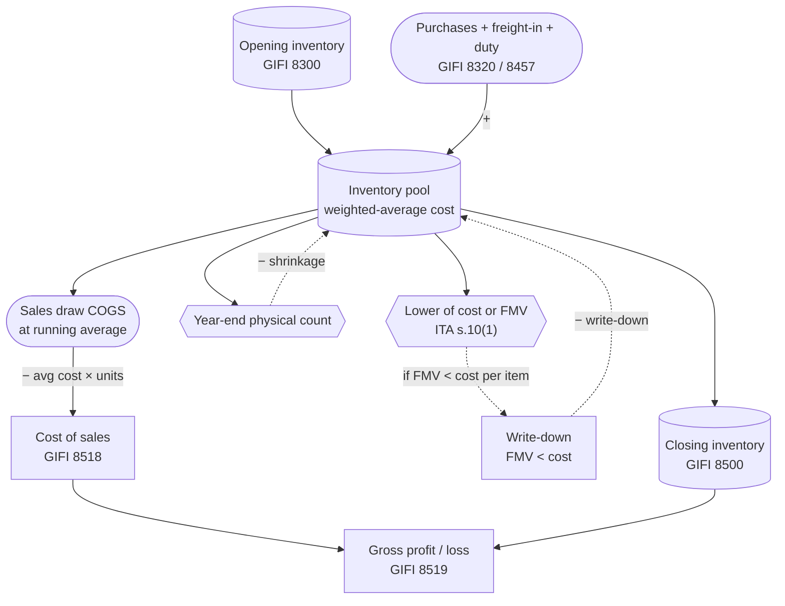

STATUS: AI GENERATED, REVIEW IN PROGRESS

# Inventory and cost of goods sold \[done]

**Who this is for**:
- Owners of a Canadian-controlled private corporation (CCPC)
- Buy goods for resale (retail, e-commerce, parts-and-services), or buy materials for use in its own operations
- Need to translate those purchases into ledger entries, a year-end valuation, the cost-of-sales section of the income statement (T2 Schedule 125), and the inventory lines of the balance sheet (Schedule 100)

**TLDR**:
- *Inventory* is property held for sale, or held for use in producing property held for sale (ITA [s.248(1)](https://laws-lois.justice.gc.ca/eng/acts/I-3.3/section-248.html))
- A property is either *inventory* or *depreciable property*, never both at the same time; *purpose at acquisition* decides which
- Inventory is valued each year-end at the lower of *cost* or *fair market value* (LCM), per ITA [s.10(1)](https://laws-lois.justice.gc.ca/eng/acts/I-3.3/section-10.html)
- *Cost* follows a permitted cost-flow assumption (weighted-average, FIFO, or specific identification), applied consistently year over year (s.10(2))
- *Cost of sales* (aka *Cost of goods sold*, COGS) is the matching deduction at the moment a unit is sold; unlike *Capital Cost Allowance* (CCA) for fixed assets, the cost is not spread over multiple years
- Materials bought to build a fixed asset for the corp's own use are *not* inventory; see [Materials and CIP](Materials-And-CIP.md)

Limitations:
- Focus is on a typical owner-managed CCPC with goods-for-resale or self-use materials inventory
- Manufacturing inventory with overhead absorption and standard-cost variances is touched on but not worked through
- Long-term construction contracts (percentage-of-completion under s.9; archived IT-92R2), commodity-pool inventories (s.10(6)), real-estate developer inventory, and financial-institution security inventories are out of scope
- Consignment inventory is mentioned briefly; service-business work-in-process under s.10(5)(a)/(11) is out of scope
- Inventory-method change requires the Minister's concurrence (ITA s.10(2.1)) and is not covered here
- The following is my understanding as of 2026

## In this folder

- [Cost Recovery](Cost-Recovery.md): overview of the three cost-recovery channels, concept map, and shared acquisition-cost / available-for-use / change-of-use rules
- [Materials and CIP](Materials-And-CIP.md): self-constructed fixed assets
- [Capital Cost Allowance](Capital-Cost-Allowance.md): depreciable property

## Inventory versus other purchase types \[done]

Purchased property in a CCPC follows one of a few tax treatments (inventory is the most common):
- *Inventory* (the focus of this page): property held for sale, or held to produce property held for sale; cost flows through `Cost of sales` (COGS) when a unit sells; valued at LCM each year-end
- *Materials to build a fixed asset for the corp's own use*: not inventory; see [Materials and CIP](Materials-And-CIP.md)
- *Consumable supplies* (office paper, packaging, cleaning, lubricants): expensed when used; not capitalized; out of scope here
- *Spare parts*: inventory if held for resale; expensed or capitalized into the equipment they service otherwise; the non-resale case is out of scope here

## What inventory is \[meh]

ITA [s.248(1)](https://laws-lois.justice.gc.ca/eng/acts/I-3.3/section-248.html) defines *inventory* as "a description of property the cost or value of which is relevant in computing a taxpayer's income from a business for a taxation year".

Typical cases:
- Finished goods bought wholesale for resale
- Raw materials and parts held to be combined into a product for sale
- Work in progress (WIP) for a manufacturing CCPC
- Real-estate-developer land and buildings held for sale (not in scope here)

A property is *inventory* or *depreciable property*, never both:
- Inventory is matched to revenue through cost of sales (COGS); the cost is deducted at the moment of sale
- Depreciable property is held to earn income over time; the cost is deducted over its life through CCA (see [Capital Cost Allowance](Capital-Cost-Allowance.md))

*Purpose at acquisition* determines which category applies:
- Bought to resell: inventory
- Bought to use in the business: depreciable property (or operating expense if below the capitalization threshold)
- Bought as a one-off speculation that you intend to flip: *adventure or concern in the nature of trade*, taxed at cost under ITA [s.10(1.01)](https://laws-lois.justice.gc.ca/eng/acts/I-3.3/section-10.html) rather than at LCM (still inventory in form, but with cost-only valuation)

If purpose changes after acquisition (say a delivery van bought to resell, then taken off the lot for operational use), that is a *change in use* event.  
The deemed-disposition rules in s.45 / s.13(7) apply and trigger a transfer between inventory and a CCA class at fair market value.  
This is rare for a typical CCPC and is out of scope here.  
See [Cost Recovery — Change of use](Cost-Recovery.md#change-of-use) for the cross-channel framing.  

## Cost of goods sold

*Cost of sales* (aka *cost of goods sold*, COGS) is the cost of the inventory units that sold during the year, matched against the revenue they produced.  
It is a deduction from business income under ITA [s.9](https://laws-lois.justice.gc.ca/eng/acts/I-3.3/section-9.html), recognized at the moment a unit is sold rather than when it is bought; s.9 is the parent rule, not a stand-alone COGS provision.  
Unlike *Capital Cost Allowance* (CCA), the cost is not spread over years; unlike a *construction in progress* (CIP) balance, it is deductible (see [Cost Recovery](Cost-Recovery.md) for the channel split).  

The cost-of-sales identity:
- Opening inventory + purchases (net of returns) + freight-in + other direct costs − closing inventory = COGS
- Schedule 125 enforces it as lines 8300 + 8320 + 8457 + 8450 − 8500 = 8518
- the closing figure is set by the year-end *lower of cost or fair market value* (LCM) valuation under ITA [s.10(1)](https://laws-lois.justice.gc.ca/eng/acts/I-3.3/section-10.html), so the valuation method drives COGS directly
- the cost-flow method is fixed year over year under s.10(2); valuing all inventory at FMV instead is the Regulation 1801 alternative

Mechanics, further down this page:
- the running per-sale figure (units sold × current average cost) and the cost-of-sales GIFI codes (`8300`–`8519`): [Tracking through the year](#tracking-through-the-year)
- the identity check and the Schedule 125 / Schedule 100 posting: [Year-end reconciliation](#year-end-reconciliation), [Bookkeeping and T2 schedules](#bookkeeping-and-t2-schedules)
- shrinkage and LCM write-downs run through COGS (`8518`)

## Valuation methods

Cost-flow assumptions permitted by CRA (pick one, apply consistently):
- *Weighted-average cost* (the focus of this page): each unit's cost is the running pooled average; analogous to the *Adjusted Cost Base* (ACB) pooling used for securities elsewhere in this guide, applied to inventory units instead of share lots
- *First-in, first-out* (FIFO): earliest-purchased units are deemed sold first; later purchases stay in inventory
- *Specific identification*: each unit is tagged with its actual cost; the only realistic method when units are individually serialized and high-value (vehicles, jewellery, custom machinery)
- *Standard cost* (not covered here): a predetermined cost per unit, with variances reconciled separately; usable for manufacturing CCPCs but adds variance-account complexity

The lower of cost or fair market value (LCM) rule:
- Each year-end, every inventory item is valued at the lower of its cost (per the chosen method above) and its *fair market value* at year-end (ITA [s.10(1)](https://laws-lois.justice.gc.ca/eng/acts/I-3.3/section-10.html))
- "Fair market value" for inventory is a case-law / net-realizable-value concept (see archived IT-473R); for a typical resale CCPC it is the net realizable value: what the corp could sell the item for, less selling costs
- If FMV is below cost, the difference is a *write-down*, deductible in the current year (s.10(1)) and recoverable as income if the FMV later recovers (s.10(2))
- LCM is applied item by item, not at the inventory level in aggregate; a write-down on slow-moving SKU A cannot be offset by appreciation on fast-moving SKU B

Method consistency:
- The chosen method must be applied year over year (ITA [s.10(2)](https://laws-lois.justice.gc.ca/eng/acts/I-3.3/section-10.html))
- A change of method requires the Minister's concurrence under ITA s.10(2.1) (with the s.10(2) consistency rule as the backdrop); in practice this means filing a written request with supporting reasons; do not silently switch methods
- Valuing all inventory at FMV instead of LCM is permitted under Regulation 1801, but it is not the right tool for a typical resale CCPC

## What goes into cost

A unit's *cost* (the C in LCM) is the *landed cost* at the point the unit becomes part of inventory:
- Invoice purchase price, net of trade discounts
- Freight-in, customs duty, brokerage fees, courier charges to bring the unit to the corp's premises
- Non-recoverable provincial sales tax (PST in non-harmonized provinces)
- *Non-recoverable* HST (only when the corp is not registered, or the input is not eligible for an input tax credit)
- Insurance during transit, where directly attributable to acquisition
- Trade-date FX conversion for foreign-currency purchases (see [Imported goods and FX](#imported-goods-and-fx) below)

The same capitalize-vs-expense rules apply across all three cost-recovery channels; see [Cost Recovery — Acquisition cost](Cost-Recovery.md#acquisition-cost-what-gets-capitalized).

What does *not* get capitalized into inventory cost:
- Recoverable HST claimed as an *input tax credit* (ITC), booked to `HST receivable`, not to inventory
- Storage costs after the inventory reaches the corp's premises; treat as operating expense (GIFI 8810 `Office expenses` or a dedicated `Warehousing` line)
- Sales commission, marketing, packaging-for-shipping-to-customer; these are selling expenses, not inventory cost
- Administrative overhead (rent for the office, accounting fees, management salary); these are operating expenses regardless of how much of the activity touches inventory
- Interest on financing used to buy inventory; deductible as `Interest and bank charges` (GIFI 8710), not in inventory cost
- Abnormal waste, breakage in transit covered by insurance proceeds, or shrinkage; these adjust COGS or appear as a separate loss line, not inventory cost

For a *manufacturing* CCPC, conversion costs (direct labour, factory overhead) would also enter inventory cost under accounting standards. ITA s.10 defers to the cost figure produced by a properly applied accounting standard, and CRA generally accepts ASPE Section 3031 / IFRS IAS 2. Manufacturing cost build-up is out of scope here; the worked examples below assume buy-and-resell or buy-for-own-use.

## Imported goods and FX

For inventory bought in a foreign currency, follow the same trade-date FX convention used elsewhere in this guide for ACB purchases (see [Adjusted Cost Base](../Adjusted-Cost-Base/Adjusted-Cost-Base.md)):
- Convert the invoice amount to CAD using the FX rate on the *purchase date* (the date of the supplier invoice, which generally matches the bill-of-lading date for goods crossing the border)
- Bank of Canada daily rates are the conventional source; some bookkeepers use the corp's bank's actual settlement rate, which is acceptable if applied consistently

Landed-cost components, each converted at its own transaction-date FX rate:
- Foreign-currency purchase invoice: trade-date rate
- Foreign-currency freight invoice: invoice-date rate (often a few days later)
- Customs duty in CAD: at face value
- Customs brokerage fees in CAD: at face value
- Non-recoverable HST or PST in CAD: at face value

FX gain or loss on payable settlement:
- Booked at the *settlement date* (the date the CAD payment goes out, or the date the foreign-currency payable is funded from a foreign-currency bank account at the spot rate)
- The realized FX gain or loss is its own P&L line (`Realized FX gain/loss` under operating expenses or other revenue, depending on sign), not an adjustment to inventory cost
- Reason: the landed cost is fixed at the trade-date rate; subsequent FX movements are a financing outcome, not part of the inventory's acquisition cost

GST/HST on imports:
- Self-assessed and paid to Canada Border Services on Form B3 at the point of import; if the corp is HST-registered, the same amount is reclaimable as an ITC on the next GST/HST return; if not, it is a permanent cost addition to inventory
- See [HST](../HST.md) for the full mechanics

## Tracking through the year

Assume a *perpetual* inventory system: the inventory ledger is updated at each purchase and each sale, and the running balance is always current. A *periodic* system (no per-transaction update, COGS plugged at year-end from a physical count) works but obscures shrinkage and complicates LCM testing. Modern e-commerce platforms (Shopify, WooCommerce) produce perpetual inventory by default; spreadsheet tracking can do either.

Running weighted-average computation:
- Maintain one running line per SKU (or per pool, if SKUs are interchangeable)
- On purchase: new total cost = old total cost + landed cost of new purchase; new total units = old units + new units; new average cost = new total cost / new total units
- On sale: the COGS for the sale = units sold × current average cost; the average cost itself does not change on a sale, only the unit count and total-cost balance
- On purchase return: reverse the purchase entry at its original landed cost (not at the current average); recompute the average
- On sales return: reverse the sale entry; the returned units re-enter the pool at the current average cost

GIFI codes (verified from CRA T2 SCH 125 and RC4088):

Balance sheet (Schedule 100), inventory accounts under code 1120:
- `1120` - Inventories (parent code)
- `1121` - Inventory of goods for sale (finished goods purchased for resale)
- `1122` - Inventory parts and supplies
- `1125` - Work in progress (manufacturing WIP)
- `1126` - Raw materials

Income statement (Schedule 125), cost-of-sales section:
- `8300` - Opening inventory
- `8320` - Purchases / cost of materials
- `8340` - Direct wages (manufacturing)
- `8360` - Trades and sub-contracts (services bought to produce the product)
- `8450` - Other direct costs
- `8457` - Freight-in and duty
- `8500` - Closing inventory
- `8518` - Cost of sales (the COGS total)
- `8519` - Gross profit/loss

Ledger entries for the typical transactions:

Purchase from a Canadian HST-registered supplier (perpetual, HST-registered corp):
- Debit `Inventory - goods for sale` (GIFI 1121) = landed cost net of recoverable HST
- Debit `HST receivable` = recoverable HST portion
- Credit `Accounts payable` or `Cash` = invoice total

Purchase with freight-in:
- Debit `Inventory - goods for sale` (GIFI 1121) = invoice cost + freight-in + duty
- Debit `HST receivable` = recoverable HST on both invoice and freight
- Credit `Accounts payable` = invoice + freight invoice

Sale to a customer (one entry for revenue, one for COGS):
- Debit `Cash` or `Accounts receivable` = sale price + HST collected
- Credit `Trade sales of goods and services` (GIFI 8000) = sale price net of HST
- Credit `HST collected` = HST charged
- Debit `Cost of sales` (GIFI 8518) = units sold × current average cost
- Credit `Inventory - goods for sale` (GIFI 1121) = same

Purchase return (defective stock returned to supplier):
- Debit `Accounts payable` = original credit, reversed
- Credit `Inventory - goods for sale` (GIFI 1121) = original landed cost of returned units
- Credit `HST receivable` = HST originally claimed

Inventory shrinkage adjustment (between physical count and book balance, after investigation):
- Debit `Cost of sales` (GIFI 8518) or a dedicated `Inventory shrinkage` line under `Other direct costs` (GIFI 8450)
- Credit `Inventory - goods for sale` (GIFI 1121)

## Inventory flow

## Year-end reconciliation

The year-end pass turns the running inventory ledger into a tax-filed closing balance. Five steps.

Step 1, physical count:
- Stop sales and receiving briefly, or hold a *cycle count* across the last week of the year if continuous operations
- Tag each location (warehouse, retail floor, in-transit not yet received); count every SKU
- Reconcile in-transit goods using the *FOB terms*. FOB shipping point: title transferred at the supplier's dock, so the corp owns the goods in transit and they belong in closing inventory. FOB destination: title transfers on receipt, so in-transit goods do not yet belong

Step 2, investigate the variance:
- Compare physical count to perpetual book balance, by SKU
- Small variances (sub-2%) typically reflect shrinkage from damage, theft, miscount; book a shrinkage adjustment to COGS
- Large variances reflect a systemic error (receiving not posted, sales not posted, mis-counted bin) and need to be traced before adjustment

Step 3, apply LCM to the corrected book balance:
- For each SKU, compare its weighted-average cost per unit to its current FMV per unit (the price the corp expects to realize at sale, net of selling cost)
- If FMV < cost, book a write-down to bring the SKU to FMV
- Document the FMV evidence (recent selling-price data, supplier quotes for replacement cost, obsolescence assessment, manager sign-off) and keep it with the year-end working papers
- The write-down is deductible in the current year (s.10(1))
- If a previously written-down SKU recovers (FMV climbs back above its written-down value), reverse part or all of the prior write-down up to original cost (s.10(2)); a SKU cannot be written *up* above original cost

Step 4, verify the cost-of-sales identity:
- Opening inventory + purchases (net of returns) + freight-in + other direct costs − closing inventory = COGS
- This identity is what Schedule 125 enforces: lines 8300 + 8320 + 8457 + 8450 − 8500 = 8518
- If the identity does not hold, the bookkeeping ledger and the schedule disagree; fix the ledger, not the schedule

Step 5, post to the T2 schedules:
- Schedule 100 closing line for each inventory GIFI code (1121, 1122, 1125, 1126 as applicable) reflects the corrected, LCM-adjusted closing balance
- Schedule 125 cost-of-sales section uses the codes shown in [Tracking through the year](#tracking-through-the-year)
- Schedule 1 is typically clean for inventory. The most common adjustment is when the corp's book inventory differs from its tax inventory because of a one-time accounting change; flag this with the accountant rather than handling silently

## Bookkeeping and T2 schedules

Schedule 125 cost-of-sales walkthrough (line by line):
- `8300 Opening inventory`: closing inventory from the prior year's Schedule 125, line 8500
- `8320 Purchases/cost of materials`: total of all inventory-purchase debits to the inventory account during the year, net of purchase returns
- `8340 Direct wages`: factory-floor wages for a manufacturing CCPC; zero for a buy-and-resell CCPC
- `8360 Trades and sub-contracts`: outsourced production costs (e.g. a contract assembler making the corp's product); usually zero for resale-only operations
- `8450 Other direct costs`: a catch-all for packaging, freight to a customer if treated as a cost rather than as a selling expense (depends on the corp's policy), and inventory shrinkage if not booked to 8518
- `8457 Freight-in and duty`: inbound freight, brokerage, and customs duty on imports; split out from 8320 so the inbound-logistics cost is visible
- `8500 Closing inventory`: year-end inventory balance after physical count, LCM, and write-downs; matches the corresponding Schedule 100 inventory codes
- `8518 Cost of sales`: the COGS plug, equals 8300 + 8320 + 8340 + 8360 + 8450 + 8457 − 8500
- `8519 Gross profit/loss`: revenue (typically GIFI 8000 `Trade sales of goods and services`) − 8518

Schedule 100 balance sheet:
- One inventory line per inventory GIFI code in use; for a small resale CCPC this is typically just `1121` finished goods
- A manufacturing CCPC uses `1126` raw materials, `1125` WIP, and `1121` finished goods as three separate lines

Schedule 1 reconciliation:
- Inventory normally produces no S1 adjustments; the income statement already reflects the tax-basis cost of sales
- Exceptions: a change in valuation method approved by CRA (the catch-up may be on S1); accounting-vs-tax LCM divergence (rare under ASPE/IFRS, both of which track ITA s.10 LCM); a write-down that the accountant booked but for which CRA disallowed the FMV evidence on audit (also rare)

Self-constructed-asset materials sit in CIP, not in the inventory GIFI accounts; see [Materials and CIP](Materials-And-CIP.md).

## Worked examples

Two multi-period walkthroughs. Each shows the ledger entries, the GIFI codes touched, and the year-end Schedule 125 outcome.  
Calendar fiscal year (Jan 1 to Dec 31) is assumed throughout. The corp is HST-registered and claims ITCs on all eligible inputs.

### Example 1: E-commerce weighted-average with year-end write-down

Setup: single-shareholder e-commerce CCPC selling a single SKU (a wireless earbud, $40 cost / $80 retail). Weighted-average cost method.

Year 1 (2026):

Mar 1, buy 100 units at $40 landed each = $4,000:
- Debit `Inventory - goods for sale` (GIFI 1121) = $4,000
- Debit `HST receivable` = $520
- Credit `Cash` = $4,520
- Pool: 100 units, total cost $4,000, average $40.00

Apr to Jun, sell 60 units at $80 each, total $4,800:
- Debit `Cash` = $5,424 (revenue + 13% HST)
- Credit `Trade sales of goods and services` (GIFI 8000) = $4,800
- Credit `HST collected` = $624
- Debit `Cost of sales` (GIFI 8518) = 60 × $40.00 = $2,400
- Credit `Inventory - goods for sale` (GIFI 1121) = $2,400
- Pool: 40 units, total cost $1,600, average still $40.00

Sep 1, buy 200 units, supplier raised price to $44 landed each = $8,800:
- Debit `Inventory - goods for sale` (GIFI 1121) = $8,800
- Debit `HST receivable` = $1,144
- Credit `Cash` = $9,944
- Pool: 240 units, total cost $10,400, new average = $10,400 / 240 = $43.33

Oct to Dec, sell 150 units at $80 each:
- Revenue entries as above (omitted for brevity)
- Debit `Cost of sales` (GIFI 8518) = 150 × $43.33 = $6,500
- Credit `Inventory - goods for sale` (GIFI 1121) = $6,500
- Pool: 90 units, total cost $3,900, average $43.33

Dec 31, physical count finds 88 units (2 missing, presumed shrinkage):
- Debit `Cost of sales` (GIFI 8518) = 2 × $43.33 = $86.66
- Credit `Inventory - goods for sale` (GIFI 1121) = $86.66
- Pool: 88 units, total cost $3,813.34, average still $43.33

Dec 31, LCM test: a competitor has just released a similar product and the corp expects to clear the remaining stock at $35 retail; FMV per unit is roughly $30 net of selling cost; FMV < cost, write down:
- Debit `Cost of sales` (GIFI 8518) = 88 × ($43.33 − $30.00) = $1,173.04
- Credit `Inventory - goods for sale` (GIFI 1121) = $1,173.04
- Pool after write-down: 88 units, total cost $2,640.30, "average" $30.00

Schedule 125 year 1 cost-of-sales section:
- `8300` Opening inventory: $0
- `8320` Purchases: $12,800 ($4,000 + $8,800)
- `8457` Freight-in and duty: $0 (already in landed cost in this example)
- `8500` Closing inventory: $2,640.30
- `8518` Cost of sales = 0 + 12,800 + 0 − 2,640.30 = $10,159.70 (matches the per-unit ledger: $2,400 + $6,500 + $86.66 + $1,173.04 = $10,159.70)

Year 2 (2027):

The 88 remaining units are cleared in Q1 at $35 each; the actual FMV recovery is mild:
- Sales-side entries omitted
- COGS at the written-down basis: 88 × $30.00 = $2,640
- If FMV at the time of sale had been $50 (above the original $43.33 cost), the corp would *reverse* prior write-down up to $43.33 (never above) per s.10(2); in this scenario the actual FMV is $32, so no reversal; the prior write-down was correct

### Example 2: Imported goods with FX and landed cost

Setup: same e-commerce CCPC. Year 2 (2027) opens a new SKU sourced from a US supplier.

Mar 15 2027, order 500 units at US $20 each = US $10,000; trade-date BoC FX = 1.34 CAD/USD; CAD equivalent = $13,400.

Apr 5 2027, supplier invoice received, BoC rate 1.34 CAD/USD (same day):
- Debit `Inventory - goods for sale` (GIFI 1121) = $13,400
- Credit `Accounts payable - USD` = US $10,000 booked at 1.34 = CAD $13,400

Apr 12 2027, freight invoice CAD $850 from the Canadian customs broker (CAD-denominated; includes freight, brokerage, $200 of customs duty):
- Debit `Inventory - goods for sale` (GIFI 1121) = $850
- Debit `HST receivable` = recoverable HST portion if applicable to the freight (note: import HST is self-assessed separately on the goods, not on the broker bill)
- Credit `Accounts payable` = $850

Pool: 500 units, landed cost $14,250 (= $13,400 + $850), average $28.50.

May 1 2027, pay the USD invoice from a USD bank account at spot rate 1.37 CAD/USD (CAD has weakened since the invoice was booked):
- Debit `Accounts payable - USD` = $13,400 (the booked CAD amount)
- Credit `USD bank account` = US $10,000 × 1.37 = $13,700 CAD-equivalent of USD outflow
- Debit `Realized FX loss` (operating-expense line, GIFI 9270 `Other expenses` or a dedicated `Realized FX gain/loss` sub-account) = $300

The $300 FX loss is *not* added to inventory cost. Landed cost was fixed at the Apr 5 trade-date rate. Subsequent FX movement is a financing-cycle outcome.

Schedule 125 year 2 cost-of-sales section (for this SKU only, ignoring example 1):
- `8320` Purchases: $13,400 (the trade-date CAD equivalent)
- `8457` Freight-in and duty: $850
- Net inventory addition: $14,250 at average $28.50

Year-end Schedule 125 if 300 units are sold during the year at $70 each:
- `8300` Opening: $0
- `8320` Purchases: $13,400
- `8457` Freight-in and duty: $850
- `8500` Closing: 200 units × $28.50 = $5,700
- `8518` Cost of sales = 0 + 13,400 + 850 − 5,700 = $8,550 (= 300 × $28.50)

## Edge cases

- *Consignment inventory*: goods physically present on the corp's premises but legally owned by another party (or vice versa) are *not* on the corp's books; book only inventory the corp owns under contract; a clear consignment agreement and a separate count tag are the audit evidence
- *Related-party purchases*: inventory bought from a non-arm's-length supplier at above-FMV is capped at FMV under ITA [s.69(1)(a)](https://laws-lois.justice.gc.ca/eng/acts/I-3.3/section-69.html); the excess is denied (the corp paid too much, but only gets to deduct the FMV portion)
- *Inventory appropriated for shareholder use*: a CCPC giving inventory to a shareholder (or to a related person) triggers a deemed disposition at FMV (s.69) and a *shareholder benefit* under ITA [s.15](https://laws-lois.justice.gc.ca/eng/acts/I-3.3/section-15.html); this also has GST/HST self-supply implications; treat as a sale at FMV in the books and add the benefit to the shareholder's T4 / T5 reporting (out of scope here, see [Shareholder-Dividends](../Shareholder-Dividends.md) for the dividend path)
- *Software, digital subscriptions, SaaS*: not inventory; SaaS is an operating expense; perpetually licensed software is Class 12 (application software) or Class 50 (systems software bundled with hardware); see [Capital Cost Allowance](Capital-Cost-Allowance.md)
- *Trade samples and demo units*: tracked separately from saleable inventory; if eventually scrapped, expense at the point of removal; if eventually sold, restore to inventory at the residual book value
- *Inventory of a discontinued line*: an obsolescence write-down to expected liquidation value is supportable under s.10(1); document the obsolescence trigger (date the discontinuation decision was made, supplier announcement, etc.)
- *Sales tax in non-harmonized provinces*: PST is non-recoverable and forms part of inventory cost in those provinces; HST in HST-registered provinces is recoverable and is not part of cost
- *Service-business "inventory"*: hours of unbilled professional work are not inventory under s.10 in the same way as goods; professional WIP has its own rules under s.10(11) and is out of scope here

## Out of scope

- Manufacturing overhead absorption, standard-cost variances, and variable-vs-absorption costing: these require accounting-standard mechanics (ASPE Section 3031 / IFRS IAS 2) that interact with tax through s.10 acceptance
- Long-term construction contracts: percentage-of-completion mechanics under s.9; archived IT-92R2
- Commodity-pool inventory valued at FMV under s.10(6) (e.g. grain elevators) and dealer-in-securities inventory under s.10(15)
- Real-estate developer inventory of land and partially completed buildings; adjacent to but distinct from typical resale inventory
- s.10(2.1) inventory-method change application mechanics: the form of the request, supporting reasons, CRA review timeline
- The art-business and farm-business special inventory rules (s.10(1.1), Reg 1802)

## Related

- [Cost Recovery](Cost-Recovery.md)
- [Materials and CIP](Materials-And-CIP.md)
- [Capital Cost Allowance](Capital-Cost-Allowance.md)
- [Small Business Tax Overview](../Small-Business-Tax-Overview.md)
- [Adjusted Cost Base](../Adjusted-Cost-Base/Adjusted-Cost-Base.md)
- [HST](../HST.md)
- [Foreign Currency](../Foreign-Currency.md)
- [Glossary](../Glossary.md)
- [Whole-dollar rounding](../Whole-Dollar-Rounding.md)

## Citations

- Income Tax Act (R.S.C., 1985, c. 1 (5th Supp.)): https://laws-lois.justice.gc.ca/eng/acts/I-3.3/
  - [s.9](https://laws-lois.justice.gc.ca/eng/acts/I-3.3/section-9.html) - income from a business or property; the parent rule that makes COGS a deduction from revenue
  - [s.10(1)](https://laws-lois.justice.gc.ca/eng/acts/I-3.3/section-10.html) - inventory valuation at the lower of cost or fair market value
  - [s.10(1.01)](https://laws-lois.justice.gc.ca/eng/acts/I-3.3/section-10.html) - inventory of an adventure or concern in the nature of trade valued at cost (no FMV write-down)
  - [s.10(2)](https://laws-lois.justice.gc.ca/eng/acts/I-3.3/section-10.html) - method consistency requirement; recovery of prior write-down if FMV recovers
  - [s.10(2.1)](https://laws-lois.justice.gc.ca/eng/acts/I-3.3/section-10.html) - Minister's concurrence required to change the inventory valuation method
  - [s.15](https://laws-lois.justice.gc.ca/eng/acts/I-3.3/section-15.html) - shareholder benefits triggered by inventory appropriation
  - [s.18(1)(a)](https://laws-lois.justice.gc.ca/eng/acts/I-3.3/section-18.html) - general deductibility test (expense for the purpose of gaining income)
  - [s.45](https://laws-lois.justice.gc.ca/eng/acts/I-3.3/section-45.html) - change-of-use rules
  - [s.69(1)](https://laws-lois.justice.gc.ca/eng/acts/I-3.3/section-69.html) - non-arm's-length transactions deemed at FMV
  - [s.248(1)](https://laws-lois.justice.gc.ca/eng/acts/I-3.3/section-248.html) - definition of "inventory"
- Income Tax Regulations (C.R.C., c. 945): https://laws-lois.justice.gc.ca/eng/regulations/C.R.C.,_c._945/
  - Regulation 1801 - option to value all inventory at fair market value (alternative to LCM)
  - Regulation 1802 - farming inventory valuation (out of scope, pointer only)
- CRA T4012 - T2 Corporation Income Tax Guide: https://www.canada.ca/en/revenue-agency/services/forms-publications/publications/t4012.html
- CRA T2 SCH 125 - Income Statement Information (GIFI cost-of-sales codes 8300, 8320, 8340, 8360, 8450, 8457, 8500, 8518, 8519): https://www.canada.ca/en/revenue-agency/services/forms-publications/forms/t2sch125.html
- CRA T2 SCH 100 - Balance Sheet Information (GIFI inventory codes 1120, 1121, 1122, 1125, 1126): https://www.canada.ca/en/revenue-agency/services/forms-publications/forms/t2sch100.html
- CRA RC4088 - General Index of Financial Information (GIFI): https://www.canada.ca/en/revenue-agency/services/forms-publications/publications/rc4088.html
- CRA Interpretation Bulletin IT-473R (archived) - Inventory Valuation: https://www.canada.ca/en/revenue-agency/services/forms-publications/publications/it473r.html
- CRA Income Tax Folio S3-F4-C1 - General Discussion of Capital Cost Allowance (referenced for the inventory-vs-depreciable-property boundary): https://www.canada.ca/en/revenue-agency/services/tax/technical-information/income-tax/income-tax-folios-index/series-3-property-investments-savings-plans/series-3-property-investments-savings-plans-folio-4-capital-cost-allowance/income-tax-folio-s3-f4-c1-general-discussion-capital-cost-allowance.html
- Bank of Canada daily exchange rates: https://www.bankofcanada.ca/rates/exchange/

## TODO

- Companion tracking-spreadsheet artifact (parallel to [Adjusted Cost Base Tracking](../Adjusted-Cost-Base/Adjusted-Cost-Base-Tracking.md)): a worked perpetual weighted-average ledger with running-cost and COGS formulas, plus a year-end LCM column
- Manufacturing WIP treatment: a section walking conversion-cost build-up under ASPE 3031 / IFRS IAS 2 and the M&P Class 53 CCA tie-in
- s.10(2.1) method-change procedure: format of the written request, supporting evidence, CRA processing timeline
- Cross-reference with [Foreign Currency](../Foreign-Currency.md) once that page is past the stub phase
