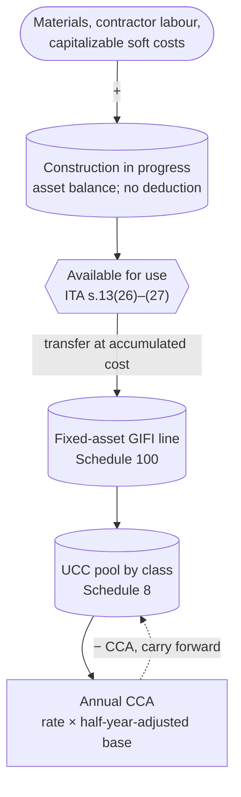

STATUS: AI GENERATED, REVIEW IN PROGRESS

# Materials and Construction in Progress

**Who this is for**:
- Owners of a Canadian-controlled private corporation (CCPC)
- Buy materials, parts, or contractor labour to build a fixed asset for the corp's own use (not for resale)
- Need to translate those costs into ledger entries, a year-end balance sheet figure, and an eventual transfer into a CCA class

**TLDR**:
- Materials bought to build a fixed asset for the corp's own use are *not* inventory; they accumulate in a `Construction in progress` (CIP) general-ledger account (a balance-sheet asset account in the corp's chart of accounts) during construction
- CIP produces *no deduction* while construction is underway: not inventory (so no COGS), and not yet available for use (so no CCA)
- On completion *and* available for use (ITA [s.13(26)](https://laws-lois.justice.gc.ca/eng/acts/I-3.3/section-13.html)), the accumulated CIP balance transfers into the appropriate CCA class and becomes the *capital cost* for that class
- From that point on, the cost is deducted year by year through annual CCA claims; see [Capital Cost Allowance](Capital-Cost-Allowance.md) for the half-year rule, UCC mechanics, recapture, and terminal loss

Limitations:
- Focus is on a typical owner-managed CCPC building a tangible fixed asset (shed, leasehold improvement, custom equipment) for its own use
- Capitalizable cost build-up beyond materials and direct contractor labour (factory overhead, indirect costs, allocated employee salaries on the project) is mentioned at a high level only
- Soft costs during construction (interest under s.18(3.1), property taxes on the construction site, legal and accounting fees on a capital project) are out of scope
- Interest capitalization election under s.21 is out of scope
- Long-term construction contracts (a CCPC building for a customer) are inventory-side rules and not covered here
- Real-estate developer construction of land and buildings held for resale is inventory-side and out of scope
- The following is my understanding as of 2026

## In this folder

- [Cost Recovery](Cost-Recovery.md): overview of the three cost-recovery channels, concept map, and shared acquisition-cost / available-for-use / change-of-use rules
- [Inventory](Inventory.md): goods held for resale
- [Capital Cost Allowance](Capital-Cost-Allowance.md): depreciable property after the CIP transfer

## Two destinations for materials

Purchased materials follow one of two paths in a CCPC:
- *Materials held for resale*, or *to be combined into a product for resale*: inventory; cost flows through COGS at sale; no amortization
- *Materials to be combined into a fixed asset for the corp's own use*: not inventory; the accumulated cost sits in a `Construction in progress` (CIP) asset account during construction; on completion and available-for-use, the cost transfers into the appropriate CCA class and amortizes through annual CCA claims

The same lumber can take either path:
- Lumber bought by a furniture-maker CCPC to build chairs for sale:
  - Raw-materials inventory (GIFI 1126)
  - Cost flows to COGS as the chairs are sold
- Lumber bought by a service CCPC to build a shed on the corp's property for its own tool storage:
  - CIP (asset account, typically a sub-account under the relevant fixed-asset line on Schedule 100)
  - On completion the CIP balance transfers into a CCA class (Class 6 for a frame shed with no support below ground level, otherwise Class 1)

Deduction timing by path:
- Inventory expensed at sale: deduction matches the revenue; no spreading over time
- Depreciable property via CCA: rate-bounded each year (10% declining for Class 6, 4% for Class 1) and discretionary; nothing is deducted until the property is *available for use* (ITA [s.13(26)](https://laws-lois.justice.gc.ca/eng/acts/I-3.3/section-13.html))

Available-for-use rule for self-constructed assets:
- A shed under construction sits in CIP and produces no deduction: not inventory (no COGS), not yet available for use (no CCA)
- *Available for use* is the earliest of: first use to earn income; the point at which the asset is capable of producing the intended service; or the end of the second tax year after acquisition (the rolling-two-year / 357-day rule under s.13(27))
- Until that point, accumulated costs sit as a non-deducting asset balance
- See [Cost Recovery — Available for use](Cost-Recovery.md#available-for-use) for the full cross-channel framing, including the building variant under s.13(28)

Change of use, finished item from the resale shelf into own use:
- A tool-retailer CCPC pulling a $1,200 saw from inventory into the workshop is a *change in use* event under s.45 / s.13(7)
- Book entry transfers the unit's cost from inventory to a Class 8 fixed asset at fair market value
- CCA mechanics apply from the conversion date
- See [Cost Recovery — Change of use](Cost-Recovery.md#change-of-use) for the cross-channel framing and the HST-side adjustment under ETA s.206

See [Capital Cost Allowance](Capital-Cost-Allowance.md) for the half-year rule, UCC mechanics, recapture, and terminal loss.

## Bookkeeping and T2 schedules

Self-constructed-asset materials are *not* in any of the 1120-series GIFI inventory codes. They sit in an asset account that rolls up to a fixed-asset GIFI code, typically a `Construction in progress` sub-account presented within the relevant Schedule 100 fixed-asset line until completion.

On completion and available-for-use, the CIP balance transfers into the appropriate CCA class line on Schedule 100, and the cost becomes the *capital cost* (the A element in the s.13(21) UCC formula) for that class on Schedule 8.

During construction:
- Schedule 100: CIP sits within the fixed-asset section; no inventory line touched
- Schedule 125: no cost-of-sales line touched; the materials never were inventory
- Schedule 8: no CCA class entry yet
- Schedule 1: no adjustment

After transfer:
- Schedule 100 fixed-asset line for the destination CCA class reflects the transferred cost
- Schedule 8 row for that class begins amortizing per the standard CCA mechanics; see [Capital Cost Allowance](Capital-Cost-Allowance.md)

## CIP flow

## Worked example: self-constructed shed

Setup: a small commercial-services CCPC builds a wood-frame storage shed on its rented business property to house tools and equipment. The shed has no support below ground level (skids on gravel pad), placing it in CCA Class 6 (10%, declining). Construction spans two fiscal years. Calendar fiscal year (Jan 1 to Dec 31) is assumed. The corp is HST-registered and claims ITCs on all eligible inputs.

Year 1 (2026):

Mar 1 2026, buy $4,000 of lumber + framing hardware:
- Debit `Construction in progress` (asset account; not GIFI 1121) = $4,000
- Debit `HST receivable` = $520
- Credit `Cash` = $4,520

Sep 1 2026, buy $2,000 of roofing materials and fasteners:
- Debit `Construction in progress` = $2,000
- Debit `HST receivable` = $260
- Credit `Cash` = $2,260

Dec 31 2026, shed not yet available for use:
- CIP balance: $6,000
- COGS deduction in 2026: $0 (the materials are not inventory)
- CCA deduction in 2026: $0 (the asset is not available for use)
- Schedule 100: CIP sits within the fixed-asset section; no inventory line touched
- Schedule 125: no purchases line touched; the materials never were inventory
- Schedule 8: no Class 6 entry yet

Year 2 (2027):

Mar 1 2027, buy $3,000 more lumber, $500 windows, $500 door:
- Debit `Construction in progress` = $4,000
- Debit `HST receivable` = $520
- Credit `Cash` = $4,520

Aug 1 2027, pay a contractor $1,500 for labour to finish the build:
- Debit `Construction in progress` = $1,500
- Debit `HST receivable` = $195
- Credit `Cash` = $1,695

Sep 1 2027, available-for-use date (construction complete, shed in service for tool storage).

Transfer entry, Sep 1 2027:
- Debit `Buildings - cost - Class 6` (Schedule 100 fixed-asset line for Class 6) = $11,500
- Credit `Construction in progress` = $11,500

Schedule 8 year 2 (2027), Class 6 row:
- Opening UCC: $0
- Cost of additions: $11,500
- Dispositions: $0
- Half-year-adjusted base (assuming standard half-year rule, no AIIP enhancement): $5,750
- Class 6 rate: 10%
- CCA: 10% × $5,750 = $575
- Closing UCC: $11,500 − $575 = $10,925

Schedule 125 year 2 (2027):
- Cost-of-sales section: no entries from the shed project (it never was inventory)
- Operating expenses: `8670 Amortization of tangible assets` reflects whatever book amortization the corp posted for the shed and any other tangibles
- Schedule 1 then adds back book amortization and deducts CCA (the $575 from Schedule 8); see [Capital Cost Allowance](Capital-Cost-Allowance.md) for the reconciliation mechanics

Contrast with [Inventory](Inventory.md):
- The same dollars as resale inventory would have flowed through COGS within a year or two
- As own-use construction inputs, the same dollars flow through CCA on the Class 6 geometric tail (10% declining; ~96% of cost expensed by year 30)

## Out of scope

- Capitalizable cost build-up beyond direct materials and contractor labour: factory-overhead allocation, employee labour on the project, equipment rental, site preparation
- Soft costs during construction: interest under ITA s.18(3.1), property taxes on the construction site, legal and accounting fees attributable to a capital project
- Interest capitalization election under ITA s.21
- Book-vs-tax impairment differences: ASPE Section 3061 and IFRS IAS 36 allow impairment write-downs on CIP that have no tax effect (the book write-down is added back on Schedule 1, and CCA continues from the unimpaired UCC once the asset is available for use)
- Long-term construction contracts (a CCPC building for a customer): percentage-of-completion under s.9, with archived IT-92R2 as guidance; inventory-side rules, not the self-constructed-asset path
- Real-estate developer construction of land and buildings held for resale (inventory-side rules)

## Related

- [Cost Recovery](Cost-Recovery.md)
- [Inventory](Inventory.md)
- [Capital Cost Allowance](Capital-Cost-Allowance.md)
- [Small Business Tax Overview](../Small-Business-Tax-Overview.md)
- [HST](../HST.md)
- [Glossary](../Glossary.md)

## Citations

- Income Tax Act (R.S.C., 1985, c. 1 (5th Supp.)): https://laws-lois.justice.gc.ca/eng/acts/I-3.3/
  - [s.13(21)](https://laws-lois.justice.gc.ca/eng/acts/I-3.3/section-13.html) - definition of "capital cost" (the A element in the UCC formula)
  - [s.13(26)](https://laws-lois.justice.gc.ca/eng/acts/I-3.3/section-13.html) - available-for-use rule for depreciable property
  - [s.13(27)](https://laws-lois.justice.gc.ca/eng/acts/I-3.3/section-13.html) - rolling-two-year / 357-day deeming rule
  - [s.18(1)(b)](https://laws-lois.justice.gc.ca/eng/acts/I-3.3/section-18.html) - exclusion of capital expenditures (the rule that pushes self-constructed-asset materials out of COGS and into the CCA path)
- CRA T2 SCH 100 - Balance Sheet Information: https://www.canada.ca/en/revenue-agency/services/forms-publications/forms/t2sch100.html
- CRA T2 SCH 8 - Capital Cost Allowance: https://www.canada.ca/en/revenue-agency/services/forms-publications/forms/t2sch8.html
- CRA Income Tax Folio S3-F4-C1 - General Discussion of Capital Cost Allowance: https://www.canada.ca/en/revenue-agency/services/tax/technical-information/income-tax/income-tax-folios-index/series-3-property-investments-savings-plans/series-3-property-investments-savings-plans-folio-4-capital-cost-allowance/income-tax-folio-s3-f4-c1-general-discussion-capital-cost-allowance.html

## TODO

- Capitalizable costs into CIP: which categories are added to CIP during construction (direct materials, contractor labour, allocated employee labour on the project, equipment rental, site preparation) versus which stay as period expenses
- Soft costs under ITA s.18(3.1): treatment of interest, property tax, legal and accounting fees attributable to construction of a capital asset
- Interest capitalization election under ITA s.21: when it applies, mechanics, interaction with s.18(3.1)
- Book-vs-tax differences: ASPE Section 3061 and IFRS IAS 36 impairment write-downs on CIP and how Schedule 1 reverses them on the tax side
- More worked examples: multi-year project with partial completion at year-end; leasehold improvement on rented business premises; custom equipment build (Class 8 / Class 53 destination); cost overruns mid-project
- Add CIP-related terms to [Glossary](../Glossary.md): CIP, available-for-use, capital cost, self-constructed asset
