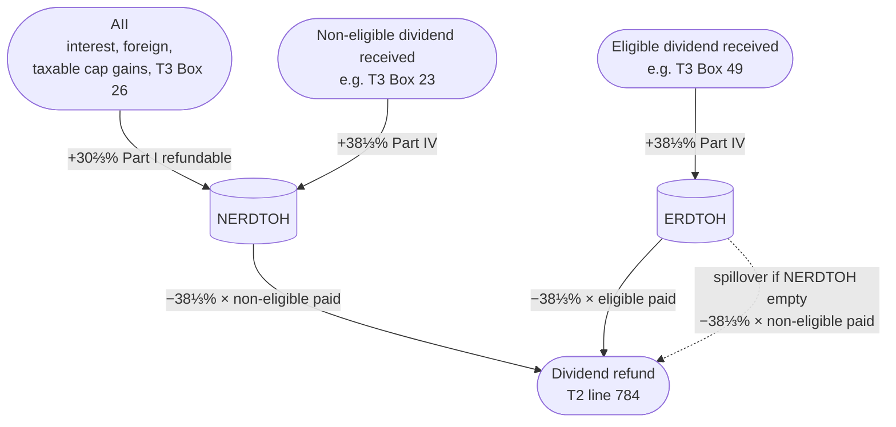

# ERDTOH and NERDTOH (Eligible and Non-Eligible Refundable Dividend Tax On Hand)

See parent document: [Dividends](Dividends.md)

**Who this is for**:
- Owners of a Canadian-controlled private corporation (CCPC) whose corp earns investment income or receives dividends from other corporations
- Want to understand the refundable tax the corp prepays on that income, and how the corp gets it back when it pays a dividend to its shareholders

**TLDR**:
- *ERDTOH* and *NERDTOH* are two corporate tax pools holding refundable tax the corp has already paid
- Tax flows *into* the pools when the corp earns *Aggregate Investment Income* (AII) or receives dividends from other corps
- Tax flows *out* of the pools as a *dividend refund* when the corp pays a taxable dividend
- The pools were a single *RDTOH* account before 2019; the split into eligible and non-eligible was effective for tax years starting after 2018

Limitations:
- Focus is on a typical owner-managed CCPC with a Canadian-resident shareholder
- *Connected*-corporation flow-through Part IV mechanics are touched on but not worked through in depth
- The salary-vs-dividend tradeoff and TOSI rules are out of scope; see [Dividends](Dividends.md)
- Tax information can change over time
- The following is my understanding as of 2026

## Corporate tax pools: ERDTOH / NERDTOH vs GRIP and CDA

ERDTOH and NERDTOH are two of four corporate tax pools that together determine how dividends are taxed on the corporation's side.  
Each pool tracks a different kind of pre-earned capacity or pre-paid tax, recovered through one specific dividend flavour paid out.  

The four pools:
- *GRIP* (Schedule 53): capacity to *designate* dividends as eligible
- *CDA*: capacity to pay *tax-free capital* dividends to a Canadian-resident shareholder
- *ERDTOH*: previously paid corporate tax, recovered when an eligible dividend is paid
- *NERDTOH*: previously paid corporate tax, recovered when a non-eligible dividend is paid

What fills each pool:
- General-rate ABI → GRIP (72% of the general-rate income)
- Eligible dividend received → GRIP (full amount) + ERDTOH (Part IV tax)
- Non-eligible dividend received → NERDTOH (Part IV tax)
- AII → NERDTOH (30⅔% refundable Part I) + CDA (non-taxable ½ of capital gains)

What each dividend flavour paid does:
- *Eligible* (s.89(14) designation): draws on GRIP capacity; triggers an ERDTOH refund of 38⅓% × dividend paid
- *Non-eligible* (no designation): triggers a NERDTOH refund of 38⅓% × dividend paid; ERDTOH is the spillover if NERDTOH is exhausted
- *Capital* (s.83(2) election on Form T2054): draws on CDA capacity; no refund

GRIP and CDA are about *capacity to pay* a particular dividend flavour.  
ERDTOH and NERDTOH are about *tax already paid* that comes back when the matching flavour is paid.   
For full GRIP mechanics see [Dividends / GRIP - capacity for eligible dividends](Dividends.md#grip---capacity-for-eligible-dividends); for CDA see [Capital-Dividend-Account.md](../Capital-Dividend-Account/Capital-Dividend-Account.md).  

## The two RDTOH pools

The *Eligible Refundable Dividend Tax on Hand* (ERDTOH) and *Non-Eligible Refundable Dividend Tax on Hand* (NERDTOH) accounts are defined in ITA [s.129(4)](https://laws-lois.justice.gc.ca/eng/acts/I-3.3/section-129.html).  
Both are refundable tax pools; balances roll forward year to year and are recovered only when the corporation pays a taxable dividend.  
Neither account is a balance-sheet asset.  
They are notional T2 pools, tracked by T2 software and reported on T2 Page 7.  

### Transition from RDTOH (pre-2019)

Prior to 2019, there was a single RDTOH, it was split on transition between the two pools based on the source of each dollar.  

Effective: first tax year beginning after 2018 (2019 for a calendar-year corp).  
Computed from the prior year-end RDTOH and GRIP (ITA [s.129(5)](https://laws-lois.justice.gc.ca/eng/acts/I-3.3/section-129.html)).  

CCPC split:
- *ERDTOH*: lesser of the prior-year RDTOH and 38⅓% of the prior-year GRIP (net of eligible dividends paid that year)
- *NERDTOH*: the rest

Non-CCPC: entire RDTOH to ERDTOH.  

RDTOH by source:
- Eligible dividends received → ERDTOH (added full amount to GRIP and 38⅓% to RDTOH, so the 38⅓% × GRIP cap matches)
- Refundable Part I tax on AII → NERDTOH (adds to RDTOH but not GRIP, so nothing fits under the cap)

No dividend before 2019 means no refund, so the full RDTOH carried into the split.  

## Additions

Two mechanisms add to the RDTOH pools.

*Part IV tax on dividends received from other corps* (ITA [s.186(1)](https://laws-lois.justice.gc.ca/eng/acts/I-3.3/section-186.html)):
- 38⅓% on dividends received from non-connected Canadian corporations (e.g. portfolio shareholdings of public-equity corps)
- For *connected* corporations: a flow-through proportional to the payer corporation's dividend refund (Part IV is only triggered to the extent the payer recovered RDTOH)
- The destination (ERDTOH or NERDTOH) is determined by the type of dividend received (under ITA [s.129(4)](https://laws-lois.justice.gc.ca/eng/acts/I-3.3/section-129.html)):
  - Eligible dividend received → Part IV tax flows to ERDTOH
  - Non-eligible dividend received → Part IV tax flows to NERDTOH
  - Connected-corp Part IV tax retains the character that triggered the payer's refund

*Refundable Part I tax on AII* (ITA s.129(4)):
- Adds to NERDTOH only, never ERDTOH
- 30⅔% of AII for the year
- AII is interest, foreign income, the taxable portion of capital gains, and most T3 Box 26 amounts from index ETFs structured as mutual fund trusts (see [T3-Box-26-Other-Income.md](../T3/T3-Box-26-Other-Income.md))

The 30⅔% rate at which AII *adds* to NERDTOH is distinct from the 38⅓% rate at which a non-eligible dividend *removes* tax from NERDTOH.  

## Inflows and outflows

Each pool is filled by investment income or dividends received, then empties when a dividend is paid.  

Legend:
- Solid arrows show the standard flow
- The dotted arrow shows the ERDTOH spillover when a non-eligible dividend is paid and NERDTOH is exhausted  

## Dividend refund

The *dividend refund* under ITA [s.129(1)](https://laws-lois.justice.gc.ca/eng/acts/I-3.3/section-129.html) is calculated separately by dividend type and credited against tax payable for the same year.

- *Eligible* dividends paid → refund equal to the lesser of:
  - 38⅓% of eligible dividends paid in the year
  - ERDTOH year-end balance (ITA s.129(1)(a))
- *Non-eligible* dividends paid → refund equal to the lesser of:
  - 38⅓% of non-eligible dividends paid in the year
  - NERDTOH year-end balance *plus* any ERDTOH balance left over after the eligible-dividend refund (ITA s.129(1)(a)(ii))

Ordering rules:
- An eligible dividend draws only on ERDTOH; it cannot use NERDTOH
- A non-eligible dividend draws on NERDTOH first, and only spills into ERDTOH after NERDTOH is exhausted
- A non-eligible-only payout history can therefore strand ERDTOH on the corporate books (see [Stranding](#stranding) below)

The 38⅓% rate is the rate at which a dollar of dividend liberates refundable tax.  
To fully empty a $1 NERDTOH balance the corporation needs $1 ÷ 38⅓% ≈ **$2.61** of non-eligible dividend.  

## T2 reporting

The T2 line items that carry the pools and the refund:
- *T2 Page 7*: opening, additions, deductions, and closing balances for ERDTOH and NERDTOH
- *T2 line 784*: total dividend refund for the year, applied as a credit against tax payable on the same return
- *S3 Part 3 Box 450*: total taxable dividends paid in the year (eligible and non-eligible combined)
- *S3 Part 4 Box 500*: the portion of Box 450 that drives the dividend refund calculation

These page, line, and box numbers drift between form releases; verify them against the current-year T2 and Schedule 3.

T2 software fills these in once dividends paid (eligible vs non-eligible split) are entered.  

## Year-end timing

The refund under ITA s.129(1) depends on when the dividend is *paid* in the year (the same "paid, credited, or otherwise made available" test that sets T5 / T1 timing).  
Declaring a dividend payable on a date in the next year, with no in-year credit to the shareholder, leaves the refund out of the current year.  

The refund uses the *year-end* pool balance, which already holds the year's Part IV additions.  
A dividend received and paid out in the same year therefore puts its Part IV tax and matching refund on one T2, where they net to zero, with no need to wait for the next year.  

For the late-December NERDTOH-recovery procedure (resolution + credit to *Due to shareholder* + January cash settlement), see [Dividends / Declaration date, record date, and payment date](Declaring-And-Paying.md#declaration-date-record-date-and-payment-date).  

## Stranding

GRIP, ERDTOH, and NERDTOH cannot be transferred, sold, or rolled out to a shareholder; any unused balance at wind-up is lost.  
A corporation that receives eligible dividends but only ever pays non-eligible dividends strands both GRIP and ERDTOH on the corporate books.  

Stranding doesn't cost anything to the corporation, but the shareholder pays more personal taxes:  
- Either way the corporation recovers the same 38⅓% refund: NERDTOH on a non-eligible dividend, ERDTOH on an eligible one.    
- Shareholder pays more: non-eligible dividends carry a lower gross-up and dividend tax credit, so the same cash leaves a bigger personal tax bill  

How the two pools strand:
- *GRIP*:
  - Eligible dividends received add to GRIP, but the eligible designation has to be made at or before the time the dividend is paid (ITA [s.89(14)](https://laws-lois.justice.gc.ca/eng/acts/I-3.3/section-89.html))
  - Non-eligible dividends already paid cannot be retroactively redesignated, so an unused GRIP balance accumulates on Schedule 53
- *ERDTOH*:
  - Part IV tax on dividends received populates ERDTOH
  - Ordering rule: non-eligible draws NERDTOH first, ERDTOH only after NERDTOH is exhausted
  - ERDTOH never drains while NERDTOH is non-empty

Stranding scenarios:
- A CCPC receiving Box 49 ETF dividends (e.g. XEI) but only paying non-eligible dividends to the owner-manager:
  - Each year's Part IV tax on the eligible dividends received goes to ERDTOH, but the year's payout draws only from NERDTOH (which is being filled by the AII portion of the same ETF distributions)
  - ERDTOH balance grows and stays
- A CCPC with no GRIP and a stranded ERDTOH balance:
  - Paying an eligible dividend would draw on ERDTOH but requires GRIP capacity to designate the dividend
  - Without GRIP the ERDTOH stays stranded

Draining a stranded balance:
- Designate future dividends as eligible up to the running GRIP balance on Schedule 53, with a current-year catch-up dividend if free retained earnings allow; the eligible dividend draws down both GRIP and ERDTOH
- GRIP is finalized at year-end, so an in-year catch-up has to forecast the closing balance; over-designating triggers Part III.1 tax (see [Dividends / Schedule 55](T2-Reporting.md#schedule-55---part-iii1-tax-on-excessive-eligible-dividend-designations))
- ITA [s.185.1(2)](https://laws-lois.justice.gc.ca/eng/acts/I-3.3/section-185.1.html) lets the corporation and shareholder jointly elect to reclassify a small overshoot as a separate non-eligible dividend

## Worked example - ERDTOH buildup from corporate ETF holdings

Setup:
- A CCPC holds $200,000 of XEI (an eligible-dividend-paying Canadian-equity ETF structured as a mutual fund trust)
- 2026 distributions allocated to the corp: T3 Box 49 (eligible dividends) = $7,500; for simplicity assume Box 26 / Box 21 amounts are negligible
- The corp's only other income is $200,000 ABI under the SBD
- Opening GRIP and ERDTOH balances: $0

Receiving the dividend:
- Box 49: $7,500 is reported on S3 Part 1 as a dividend received; the s.112 deduction removes it from Part I taxable income
- Part IV tax: $7,500 × 38⅓% = **$2,875**, paid with the 2026 T2; this $2,875 flows to ERDTOH per s.129(4)
- GRIP also increases by the $7,500 of eligible dividends received

End of 2026:
- ERDTOH closing balance: $2,875
- GRIP closing balance: $7,500
- NERDTOH closing balance: $0 (no AII)

To recover the $2,875 ERDTOH, the corporation pays a $7,500 eligible dividend (designated under s.89(14)), drawing on the GRIP capacity.  
Dividend refund: $7,500 × 38⅓% = $2,875, exactly emptying ERDTOH.  

Paid in 2026, the $2,875 Part IV tax and this $2,875 refund both fall on the 2026 T2 and net to zero (see [Year-end timing](#year-end-timing)); the refund slips to the 2027 T2 only if the dividend is not paid or credited until then.  

If a non-eligible dividend was used instead, it would draw on NERDTOH first.  
With NERDTOH at $0, a $7,500 non-eligible dividend spills into ERDTOH and triggers the same $2,875 refund.  
The eligible designation produces a more favourable personal-side gross-up and DTC, so the eligible route is preferred when GRIP is available.  

For the parallel non-eligible / NERDTOH-recovery example (with year-end timing), see [Dividends / Worked examples](Dividends-Examples.md#worked-examples).  

## Related

- [Dividends](Dividends.md)
- [T3](../T3/T3.md)
- [T3 - Box 26 Other Income](../T3/T3-Box-26-Other-Income.md)
- [Tax Integration](../Tax-Integration.md)
- [Capital Dividend Account](../Capital-Dividend-Account/Capital-Dividend-Account.md)
- [Small Business Tax Overview](../Small-Business-Tax-Overview.md)
- [Glossary](../Glossary.md)

## Citations

- Income Tax Act (R.S.C., 1985, c. 1 (5th Supp.)):
  - [s.89(1)](https://laws-lois.justice.gc.ca/eng/acts/I-3.3/section-89.html) - definition of *GRIP*
  - [s.89(14)](https://laws-lois.justice.gc.ca/eng/acts/I-3.3/section-89.html) - eligible dividend designation by written notice at or before payment
  - [s.112](https://laws-lois.justice.gc.ca/eng/acts/I-3.3/section-112.html) - inter-corporate dividend deduction (Part I exemption for dividends received)
  - [s.129(1)](https://laws-lois.justice.gc.ca/eng/acts/I-3.3/section-129.html) - dividend refund formula (eligible: s.129(1)(a)(i); non-eligible: s.129(1)(a)(ii))
  - [s.129(4)](https://laws-lois.justice.gc.ca/eng/acts/I-3.3/section-129.html) - definitions of *ERDTOH* and *NERDTOH*, and the additions to each; refundable Part I tax on AII (30⅔%); destination rule for Part IV tax
  - [s.129(5)](https://laws-lois.justice.gc.ca/eng/acts/I-3.3/section-129.html) - transition of the pre-2019 RDTOH into ERDTOH and NERDTOH (CCPC opening ERDTOH = lesser of RDTOH and 38⅓% of GRIP)
  - [s.185.1](https://laws-lois.justice.gc.ca/eng/acts/I-3.3/section-185.1.html) - Part III.1 tax on excessive eligible dividend designations (20%); s.185.1(2) joint election to reclassify a small overshoot as a non-eligible dividend
  - [s.186(1)](https://laws-lois.justice.gc.ca/eng/acts/I-3.3/section-186.html) - Part IV tax on dividends received from other corporations (38⅓% non-connected; flow-through for connected)
- CRA T4012 - T2 Corporation Income Tax Guide: https://www.canada.ca/en/revenue-agency/services/forms-publications/publications/t4012.html
