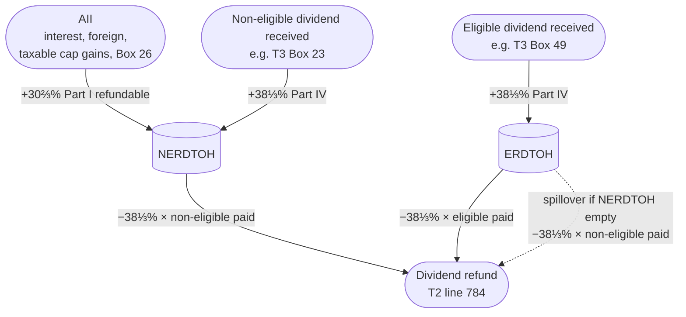

STATUS: AI GENERATED, REVIEW IN PROGRESS

# ERDTOH and NERDTOH (Refundable Dividend Tax Accounts)

**Who this is for**: owners of a Canadian-controlled private corporation (CCPC) trying to understand the corporate-side refundable dividend tax accounts: what fills them, what empties them, and how they show up on the T2.  

**TLDR**:
- *ERDTOH* and *NERDTOH* are two corporate tax pools holding previously paid refundable tax
- Tax flows *into* the pools when the corp earns *Aggregate Investment Income* (AII) or receives dividends from other corps
- Tax flows *out* of the pools as a *dividend refund* when the corp pays a taxable dividend
- The pools were a single *RDTOH* account before 2019; the split into eligible and non-eligible was effective for tax years starting after 2018

Limitations:
- Focus is on a typical owner-managed CCPC with a Canadian-resident shareholder
- *Connected*-corporation flow-through Part IV mechanics are sketched but not worked through in depth
- The salary-vs-dividend tradeoff and TOSI rules are out of scope; see [Shareholder-Dividends.md](Shareholder-Dividends.md)
- Tax information can change over time
- The following is my understanding as of 2026

## The four corporate tax pools

ERDTOH and NERDTOH are two of four corporate tax pools that together drive the corp-side dividend mechanics.  
Each pool tracks a different kind of pre-earned capacity or pre-paid tax, recovered through one specific dividend flavour paid out.  

The four pools:
- *GRIP* (Schedule 53): capacity to *designate* dividends as eligible
- *CDA*: capacity to pay *tax-free capital* dividends to a Canadian-resident shareholder
- *ERDTOH*: previously paid corporate tax, recovered when an eligible dividend is paid
- *NERDTOH*: previously paid corporate tax, recovered when a non-eligible dividend is paid

What fills each pool:
- General-rate ABI → GRIP (72% of the post-tax addition)
- Eligible dividend received → GRIP (full amount) + ERDTOH (Part IV tax)
- Non-eligible dividend received → NERDTOH (Part IV tax)
- AII → NERDTOH (30⅔% refundable Part I) + CDA (non-taxable ½ of capital gains)

What each dividend flavour paid does:
- *Eligible* (s.89(14) designation): draws on GRIP capacity; triggers an ERDTOH refund of 38⅓% × dividend paid
- *Non-eligible* (no designation): triggers a NERDTOH refund of 38⅓% × dividend paid; ERDTOH is the spillover if NERDTOH is exhausted
- *Capital* (s.83(2) election on Form T2054): draws on CDA capacity; no refund

GRIP and CDA are about *capacity to pay* a particular dividend flavour; ERDTOH and NERDTOH are about *tax already paid* that comes back when the matching flavour is paid.  
For full GRIP mechanics see [Shareholder-Dividends.md / GRIP - capacity for eligible dividends](Shareholder-Dividends.md#grip---capacity-for-eligible-dividends); for CDA see [Capital-Dividend-Account.md](Capital-Dividend-Account/Capital-Dividend-Account.md).  

## The two RDTOH pools

The *Eligible Refundable Dividend Tax on Hand* (ERDTOH) and *Non-Eligible Refundable Dividend Tax on Hand* (NERDTOH) accounts are defined in ITA [s.89(1)](https://laws-lois.justice.gc.ca/eng/acts/I-3.3/section-89.html).  
Both are refundable tax pools; balances roll forward year to year and are recovered only when the corporation pays a taxable dividend.  
Neither account is a balance-sheet asset.  
They are notional T2 pools, tracked by T2 software and reported on T2 Page 7.  

The single pre-2019 RDTOH was effectively split between the two pools on transition based on the source of each dollar.  

## Additions

Two mechanisms add to the RDTOH pools.

*Part IV tax on dividends received from other corps* (ITA [s.186(1)](https://laws-lois.justice.gc.ca/eng/acts/I-3.3/section-186.html)):
- 38⅓% on dividends received from non-connected Canadian corporations (e.g. portfolio shareholdings of public-equity corps)
- For *connected* corporations: a flow-through proportional to the payer corporation's dividend refund (Part IV is only triggered to the extent the payer recovered RDTOH)
- The destination (ERDTOH or NERDTOH) follows the type of dividend received under ITA [s.129(4)](https://laws-lois.justice.gc.ca/eng/acts/I-3.3/section-129.html):
  - Eligible dividend received → Part IV tax flows to ERDTOH
  - Non-eligible dividend received → Part IV tax flows to NERDTOH
  - Connected-corp Part IV tax retains the character that triggered the payer's refund

*Refundable Part I tax on AII* (ITA s.129(4)):
- Adds to NERDTOH only, never ERDTOH
- 30⅔% of AII for the year
- AII is interest, foreign income, the taxable portion of capital gains, and most T3 Box 26 amounts from index ETFs structured as mutual fund trusts (see [T3-Box-26-Other-Income.md](T3/T3-Box-26-Other-Income.md))

The 30⅔% rate at which AII *adds* to NERDTOH is not the same as the 38⅓% rate at which a non-eligible dividend *removes* tax from NERDTOH.  

## Lifecycle

The fill and empty cycle for the two pools.  
Solid arrows show the standard flow; the dotted arrow shows the conditional ERDTOH spillover when a non-eligible dividend is paid and NERDTOH is exhausted.  

## Dividend refund

The *dividend refund* under ITA [s.129(1)](https://laws-lois.justice.gc.ca/eng/acts/I-3.3/section-129.html) is calculated separately by dividend type and credited against tax payable for the same year.

- *Eligible* dividends paid → refund equal to the lesser of:
  - 38⅓% of eligible dividends paid in the year
  - ERDTOH year-end balance (ITA s.129(1)(a))
- *Non-eligible* dividends paid → refund equal to the lesser of:
  - 38⅓% of non-eligible dividends paid in the year
  - NERDTOH year-end balance *plus* any ERDTOH balance left over after the eligible-dividend refund (ITA s.129(1)(b))

Ordering rules:
- An eligible dividend draws only on ERDTOH; it cannot reach into NERDTOH
- A non-eligible dividend draws on NERDTOH first, and only spills into ERDTOH after NERDTOH is exhausted
- A non-eligible-only payout history can therefore strand ERDTOH on the corporate books (see [Stranding](#stranding) below)

The 38⅓% rate is the rate at which a dollar of dividend liberates refundable tax.  
To fully empty a $1 NERDTOH balance the corporation needs $1 ÷ 38⅓% ≈ **$2.61** of non-eligible dividend.  

## T2 reporting

The T2 line items that carry the pools and the refund:
- *T2 Page 7*: opening, additions, deductions, and closing balances for ERDTOH and NERDTOH
- *T2 line 784*: total dividend refund for the year, applied as a credit against tax payable on the same return
- *S3 Part 3 Box 450*: total taxable dividends paid in the year (eligible and non-eligible combined)
- *S3 Part 4 Box 500*: the portion of Box 450 that drives the dividend refund calculation

T2 software fills these in once dividends paid (eligible vs non-eligible split) are entered.  

## Year-end timing

ITA s.129(1) keys off when the dividend is *paid* in the year, using the same "paid, credited, or otherwise made available" standard that determines T5 / T1 timing.  
A resolution that merely *declares* a dividend payable on a future date in the next year, with no in-year credit to the shareholder, does not land the refund in the current year.  

For the late-December NERDTOH-recovery procedure (resolution + credit to *Due to shareholder* + January cash settlement), see [Shareholder-Dividends.md / Declaration date, record date, and payment date](Shareholder-Dividends.md#declaration-date-record-date-and-payment-date).  

## Stranding

ERDTOH and NERDTOH cannot be transferred, sold, or rolled out to a shareholder; any unused balance at wind-up is lost.  
The ordering rule above (non-eligible draws NERDTOH first, then ERDTOH) means a corporation that receives eligible dividends but only ever pays non-eligible dividends can build up ERDTOH that never drains while NERDTOH is non-empty.  

Stranding scenarios:
- A CCPC receiving Box 49 ETF dividends (e.g. XEI) but only paying non-eligible dividends to the owner-manager: each year's Part IV tax on the eligible dividends received goes to ERDTOH, but the year's payout draws only from NERDTOH (which is being filled by the AII portion of the same ETF distributions); the ERDTOH balance grows and stays
- A CCPC with no GRIP and a stranded ERDTOH balance: paying an eligible dividend would draw on ERDTOH but requires GRIP capacity to designate the dividend; without GRIP the ERDTOH stays stranded

The companion GRIP-stranding pitfall is covered in [Shareholder-Dividends.md / Stranded GRIP and ERDTOH](Shareholder-Dividends.md#stranded-grip-and-erdtoh).  

## Worked example - ERDTOH buildup from corporate ETF holdings

Setup:
- A CCPC holds $200,000 of XEI (an eligible-dividend-paying Canadian-equity ETF structured as a mutual fund trust)
- 2026 distributions allocated to the corp: T3 Box 49 (eligible dividends) = $7,500; assume Box 26 / Box 21 amounts are negligible for simplicity
- The corp's only other income is $200,000 ABI under the SBD
- Opening GRIP and ERDTOH balances: $0

Receiving the dividend:
- The $7,500 in Box 49 is reported on S3 Part 1 as a dividend received; the s.112 deduction removes it from Part I taxable income
- Part IV tax: $7,500 × 38⅓% = **$2,875**, paid with the 2026 T2; this $2,875 flows to ERDTOH per s.129(4)
- GRIP also increases by the $7,500 of eligible dividends received

End of 2026:
- ERDTOH closing balance: $2,875
- GRIP closing balance: $7,500
- NERDTOH closing balance: $0 (no AII)

To recover the $2,875 ERDTOH, the corporation pays a $7,500 eligible dividend (designated under s.89(14)), drawing on the GRIP capacity.  
Dividend refund: $7,500 × 38⅓% = $2,875, exactly emptying ERDTOH.  

If the corporation paid only a non-eligible dividend instead, the dividend would draw on NERDTOH first; with NERDTOH at $0, a $7,500 non-eligible dividend would spill into ERDTOH and trigger the same $2,875 refund.  
The eligible designation produces a more favourable personal-side gross-up and DTC, so the eligible route is preferred when GRIP is available.  

For the parallel non-eligible / NERDTOH-recovery example (with the year-end timing trick), see [Shareholder-Dividends.md / Worked examples](Shareholder-Dividends.md#worked-examples).  

# Related

- [Shareholder Dividends](Shareholder-Dividends.md)
- [T3](T3/T3.md)
- [T3 - Box 26 Other Income](T3/T3-Box-26-Other-Income.md)
- [Tax Integration](Tax-Integration.md)
- [Capital Dividend Account](Capital-Dividend-Account/Capital-Dividend-Account.md)
- [Small Business Tax Overview](Small-Business-Tax-Overview.md)
- [Glossary](Glossary.md)

# Citations

- Income Tax Act (R.S.C., 1985, c. 1 (5th Supp.)):
  - [s.89(1)](https://laws-lois.justice.gc.ca/eng/acts/I-3.3/section-89.html) - definitions of *ERDTOH* and *NERDTOH*
  - [s.112](https://laws-lois.justice.gc.ca/eng/acts/I-3.3/section-112.html) - inter-corporate dividend deduction (Part I exemption for dividends received)
  - [s.129(1)](https://laws-lois.justice.gc.ca/eng/acts/I-3.3/section-129.html) - dividend refund formula (eligible: s.129(1)(a); non-eligible: s.129(1)(b))
  - [s.129(4)](https://laws-lois.justice.gc.ca/eng/acts/I-3.3/section-129.html) - additions to ERDTOH and NERDTOH; refundable Part I tax on AII (30⅔%); destination rule for Part IV tax
  - [s.186(1)](https://laws-lois.justice.gc.ca/eng/acts/I-3.3/section-186.html) - Part IV tax on dividends received from other corporations (38⅓% non-connected; flow-through for connected)
- CRA T4012 - T2 Corporation Income Tax Guide: https://www.canada.ca/en/revenue-agency/services/forms-publications/publications/t4012.html
