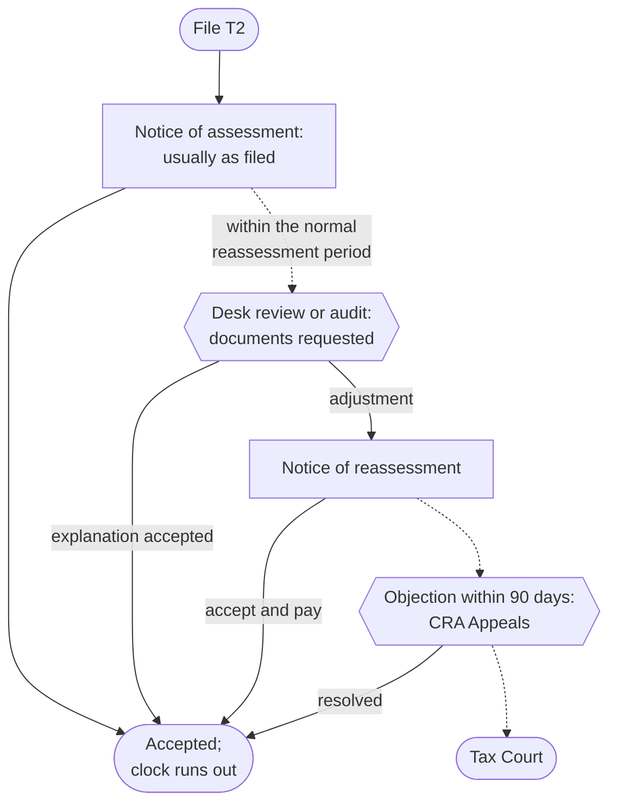

STATUS: AI GENERATED, REVIEW IN PROGRESS

# CRA Administration

**Who this is for**:
- Owners of a Canadian-controlled private corporation (CCPC)
- Handling what comes after the return is filed
  - Assessments, reviews, adjustments, objections, and the books that back them

**TLDR**:
- The T2 is self-assessed: the *notice of assessment* usually accepts the return as filed
  - CRA's checking happens afterwards, inside the *normal reassessment period* (3 years for a CCPC)
- Reconcile every notice of (re)assessment to the books
  - Differences adjust the tax expense in the year the notice arrives
- Arrears interest and penalties are never deductible; refund interest is taxable income
- A desk review letter is answered with documents by its deadline, not with arguments
  - An unanswered letter becomes a reassessment
- Disagreeing with a reassessment has a 90-day clock: file a notice of objection, or the assessment stands
- Keep books and records 6 years from the end of the last tax year they relate to

Limitations:
- Scope is income tax (the RC account)
  - GST/HST assessments and reviews follow parallel Excise Tax Act mechanics; touched on, not worked through
- Full audit defence and Tax Court procedure are out of scope beyond orientation; both are professional-advice territory
- Payroll examinations and slip-filing penalties are covered on their own pages
  - PIER reviews are in [Payroll](../Paying-Yourself/Payroll.md); slip-filing penalties in [Small Business Tax Overview](../Overview/Small-Business-Tax.md#filing-deadlines-and-instalments)
- The following is my understanding as of 2026

## The Assessment Cycle

Corporate tax is self-assessed: the corporation computes its own tax, files, and pays.  
CRA assesses first and verifies later.  

The notice of assessment (NOA):
- Arrives in My Business Account after the T2 is processed
  - CRA has been moving business correspondence to online mail by default
  - Check the mail preference and register for email notifications so a notice or review letter is not missed
- Usually matches the return as filed
  - An initial NOA is not CRA agreement with the numbers, only the starting point of the reassessment clock
- Compare it line by line against the filed T2; a changed line comes with an explanation paragraph on the notice

## Booking the Tax Cycle

The corporation's income tax flows through two accounts (see [Ledger and Accounts](../Bookkeeping/Ledger-And-Accounts.md)):
- `Current income taxes` (`9990`): expense
- `Taxes payable` (`2680`): liability; instalments post here as debits, so the balance nets to what is still owed

Year-end accrual, FY2026 tax estimated at $9,760 with $8,000 of instalments already paid during the year:

| Account | Debit | Credit |
|---|---|---|
| `Current income taxes` (`9990`) | 9,760.00 | |
| `Taxes payable` (`2680`) | | 9,760.00 |

The instalment payments during the year were each booked as Dr `Taxes payable` / Cr `Cash`.  
`2680` now shows the $1,760 balance due.  
Paying it by the balance-due date clears the account (see [Payment](Payment/Payment.md)).  

When the NOA assesses a different amount (say $9,900, $140 more):

| Account | Debit | Credit |
|---|---|---|
| `Current income taxes` (`9990`) | 140.00 | |
| `Taxes payable` (`2680`) | | 140.00 |

Interest and penalties on the notice:
- Arrears interest and penalties are not deductible (ITA [s.18(1)(t)](https://laws-lois.justice.gc.ca/eng/acts/I-3.3/section-18.html))
  - Book them to `Interest and bank charges` (`8710`) and add them back on Schedule 1
- Refund interest CRA pays is taxable interest income in the year received

The true-up posts in the year the notice arrives; do not reopen a closed year's books for it.  

## The Reassessment Clock

CRA can reassess a CCPC's tax year within the *normal reassessment period* (ITA [s.152(3.1)](https://laws-lois.justice.gc.ca/eng/acts/I-3.3/section-152.html)).  
The period is 3 years from the date of the original notice of assessment.  

The clock stretches or disappears in specific cases:
- *Loss carryback*: the year a loss was carried back to stays open 3 extra years (s.152(4)(b))
  - Only for adjustments related to the carryback
- *T1135 not filed with foreign income omitted*: 3 extra years (see [T1135](../Investments/T1135.md))
- *Misrepresentation* attributable to neglect, carelessness, wilful default, or fraud: no time limit (s.152(4)(a)(i))
- *Waiver*: the corporation can sign one (Form T2029) to keep a specific issue open past the deadline
  - Usually during an audit negotiation; it is revocable on 6 months' notice

The clock cuts both ways:
- After it runs out, the year is *statute-barred*
  - CRA cannot reassess it, and the corporation cannot get money back from it
- A refund-side correction (a missed deduction, an overstated income line) must land while the year is still open
  - The 10-year relief window that individuals have for refunds does not extend to corporations
- Review old years for missed claims before their third anniversary, not after

## Interest and Penalties

All rates key off the quarterly *prescribed rate* (Income Tax Regulations [s.4301](https://laws-lois.justice.gc.ca/eng/regulations/C.R.C.,_c._945/section-4301.html), set from 90-day T-bill yields):
- *Arrears interest*: prescribed rate + 4%, compounded daily, from the balance-due date
- *Refund interest* for a corporation: the plain prescribed rate, compounded daily
- The 4-point spread means a disputed balance is expensive to leave unpaid (see the objection section below)

The penalties an owner-managed corporation actually meets:
- *Late-filed T2 with a balance owing*: 5% of the unpaid tax plus 1% per full month late, up to 12 months (ITA [s.162(1)](https://laws-lois.justice.gc.ca/eng/acts/I-3.3/section-162.html))
  - A repeat failure after a demand doubles the rates (s.162(2))
- *Late-filed T2 with no balance owing*: no s.162(1) penalty (it is a percentage of nil)
  - The year still must be filed to start the clocks and preserve carryovers
- *Instalment interest*, and an instalment penalty when that interest tops $1,000 (ITA [s.163.1](https://laws-lois.justice.gc.ca/eng/acts/I-3.3/section-163.1.html))
- *Information-slip and T1135 penalties*: flat-rate, no tax owing required; see [Filing deadlines](../Overview/Small-Business-Tax.md#filing-deadlines-and-instalments) and [T1135](../Investments/T1135.md)

## Director Liability

The corporation's tax debts are its own, with one exception aimed straight at the owner-manager.  
Directors are jointly and severally liable for amounts the corporation failed to withhold or remit:
- Source deductions and other s.153 withholdings, under ITA [s.227.1](https://laws-lois.justice.gc.ca/eng/acts/I-3.3/section-227.1.html)
- GST/HST net tax, under ETA [s.323](https://laws-lois.justice.gc.ca/eng/acts/E-15/section-323.html)
- Plus the interest and penalties on both

Corporate income tax is not on the list; an unpaid T2 balance stays the corporation's.  

Both provisions run the same machinery:
- CRA must first exhaust the corporation (s.227.1(2), s.323(2)):
  - A certificate registered in Federal Court with execution returned unsatisfied
  - Or a claim proved within six months of a liquidation or dissolution, or of a bankruptcy
- The *due-diligence defence*: no liability where the director "exercised the degree of care, diligence and skill to prevent the failure that a reasonably prudent person would have exercised in comparable circumstances" (s.227.1(3), s.323(3))
- The limitation: no assessment more than two years after the person last ceased to be a director (s.227.1(4), s.323(5))

What this means for a single-director CCPC in a cash squeeze:
- The payroll remittance and the HST are not working capital; a shortfall financed by holding them back is financed personally
- The amounts are already impressed with a deemed trust for the Crown before any assessment (see [HST](../Operations/HST/HST.md) for ETA s.222)
- The defence is about *prevention*: a remittance-first payment habit and evidence of monitoring, not explanations after the failure
- The two-year clock starts only on a genuine cessation
  - A documented, registry-filed resignation starts it; continuing to manage the corporation as a de facto director does not

The exposure is why the remittance accounts are cleared before anything else in a wind-down; see [Winding Down](../Corporate-Lifecycle/Winding-Down.md).  

## Reviews and Audits

A *desk review* (processing review) is a letter asking for the backup behind specific lines.  
The target can be a GIFI expense line, a schedule figure, or an ITC.  

Handling one:
- Respond by the letter's deadline (typically 30 days) through *Submit documents* in My Business Account
  - Quote the letter's case or reference number
- Send documents, not essays: the invoices, statements, and ledger extracts behind the questioned line
  - Add a short covering note mapping each document to the line
- Ask for more time before the deadline if gathering takes longer
  - Silence is the one losing move: an unanswered letter becomes a reassessment denying the line
- This is where the bookkeeping discipline pays off
  - A ledger whose lines trace to filed source documents turns a review into an afternoon

A *full audit* is broader: an auditor examines the books and records.  
The auditor has statutory authority to inspect them and require answers (ITA [s.231.1](https://laws-lois.justice.gc.ca/eng/acts/I-3.3/section-231.html)).  
Cooperate on documents, keep answers factual, and involve an accountant early; audit defence is out of scope here.  

Authorizing a representative (an accountant) for the RC account is done in My Business Account.  
The authorization is per program account.  
It survives until it expires (if an expiry date was set when granted) or is revoked.  

## Records Retention

The duty to keep books and records is ITA [s.230](https://laws-lois.justice.gc.ca/eng/acts/I-3.3/section-230.html).  
The default retention clock is 6 years from the end of the last tax year the record relates to (s.230(4)(b)).  
Certain records prescribed by Income Tax Regulations [s.5800](https://laws-lois.justice.gc.ca/eng/regulations/C.R.C.,_c._945/section-5800.html), the general ledger among them, follow a different clock.  
They must be kept until 2 years after dissolution (s.230(4)(a)).  

What that means in practice:
- *Transaction records*: 6 years from the end of the tax year they relate to (s.230(4)(b))
  - Invoices, receipts, bank and brokerage statements, ordinary client contracts
- *Long-lived records*: a record supporting a balance that persists relates to every year the balance is alive
  - Its 6 years start when the balance is finally used up
  - Examples: an [ACB tracker](../Investments/Adjusted-Cost-Base/Adjusted-Cost-Base-Tracking.md), a [CCA asset register](../Operations/Cost-Recovery/Capital-Cost-Allowance/CCA-Tracking.md), the [loss continuity schedule](Losses.md#carrying-forward)
- *Permanent records*: keep until 2 years after dissolution (Reg 5800(1)(a))
  - The minute book, share registers, and articles
  - **The general ledger, and any special contracts or agreements needed to understand its entries**
  - Effectively permanent for a going concern that is never dissolved
- Electronic records are fine; keep them readable and in Canada (or get CRA's written permission otherwise)
- Destroying records early needs CRA consent (Form T137)
  - The practical answer for a small corporation is to keep everything digital and never destroy

## Amending a Filed T2

There is no separate amendment form: a change to a filed year is a *requested reassessment*.  

How to request one:
- File an amended T2 through the same certified software (marked amended)
  - Or send the request with the changed schedules through My Business Account
- State what changes and why; attach the corrected schedule, not the whole reasoning
- The request must land within the normal reassessment period
  - A statute-barred year cannot be reopened downward (see [the reassessment clock](#the-reassessment-clock))
- A carryback is not an amendment: it goes on the loss-year Schedule 4 (see [Losses](Losses.md#carrying-back))

Amending information slips is separate from the T2.  
Amended T4s are covered in [Payroll](../Paying-Yourself/Payroll.md), amended T5s in [Bookkeeping and information slips](../Paying-Yourself/Dividends/Bookkeeping-And-Slips.md).  

## Objections

An objection is the formal disagreement with an assessment or reassessment.  
It moves the file from the auditor to CRA *Appeals*.  

Mechanics:
- Deadline: 90 days from the date on the notice (ITA [s.165(1)](https://laws-lois.justice.gc.ca/eng/acts/I-3.3/section-165.html))
  - A corporation does not get the extra one-year window individuals have
- Missed the deadline: apply for an extension within the following year (ITA [s.166.1](https://laws-lois.justice.gc.ca/eng/acts/I-3.3/section-166.1.html))
  - Extensions are discretionary, so treat 90 days as the real deadline
- File through My Business Account (*file a notice of objection*) or Form T400A
  - State the facts, the issue, and the relief sought
- First try the cheaper route: call the number on the notice or submit the missing document
  - An objection is for genuine disagreement, not a missed reply

Money while the dispute runs:
- For a CCPC, CRA generally cannot collect the disputed income-tax amount while the objection is open (ITA [s.225.1](https://laws-lois.justice.gc.ca/eng/acts/I-3.3/section-225.1.html))
- Arrears interest keeps compounding at prescribed + 4% the whole time
  - Paying the disputed amount stops the interest; it is refunded with interest if the objection succeeds
- An objection decided against the corporation can be appealed to the Tax Court of Canada
  - The informal procedure covers up to $25,000 of federal tax in dispute per year, without requiring counsel

A nil assessment cannot be objected to; for a loss year, the lever is a loss determination (see [Losses](Losses.md#the-loss-year-on-the-t2)).  

## Relief Programs

*Taxpayer relief* (ITA [s.220(3.1)](https://laws-lois.justice.gc.ca/eng/acts/I-3.3/section-220.html)):
- CRA can cancel or waive interest and penalties (never the tax itself) up to 10 years back
- Grounds: CRA error or delay, circumstances beyond the corporation's control, or inability to pay
- Apply on Form RC4288 with the supporting story and documents; the decision is discretionary

*Voluntary Disclosures Program* (VDP), per IC00-1R7 for applications received on or after 2025-10-01:
- For unfiled returns, unfiled slips or T1135s, or unreported income
- Applications are classed by what CRA had already said:
  - *Unprompted*: no CRA communication about the identified issue
    - An application made after an *education letter* or a notice offering general guidance is still unprompted
  - *Prompted*: made after CRA communication about the identified issue
    - Such as a specific compliance letter or a notice with a deadline to file or comply
    - A demand to file lands here, but the application remains eligible
- Relief: the tax is always payable
  - Unprompted gets full penalty relief plus 75% interest relief
  - Prompted gets up to full penalty relief plus 25% interest relief
- An ongoing audit or investigation in respect of the disclosed matter bars the application
  - The disclosure must be complete and include payment or a payment arrangement
- Apply on Form RC199; for anything material, have a professional shape the disclosure first

## Related

- [Payment](Payment/Payment.md)
- [Losses](Losses.md)
- [T2 Schedules](T2-Schedules.md)
- [T1135](../Investments/T1135.md)
- [Payroll](../Paying-Yourself/Payroll.md) (the remittances director liability covers)
- [Small Business Tax Overview](../Overview/Small-Business-Tax.md)
- [Ledger and Accounts](../Bookkeeping/Ledger-And-Accounts.md)
- [HST](../Operations/HST/HST.md)
- [Winding Down](../Corporate-Lifecycle/Winding-Down.md) (clearing the remittance accounts first)

## Citations

- Income Tax Act (R.S.C., 1985, c. 1 (5th Supp.)):
  - [s.18(1)(t)](https://laws-lois.justice.gc.ca/eng/acts/I-3.3/section-18.html) - no deduction for amounts paid under the ITA (arrears interest, penalties)
  - [s.152(3.1)](https://laws-lois.justice.gc.ca/eng/acts/I-3.3/section-152.html) - normal reassessment period (3 years for a CCPC)
  - [s.152(4)](https://laws-lois.justice.gc.ca/eng/acts/I-3.3/section-152.html) - exceptions: misrepresentation, waiver, carryback-related, foreign-reporting failures
  - [s.162(1)](https://laws-lois.justice.gc.ca/eng/acts/I-3.3/section-162.html) - late-filing penalty (5% + 1%/month to 12 months)
  - s.162(2) - repeated failure (10% + 2%/month to 20 months)
  - [s.163.1](https://laws-lois.justice.gc.ca/eng/acts/I-3.3/section-163.1.html) - instalment penalty when instalment interest exceeds $1,000
  - [s.165(1)](https://laws-lois.justice.gc.ca/eng/acts/I-3.3/section-165.html) - notice of objection, 90-day deadline; [s.166.1](https://laws-lois.justice.gc.ca/eng/acts/I-3.3/section-166.1.html) - extension application within one further year
  - [s.220(3.1)](https://laws-lois.justice.gc.ca/eng/acts/I-3.3/section-220.html) - taxpayer relief: waiver of interest and penalties within 10 years
  - [s.225.1](https://laws-lois.justice.gc.ca/eng/acts/I-3.3/section-225.1.html) - collection restrictions while an objection or appeal is outstanding
  - [s.227.1](https://laws-lois.justice.gc.ca/eng/acts/I-3.3/section-227.1.html) - director liability for unremitted withholdings: preconditions (227.1(2)), due-diligence defence (227.1(3)), two-year limit (227.1(4))
  - [s.230](https://laws-lois.justice.gc.ca/eng/acts/I-3.3/section-230.html) - duty to keep books and records; s.230(4) - retention period
  - [s.231.1](https://laws-lois.justice.gc.ca/eng/acts/I-3.3/section-231.html) - audit inspection authority
- Excise Tax Act (R.S.C., 1985, c. E-15):
  - [s.323](https://laws-lois.justice.gc.ca/eng/acts/E-15/section-323.html) - director liability for unremitted net tax: the same preconditions, defence, and two-year limit
- Income Tax Regulations (C.R.C., c. 945):
  - [s.4301](https://laws-lois.justice.gc.ca/eng/regulations/C.R.C.,_c._945/section-4301.html) - prescribed interest rates (arrears = base + 4%; corporate refunds = base)
  - [s.5800](https://laws-lois.justice.gc.ca/eng/regulations/C.R.C.,_c._945/section-5800.html) - retention periods, including permanent corporate records until 2 years after dissolution
- CRA forms and guidance:
  - T400A - Notice of Objection: https://www.canada.ca/en/revenue-agency/services/forms-publications/forms/t400a.html
  - T2029 - Waiver in Respect of the Normal Reassessment Period: https://www.canada.ca/en/revenue-agency/services/forms-publications/forms/t2029.html
  - RC4288 - Request for Taxpayer Relief: https://www.canada.ca/en/revenue-agency/services/forms-publications/forms/rc4288.html
  - RC199 - Voluntary Disclosures Program Application: https://www.canada.ca/en/revenue-agency/services/forms-publications/forms/rc199.html
  - T137 - Request for Destruction of Records: https://www.canada.ca/en/revenue-agency/services/forms-publications/forms/t137.html
  - CRA - Prescribed interest rates: https://www.canada.ca/en/revenue-agency/services/tax/prescribed-interest-rates.html
  - IC00-1R7 - Voluntary Disclosures Program (applications received on or after 2025-10-01; earlier applications stay under IC00-1R6): https://www.canada.ca/en/revenue-agency/services/forms-publications/publications/ic00-1r7.html

## TODO

- Verify the online-mail-by-default transition for business correspondence and state the effective date once confirmed
- Verify the corporate amended-T2 channels against current T4012 wording (certified software vs written request)
  - Also whether electronic amended T2s are accepted for all years
- Verify that the 10-year refund window (s.164(1.5)) is limited to individuals and graduated rate estates
  - It supports the "statute-barred cuts both ways" claim for corporations
- Verify the Tax Court informal-procedure monetary limit ($25,000 federal tax per year)
  - Against the current Tax Court of Canada Act figure
- Verify the s.225.1 collection-restriction scope for a CCPC before sign-off
  - The large-corporation 50% carve-out does not apply
- Confirm the long-lived-records interpretation against CRA's records-retention guidance (IC78-10)
  - The interpretation: the retention clock starts when the supported balance is exhausted
- Split candidates once the page matures:
  - A records-retention page (if it grows past a section)
  - An objections walkthrough with My Business Account screenshots
