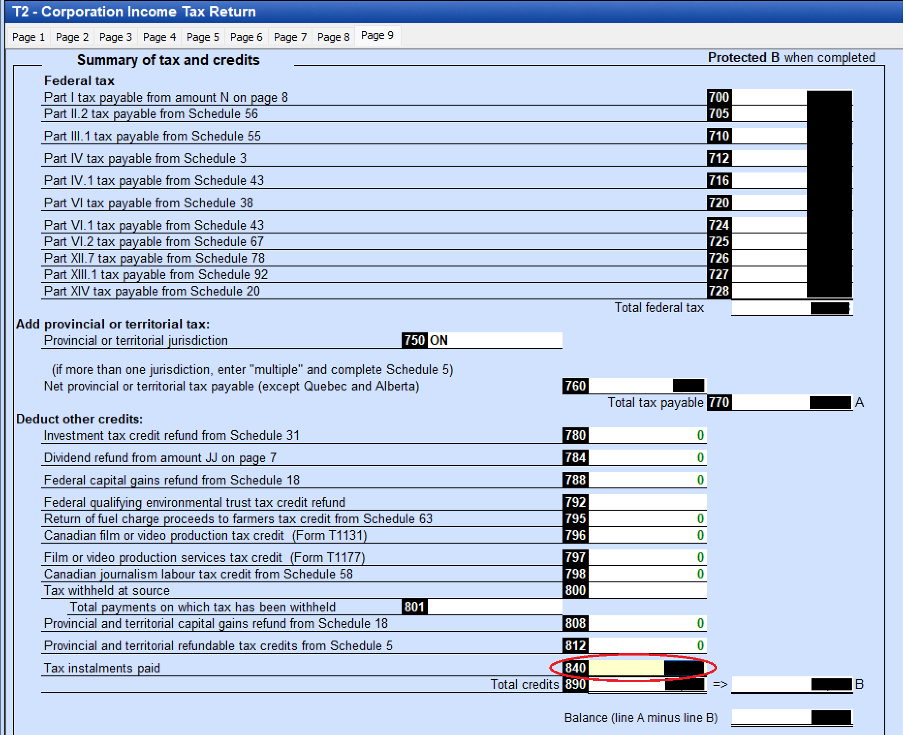

STATUS: AI GENERATED, REVIEW IN PROGRESS

# Payment

## Corporate Income Tax

The corp pays its T2 balance, and monthly or quarterly instalments toward it during the year.

- *Account*: the `RC` corporation-income-tax program account under the business number
- *Balance-due day*: the balance is due two months after the tax year-end, or three months for a CCPC that claims the small business deduction with taxable income within the business limit (ITA [s.248(1)](https://laws-lois.justice.gc.ca/eng/acts/I-3.3/section-248.html) "balance-due day")
- *Instalments*: monthly by default (ITA [s.157(1)](https://laws-lois.justice.gc.ca/eng/acts/I-3.3/section-157.html)); an eligible small CCPC may instead pay quarterly (s.157(1.1)) if it claims the SBD, keeps taxable income at $500,000 or less and taxable capital at $10 million or less across the associated group, and has a clean 12-month filing-and-remittance record
- *Instalment base*: base the instalments on the current year's estimated tax or on a prior-year instalment base (the canonical page sets out the one-year and two-year base methods)
- *No-instalment threshold*: instalments are not required when the year's total tax payable, or the first instalment base, is $3,000 or less (ITA [s.157(2.1)](https://laws-lois.justice.gc.ca/eng/acts/I-3.3/section-157.html)); pay the whole balance by the balance-due day instead
- *Interest*: deficient or late instalments carry instalment interest and a possible instalment penalty (s.163.1); an unpaid balance after the balance-due day accrues arrears interest, compounded daily at the prescribed rate
- *How*: My Business Account, an online-banking "Federal - Corporation Tax" payee, or a bank's business tax service; see [Payment methods](#payment-methods) below

See [filing deadlines and instalments](../../Overview/Small-Business-Tax.md#filing-deadlines-and-instalments) for the full computation.

When filing T2 taxes, enter the pre-paid instalments for them to count towards the balance:  
T2 (Corporate Income Tax Return) / Page 9 / Summary of tax and credits  
Deduct other credits / line 840 (Tax instalments paid)  

## HST

The corp remits the GST34 net tax for each reporting period: the Quick Method flat percentage of tax-inclusive revenue for this corp, or regular-method net tax (tax collected − input tax credits). The calculation and filing are in [HST](../../Operations/HST.md).

- *Account*: the `RT` program account under the business number
- *When*: an annual filer pays with the return, three months after fiscal year-end; an annual filer with net tax of $3,000 or more also pays *quarterly instalments* at one-quarter of the instalment base (the lesser of the prior year's net tax and the current year's estimate), reconciled on the year-end return (ETA s.237); see [filing deadlines](../../Overview/Small-Business-Tax.md#filing-deadlines-and-instalments)
- *Electronic*: a remittance of $10,000 or more must be paid electronically (ETA s.278(3)); electronic filing is mandatory for reporting periods beginning on or after 2024-01-01
- *How*: My Business Account, an online-banking "Federal - GST/HST" payee (banks list the return balance and the instalments as separate payees), or a bank's business tax service; see [Payment methods](#payment-methods) below

## Payroll Remittance

Source deductions apply only if the corp pays a *salary*; a corp that distributes only dividends has no payroll to remit. The salary-vs-dividend choice is in [Small Business Tax Overview](../../Overview/Small-Business-Tax.md#paying-yourself-salary-vs-dividends); the payroll concepts and bookkeeping are in [Payroll](../../Paying-Yourself/Payroll.md).

- *Account*: an `RP` payroll program account under the business number (format `…RP0001`)
- *What is remitted each period*: the employee's federal and provincial income tax, plus CPP (both the employee and employer halves, since the corp is the employer), plus EI where the employee is EI-insurable
  - An owner-manager controlling more than 40% of the voting shares is *not* EI-insurable on their own pay (Employment Insurance Act s.5(2)(b)), so a single-owner corp remits income tax and CPP only
- *2026 CPP*: 5.95% employee + 5.95% employer on pensionable earnings between the $3,500 basic exemption and the $74,600 YMPE (maximum $4,230.45 each half), plus *CPP2* at 4% each on earnings from $74,600 to the $85,000 YAMPE (maximum $416 each half); the corp remits both halves. Rates and limits change every January — check CRA's payroll deductions tables for the current year
- *Frequency*: most owner-managed CCPCs are *regular* (monthly) remitters, due by the *15th of the month following* the month the pay was made; a small or new employer with a low average monthly withholding and a clean compliance record can qualify as a *quarterly* remitter
- *Voucher*: remit against Form *PD7A* (Statement of Account for Current Source Deductions); if no salary was paid in a period, report a *nil remittance* by the due date through My Business Account or CRA's TeleReply line
- *Year-end*: issue a *T4* slip to the employee and file the *T4 Summary* with CRA by the last day of February; see [filing deadlines](../../Overview/Small-Business-Tax.md#filing-deadlines-and-instalments)
- *How*: My Business Account, an online-banking payroll source-deductions payee, or a bank's business tax service; see [Payment methods](#payment-methods) below

The withheld amounts sit in the `Employee deductions payable` (2627) control account until remitted; see [Ledger and Accounts](../../Bookkeeping/Ledger-And-Accounts.md).

## Payment Methods

- Scheduled from CRA My Business Account
  - Free, but takes 5 business days
- Some banks provide service to remit business taxes
  - The services typically come with a fee, but they can offer same-day processing
- Visa Debit
  - Might require calling bank to raise limit (possibly temporary)

