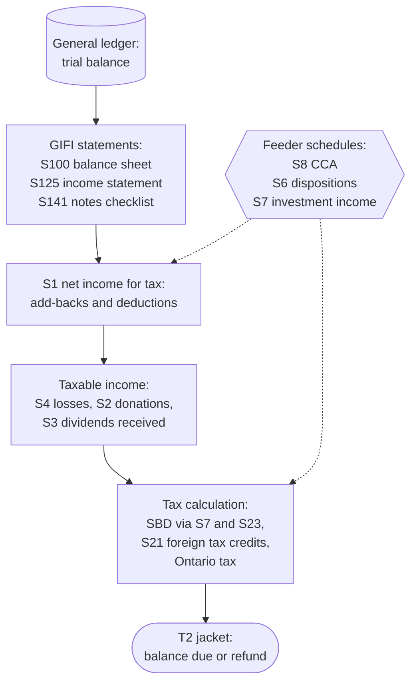

STATUS: AI GENERATED, REVIEW IN PROGRESS

# T2 Schedules

**Who this is for**:
- Owners of a Canadian-controlled private corporation (CCPC) assembling or reviewing the annual T2 package
- Wanting one map of which schedules exist, when each applies, and where this guide works it

**TLDR**:
- The T2 return is the *jacket* (form T2) plus schedules; T2 software selects most schedules from the data entered, but the map catches what the software was never told
- A service or consulting CCPC files the same core every year: the GIFI statements (S100, S125, S141), the book-to-tax reconciliation (S1), CCA (S8), shareholder information (S50), and GRIP (S53)
- A corporate investment account adds S3, S6, S7, and S21; events add the rest — S4 in a loss year, S2 for donations, S24 and S101 with the first return
- ERDTOH/NERDTOH continuity is on the jacket itself, not a schedule
- Schedule numbers are stable; line numbers drift between form versions, so verify any line reference against the current-year form

Limitations:
- Coverage is what an owner-managed service or consulting CCPC (with a corporate investment account) plausibly files; the full T4012 list runs to some fifty schedules and the rest get one line here
- Ontario is the provincial context; Quebec (CO-17) and Alberta (AT1) file separate provincial returns and are out of scope
- This page is the map: the mechanics of each schedule live on the linked pages
- The following is my understanding as of 2026

## Return Assembly

The return computes in layers, and the schedules are the layers:
- The books produce the *GIFI* financial statements (S100, S125); paper financial statements are not filed — GIFI is their replacement (see [Bookkeeping, the general ledger, and GIFI](../Overview/Small-Business-Tax.md#bookkeeping-the-general-ledger-and-gifi))
- S1 converts accounting net income to *net income for tax purposes* (add back what the books deducted but tax does not allow, deduct what tax allows but the books did not)
- The taxable-income section of the jacket then subtracts carryovers and special deductions (losses, donations, the s.112 deduction for dividends received)
- The tax calculation applies rates and credits, and the jacket nets instalments against the result

Everything on the schedules is in whole dollars (see [Whole-dollar rounding](Whole-Dollar-Rounding.md)).  
T2 software generates the schedule set from the data entered; the failure mode is not a mis-filed schedule but a missing one — income or an event the software was never told about.  

## The T2 Jacket

The jacket (form T2, nine pages) is the return proper; everything else attaches to it:
- *Identification*: name, BN, year-end, the CCPC box, and the yes/no questions — including whether specified foreign property exceeded $100,000 (which commits the corporation to a [T1135](../Investments/T1135.md))
- *Taxable income*: the assembly line from S1's net income through the loss and donation deductions
- *Small business deduction*: the SBD calculation sits on the jacket, fed by S7's active/investment split and any S23 allocation
- *Refundable taxes*: the ERDTOH and NERDTOH continuity and the dividend refund are jacket lines, not a schedule (see [ERDTOH and NERDTOH](../Paying-Yourself/Dividends/ERDTOH-NERDTOH.md)); Part IV tax feeds in from S3
- *Balance*: federal and Ontario tax, minus instalments, gives the balance due or refund (see [Filing deadlines and instalments](../Overview/Small-Business-Tax.md#filing-deadlines-and-instalments))

## Every-Year Schedules

Filed with essentially every return of an owner-managed CCPC:

| Schedule | Title | When it applies | Details |
|---|---|---|---|
| S100 | Balance Sheet Information | always | [Ledger and Accounts](../Bookkeeping/Ledger-And-Accounts.md) |
| S125 | Income Statement Information | always | [Expense Classification](../Bookkeeping/Expense-Classification.md), [Ledger and Accounts](../Bookkeeping/Ledger-And-Accounts.md) |
| S141 | Notes Checklist | always, with the GIFI statements | below |
| S1 | Net Income (Loss) for Income Tax Purposes | whenever book and tax differ — in practice always | below |
| S8 | Capital Cost Allowance | any depreciable property on the books | [CCA — Bookkeeping and T2 schedules](../Operations/Cost-Recovery/Capital-Cost-Allowance/Capital-Cost-Allowance.md#bookkeeping-and-t2-schedules) |
| S50 | Shareholder Information | any shareholder holding 10% or more | below |
| S53 | General Rate Income Pool (GRIP) Calculation | any year an eligible dividend is paid or GRIP changes | [T2 reporting — Schedule 53](../Paying-Yourself/Dividends/T2-Reporting.md#schedule-53---grip-calculation) |

*S1* is the spine of the tax side:
- Recurring add-backs for this guide's scenarios: book amortization (CCA replaces it), the non-deductible half of [meals](../Bookkeeping/Expense-Classification.md), arrears interest and penalties (see [CRA Administration](CRA-Administration.md#booking-the-tax-cycle)), the foreign-tax add-back behind [T3 Box 34](../Investments/T3/T3_Box-25-Foreign-Income_Box-34-Foreign-Tax-Withheld.md)
- Recurring deductions: CCA from S8, the non-taxable half of capital gains booked in full (see [T5008](../Investments/T5008/T5008.md))
- Tax-basis books keep S1 short; that is much of their appeal (see [Ledger and Accounts](../Bookkeeping/Ledger-And-Accounts.md))

*S50* lists every shareholder holding 10% or more of any class: name, SIN (or BN for a corporate shareholder), and percentage of common and preferred shares.  
For a single-owner corporation it is one row that never changes, but it is still filed each year.  

*S141* describes the financial statements behind the GIFI: who prepared them (owner, or an accountant on a compilation, review, or audit engagement) and the accountant's involvement.  
Self-prepared statements are a legitimate answer for an owner-managed corporation; answer it accurately rather than aspirationally.  

## Investment-Income Schedules

Triggered by the corporate investment account (see [Active vs investment income](../Overview/Small-Business-Tax.md#active-vs-investment-income)):

| Schedule | Title | When it applies | Details |
|---|---|---|---|
| S3 | Dividends Received, Taxable Dividends Paid, and Part IV Tax Calculation | dividends received (Part IV tax) or paid | receiving: [T5](../Investments/T5/T5.md), [T3](../Investments/T3/T3.md); paying: [T2 reporting — Schedule 3](../Paying-Yourself/Dividends/T2-Reporting.md#schedule-3---dividends-paid-section) |
| S6 | Summary of Dispositions of Capital Property | any capital disposition — securities, FX on capital account, capital gains dividends | [T5008](../Investments/T5008/T5008.md), [Foreign Currency](../Bookkeeping/Foreign-Currency.md), [T5 Box 18](../Investments/T5/T5-Box-18-Capital-Gains-Dividends.md) |
| S7 | Aggregate Investment Income and Income Eligible for the Small Business Deduction | any investment income; splits AII from active income | [T5 — Interest Box 13](../Investments/T5/T5.md#interest---box-13), [ERDTOH and NERDTOH](../Paying-Yourself/Dividends/ERDTOH-NERDTOH.md) |
| S21 | Federal and Provincial or Territorial Foreign Income Tax Credits | foreign withholding tax to credit | [T3 Box 25 / Box 34](../Investments/T3/T3_Box-25-Foreign-Income_Box-34-Foreign-Tax-Withheld.md) |
| S55 | Part III.1 Tax on Excessive Eligible Dividend Designations | only when eligible dividends were designated beyond GRIP | [T2 reporting — Schedule 55](../Paying-Yourself/Dividends/T2-Reporting.md#schedule-55---part-iii1-tax-on-excessive-eligible-dividend-designations) |

S7 does double duty: it computes the *aggregate investment income* that drives the refundable tax and the passive-income grind of the business limit, and the income eligible for the SBD.  
The slip-to-schedule mapping (which T3/T5 box lands on which schedule) is diagrammed on [T5](../Investments/T5/T5.md#t5-boxes) and worked box-by-box on the T3 and T5 pages.  

## Event-Driven Schedules

Filed in the years something happens:

| Schedule | Title | When it applies | Details |
|---|---|---|---|
| S4 | Corporation Loss Continuity and Application | a loss arises, carries back, or carries forward | [Losses](Losses.md) |
| S2 | Charitable Donations and Gifts | a donation deduction is claimed | [Donations](../Operations/Donations.md) |
| S13 | Continuity of Reserves | a reserve is claimed (doubtful debts, unearned amounts) | [Receivables and Bad Debts](../Operations/Receivables-And-Bad-Debts.md), [Deferred Revenue](../Operations/Deferred-Revenue.md) |
| S24 | First-time Filer after Incorporation, Amalgamation, or Winding-up | the first T2 | [Starting Up](../Corporate-Lifecycle/Starting-Up.md) |
| S101 | Opening Balance Sheet Information | the first T2's opening GIFI | [Starting Up — Funding the corporation](../Corporate-Lifecycle/Starting-Up.md#funding-the-corporation) |
| S9 | Related and Associated Corporations | a second corporation enters the picture | [Corporate Structure](../Corporate-Lifecycle/Corporate-Structure/Corporate-Structure.md) |
| S23 | Agreement Among Associated CCPCs to Allocate the Business Limit | associated CCPCs share the $500,000 limit | [Small Business Tax Overview](../Overview/Small-Business-Tax.md#what-is-corporate-tax) |
| S44 | Non-Arm's Length Transactions | property acquired from a non-arm's-length person on a rollover basis (e.g. s.85) | [Starting Up — Bringing in assets](../Corporate-Lifecycle/Starting-Up.md#bringing-in-assets), [Business Acquisition](../Corporate-Lifecycle/Business-Acquisition/Business-Acquisition.md) |
| S11 | Transactions with Shareholders, Officers, or Employees | certain owner-corporation property transactions | [Owner-corporation transactions](../Paying-Yourself/Owner-Corporation-Transactions.md) |

*S2* tracks corporate donations like S4 tracks losses:
- The deduction (not a credit, at the corporate level) is capped at 75% of net income; the excess carries forward 5 years (see [Donations](../Operations/Donations.md))

*S13* carries the reserve continuity year over year:
- Reserves let recognized-but-uncollected or received-but-unearned amounts defer: doubtful accounts receivable (ITA s.20(1)(l), see [Receivables and Bad Debts](../Operations/Receivables-And-Bad-Debts.md)) and prepaid-but-undelivered revenue (s.20(1)(m), see [Deferred Revenue](../Operations/Deferred-Revenue.md))
- Each reserve reverses into income the next year and is re-claimed at the new balance, so the schedule shows opening, closing, and the swing

A wind-up year files the same package one last time, plus the clearance machinery around it (see [Winding Down](../Corporate-Lifecycle/Winding-Down.md)).  

## Ontario Schedules

Ontario corporate tax has been administered by CRA within the T2 since 2009; there is no separate Ontario return:
- *S500* (Ontario Corporation Tax Calculation): the Ontario rates and the Ontario small-business deduction; T2 software generates it for any corporation taxable in Ontario
- *S5* (Tax Calculation Supplementary — Corporations): needed only with a permanent establishment in more than one province or with provincial credits to claim; a one-province Ontario corporation without credits typically does not file it
- The old Ontario annual-return schedules (S546/S547) were retired in 2021: the corporate-registry annual return is now filed in the Ontario Business Registry, separate from the T2 (see [Starting Up — First-year clocks](../Corporate-Lifecycle/Starting-Up.md#first-year-clocks))

## Rarely Applicable Schedules

One line each, so the names are recognizable when software or a checklist mentions them:

| Schedule | Title | Why it is rare here |
|---|---|---|
| S10 | Cumulative Eligible Capital Deduction | repealed regime; replaced in 2017 by CCA Class 14.1 (see [CCA Classification](../Operations/Cost-Recovery/Capital-Cost-Allowance/CCA-Classification.md)) |
| S27 | Manufacturing and Processing Profits Deduction | manufacturers only |
| S31 | Investment Tax Credit — Corporations | SR&ED and other ITCs; specialized claims |
| S33 | Taxable Capital Employed in Canada — Large Corporations | taxable capital of $10M or more; also where the capital-based grind of the business limit starts |
| S19 | Non-Resident Shareholder Information | a non-resident holds shares |
| S29 | Payments to Non-Residents | rents, royalties, or fees paid to non-residents (withholding territory) |
| S54 | Low Rate Income Pool (LRIP) Calculation | non-CCPCs; the CCPC analogue is GRIP on S53 |
| S88 | Internet Business Activities | income earned from websites the corporation runs; a brochure site alone does not appear to trigger it |

## Forms Filed Alongside the T2

Not schedules, but part of the same season:
- *T1135* (Foreign Income Verification Statement): its own return with its own penalty, due with the T2; see [T1135](../Investments/T1135.md)
- *T2054* (capital dividend election): filed when the dividend is elected, not with the T2; see [T2 reporting — Form T2054](../Paying-Yourself/Dividends/T2-Reporting.md#capital-dividend-election---form-t2054)
- *T183 CORP*: authorizes an outside preparer to e-file the return; most corporations are required to file electronically
- *T106* (non-arm's-length transactions with non-residents) and *T1134* (foreign affiliates): out of scope for this guide's scenarios
- The GIFI itself is documented in CRA guide RC4088, the source of the account names in [Ledger and Accounts](../Bookkeeping/Ledger-And-Accounts.md)

## Related

- [Small Business Tax Overview](../Overview/Small-Business-Tax.md)
- [Investments](../Investments/Investments.md) (the investing cycle behind S3, S6, S7, and S21)
- [Ledger and Accounts](../Bookkeeping/Ledger-And-Accounts.md)
- [Expense Classification](../Bookkeeping/Expense-Classification.md)
- [Whole-dollar rounding](Whole-Dollar-Rounding.md)
- [Capital Cost Allowance](../Operations/Cost-Recovery/Capital-Cost-Allowance/Capital-Cost-Allowance.md)
- [Losses](Losses.md)
- [T2 reporting](../Paying-Yourself/Dividends/T2-Reporting.md) (S3, S53, S55 in depth)
- [ERDTOH and NERDTOH](../Paying-Yourself/Dividends/ERDTOH-NERDTOH.md)
- [T3](../Investments/T3/T3.md), [T5](../Investments/T5/T5.md), [T5008](../Investments/T5008/T5008.md) (slip-to-schedule mapping)
- [T1135](../Investments/T1135.md)
- [Starting Up](../Corporate-Lifecycle/Starting-Up.md), [Winding Down](../Corporate-Lifecycle/Winding-Down.md)
- [CRA Administration](CRA-Administration.md)

## Citations

- CRA T4012 - T2 Corporation Income Tax Guide (the schedule-by-schedule reference): https://www.canada.ca/en/revenue-agency/services/forms-publications/publications/t4012.html
- CRA - T2 returns and schedules (index of all current schedules): https://www.canada.ca/en/revenue-agency/services/forms-publications/t2-returns-schedules.html
- CRA RC4088 - General Index of Financial Information (GIFI): https://www.canada.ca/en/revenue-agency/services/forms-publications/publications/rc4088.html
- Individual schedule pages are cited on the linked detail pages (S3/S53/S55 on [T2 reporting](../Paying-Yourself/Dividends/T2-Reporting.md), S4 on [Losses](Losses.md), S8 on [CCA](../Operations/Cost-Recovery/Capital-Cost-Allowance/Capital-Cost-Allowance.md), S100/S125 on [Ledger and Accounts](../Bookkeeping/Ledger-And-Accounts.md))

## TODO

- Verify S141's current title and content against the latest revision (the form was revised recently; confirm "Notes Checklist" is still the official name and whether the preparer questions changed)
- Verify the Ontario pair: whether S500 is filed by every Ontario-taxable corporation or only in specific cases, and the exact S5 trigger conditions
- Verify the S50 threshold wording (10% of any class of shares) and what identifiers the current form requires
- Verify the S44 trigger list (which rollover provisions require it) and whether an s.85 incorporation transfer files it in addition to the T2057 election
- Verify S11's current status and trigger conditions; it is the least-documented schedule in this list
- Confirm the jacket's yes/no question line numbers (the T1135 question in particular, coordinating with the [T1135](../Investments/T1135.md) TODO)
- Confirm the mandatory electronic-filing rule and its exceptions for the current year
- Consider a redacted screenshot set (S50, S141) once available; move the page into a `T2-Schedules/` folder when media lands
