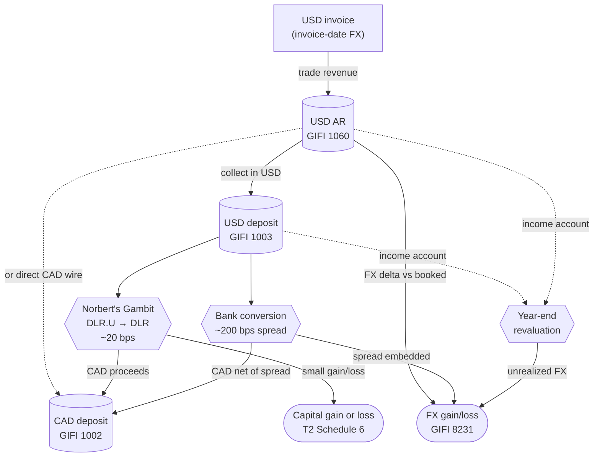

STATUS: AI GENERATED, REVIEW IN PROGRESS

# Foreign Currency

**Who this is for**: owners of a Canadian-controlled private corporation (CCPC) who hold a USD bank account, invoice US customers in USD, hold USD-denominated investments, or convert between CAD and USD.  

**TLDR**:
- The corporation reports in CAD by default; foreign-currency-native accounts (USD bank, USD AR) are translated at year-end to populate Schedule 100 in CAD
- *Bank of Canada* (BoC) single daily exchange rate is the conventional source; the corp's bank's actual settlement rate is also acceptable if applied consistently
- FX rate convention follows the *transaction date*: invoice date for revenue, trade date for securities and commissions, payment date for distributions, year-end closing rate for revaluation of *monetary items*
- FX gains and losses split into *income account* (operating receivables, payables, cash from operations) and *capital account* (foreign securities, USD held to acquire securities); the character follows the underlying transaction
- This page uses a *multi-currency native* bookkeeping convention: each ledger account has one native currency, cross-currency entries split into a CAD leg and a USD leg with `FX gain/loss - CAD` (8231-1) and `FX gain/loss - USD` (8231-2) as per-currency bridge accounts; year-end revaluation translates the USD-native accounts at the closing rate and the net of 8231-1 + 8231-2 (translated) is the period's FX gain or loss on Schedule 125 GIFI 8231
- Bank CAD↔USD conversion bakes a 1.5%–3% spread into the rate; the spread surfaces as an FX loss at period-end revaluation
- *Norbert's Gambit* via *DLR* / *DLR.U* on the TSX moves USD↔CAD at ~10–30 basis points all-in instead of the bank's ~200 bp spread; the round trip is a securities disposition reported on Schedule 6
- Invoices to a non-resident US customer for services are *zero-rated* GST/HST under the Excise Tax Act, Schedule VI, Part V; see [HST](HST.md) for the full mechanics

Limitations:
- Focus is on CAD↔USD for a typical owner-managed CCPC consultant or investor; other currency pairs (EUR, GBP, etc.) follow the same mechanics by analogy but specific rates and broker products differ
- *Functional currency* election (ITA s.261) is mentioned once and excluded from scope; it is a multinational filing aimed at corporations whose primary books-and-records currency is not CAD
- Foreign-securities tax slips (T3 Box 25/34 foreign-income, foreign tax credit on Schedule 21) and ACB mechanics live in [T3](T3/T3.md) and [Adjusted Cost Base](Adjusted-Cost-Base/Adjusted-Cost-Base.md); this page covers only the FX-conversion layer
- *Hedging* (forward contracts, currency swaps) and derivative tax mechanics are out of scope
- Broker support for Norbert's Gambit changes; named brokers below reflect their 2026 state and should be re-verified before relying on them
- Tax information can change over time (e.g. the capital gains inclusion rate was going to increase to 2/3, before the proposal was cancelled)
- The following is my understanding as of 2026

## Reporting currency and exchange-rate sources

The Income Tax Act presumes a Canadian-resident corporation reports in Canadian dollars.  
Foreign-currency amounts are converted to CAD at the rate prevailing on the transaction date (ITA [s.261(2)](https://laws-lois.justice.gc.ca/eng/acts/I-3.3/section-261.html); CRA Income Tax Folio S5-F4-C1).  

Acceptable sources for the exchange rate, applied consistently across the year:
- *Bank of Canada single daily exchange rate*: published once per business day by approximately 16:30 ET, replacing the legacy noon rate that was discontinued on 2017-03-01; the BoC describes these as *indicative rates* based on aggregated market quotes and CRA folio S5-F4-C1 names them as the default rate for post-2017-02-28 conversions
- *Year-average BoC rate*: CRA folio S5-F4-C1 accepts an annual average for income-account items where the rate does not fluctuate significantly through the year; used as a simplification when the per-transaction rate is impractical
- The corp's *bank's actual settlement rate* on the transaction: acceptable when the bank statement shows the CAD and USD legs of an actual conversion; the only rate that reflects what actually happened in the account
- Other commercial sources (Bloomberg, Reuters, OANDA), applied consistently
- For a small CCPC the practical convention is: BoC daily rate for accruals, year-end revaluations, and ACB; the bank's actual settlement rate for any CAD↔USD conversion the bank itself performed

The *functional currency election* under ITA [s.261(3)](https://laws-lois.justice.gc.ca/eng/acts/I-3.3/section-261.html) lets a corporation file its T2 in USD, EUR, GBP, AUD, or JPY when that currency is the corporation's *primary* books-and-records currency.  
The election is available only to a corporation resident in Canada that is *not* an investment corporation, mortgage investment corporation, or mutual fund corporation.  
It is filed on Form T1296 no later than 60 days after the first day of the first tax year for which it applies.  
For a typical owner-managed CCPC operating in Canada with CAD bank accounts and Canadian customers, the election is not available because CAD remains the primary currency; out of scope here.  

## When to use which rate

CRA Income Tax Folio S5-F4-C1 lets a corporation pick any consistent and appropriate method for income-account items (current-rate / accrual, settlement, fixed-rate, or average-rate).  
This guide uses the *transaction-date* method throughout, applied per-event as listed below.  

The rate-by-event convention used throughout this guide, with cross-links to where each rule is applied:

- *Trade date*: securities purchases, sales, and commissions ([Adjusted Cost Base](Adjusted-Cost-Base/Adjusted-Cost-Base.md))
- *Payment date*: investment distributions including ROC, dividends, and reinvested or phantom amounts ([T3](T3/T3.md))
- *Invoice date*: revenue recognized on a USD-denominated invoice issued to a customer
- *Bill date*: expense or payable recognized on a USD-denominated invoice received from a supplier
- *Settlement date*: bank's actual conversion rate on the CAD-side of a cross-currency cash settlement (e.g. the bank converts an incoming USD wire directly to CAD on receipt; or a USD payment funded from a CAD account)
- *Year-end closing rate*: revaluation of unsettled foreign-currency *monetary items* (cash, receivables, payables) for Schedule 100 and Schedule 125 reporting
- *Average annual rate*: only used under a full-translation accounting methodology; rarely applied by a small CCPC because each transaction is already converted at its own date rate

A *monetary item* is a unit of currency or an obligation to deliver a fixed or determinable number of units of currency: cash, receivables, payables, debt instruments.  
A *non-monetary item* is everything else: inventory, capital assets, prepaid expenses, equity securities.  
The year-end-revaluation rule applies only to monetary items; non-monetary items stay at the historical CAD figure recorded on acquisition.  

## Capital-account vs income-account FX

This is the load-bearing distinction in foreign-currency tax: every FX gain or loss has a character that follows the underlying transaction.  

*Income-account FX*:
- Arises from ordinary business operations: USD trade receivables, USD operating cash from invoicing, USD payables to suppliers, USD operating expenses
- Fully includable in income in the year recognized (no inclusion-rate halving)
- CRA accepts the *accrual basis*: revalue monetary items at year-end and recognize the resulting unrealized FX gain or loss in income (CRA archived bulletin [IT-95R](https://www.canada.ca/en/revenue-agency/services/forms-publications/publications/it95r/archived-foreign-exchange-gains-losses.html), paragraph 8)
- Reported on Schedule 125 under `Realized gains/losses on foreign exchange` (GIFI 8231)

*Capital-account FX*:
- Arises from dispositions of *capital property*: foreign securities, USD held in an investment account to acquire securities, settlement of a foreign-currency capital obligation
- 50% inclusion rate (ITA [s.38](https://laws-lois.justice.gc.ca/eng/acts/I-3.3/section-38.html)); recognized only on disposition (ITA [s.39(2)](https://laws-lois.justice.gc.ca/eng/acts/I-3.3/section-39.html)), not on year-end revaluation (IT-95R paragraph 9)
- "Disposition" of foreign currency includes converting it to CAD, using it to pay a CAD obligation, transferring it to a third currency, or using it to acquire property
- Reported on Schedule 6 (Summary of Dispositions of Capital Property); reconciled through Schedule 1 in the usual capital-gains accounting-to-tax pattern (full accounting gain or loss removed, the taxable half from Schedule 6 added back)

The $200 personal FX de minimis under ITA [s.39(1.1)](https://laws-lois.justice.gc.ca/eng/acts/I-3.3/section-39.html) applies only to *individuals*.  
A corporation has no de minimis: every capital-account FX gain or loss, however small, is reportable on Schedule 6.  

Which side of the line a given USD balance sits on:
- USD operating cash from US-client invoicing → *income account* (revalue at year-end)
- USD operating cash used to pay USD suppliers → *income account*
- USD cash sitting in a corporate trading account waiting to buy USD securities → *capital account* (no year-end revaluation)
- USD-denominated long-term debt the corp issued → *capital account*

For a typical owner-managed CCPC consultant, almost all USD activity is income-account; capital-account FX appears only on disposition of USD securities and is handled through the ACB workflow.

## Multi-currency bookkeeping convention

The worked examples on this page use a *multi-currency native* convention: each ledger account has a single native currency, cross-currency transactions split into a CAD leg and a USD leg with separate FX bridge accounts per currency, and FX gain or loss is recognized at period-end revaluation rather than at each settlement.  
This is what GnuCash, Xero, and QuickBooks Multi-Currency produce natively, and it keeps each bank account and AR balance in the currency the underlying account actually holds.  

The equivalent *single-currency translated* form (every account holds CAD figures, foreign-currency amounts translated at the transaction-date rate) is also CRA-acceptable and produces identical T2 figures when applied correctly; the choice between the two is a bookkeeping representation, not a tax-method choice.  

How it works:
- Each ledger account has a single native currency; CAD-native accounts hold CAD, USD-native accounts hold USD, and the two never mix within a single account
- Cross-currency transactions split into two legs, each balancing within its own currency, with `FX gain/loss - CAD` (8231-1) and `FX gain/loss - USD` (8231-2) acting as the per-currency bridge
- Same-currency transactions (USD payment closing a USD receivable; CAD payment from `Deposits` to a Canadian supplier) are pure-currency entries with no FX bridge
- Investment accounts stay *CAD-native* even when the underlying security trades in USD: ACB is defined in ITA [s.54](https://laws-lois.justice.gc.ca/eng/acts/I-3.3/section-54.html) and, for a Canadian-resident corporation reporting in CAD under [s.261](https://laws-lois.justice.gc.ca/eng/acts/I-3.3/section-261.html), the figure is CAD-denominated; the investment ledger account holds the CAD ACB and subsequent USD/CAD movement affects the cash side (`Deposits - USD`) instead of the investment side
- Period-end revaluation: translate every foreign-currency-native account balance to CAD at the closing BoC rate; the net of (8231-1 in CAD + 8231-2 translated to CAD at the closing rate) is the FX gain or loss for the period and flows to Schedule 125 GIFI 8231

The `FX gain/loss` sub-accounts (8231-1, 8231-2) accumulate per-currency positions through the year and are not separately reported; both roll up to a single GIFI 8231 line on Schedule 125 after the period-end translation.  

## GIFI mapping

Account codes used through the worked examples below.  
Internal codes carry a `-N` suffix (matching the convention in [T3](T3/T3.md)); the GIFI rollup at year-end is the parent code without the suffix.  

<table>
  <thead>
    <tr><th>Internal code</th><th>Account</th><th>Currency</th><th>GIFI rollup</th></tr>
  </thead>
  <tbody>
    <tr><td>1002-1</td><td>Deposits</td><td>CAD</td><td>1002 (Deposits in Canadian banks - Canadian currency)</td></tr>
    <tr><td>1002-2</td><td>Deposits - investment</td><td>CAD</td><td>1002 (cash sitting in a CAD investment account; per <a href="T3/T3.md">T3</a>)</td></tr>
    <tr><td>1002-3</td><td>Deposits - USD</td><td>USD</td><td>1003 (Deposits in Canadian banks - foreign currency)</td></tr>
    <tr><td>1060-1</td><td>Accounts receivable - CAD</td><td>CAD</td><td>1060</td></tr>
    <tr><td>1060-2</td><td>Accounts receivable - USD</td><td>USD</td><td>1060 (at closing BoC rate at year-end)</td></tr>
    <tr><td>2303-1</td><td>Investments - DLR/DLR.U</td><td>CAD</td><td>2303 (Canadian shares; ACB-denominated in CAD even when traded in USD)</td></tr>
    <tr><td>8000</td><td>Trade sales of goods and services</td><td>CAD</td><td>8000</td></tr>
    <tr><td>8211-1</td><td>Disposition of capital property</td><td>CAD</td><td>8211 (per <a href="T3/T3.md">T3</a>)</td></tr>
    <tr><td>8231-1</td><td>Foreign exchange gain/loss - CAD</td><td>CAD</td><td>8231 (net with 8231-2 at closing rate)</td></tr>
    <tr><td>8231-2</td><td>Foreign exchange gain/loss - USD</td><td>USD</td><td>8231 (net with 8231-1; translated at closing BoC rate)</td></tr>
    <tr><td>8710</td><td>Interest and bank charges</td><td>CAD</td><td>8710</td></tr>
  </tbody>
</table>

Notes on the codes:
- GIFI 1003 captures USD deposits at a Canadian bank; GIFI 1004 (foreign bank, CAD) and 1005 (foreign bank, foreign currency) are reserved for accounts at foreign banks and are not in scope here
- GIFI 8231 covers realized and unrealized FX on income-account monetary items; do not confuse with GIFI 8210 (the broader realized-gains-on-disposal-of-assets line); 8231 is the FX-specific line on Schedule 125
- Splitting `FX gain/loss` into 8231-1 (CAD-native) and 8231-2 (USD-native) is what makes the trading-account convention work; both roll up to GIFI 8231 at year-end
- For broader account-tree conventions (investment accounts, withholding taxes, GIFI rollups), see [T3](T3/T3.md)

## Bank conversions and the embedded spread

When a bank converts CAD↔USD, the rate it applies is worse than the mid-market spot rate.  
The difference between the BoC mid-rate and the rate the bank used is the *implicit spread*; this is how the bank earns on the conversion.  

This section covers the simplest case: a plain CAD↔USD transfer between two accounts at the same bank.  
The more involved case of a USD wire from a customer landing in the CAD account (which combines bank conversion with closing out a USD receivable) is covered in [Getting paid in USD](#getting-paid-in-usd-invoicing-us-clients) below.  

Bookkeeping treatment under the multi-currency convention:
- The transfer is an FX event between a CAD-native account and a USD-native account; each currency leg balances independently using `FX gain/loss - CAD` (8231-1) and `FX gain/loss - USD` (8231-2) as the per-currency bridge
- No FX gain or loss is recognized at the moment of transfer; the trading accounts accumulate the per-currency positions until period-end revaluation translates them at the closing BoC rate
- The implicit spread surfaces at period-end revaluation; until then the bank's actual settlement rate is the effective "cost" of the USD position

Explicit fees the bank shows as separate line items:
- Wire-in fee (e.g. $15 to receive an international wire)
- Wire-out fee (e.g. $30 to send an international wire)
- Currency-conversion fee shown as a distinct line on the statement (less common)
- All of these are bookable: debit `Interest and bank charges` (8710, CAD), credit `Deposits` (1002-1) or `Deposits - USD` (1002-3) in the matching currency

Typical CAD↔USD conversion spreads observed in practice (rough magnitudes; verify against your own bank's posted rates):
- Big-bank retail conversion at a branch teller: 2.0%–3.0% from mid-rate
- Big-bank business banking USD↔CAD conversion: 1.5%–2.0%
- Specialty FX services (Wise, OFX): 0.4%–1.0%
- Norbert's Gambit through a discount broker (see next section): 10–30 basis points all-in
- Interactive Brokers desk FX (FXCONV / IDEALPRO): ~1 basis point plus a small minimum commission

Worked example — internal CAD → USD transfer between two accounts at the same bank:
- Setup: corp moves CAD 10,000 from `Deposits` (1002-1, CAD-native) to `Deposits - USD` (1002-3, USD-native) at the same Canadian bank on Apr 20
- BoC mid-rate that day is 1.36 (mid-implied USD value of CAD 10,000 ≈ USD 7,352.94)
- The bank credits the USD side with USD 7,210; effective bank rate 1.3870 CAD/USD, about a 2.0% spread vs the BoC mid
- Ledger entry — each currency leg balances independently:
  - CAD-side (balances within CAD):
    - Credit `Deposits` (1002-1): CAD 10,000
    - Debit `FX gain/loss - CAD` (8231-1): CAD 10,000
  - USD-side (balances within USD):
    - Debit `Deposits - USD` (1002-3): USD 7,210
    - Credit `FX gain/loss - USD` (8231-2): USD 7,210
- No FX gain or loss is recognized at this point; both trading accounts now hold per-currency positions (8231-1 carries CAD 10,000 debit; 8231-2 carries USD 7,210 credit)
- The implicit spread of ~CAD 194 surfaces at period-end revaluation:
  - If year-end BoC rate is 1.36 and the USD 7,210 is still held, translate 8231-2 at 1.36: USD 7,210 × 1.36 = CAD 9,805.60 credit
  - Net of 8231 at year-end: CAD 10,000 debit (8231-1) − CAD 9,805.60 credit (8231-2 translated) = CAD 194.40 debit (net FX loss)
  - This CAD 194.40 flows to Schedule 125 GIFI 8231 as the period's FX gain or loss

## Norbert's Gambit: USD ↔ CAD via DLR / DLR.U

*Norbert's Gambit* is a technique for converting USD↔CAD at low cost through interlisted securities on the TSX.  
The standard vehicle is *DLR* (CAD-listed) and *DLR.U* (USD-listed): two listings of the same fund, with the same CUSIP, distinguished only by the currency of the cash leg.  

### Mechanism

The fund:
- *Global X US Dollar Currency ETF* (rebranded from Horizons in 2024), tickers DLR (TSX, CAD) and DLR.U (TSX, USD)
- Holds USD T-bills and a USD high-interest-savings ETF; unit value tracks USD/CAD mechanically
- Management expense ratio ~0.57% (annualized; only meaningful if held long-term; immaterial for an overnight Gambit)

The trade sequence for USD → CAD (the typical corporate use case for moving US-client invoice proceeds back to CAD):
1. With USD cash in the brokerage account, buy DLR.U (USD-listed); the trade settles T+1
2. Journal the DLR.U units to the CAD side, where they become DLR units (same security, same CUSIP; the journal is an internal broker bookkeeping entry, not a market transaction)
3. Sell DLR for CAD; the sale settles T+1
4. CAD proceeds appear in the CAD side of the brokerage account

The trade sequence for CAD → USD is the mirror: buy DLR with CAD, journal to USD side, sell DLR.U for USD.  

Settlement timing:
- Equities in Canada moved from T+2 to *T+1 settlement* on 2024-05-27
- Brokers that auto-journal (RBC Direct Investing, BMO InvestorLine) let you initiate the second leg the same day as the first; the journal reconciles on the back end
- Brokers that require a phone call or secure message typically settle the round trip over 2 business days

### Broker support

Broker-specific Gambit support shifts over time; the table below reflects publicly documented behaviour as of 2026 and should be re-verified with the broker's current FAQ before relying on it.

- *RBC Direct Investing*: automatic via the "Sell in USD" option when selling DLR; free; round-trip usually same-day
- *BMO InvestorLine*: automatic; free; reconciled the next business day
- *CIBC Investor's Edge*: online request; free; settles 1–3 business days
- *TD Direct Investing*: online via Securities Transfers; free; some users still rely on secure-message workflow
- *Scotia iTrade*: phone or secure message; free; not permitted in registered accounts
- *National Bank Direct Brokerage*: online journal; ~$9.95 plus tax journal fee; $0 trading commission on stocks and ETFs
- *Questrade*: online journal portal since 2025-01-31; ~$9.95 plus tax journal fee (waived with Questrade Plus); $0 trading commission
- *Wealthsimple*: Norbert's Gambit in beta as of 2026; confirm corporate-account availability with the broker before assuming support
- *Interactive Brokers Canada*: direct interbank FX through FXCONV / IDEALPRO at ~1 basis point with a ~$2 minimum is cheaper than the Gambit; use that instead unless you need the cash in another broker

### Tax characterization

The Gambit round trip is a *securities disposition*, not an income-account currency conversion:
- DLR and DLR.U are *identical property* under ITA [s.47(1)](https://laws-lois.justice.gc.ca/eng/acts/I-3.3/section-47.html); the ACB is pooled and computed in CAD
- The ACB of the DLR.U leg is the CAD equivalent of the USD purchase price at the *trade-date* BoC rate, consistent with the convention used elsewhere in this guide for securities
  - CRA technical interpretation 2015-0588981C6 (a transcribed APFF Roundtable position, persuasive rather than binding) instead points to the *settlement-date* rate for FX on a disposition; this guide stays on trade-date for consistency with the [Adjusted Cost Base](Adjusted-Cost-Base/Adjusted-Cost-Base.md) workflow
- The disposition produces a small capital gain or loss equal to (CAD proceeds from the DLR sale) − (CAD ACB of the DLR.U leg) − (outlays and expenses on disposition)
- Half of the gain (or loss) is taxable (or deductible) at the current 50% inclusion rate; report on T2 Schedule 6 under capital-property dispositions
- The capital gain is part of *Aggregate Investment Income* (AII) and does not benefit from the *Small Business Deduction*; for a small Gambit gain this is immaterial, but the entry is still required
- The personal $200 FX de minimis (s.39(1.1)) does not apply to a corporation: every Gambit, however small the gain, is reportable

T5008 note:
- The broker may issue a T5008 for the DLR sale leg with a "Book Cost" that does not match your computed CAD ACB
- Do not use the T5008 Book Cost on Schedule 6; use your own ACB tracking
- The standard ACB-tracking workflow applies; see [Adjusted Cost Base — Tracking](Adjusted-Cost-Base/Adjusted-Cost-Base-Tracking.md)

### Cost comparison

Concrete example on USD 50,000:

- Bank wire / retail FX at 2% spread: USD 50,000 × 1.36 × 0.02 ≈ CAD 1,360 lost to spread
- Norbert's Gambit, round-trip, at a flat-commission bank broker:
  - DLR.U bid-ask spread ~10 bps + DLR bid-ask spread ~7 bps: ≈ CAD 85
  - Two commissions of $9.95 (or one journal fee at NBDB / Questrade): ≈ CAD 20
  - Total all-in: ~CAD 100–120
- Savings on this size: ~CAD 1,240, about 12× cheaper than the bank
- Break-even threshold against a 2% bank spread:
  - Bank broker with $9.95 commissions: ~CAD 1,500
  - NBDB or Questrade with $9.95 journal fee and $0 commissions: ~CAD 1,000
  - Below the break-even, the bank conversion is actually cheaper because the per-trip Gambit overhead exceeds the spread savings

### Bookkeeping

Worked example — convert USD 10,000 of invoice proceeds back to CAD via Gambit at a flat-commission bank broker.  
Assume: BoC rate on day 0 is 1.36; DLR.U trades at USD 10.00; DLR trades at CAD 13.60 on day 1; two $9.95 trading commissions (one in USD on the buy leg, one in CAD on the sell leg).  

The `Investments - DLR/DLR.U` account is CAD-native: ACB is defined in ITA s.54 and CAD-denominated by default reporting currency (s.261), so the USD purchase enters the investment account at the trade-date CAD equivalent (USD 10,009.95 × 1.36 = CAD 13,613.53).  
The USD-side cash outflow is bridged to the CAD-side investment entry via the per-currency FX accounts.  

Day 0 — buy 1,000 units of DLR.U at USD 10.00 + USD 9.95 commission = USD 10,009.95:
- USD-side (balances within USD):
  - Credit `Deposits - USD` (1002-3): USD 10,009.95
  - Debit `FX gain/loss - USD` (8231-2): USD 10,009.95
- CAD-side (balances within CAD, at trade-date BoC 1.36):
  - Credit `FX gain/loss - CAD` (8231-1): CAD 13,613.53
  - Debit `Investments - DLR/DLR.U` (2303-1, CAD-native): CAD 13,613.53

Day 1 — journal DLR.U units to the DLR side:
- No ledger entry; the journal is an internal broker bookkeeping action with no cash impact, and the investment account is already CAD-denominated

Day 1 — sell 1,000 units of DLR at CAD 13.60 = CAD 13,600 minus $9.95 commission = CAD 13,590.05 net proceeds:
- Pure CAD entry (no FX bridge; both legs CAD-native):
  - Debit `Deposits` (1002-1): CAD 13,590.05
  - Debit `Disposition of capital property` (8211-1, capital-account; Schedule 6 disposition): CAD 23.48
  - Credit `Investments - DLR/DLR.U` (2303-1): CAD 13,613.53

Schedule 6 entry:
- Description: "DLR / DLR.U, Norbert's Gambit round trip"
- Proceeds of disposition: CAD 13,600 (gross before commission)
- Outlays and expenses on disposition: CAD 9.95 (sell-side commission)
- ACB: CAD 13,613.53 (USD purchase plus buy-side commission, at trade-date FX)
- Capital loss: CAD 23.48 (= 13,600 − 9.95 − 13,613.53)
- Half of the loss is an *allowable capital loss* on Schedule 1 in the usual capital-gains pattern; small losses are still reportable

The trading accounts (8231-1, 8231-2) from the buy leg carry the per-currency positions of the FX conversion: 8231-1 has a CAD 13,613.53 credit balance and 8231-2 has a USD 10,009.95 debit balance.  
At period-end, translate 8231-2 to CAD at the closing rate; the net of 8231-1 and 8231-2 (translated) is the income-account FX gain or loss attributable to having held USD for the journal window.  
In practice the Gambit window is one or two business days and the FX drift contributes only cents; the capital gain or loss on Schedule 6 dominates the round-trip result.

## Getting paid in USD (invoicing US clients)

The accrual + tax basis bookkeeping convention (per [Small Business Tax Overview](Small-Business-Tax-Overview.md)) recognizes revenue at the invoice date.  
For a USD invoice, the CAD equivalent is computed at the BoC rate on the invoice date and that figure is the recorded revenue.  

### Bookkeeping

On invoice issue — a cross-currency entry (CAD-side revenue, USD-side AR) with FX bridge accounts:
- USD-side (balances within USD):
  - Debit `Accounts receivable - USD` (1060-2): USD invoice amount
  - Credit `FX gain/loss - USD` (8231-2): USD invoice amount
- CAD-side (balances within CAD, at invoice-date BoC rate):
  - Debit `FX gain/loss - CAD` (8231-1): USD invoice amount × invoice-date BoC rate
  - Credit `Trade sales of goods and services` (8000): same CAD amount

On collection — two cases:

Case A: USD payment hits the USD operating account (`Deposits - USD`, 1002-3).  
Pure USD entry; no FX bridge because both legs are USD-native:
- Debit `Deposits - USD` (1002-3): USD amount received
- Credit `Accounts receivable - USD` (1060-2): same USD amount
- No FX gain or loss recognized on collection; the FX exposure remains in the trading accounts (8231-1, 8231-2) until period-end revaluation

Case B: USD payment is converted by the bank and lands in the CAD account.  
This combines a customer settlement with a bank FX conversion in a single transaction:
- USD-side (balances within USD):
  - Credit `Accounts receivable - USD` (1060-2): USD amount received
  - Debit `FX gain/loss - USD` (8231-2): USD amount received
- CAD-side (balances within CAD, at the bank's actual settlement rate):
  - Debit `Deposits` (1002-1): actual CAD credited (net of explicit fees)
  - Debit `Interest and bank charges` (8710): explicit wire-in / conversion fees if shown
  - Credit `FX gain/loss - CAD` (8231-1): USD amount × bank's settlement rate (CAD value matching the CAD credited plus fees)
- No FX gain or loss recognized on this entry; the bank's implicit spread is captured in the difference between the bank's settlement rate and the BoC mid, and surfaces at period-end revaluation when 8231-2 is translated at the closing rate

### Year-end retranslation

Any USD-native monetary balance (AR or cash) at year-end is translated to CAD at the closing BoC rate.  
The trading accounts (8231-1, 8231-2) capture the cumulative per-currency positions through the year; period-end revaluation translates 8231-2 to CAD at the closing rate and the net of (8231-1 + translated 8231-2) is the period's FX gain or loss on Schedule 125 GIFI 8231.  

Mechanically, this is done by:
- Translating each foreign-currency-native account balance at the closing rate to produce the Schedule 100 figure
- Translating 8231-2 at the closing rate and netting with 8231-1 to produce the Schedule 125 GIFI 8231 figure
- For accounting software with built-in multi-currency, this happens automatically when reports are generated at year-end; for spreadsheet-tracked books, do the translation as a year-end working paper

The treatment is income-account (IT-95R paragraph 8); fully includable, no inclusion-rate halving.

### Zero-rated GST/HST on services to non-residents

Services rendered to a non-resident customer with no presence in Canada are typically *zero-rated* under the *Excise Tax Act*, Schedule VI, Part V:
- Section 7 covers general services to a non-resident
- Section 23 covers advisory, professional, or consulting services to a non-resident (the typical category for an IT or management consultant)
- Both rate the supply at 0% GST/HST while still treating it as a *taxable supply*
- Each has carve-outs (services rendered to an individual physically in Canada; services in respect of Canadian real property or tangible personal property in Canada; agency services for the non-resident; etc.); the non-resident customer's status and the place of supply both need to support the zero-rating

Invoice presentation:
- Show "GST/HST: $0.00 (zero-rated under Excise Tax Act, Schedule VI, Part V, section 7)" or section 23 as appropriate
- Some businesses omit the GST/HST line; either is acceptable as long as the documentation supports the zero-rating

Registration and ITC consequences:
- Zero-rated revenue still counts as *taxable supplies* for the small-supplier threshold (ETA [s.148](https://laws-lois.justice.gc.ca/eng/acts/E-15/section-148.html)): a CCPC with all-US-client revenue over $30,000 in a rolling four-quarter window must register
- Once registered, ITCs on Canadian inputs remain claimable even though all output is zero-rated; the corp typically files for a GST/HST refund each period
- See [HST](HST.md) for the full mechanics including registration, reporting periods, ITC tracking, and Quick Method considerations (a consultant billing only non-resident clients gets no benefit from the Quick Method anyway, since zero-rated supplies carry no HST to keep)

### Taxable USD supplies and HST

The zero-rated case above carries no HST, so no FX question arises on the tax.  
A *taxable* USD-denominated supply (for example a USD invoice to a Canadian customer) does carry HST, and the HST is converted to CAD at the rate on its *tax-point* date: the earlier of the invoice date and the day the invoice is issued (ETA [s.159](https://laws-lois.justice.gc.ca/eng/acts/E-15/section-159.html); see [HST / When tax becomes payable](HST.md#when-tax-becomes-payable)).  

The HST tax-point rate can differ from the rate date on the revenue:
- *Revenue*: invoice-date BoC rate, as elsewhere on this page
- *HST*: tax-point-date BoC rate under s.159

When the invoice is issued the day it is dated, the two coincide and a single rate applies.  
They diverge across a year-end straddle: revenue is accrued in the earlier year at that year-end's rate, while the HST is recognized with the next-year invoice at the later rate (see [HST / Year-end straddle](HST.md#year-end-straddle-income-vs-hst-timing)).  

### US withholding tax and W-8BEN-E

When invoicing a US client, US tax law requires the client to withhold US tax on payments to a foreign person unless an exemption is supported:
- File Form *W-8BEN-E* with the US client (not with the IRS) to certify the corp's Canadian tax residency
- Claim Article VII (business profits) of the Canada-US Tax Convention: business profits of a Canadian enterprise are taxable only in Canada unless the corp has a *permanent establishment* in the US
- A remote-from-Canada services CCPC has no US PE under treaty Article V and the US withholding rate is 0%
- The W-8BEN-E is renewed every three years or sooner on a change of circumstances
- Full mechanics are out of scope for this guide

### Worked example

Setup: single-shareholder Canadian IT consulting CCPC, calendar fiscal year, HST-registered, all clients are US corporations with no Canadian presence.  
Year 1 (2026), three transactions:

Mar 15 — issue invoice #1 for USD 10,000; BoC rate 1.36:
- USD-side:
  - Debit `Accounts receivable - USD` (1060-2): USD 10,000
  - Credit `FX gain/loss - USD` (8231-2): USD 10,000
- CAD-side (at invoice-date BoC 1.36):
  - Debit `FX gain/loss - CAD` (8231-1): CAD 13,600
  - Credit `Trade sales of goods and services` (8000): CAD 13,600
- Invoice shows GST/HST: $0.00 (zero-rated, ETA Sch VI Part V s.23)

Apr 20 — USD 10,000 received into `Deposits - USD`:
- Pure USD entry (no FX bridge; both legs USD-native):
  - Debit `Deposits - USD` (1002-3): USD 10,000
  - Credit `Accounts receivable - USD` (1060-2): USD 10,000
- No FX gain or loss recognized; the FX exposure stays in the trading accounts

Oct 1 — issue invoice #2 for USD 5,000; BoC rate 1.36:
- USD-side:
  - Debit `Accounts receivable - USD` (1060-2): USD 5,000
  - Credit `FX gain/loss - USD` (8231-2): USD 5,000
- CAD-side (at invoice-date BoC 1.36):
  - Debit `FX gain/loss - CAD` (8231-1): CAD 6,800
  - Credit `Trade sales of goods and services` (8000): CAD 6,800

Dec 31 — year-end revaluation at closing BoC rate 1.38:
- Account balances before revaluation:
  - `Accounts receivable - USD` (1060-2): USD 5,000 (invoice #2 unpaid)
  - `Deposits - USD` (1002-3): USD 10,000 (from invoice #1)
  - `FX gain/loss - CAD` (8231-1): CAD 20,400 debit (= 13,600 + 6,800)
  - `FX gain/loss - USD` (8231-2): USD 15,000 credit (= 10,000 + 5,000)
  - `Trade sales` (8000): CAD 20,400 credit
- Translate USD-native balances at the closing rate (1.38):
  - `Accounts receivable - USD` → CAD 6,900 (Schedule 100 GIFI 1060)
  - `Deposits - USD` → CAD 13,800 (Schedule 100 GIFI 1003)
  - `FX gain/loss - USD` 8231-2 → CAD 20,700 credit (translated)
- Schedule 125 GIFI 8231 = net of (8231-1 CAD 20,400 debit) + (8231-2 translated CAD 20,700 credit) = CAD 300 credit → net FX gain CAD 300

Schedule 125 year 1:
- Trade sales (GIFI 8000): CAD 20,400
- Foreign exchange gain/loss (GIFI 8231): CAD 300 gain

Schedule 1 reconciliation: none required; income-account FX is fully includable and the GIFI line already flows to taxable income.  

Economic check:
- Invoice #1: USD 10,000 recognized as CAD 13,600 revenue (at 1.36); the USD is held, not converted, so it revalues to CAD 13,800 at year-end (1.38), an FX gain of CAD 200
- Invoice #2: USD 5,000 recognized as CAD 6,800 revenue (at 1.36); still outstanding at year-end, worth CAD 6,900 (at 1.38), an FX gain of CAD 100
- Net FX: 200 + 100 = +300 CAD gain ✓ (matches the trading-account result)

## Year-end USD deposit account

Year-end handling depends on whether the USD cash is on income account or capital account.  

*Operating USD deposit* (the typical small-CCPC case):
- Cash arose from US-client invoicing and is used to pay USD operating expenses
- Income-account character; revalue at the year-end closing BoC rate
- Recognize the unrealized FX gain or loss on Schedule 125 GIFI 8231
- Fully includable in income; no Schedule 1 adjustment

*Investment USD deposit*:
- Cash sitting in a corporate trading account specifically to acquire USD securities
- Capital-account character; *no* year-end revaluation (ITA s.39(2) realizes FX only on disposition)
- The FX gain or loss surfaces when the USD is used to buy a USD security (the security's CAD ACB is the trade-date conversion) or when the USD is converted back to CAD
- This mirrors the FX convention for purchases and dispositions of foreign securities in [Adjusted Cost Base](Adjusted-Cost-Base/Adjusted-Cost-Base.md)

In practice, for most owner-managed CCPCs the USD balance is on income account: it flows from operations and is used for operations.  
The capital-account treatment applies narrowly when the USD is held *and intended* for investment.  

### Worked example

Setup: single-shareholder consulting CCPC keeps a small USD float for paying US software vendors directly.  
The float is funded once a year from CAD via internal bank conversion.  
Calendar fiscal year, opening USD 0.

Mar 1 — internal CAD → USD bank conversion to fund the float; CAD 7,000 → USD 5,000 at the bank's effective rate of 1.40:
- CAD-side (balances within CAD):
  - Credit `Deposits` (1002-1): CAD 7,000
  - Debit `FX gain/loss - CAD` (8231-1): CAD 7,000
- USD-side (balances within USD):
  - Debit `Deposits - USD` (1002-3): USD 5,000
  - Credit `FX gain/loss - USD` (8231-2): USD 5,000

Aug 15 — pay USD 2,000 to a US software vendor (annual subscription); bill-date BoC rate 1.35:
- USD-side:
  - Credit `Deposits - USD` (1002-3): USD 2,000
  - Debit `FX gain/loss - USD` (8231-2): USD 2,000
- CAD-side (at bill-date BoC 1.35):
  - Credit `FX gain/loss - CAD` (8231-1): CAD 2,700
  - Debit `Computer-related expenses / Software subscriptions` (GIFI 9150, CAD-native operating-expense line): CAD 2,700

Dec 31 — year-end revaluation at closing BoC rate 1.38:
- Account balances before revaluation:
  - `Deposits - USD` (1002-3): USD 3,000 (= 5,000 funded − 2,000 paid)
  - `FX gain/loss - CAD` (8231-1): CAD 4,300 debit (= 7,000 debit − 2,700 credit)
  - `FX gain/loss - USD` (8231-2): USD 3,000 credit (= 5,000 credit − 2,000 debit)
- Translate USD-native balances at the closing rate (1.38):
  - `Deposits - USD` → CAD 4,140 (Schedule 100 GIFI 1003)
  - `FX gain/loss - USD` 8231-2 → CAD 4,140 credit (translated)
- Schedule 125 GIFI 8231 = net of (8231-1 CAD 4,300 debit) + (8231-2 translated CAD 4,140 credit) = CAD 160 debit → net FX loss CAD 160

Schedule 125 year:
- Software subscriptions (operating expense): CAD 2,700
- Foreign exchange gain/loss (GIFI 8231): CAD 160 loss

Schedule 1 reconciliation: none required; income-account FX is fully includable.  

Economic check:
- Mar 1: paid CAD 7,000 for USD 5,000; effective USD cost basis CAD 1.40/USD
- Aug 15: paid USD 2,000 of software, recognized as CAD 2,700 expense at BoC 1.35; original CAD basis on those USD 2,000 was 2,000 × 1.40 = CAD 2,800; realized FX loss CAD 100 on the outflow
- Dec 31: USD 3,000 remaining, worth CAD 4,140 at year-end (1.38); original CAD basis 3,000 × 1.40 = CAD 4,200; unrealized FX loss CAD 60 on the remaining balance
- Net economic FX: −100 − 60 = −160 CAD loss ✓ (matches the trading-account result)

The CAD 160 loss is the bank's implicit spread surfacing: the corp paid for USD at 1.40 but the BoC mid never reached 1.40, so the USD never recovered its CAD cost basis.

## Currency flow

## Edge cases

- *USD-denominated capital assets*: foreign securities held in a corporate trading account follow [Adjusted Cost Base](Adjusted-Cost-Base/Adjusted-Cost-Base.md) — trade-date FX for purchases, sales, and commissions; payment-date FX for distributions; the FX layer here is the ACB workflow's mirror image
- *Foreign tax withheld on USD distributions*: see [T3](T3/T3.md) for the Box 25 / Box 34 walkthrough; foreign withholding tax is grossed up on Schedule 7 and a foreign tax credit is claimed on Schedule 21
- *USD credit card paying CAD bills*: the foreign-currency liability is settled at the statement-conversion FX; record at the transaction date, recognize FX gain or loss on statement settlement
- *Triangular conversions* (USD → EUR → CAD): each leg is a separate disposition; the intermediate currency is itself property; out of scope here
- *Hedging instruments* (forward contracts, currency swaps): can produce both capital-account and income-account FX depending on the underlying purpose; out of scope
- *Functional currency election* (ITA s.261): mentioned in the Reporting Currency section; not re-explained here
- *Same security on US exchanges* (cross-listed equities, e.g. RY on TSX and NYSE): Norbert's Gambit also works using these names, but unit-value risk during the journal window is real (the underlying is an equity, not USD cash); DLR / DLR.U avoids this risk and is the practical default
- *Brokerage cash sweep* in USD: typically pays a small USD-denominated yield; the yield is foreign interest income; the FX on the yield follows payment-date convention

## Related

- [Small Business Tax Overview](Small-Business-Tax-Overview.md)
- [Adjusted Cost Base](Adjusted-Cost-Base/Adjusted-Cost-Base.md)
- [Adjusted Cost Base — Tracking](Adjusted-Cost-Base/Adjusted-Cost-Base-Tracking.md)
- [T3](T3/T3.md)
- [T5008](T5008/T5008.md)
- [T1135](T1135.md)
- [HST](HST.md)
- [Ledger and Accounts](Ledger-And-Accounts.md)
- [Expense Classification](Expense-Classification.md)
- [Inventory](Cost-Recovery/Inventory-And-COGS.md)
- [Glossary](Glossary.md)
- [Whole-dollar rounding](Whole-Dollar-Rounding.md)

## Citations

- Income Tax Act (R.S.C., 1985, c. 1 (5th Supp.)):
  - [s.38](https://laws-lois.justice.gc.ca/eng/acts/I-3.3/section-38.html) - taxable capital gain inclusion rate (one-half)
  - [s.39(1)](https://laws-lois.justice.gc.ca/eng/acts/I-3.3/section-39.html) - definitions of capital gain and capital loss
  - [s.39(1.1)](https://laws-lois.justice.gc.ca/eng/acts/I-3.3/section-39.html) - $200 personal FX de minimis (individuals only; does not apply to corporations)
  - [s.39(2)](https://laws-lois.justice.gc.ca/eng/acts/I-3.3/section-39.html) - capital gain or loss on FX from the disposition of foreign currency, or settlement of a foreign-currency capital obligation
  - [s.40(1)](https://laws-lois.justice.gc.ca/eng/acts/I-3.3/section-40.html) - general capital-gain-on-disposition formula
  - [s.47(1)](https://laws-lois.justice.gc.ca/eng/acts/I-3.3/section-47.html) - identical-properties pooling (relevant for DLR / DLR.U as the same fund)
  - [s.54](https://laws-lois.justice.gc.ca/eng/acts/I-3.3/section-54.html) - definition of "adjusted cost base"
  - [s.261](https://laws-lois.justice.gc.ca/eng/acts/I-3.3/section-261.html) - functional currency election and acceptable exchange-rate sources
- Excise Tax Act (R.S.C., 1985, c. E-15):
  - Schedule VI, Part V, section 7 - zero-rated general services to non-residents
  - Schedule VI, Part V, section 23 - zero-rated advisory, professional, or consulting services to non-residents
  - [s.148](https://laws-lois.justice.gc.ca/eng/acts/E-15/section-148.html) - small-supplier threshold (zero-rated supplies count toward the $30,000 test)
  - [s.159](https://laws-lois.justice.gc.ca/eng/acts/E-15/section-159.html) - conversion of foreign-currency consideration to CAD at the HST tax-point date
- CRA publications:
  - CRA archived IT-95R - *Foreign Exchange Gains and Losses* (paragraphs 8 and 9 on accrual vs settlement for income-account vs capital-account FX): https://www.canada.ca/en/revenue-agency/services/forms-publications/publications/it95r/archived-foreign-exchange-gains-losses.html
  - CRA Income Tax Folio S5-F4-C1 - *Income Tax Reporting Currency*: https://www.canada.ca/en/revenue-agency/services/tax/technical-information/income-tax/income-tax-folios-index/series-5-international-residency/series-5-international-residency-folio-4-foreign-currency/income-tax-folio-s5-f4-c1-income-tax-reporting-currency.html
  - CRA GST/HST Memorandum 4.5.3 - *Exports — Services and Intellectual Property*: https://www.canada.ca/en/revenue-agency/services/forms-publications/publications/4-5-3/exports-services-intangible-personal-property.html
  - CRA GST/HST Memorandum 4.5.1 - *Exports — Determining Residence Status*: https://www.canada.ca/en/revenue-agency/services/forms-publications/publications/4-5-1/exports-determining-residence-status.html
  - CRA RC4022 - *General Information for GST/HST Registrants*: https://www.canada.ca/en/revenue-agency/services/forms-publications/publications/rc4022/general-information-gst-hst-registrants.html
  - CRA RC4058 - *Quick Method of Accounting for GST/HST*: https://www.canada.ca/en/revenue-agency/services/forms-publications/publications/rc4058/quick-method-accounting-gst-hst.html
  - CRA RC4088 - *General Index of Financial Information (GIFI)*: https://www.canada.ca/en/revenue-agency/services/forms-publications/publications/rc4088/general-index-financial-information-gifi.html
  - CRA T2 Schedule 6 - *Summary of Dispositions of Capital Property*: https://www.canada.ca/en/revenue-agency/services/forms-publications/forms/t2sch6.html
  - CRA Form T1296 - *Election, or Revocation of an Election, to Report in a Functional Currency*: https://www.canada.ca/en/revenue-agency/services/forms-publications/forms/t1296.html
- Bank of Canada daily exchange rates: https://www.bankofcanada.ca/rates/exchange/daily-exchange-rates/

## Links

- finiki — *Norbert's gambit*: https://www.finiki.org/wiki/Norbert%27s_gambit
- Canadian Couch Potato — *Taxable Consequences of Norbert's Gambit*: https://canadiancouchpotato.com/2015/02/26/taxable-consequences-of-norberts-gambit/
- Global X — DLR product page: https://www.globalx.ca/product/dlr
- Canadian Securities Administrators — T+1 settlement announcement: https://www.securities-administrators.ca/news/canadian-securities-regulators-announce-move-to-t1-settlement-cycle/
- IRS Form W-8BEN-E (PDF): https://www.irs.gov/pub/irs-pdf/fw8bene.pdf

## TODO

- Zero-rated and taxable-supply HST notes now cross-link [HST](HST.md) (tax-point and s.159 conversion); revisit the overlap on a maintainer sign-off pass
- Add FX-specific terms to [Glossary](Glossary.md) on a separate maintainer pass: BoC daily rate, functional currency election, income-account FX, capital-account FX, monetary item, multi-currency bookkeeping convention, FX trading account, Norbert's Gambit, journal (broker), settlement-date rate, realized FX, unrealized FX
- Worked example for a USD payable to a foreign supplier (the mirror of the USD-AR example); useful for inventory-importing CCPCs and partly covered in [Inventory](Cost-Recovery/Inventory-And-COGS.md) Example 2
- A short companion section if and when the maintainer signs off this page on the bank-statement-driven workflow (record at the bank's actual settlement rate, reconcile to BoC monthly) vs the BoC-driven workflow (record at BoC daily, reconcile to bank at year-end)
