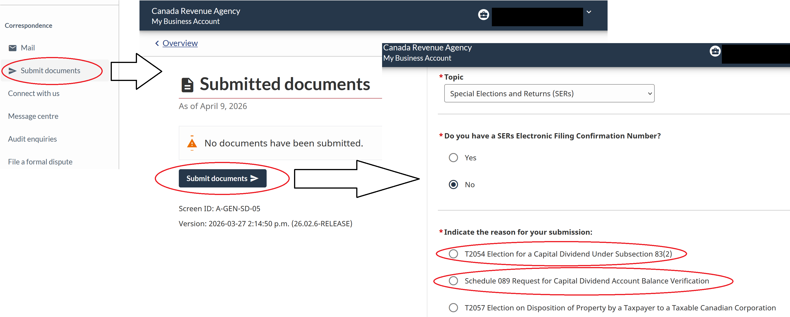

# Capital Dividend Account (CDA)

**Who this is for**:
- Owners of a Canadian-controlled private corporation (CCPC) who hold investments in a corporate trading account
  - Assumes the corporation is resident in Canada

**TLDR**: capital gains can be used for a tax-efficient capital dividend.

Limitations:
- This document only covers stocks and ETFs
  - Other types of investments (real estate, etc.) are out of scope and might have different or additional rules
- It is assumed that the shareholder is a Canadian resident
  - Non-residents might have additional reporting rules (e.g. NR4), which are not covered here
- Tax information can change over time
  - One example: the capital gains inclusion rate was going to increase to 2/3, before the proposal was cancelled
- The following is my understanding as of 2026

## Details

The Capital Dividend Account is not part of the ledger; it can be tracked separately (e.g. in a spreadsheet).  
The CDA can be used to pay out the tax-free portion of the cumulative net capital gain.  
The corporation pays it to the shareholders with a capital dividend.  
A capital dividend is one of the three dividend flavours (eligible, non-eligible, capital).  
For how it sits alongside the others and the steps to declare and pay it, see [Dividends](../../Paying-Yourself/Dividends/Dividends.md).  
The CDA can also include other amounts, which are outside the scope of this document.  
One example: the tax-free portion of life-insurance proceeds received by the corporation (ITA [s.89(1)(d)](https://laws-lois.justice.gc.ca/eng/acts/I-3.3/section-89.html)).  

Maintain a running total of capital gain or loss:
- Realized gains or losses: when you sell a security, calculate T5008 Box 21 - ACB
  - Use your independently calculated ACB, not T5008 Box 20
  - Box 21 is assumed net-of-fees; if it shows the gross amount, subtract the commission first (see [T5008 boxes](../T5008/T5008.md#t5008-boxes))
- Distributions: for T3/T5 slips, add the entire capital gains amount to your running total
  - For example, T3 Box 21 or T5 Box 18
- Deemed gains: when return of capital (ROC) drives a security's ACB below zero, there is an immediate capital gain
  - ITA [s.40(3)](https://laws-lois.justice.gc.ca/eng/acts/I-3.3/section-40.html) deems a capital gain equal to the shortfall; add it like a realized gain
  - The ACB sheet computes it; see [Adjusted Cost Base - Tracking](../Adjusted-Cost-Base/Adjusted-Cost-Base-Tracking.md)
- Capital gains increase the running total, and capital losses decrease it

Calculate the balance of the Capital Dividend Account:
- When the running total is negative, the balance is zero until new gains exceed those past losses
- When the running total is positive, the balance is the non-taxable portion (currently 50%) of the net capital gain
- When you pay a capital dividend, subtract it from the CDA
  - The balance is measured immediately before the dividend becomes payable (s.83(2)(a))
  - Interim capital losses between your last calculation and the payable date reduce the available balance

Example (50% inclusion rate):
- Year 1: sell a position, gain = $10,000 → non-taxable portion = $5,000 → CDA balance: $5,000
- Year 2: sell a position, loss = $12,000 → non-taxable portion = $6,000
  - The cumulative balance would be negative, so CDA balance: $0
- Year 3: sell a position, gain = $4,000 → non-taxable portion = $2,000
  - This first offsets the prior negative balance, leaving CDA balance: $1,000
- At this point the corporation can elect to pay a capital dividend of up to $1,000
  - Subject to the balance still being available immediately before the dividend becomes payable

Capital Dividend Account election process:
- Verification: check the CDA balance via Schedule 89 (S89) or My Business Account
  - The balance shown reflects the last assessed T2
  - It typically lags by 6–12 weeks after your year-end while CRA processes the return
- Resolution: directors must pass a resolution to pay a dividend
  - The resolution elects for the dividend to be a Capital Dividend under s.83(2)
- Filing: submit Form T2054 ("Election for a Capital Dividend Under Subsection 83(2)")
  - Attach a certified copy of the resolution
    - Certification means the Secretary or a Director signs a statement on the resolution
    - The statement attests that it is a true copy of the resolution passed by the board
  - Attach a schedule showing the CDA computation immediately before the election (Reg 2101)
  - File on or before the day the dividend becomes payable (or the first day any part of it is paid, if earlier)
- Reporting:
  - Enter the dividend on T2 Schedule 3 (S3)
  - For Canadian residents: do not issue a T5 information slip for this amount (but do notify them, e.g. by email)
  - Keep internal records of the per-shareholder allocation (amount paid to each shareholder)
    - This is not filed with CRA, but is needed if the election is ever reviewed

The CDA is a "point-in-time" calculation.  
Selling an investment at a loss between your calculation and the payable date can inadvertently overdraw the account.  
Overdrawing incurs Part III tax under ITA s.184(2): 60% of the excess amount.  
Under s.184(3) the corporation can elect to treat the excess as a separate taxable dividend instead.  
That is rarely preferable.  
You may elect to pay less than the calculated CDA balance, e.g. by leaving a $1,000 buffer.  

Since this is a tax-free amount for Canadian residents, the shareholders do not report this income on their T1.  
If a shareholder is a non-resident, the capital dividend is subject to a Part XIII withholding tax.  
The rate is usually 25%, potentially reduced by a treaty, so it isn't "tax-free" for them.  

## Submitting S89 and Form T2054

CRA allows S89 and Form T2054 to be submitted by:
- CRA My Business Account using "Submit documents"
- Specialized software (e.g. TaxCycle)
- Physical mail

The CRA My Business Account website can change over time, here are steps as of 2026:
- Log in to CRA My Account and select My Business Account (you will need to set up your login first)
- On the left navigation panel, go to "Submit documents" (under "Correspondence")
- On the "Submitted documents" screen, click "Submit documents"
- On the "Submit documents" screen:
  - Click "Start"
  - Select "Topic" = "Special Elections and Returns (SERs)"
  - Select "Indicate the reason for your submission" as one of:
    - "T2054 Election for a Capital Dividend Under Subsection 83(2)"
    - "Schedule 089 Request for Capital Dividend Account Balance Verification"

## Related

- [Small Business Tax Overview](../../Overview/Small-Business-Tax.md)
- [Adjusted Cost Base](../Adjusted-Cost-Base/Adjusted-Cost-Base.md)
- [Dividends](../../Paying-Yourself/Dividends/Dividends.md)
- [T3](../T3/T3.md)
- [T5008](../T5008/T5008.md)

## Citations

- Income Tax Act (R.S.C., 1985, c. 1 (5th Supp.)):
  - [s.83(2)](https://laws-lois.justice.gc.ca/eng/acts/I-3.3/section-83.html) - capital dividend election
    - The corporation elects in prescribed form on or before the day the dividend becomes payable
    - If any part of the dividend is paid earlier, the election is due on that first payment day
  - [s.89(1)](https://laws-lois.justice.gc.ca/eng/acts/I-3.3/section-89.html) - definition of "capital dividend account"
    - Includes the non-taxable portion of capital gains and certain life-insurance proceeds
  - [s.184](https://laws-lois.justice.gc.ca/eng/acts/I-3.3/section-184.html) - Part III tax on excessive capital-dividend elections
  - [s.212(2)](https://laws-lois.justice.gc.ca/eng/acts/I-3.3/section-212.html) - Part XIII withholding tax on taxable dividends and capital dividends paid to non-residents
- CRA Form T2054 - Election for a Capital Dividend Under Subsection 83(2): https://www.canada.ca/en/revenue-agency/services/forms-publications/forms/t2054.html
- CRA T2 S89 - Request for Capital Dividend Account Balance Verification: https://www.canada.ca/en/revenue-agency/services/forms-publications/forms/t2sch89.html
- CRA T2 S3: https://www.canada.ca/en/revenue-agency/services/forms-publications/forms/t2sch3.html
- CRA Form T5: https://www.canada.ca/en/revenue-agency/services/forms-publications/forms/t5.html

## TODO

- Include template for resolution to declare capital dividend  
- Include spreadsheet to be used as template for CDA calculation  
