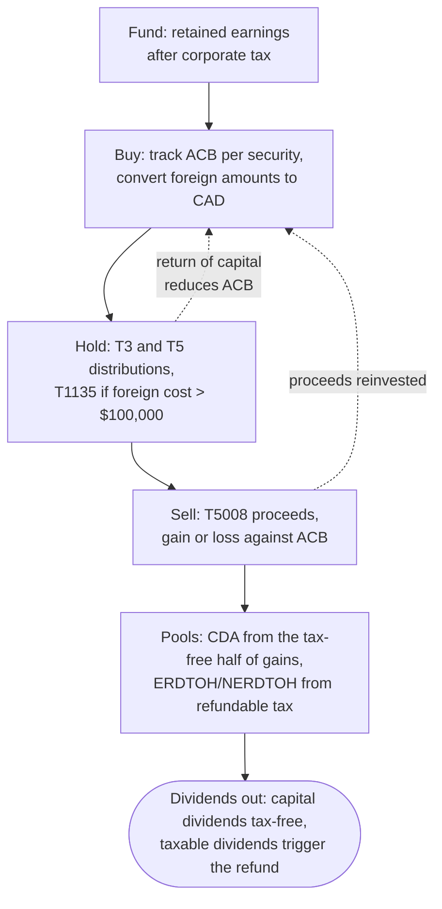

STATUS: AI GENERATED, REVIEW IN PROGRESS

# Investments

**Who this is for**:
- Owners of a Canadian-controlled private corporation (CCPC) holding, or considering, an investment account inside the corporation
- Wanting one map of the corporate investing cycle and which page covers each step

**TLDR**:
- Corporate investing runs a cycle: fund the account from retained earnings, buy and track adjusted cost base (ACB), collect distributions, sell, and flow the resulting tax pools back out as dividends
- Investment income is taxed near the top personal rate up front, with part refunded when the corporation pays taxable dividends; the notional pools — capital dividend account (CDA), ERDTOH and NERDTOH — are the plumbing that makes the round trip work
- The recurring paperwork is slips in, schedules out: T3, T5, and T5008 slips feed the books and ACB records, which feed the T2 investment schedules
- Each step has its own page; this page is the map and adds no mechanics of its own

Limitations:
- Assumes buy-and-hold portfolio investing (ETFs, stocks, GICs) in an operating consulting corporation; frequent trading changes the character of gains and breaks several of these pages' assumptions (see [Capital vs Income Character](Capital-Vs-Income-Character.md))
- Registered plans, real property, and holding-company structures are out of scope
- The following is my understanding as of 2026

## The Investing Cycle

Two habits carry the whole cycle:
- *Record at purchase*: ACB and the CAD conversion are cheap to capture on the trade date and expensive to reconstruct years later
- *Reconcile at slip season*: the T3, T5, and T5008 slips arriving in February and March must tie to the books and the ACB records before the T2 is prepared

## Step by Step

| Step | What to handle | Page |
|---|---|---|
| Character | buy-and-hold produces capital gains; frequent trading turns gains into income and erases the CDA | [Capital vs Income Character](Capital-Vs-Income-Character.md) |
| Funding | investment income is taxed differently from active income, and too much of it can grind the small business deduction | [Active vs investment income](../Overview/Small-Business-Tax.md#active-vs-investment-income), [Tax Integration](../Overview/Tax-Integration.md) |
| Buying | ACB per security, averaged across purchases | [Adjusted Cost Base](Adjusted-Cost-Base/Adjusted-Cost-Base.md), [ACB Tracking](Adjusted-Cost-Base/Adjusted-Cost-Base-Tracking.md) |
| Buying in USD | convert every amount to CAD at the transaction-date rate | [Foreign Currency](../Bookkeeping/Foreign-Currency.md) |
| Holding: fund distributions | trust and ETF distributions by box, including reinvested amounts and return of capital | [T3](T3/T3.md), [Box 26](T3/T3-Box-26-Other-Income.md), [Box 25 / Box 34](T3/T3_Box-25-Foreign-Income_Box-34-Foreign-Tax-Withheld.md) |
| Holding: dividends and interest | dividends from corporations (stocks, corporate-class funds) and interest by box | [T5](T5/T5.md), [Box 18](T5/T5-Box-18-Capital-Gains-Dividends.md) |
| Holding: foreign property | the T1135 filing once total cost of specified foreign property exceeds $100,000 | [T1135](T1135.md) |
| Selling | broker-reported proceeds, gain or loss computed against ACB | [T5008](T5008/T5008.md) |
| Pools | the tax-free half of capital gains accumulates in the CDA; refundable tax accumulates in ERDTOH and NERDTOH | [Capital Dividend Account](Capital-Dividend-Account/Capital-Dividend-Account.md), [ERDTOH and NERDTOH](../Paying-Yourself/Dividends/ERDTOH-NERDTOH.md) |
| Paying out | capital dividends come out tax-free (with an election); taxable dividends recover the refundable tax | [Dividends](../Paying-Yourself/Dividends/Dividends.md) |
| T2 reporting | S3, S6, S7, S21, and S55 carry the investment activity onto the return | [T2 Schedules — Investment-income schedules](../Filing-And-CRA/T2-Schedules.md#investment-income-schedules) |

## Related

- [Small-Business-Tax-Overview](../Overview/Small-Business-Tax.md)
- [Concept map](../Overview/Concept-Map.md) (the same territory as a single diagram)
- [T2 Schedules](../Filing-And-CRA/T2-Schedules.md) (where each slip lands on the return)
- [Losses](../Filing-And-CRA/Losses.md) (capital losses from the portfolio and their carryover)
- [Owner-corporation transactions](../Paying-Yourself/Owner-Corporation-Transactions.md) (moving money between you and the corporation)

## Citations

- The rules live on the linked pages, each with its own citations; this page introduces none

## TODO

- Consider a worked end-to-end example: one ETF through one year (buy, distribution, sale, capital dividend out)
- Link a GIC interest-accrual page from the Holding rows if one is written
