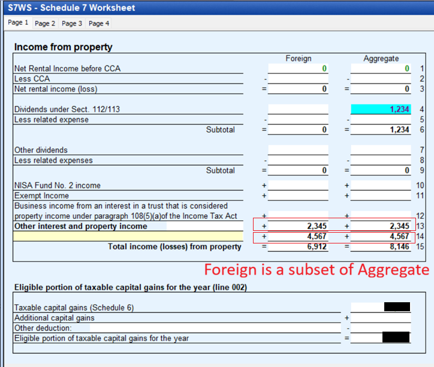

STATUS: AI GENERATED, REVIEW IN PROGRESS

# T3 Box 25 - Foreign Income / Box 34 - Foreign Tax Withheld

See parent document: [T3](T3.md)  
**Who this is for**: owners of a Canadian-controlled private corporation (CCPC) who receive a T3 with Box 25 (foreign non-business income), with or without Box 34 (foreign tax withheld).  

CRA rules for corporate tax filing do not spell out granular details about what exactly to do with each T3 box.  
Presented here is one particular bookkeeping convention which is compatible with CRA requirements.  
If you choose a different bookkeeping convention, make sure that it is: consistently applied, logically self-consistent, and consistent with T2 treatment.  

Limitations:
- This document only covers ETFs structured as a trust (e.g. a Canadian-listed equity, bond, or currency ETF); other investments may have different or additional rules
- It is assumed the corporation is resident in Canada; non-resident recipients have separate rules and are out of scope
- Foreign *business* income (e.g. from a foreign branch or active business) is different from the foreign *non-business* income in Box 25, and is out of scope
- Tax information can change over time; the following is my understanding as of 2026

## Meaning and Tax Treatment

T3 Box 25 is *foreign non-business income* allocated to a beneficiary of a trust: income from a source outside Canada that is income from property, not a capital gain, and not from a business.  
It is a catch-all that can hold more than one kind of income:
- *Foreign interest*: e.g. interest the fund earns on US-dollar cash or on foreign bonds
- *Foreign dividends*: e.g. dividends the fund receives on US or other foreign equities
- A single Box 25 figure can blend both; the slip reports one number and does not split it by character

T3 Box 34 is the *foreign non-business income tax paid*: the foreign tax (typically withholding) on that income, if any.  
Its absence does not tell you whether the Box 25 amount is interest or a dividend, only that no foreign tax was withheld.  
Interest on foreign cash deposits is commonly paid with no withholding, so Box 25 with an empty Box 34 is normal.  

For a CCPC the corporate-tax outcome is the same whether the Box 25 amount is foreign interest or foreign dividends:
- Both are *income from property*, fully taxable; there is no preferential rate, gross-up, or dividend tax credit (those are personal-side mechanics)
- Foreign portfolio dividends do not qualify for the s.112 intercorporate-dividend deduction (that applies only to dividends from a taxable Canadian corporation), so they create no Part IV tax and no ERDTOH; they are taxable property income, like the interest
- Both are part of *Aggregate Investment Income* (AII): the refundable portion of Part I tax applies, 30⅔% of AII flows into NERDTOH (recovered when you pay a non-eligible dividend; see [ERDTOH-NERDTOH.md](../../Paying-Yourself/Dividends/ERDTOH-NERDTOH.md)), and the amount counts toward the *Adjusted Aggregate Investment Income* that grinds the small business deduction once AAII exceeds $50,000 (ITA [s.125(5.1)](https://laws-lois.justice.gc.ca/eng/acts/I-3.3/section-125.html))
- If Box 34 has foreign tax, claim the foreign non-business income tax credit (below) regardless of the interest/dividend split

What the interest-versus-dividend character changes is presentation, not tax dollars:
- *GIFI code*: foreign interest rolls up under GIFI 8091 (Interest from foreign sources), foreign dividends under GIFI 8097 (Dividends from foreign sources), both on the Schedule 125 income statement
- *Schedule 7*: does not split the two; both land in the foreign-income line (Box 019) and feed aggregate investment income identically, so the worksheet row you pick there does not change the tax result

## Determining Whether Box 25 Is Interest or Dividends

The slip won't tell you, so classify by what the holding actually pays:
- The fund's holdings are the first clue: a currency or cash ETF earns *interest*; a foreign-bond ETF earns *interest*; a foreign-equity ETF earns *dividends*
- The authoritative source is the sponsor's annual *tax characterization of distributions* (sometimes "breakdown of distributions"), which splits each box into its components (interest, dividends, capital gains, return of capital, foreign tax)
- The CDS Canadian Tax Breakdown Reporting Service (CTBS) gives the same per-distribution breakdown if your brokerage did not provide it: https://ctbsext.posttrade.cds.ca/ctbsExt/external-landing
- The prospectus ("Income Tax Considerations" / "Taxation of the Fund") describes what the fund earns and distributes

Apply the classification consistently year to year.  

## Worked Example - DLR.U (US-Dollar Cash ETF)

DLR.U (Global X US Dollar Currency ETF) holds US dollars and earns interest on that cash.  
The sponsor characterizes the distribution as net investment income excluding dividends.  
On the slip:
- Box 25 has an amount (foreign non-business income) and Box 34 is empty, since interest on US-dollar deposits is generally paid without foreign withholding
- The Box 25 amount is foreign *interest*, so it is credited to GIFI 8091 (Interest from foreign sources), not GIFI 8097
- With no Box 34, there is no foreign tax credit step: no Schedule 21 entry and no Schedule 1 add-back are needed
- Confirm the character against Global X's annual tax-characterization table for the year

This is the simplest version of the Box 25 flow.  
The fuller flow (a Box 34 amount, and the foreign tax credit) appears with foreign-equity holdings that suffer withholding.  

T3 amounts are reported in Canadian dollars; if you also track the USD distributions during the year, convert them at the payment-date rate (see [Foreign Currency](../../Bookkeeping/Foreign-Currency.md)).  

## Relevant General Ledger Accounts

For the broader ledger tree, see [T3](T3.md).  

Accounts typically involved in the T3 Box 25 workflow:
<table>
  <thead>
    <tr><th>Account</th><th>Code</th><th>Description</th></tr>
  </thead>
  <tbody>
    <tr><td>Assets</td><td>2599-valid</td><td></td></tr>
    <tr><td nowrap>&ensp; └ Current Assets</td><td>1599-calc</td><td></td></tr>
    <tr><td nowrap>&ensp; &ensp; └ Cash and deposits</td><td>1000</td><td></td></tr>
    <tr><td nowrap>&ensp; &ensp; &ensp; └ Deposits - investment</td><td>1002-2</td><td>Cash sitting in investment account</td></tr>
    <tr><td nowrap>&ensp; &ensp; └ Accounts receivable</td><td>1060-parent</td><td></td></tr>
    <tr><td nowrap>&ensp; &ensp; &ensp; └ Investment distributions receivable</td><td>1060-1</td><td>Distributions declared in December but paid in January</td></tr>
    <tr><td>Revenue</td><td>8299-valid</td><td></td></tr>
    <tr><td nowrap>&ensp; └ Investment revenue</td><td>8090-parent</td><td></td></tr>
    <tr><td nowrap>&ensp; &ensp; └ Investment revenue - detail accounts</td><td>8090</td><td>Roll up into GIFI 8090</td></tr>
    <tr><td nowrap>&ensp; &ensp; &ensp; └ TBD investment distributions</td><td>8090-3</td><td>Unclassified passive income (pending T3 in March)</td></tr>
    <tr><td nowrap>&ensp; &ensp; └ Interest from foreign sources</td><td>8091</td><td>Box 25 portion that is foreign interest (e.g. USD cash from DLR.U)</td></tr>
    <tr><td nowrap>&ensp; &ensp; └ Dividends from foreign sources</td><td>8097</td><td>Box 25 portion that is foreign dividends (e.g. foreign-equity ETF)</td></tr>
    <tr><td>Operating expenses</td><td>9367-calc</td><td>Net of operating expenses</td></tr>
    <tr><td nowrap>&ensp; └ Other expenses</td><td>9270-parent</td><td></td></tr>
    <tr><td nowrap>&ensp; &ensp; └ Withholding taxes</td><td>9283</td><td>Foreign non-business tax withheld (Box 34)</td></tr>
  </tbody>
</table>

In the ledger tree both 8091 and 8097 sit under the 8090 parent, but when filing GIFI-coded financial statements each code is considered individually (8090, 8091, and 8097 are separate lines).  
GIFI codes: https://www.canada.ca/en/revenue-agency/services/forms-publications/publications/rc4088/general-index-financial-information-gifi.html  

## Ledger Entries

During the year the distribution can be parked in `TBD investment distributions` (8090-3) and reclassified when the T3 arrives (see [T3](T3.md)).  

When the T3 confirms the Box 25 amount, post the net cash, the foreign tax, and the income:
- Debit Box 25 minus Box 34 (net cash received): `Deposits - investment` (1002-2) within the year, or `Investment distributions receivable` (1060-1) if declared in December but paid in January
- Debit Box 34 (foreign tax withheld), if any: `Withholding taxes` (9283)
- Credit Box 25 (full gross amount):
  - `Interest from foreign sources` (8091) if the distribution is foreign interest (e.g. DLR.U)
  - `Dividends from foreign sources` (8097) if it is foreign dividends (e.g. a foreign-equity ETF)

If there is no Box 34 (no withholding, as with DLR.U), the net debit equals the gross and the `Withholding taxes` line is omitted.  

## T2 Schedule Mapping

On Schedule 7 (S7), the Box 25 amount is income from property that belongs in two places, and the distinction matters:
- Part 1, Box 032: total income from property (worldwide), which feeds aggregate investment income (AII) to line 440 of the T2 return
- Part 3, Box 019: total income from property from a source outside Canada (the foreign subset), which feeds foreign investment income to line 445

Enter the full gross Box 25 amount (despite the Box 019 "net of related expenses" label, expenses are entered separately).  

In FutureTax T2, double-click the field to open the S7 worksheet (S7WS).  
Its "Income from property" grid has one row per income type and two columns that map straight to the two Schedule 7 lines above.  
The columns are independent, so each foreign amount must be entered in *both*; this is the step most easily missed:
- *Foreign* column: feeds Box 019 (foreign investment income, line 445)
- *Aggregate* column: feeds Box 032 (worldwide income from property, AII at line 440)
- The row you use changes no filed number; every row sums into its column total
- Put foreign interest on the "Other interest and property income" row: it is the correct label for interest (e.g. DLR.U) and is the expandable one, so multiple T3s can be itemized there
- Foreign investment income is a subset of AII, so the same dollars belong in both boxes; entering the amount in the Foreign column alone puts it in foreign investment income (Box 019) but leaves it out of AII (Box 032), understating the refundable-tax (NERDTOH) pool
- On the generated Schedule 7, check that Box 032 equals your Canadian income from property plus the foreign Box 25 (AII at line 440 rises by the foreign amount) and that Box 019 equals the foreign total

The worksheet below shows the correct entry: each foreign amount is keyed into both the Foreign and Aggregate columns (the same figure in each row), so the Foreign total (Box 019) is a subset of the Aggregate total (Box 032).  
Here the Aggregate total (8,146) is the foreign property income (6,912) plus the Canadian s.112/113 dividends (1,234), while the Foreign total (6,912) carries only the foreign rows.  

Make sure the amount is not removed as "taxable dividends deductible" (Part 1 line 062 / Part 3 line 049, fed from Schedule 3); that line captures only s.112/113-deductible dividends (from taxable Canadian corporations or foreign affiliates), which a portfolio foreign distribution is not.  

Foreign tax credit (only if Box 34 has an amount):
- Schedule 21 (S21), Part 1 (Federal foreign non-business income tax credit): claim the credit for the foreign tax paid (ITA [s.126(1)](https://laws-lois.justice.gc.ca/eng/acts/I-3.3/section-126.html)), reducing the Canadian tax otherwise payable. One row per country of source; the columns are:
  - *Column 1A* (100): country of source, e.g. US
  - *Column 1B* (110): net foreign non-business income, i.e. the gross Box 25 amount less any related carrying expenses (usually just the Box 25 figure)
  - *Column 1C* (120): foreign tax paid, i.e. the Box 34 amount
  - *Column 1D* (130): leave it blank for a T3 Box 34 amount. The column feeds the s.20(12) deduction, the mutually exclusive alternative to the credit, but that deduction is not available for foreign tax flowed through a trust (see [Box 34 Without Box 25](#box-34-without-box-25)); it applies only to foreign non-business tax the corporation pays directly, not through a T3. Column 1E computes `1C - 1D`, so any figure here reduces the credit dollar for dollar
  - *Column 1F* (line 600 in Part 6): adjusted net income, used in the credit-limit calculation; software-populated
- Schedule 1 (S1), Other additions: enter the Box 34 amount as a "Foreign tax add-back" to reverse the withholding expensed in `Withholding taxes` (9283), so the credit is not double-counted against the expense. This is the "Other additions" grid on S1 page 3, not the "Other deductions" grid on page 4; the two look alike but have different box numbers and opposite sign:
  - *Column 1* (Description, 605): a label such as "Foreign tax add-back - T3 Box 34"
  - *Column 2* (Amount, 295): the Box 34 amount
  - The grid totals to box 296, which feeds amount D (line 199 on page 1) and is *added* to income; do not use the page-4 "Other deductions" grid (Description 705, Amount 395, totalling to 396 → amount E → line 499), which subtracts
- If you claim neither the S21 credit nor the S1 add-back, the foreign tax stays a plain expense, which is less tax-efficient
- An alternative some find simpler: debit only the net amount (skip the `Withholding taxes` expense) and add the gross-up back through the S1 "Other additions" line

The S21 credit for non-business foreign tax is bounded by the Canadian tax otherwise payable on that foreign income.  
For foreign tax that reaches you through a trust (a T3 Box 34 amount), any uncredited excess is not recoverable: the [s.20(12)](https://laws-lois.justice.gc.ca/eng/acts/I-3.3/section-20.html) deduction does not apply, because s.104(22.1) deems the beneficiary to have paid the foreign tax only for the purposes of the s.126 credit (see [Box 34 Without Box 25](#box-34-without-box-25) below).  
The detailed credit-limit arithmetic is out of scope here.  

## Box 34 Without Box 25

Box 34 is the foreign tax on the Box 25 income, so the two normally travel together and Box 34 is a fraction of Box 25.  
The slip enforces no arithmetic link between them, though, and a Box 34 amount can show up against a nil or much smaller Box 25.  

The cause is a character mismatch: the foreign side withholds on the gross cash distribution, while the fund assigns that same cash to Canadian tax characters box by box.  
When the Canadian character is not foreign non-business income, the withholding still lands in Box 34 (the slip has no other box for foreign tax) while the distribution itself lands elsewhere:
- *Return of capital (Box 42) or capital gains (Box 21)*: the cash is characterized as ROC or a capital gain for Canadian purposes, not as property income, so little or nothing reaches Box 25
- *US REITs are the classic case*: FIRPTA withholding applies even to return-of-capital distributions, so a distribution that is largely Box 42 / Box 21 can still carry a Box 34 amount
- *Timing*: an interim slip can show withholding before the fund finalizes the character split in its March tax-characterization breakdown, so the two may not line up dollar for dollar until the final numbers arrive

An uncreditable Box 34 on a T3 gives no Canadian relief:
- The s.126(1) credit is bounded by the Canadian tax on the foreign non-business income (the Box 25 amount), so with Box 25 nil there is little or no credit room (see [T2 Schedule Mapping](#t2-schedule-mapping) above)
- There is no s.20(12) fallback for foreign tax flowed through a trust: s.104(22.1) deems the beneficiary to have paid the foreign tax only for the purposes of s.126, and s.104(22) to (22.3) do not extend to the s.20(11) or s.20(12) deductions (CRA position in IT-506 and IT-201R2). This binds a corporate beneficiary the same as an individual; the deeming is scoped by statute to the credit, not to the type of taxpayer
- The withholding therefore stays a non-deductible cost: add it back on Schedule 1 as in the creditable flow, but with no offsetting credit, so it simply reduces the after-tax return

Before treating a Box 34 as lost, pull the fund's annual tax-characterization breakdown (or the CTBS PDF; see [Determining Whether Box 25 Is Interest or Dividends](#determining-whether-box-25-is-interest-or-dividends) above).  
An interim Box 34 with no Box 25 often resolves into a real Box 25 once the character is finalized, which restores the credit room.  

## Related

- [T3](T3.md)
- [T3 - Box 26 Other Income](T3-Box-26-Other-Income.md)
- [Small Business Tax Overview](../../Overview/Small-Business-Tax.md)
- [ERDTOH and NERDTOH](../../Paying-Yourself/Dividends/ERDTOH-NERDTOH.md)
- [Foreign Currency](../../Bookkeeping/Foreign-Currency.md)

## Citations

- Income Tax Act (R.S.C., 1985, c. 1 (5th Supp.)):
  - [s.104](https://laws-lois.justice.gc.ca/eng/acts/I-3.3/section-104.html) - trust income allocations and amounts becoming payable to beneficiaries; s.104(22)/(22.1) designate foreign source income and foreign tax to the beneficiary for the purposes of the s.126 credit only
  - [s.108](https://laws-lois.justice.gc.ca/eng/acts/I-3.3/section-108.html) - trust definitions and the deeming rule in s.108(5) for beneficiary income from a trust interest
  - [s.112(1)](https://laws-lois.justice.gc.ca/eng/acts/I-3.3/section-112.html) - intercorporate-dividend deduction, limited to dividends from a taxable Canadian corporation (foreign dividends do not qualify)
  - [s.20(12)](https://laws-lois.justice.gc.ca/eng/acts/I-3.3/section-20.html) - deduction for foreign non-business income tax not credited; not available for tax flowed through a trust, since the s.104(22.1) designation applies only for the s.126 credit
  - [s.125(5.1)](https://laws-lois.justice.gc.ca/eng/acts/I-3.3/section-125.html) - reduction of the small-business business limit when adjusted aggregate investment income exceeds $50,000
  - [s.126(1)](https://laws-lois.justice.gc.ca/eng/acts/I-3.3/section-126.html) - foreign non-business income tax credit
  - [s.129(4)](https://laws-lois.justice.gc.ca/eng/acts/I-3.3/section-129.html) - definitions of aggregate investment income and non-eligible RDTOH
- CRA Form T3 - Statement of Trust Income Allocations and Designations: https://www.canada.ca/en/revenue-agency/services/forms-publications/forms/t3.html
- CRA IT-201R2 (archived) - Foreign Tax Credit - Trust and Beneficiaries; and IT-506 (archived) - Foreign Income Taxes as a Deduction from Income (para 11): a beneficiary cannot claim the s.20(11)/(12) deduction for foreign tax allocated by a trust: https://www.canada.ca/en/revenue-agency/services/forms-publications/publications/it201r2/archived-foreign-tax-credit-trust-beneficiaries.html
- CRA T2 S7: https://www.canada.ca/en/revenue-agency/services/forms-publications/forms/t2sch7.html
- CRA T2 S21: https://www.canada.ca/en/revenue-agency/services/forms-publications/forms/t2sch21.html
- CRA RC4088 - General Index of Financial Information (GIFI): https://www.canada.ca/en/revenue-agency/services/forms-publications/publications/rc4088/general-index-financial-information-gifi.html
- CDS Canadian Tax Breakdown Reporting Service (CTBS): https://ctbsext.posttrade.cds.ca/ctbsExt/external-landing
- Global X US Dollar Currency ETF (DLR / DLR.U): https://www.globalx.ca/product/dlr-u

## TODO

- Add a Box 25 / Box 34 T3 slip screenshot (the S7 worksheet screenshot is included)
- Expand the s.126(1) foreign tax credit limit arithmetic (the credit-limit fraction) for larger Box 34 amounts
