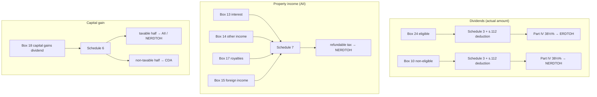

STATUS: AI GENERATED, REVIEW IN PROGRESS

# T5 investment income handling for corporations

**Who this is for**: owners of a Canadian-controlled private corporation (CCPC) who receive a T5 from investments held in a corporate account.  
If your corporate investment account (e.g. RBC Direct Investing) holds a dividend-paying Canadian stock, a corporate-class fund, a GIC, or a bank/broker high-interest savings deposit (an Investment Savings Account, ISA), you will receive a *T5 Statement of Investment Income* and need to account for it.  

The slip type follows the issuer's legal structure, not the kind of income:
- A *trust* (most Canadian index ETFs and high-interest savings (HISA) ETFs, structured as mutual fund trusts) reports through a T3; see [T3](../T3/T3.md)
- A *corporation* (a stock, a mutual fund corporation, a corporate-class fund) reports through a T5
- A *securities disposition* (you sell a holding) reports through a T5008; see [T5008](../T5008/T5008.md)

This page covers the T5 your corporation *receives* on its investments.  
The T5 your corporation *issues* to its shareholder when it pays a taxable dividend is a separate obligation, covered in [Bookkeeping and information slips](../../Paying-Yourself/Dividends/Bookkeeping-And-Slips.md).  

Limitations:
- Covers a CCPC claiming the small business deduction (SBD), with active business income under the $500,000 business limit
- Covers plain investment holdings (stocks, corporate-class funds, GICs, high-interest savings/ISA deposits); annuities, insurance products, and structured products beyond equity-linked notes are out of scope
- Dates assume a December 31 year-end
- Tax information can change over time (e.g. the capital gains inclusion rate was going to increase to 2/3, before the proposal was cancelled)
- The following is my understanding as of 2026

## T5 boxes

When a corporate investment account earns investment income from a corporation-issued holding, you may see the following:
- Box 24: Actual amount of eligible dividends
- Box 10: Actual amount of dividends other than eligible (non-eligible)
- Box 13: Interest from Canadian sources
- Box 14: Other income from Canadian sources
- Box 15: Foreign income
- Box 16: Foreign tax paid
- Box 17: Royalties from Canadian sources
- Box 18: Capital gains dividends: [T5 - Box 18 Capital Gains Dividends](T5-Box-18-Capital-Gains-Dividends.md)
- Box 30: Equity linked notes interest; when a linked note (a market-linked GIC or principal-protected note) is sold or matures, ITA [s.20(14.2)](https://laws-lois.justice.gc.ca/eng/acts/I-3.3/section-20.html) deems the return-based portion of the proceeds to be interest accrued to that disposition; treat it as Box 13 interest

Boxes the corporation does not act on:
- Box 11, Box 12, Box 25, Box 26: the grossed-up *taxable amount* and the *dividend tax credit* for non-eligible (11/12) and eligible (25/26) dividends; these are individual-T1 figures and a corporation ignores them (see [Corporation vs personal handling](#corporation-vs-personal-handling))
- Box 27: foreign-currency indicator (e.g. USD); not income, but it tells you the boxes are stated in a foreign currency and must be converted to CAD; see [Foreign Currency](../../Bookkeeping/Foreign-Currency.md)
- Box 21, Box 22, Box 23, Box 28, Box 29: report code and recipient identification (account, transit, recipient type); no tax treatment
- Box 19 (accrued income: annuities): out of scope for this audience

## Corporation vs personal handling

Most T5 guidance online is written for an individual filing a T1, where a Canadian dividend is grossed up and then offset by a dividend tax credit.  
A corporation does none of that.  

For a dividend received from a Canadian corporation:
- Include the *actual* amount only (Box 10 or Box 24) in income under ITA [s.82(1)(a)](https://laws-lois.justice.gc.ca/eng/acts/I-3.3/section-82.html); the gross-up (s.82(1)(b)) and the dividend tax credit ([s.121](https://laws-lois.justice.gc.ca/eng/acts/I-3.3/section-121.html)) are available to individuals only
- Deduct the actual amount again under [s.112](https://laws-lois.justice.gc.ca/eng/acts/I-3.3/section-112.html), removing the dividend from Part I taxable income
- Pay Part IV tax of 38⅓% on the *actual* amount (Box 10 or Box 24), not the grossed-up Box 11/25 amount

The corporation uses Box 10 and Box 24, and leaves Box 11, Box 12, Box 25, and Box 26 untouched.  

How each box maps to a schedule and a tax pool:

## Matching ledger vs brokerage account

Investment income arrives in your corporate account throughout the year, but the final tax classification is not known until the T5 arrives, typically in February or March.  
A statement line labelled "dividend" is not necessarily an eligible dividend, and may turn out to be interest, foreign income, or a capital gains dividend.  
Park amounts in a temporary account during the year and reclassify once the slip confirms the split; the reconciliation approach is the same as for T3, see [Matching ledger vs brokerage account](../T3/T3.md#matching-ledger-vs-brokerage-account).  

If the T5 amounts differ slightly from your booked figures, report the amounts as they appear on the T5 and carry the difference in `Investment revenue adjustment` (8090-1).  

## Relevant general ledger accounts

Example tree of accounts that can be used for T5 bookkeeping (with account codes aligned with GIFI):
<table>
  <thead>
    <tr><th>Account</th><th>Code</th><th>Description</th></tr>
  </thead>
  <tbody>
    <tr><td>Assets</td><td>2599-valid</td><td></td></tr>
    <tr><td nowrap>&ensp; └ Current Assets</td><td>1599-calc</td><td></td></tr>
    <tr><td nowrap>&ensp; &ensp; └ Cash and deposits</td><td>1000</td><td></td></tr>
    <tr><td nowrap>&ensp; &ensp; &ensp; └ Deposits - investment</td><td>1002-2</td><td>Cash sitting in investment account</td></tr>
    <tr><td nowrap>&ensp; &ensp; └ Accounts receivable</td><td>1060-parent</td><td></td></tr>
    <tr><td nowrap>&ensp; &ensp; &ensp; └ Investment distributions receivable</td><td>1060-1</td><td>Income declared in December but paid in January</td></tr>
    <tr><td nowrap>&ensp; └ Long-term investments</td><td>2300</td><td></td></tr>
    <tr><td nowrap>&ensp; &ensp; └ Canadian shares</td><td>2303</td><td>Investment – Securities</td></tr>
    <tr><td>Revenue</td><td>8299-valid</td><td></td></tr>
    <tr><td nowrap>&ensp; └ Investment revenue</td><td>8090-parent</td><td></td></tr>
    <tr><td nowrap>&ensp; &ensp; └ Investment revenue - detail accounts</td><td>8090</td><td>Roll up into GIFI 8090</td></tr>
    <tr><td nowrap>&ensp; &ensp; &ensp; └ Investment revenue adjustment</td><td>8090-1</td><td>Plug when T3/T5 different vs investment account</td></tr>
    <tr><td nowrap>&ensp; &ensp; &ensp; └ Other investment income</td><td>8090-2</td><td>T5 Box 14 Other income</td></tr>
    <tr><td nowrap>&ensp; &ensp; &ensp; └ TBD investment distributions</td><td>8090-3</td><td>Unclassified passive income (pending T5) | eligible dividend / interest / foreign / capital gains dividend / etc.</td></tr>
    <tr><td nowrap>&ensp; &ensp; └ Interest from other Canadian sources</td><td>8094</td><td>T5 Box 13 (and Box 30); GIC interest, ISA deposit interest, bond interest</td></tr>
    <tr><td nowrap>&ensp; &ensp; └ Dividends from Canadian sources</td><td>8096</td><td>Eligible dividend income (T5 Box 24)</td></tr>
    <tr><td nowrap>&ensp; &ensp; &ensp; └ Dividends from Canadian sources - non-eligible</td><td>8096-1</td><td>Non-eligible dividend income (T5 Box 10)</td></tr>
    <tr><td nowrap>&ensp; &ensp; └ Dividends from foreign sources</td><td>8097</td><td>Foreign income (T5 Box 15), gross of withholding tax; withholding tax goes to 9283</td></tr>
    <tr><td nowrap>&ensp; └ Realized gains/losses on disposal of assets</td><td>8210</td><td>Gain/loss or profit/loss on disposal/sale of capital assets</td></tr>
    <tr><td nowrap>&ensp; &ensp; └ Realized gains/losses on sale of investments</td><td>8211</td><td>Profit/loss on disposal of investments or marketable securities</td></tr>
    <tr><td nowrap>&ensp; &ensp; &ensp; └ Disposition of capital property</td><td>8211-1</td><td>Comes from T5008 - Amount minus ACB</td></tr>
    <tr><td nowrap>&ensp; &ensp; &ensp; └ Capital gains distributions</td><td>8211-2</td><td>Comes from T3 - Box 21 (Capital gains)</td></tr>
    <tr><td nowrap>&ensp; &ensp; &ensp; └ Capital gains dividends</td><td>8211-3</td><td>Comes from T5 - Box 18 (Capital gains dividends)</td></tr>
    <tr><td>Operating expenses</td><td>9367-calc</td><td>Net of operating expenses</td></tr>
    <tr><td nowrap>&ensp; └ Other expenses</td><td>9270-parent</td><td></td></tr>
    <tr><td nowrap>&ensp; &ensp; └ Withholding taxes</td><td>9283</td><td>Foreign tax paid (T5 Box 16)</td></tr>
  </tbody>
</table>

The account code is based on the GIFI code, with a -&lt;suffix&gt; added where the codes are too coarse-grained.  
Each code is filed individually: 8094 is separate from 8096, even though both roll up under 8090.  
GIFI codes: https://www.canada.ca/en/revenue-agency/services/forms-publications/publications/rc4088/general-index-financial-information-gifi.html

## Eligible dividends - Box 24

Debit: `Deposits - investment` (1002-2) within year, or `Investment distributions receivable` (1060-1) if declared in December but paid in January.  
Credit: `Dividends from Canadian sources` (8096).  

Schedule 3 (S3 - Dividends Received, Taxable Dividends Paid, and Part IV Tax Calculation) / Part 1 (Dividends received in tax year):  
- A = payer name (e.g. the corporation or fund that issued the T5)
- Type of Column F = s.112
- F = G = actual eligible dividend amount (Box 24)

Part IV tax of 38⅓% on the received dividend populates ERDTOH (ITA [s.186(1)](https://laws-lois.justice.gc.ca/eng/acts/I-3.3/section-186.html): 38⅓% for non-connected payers under s.186(1)(a), a flow-through for connected payers under s.186(1)(b)).  
The s.112 deduction is taken on line 320 of the T2 to remove the dividend from Part I taxable income.  
This is mechanically identical to [T3 eligible dividends - Box 49](../T3/T3.md#eligible-dividends---box-49); for the pool definitions and the refund on payout, see [ERDTOH and NERDTOH](../../Paying-Yourself/Dividends/ERDTOH-NERDTOH.md).  

## Non-eligible dividends - Box 10

Debit: `Deposits - investment` (1002-2), or `Investment distributions receivable` (1060-1) if declared in December but paid in January.  
Credit: `Dividends from Canadian sources - non-eligible` (8096-1).  

Report on S3 Part 1 the same way as Box 24, using the actual amount (Box 10).  
The s.112 deduction still applies, and Part IV tax of 38⅓% on a non-eligible dividend flows into NERDTOH rather than ERDTOH.  

## Interest - Box 13

Debit: `Deposits - investment` (1002-2), or `Investment distributions receivable` (1060-1) if accrued at year-end but paid in January.  
Credit: `Interest from other Canadian sources` (8094).  

Interest is property income and forms part of Aggregate Investment Income (AII), entered on Schedule 7 (S7).  
A corporation reports interest on an annual accrual basis under ITA [s.12(3)](https://laws-lois.justice.gc.ca/eng/acts/I-3.3/section-12.html): for a multi-year compound GIC or note that pays at maturity, accrue and report each year even though no cash and no T5 arrive until maturity.  
For a monthly-paying ISA deposit the accrual and the cash effectively coincide, so the timing difference rarely matters.  
Box 30 (equity linked notes interest) is the same income character and posts to the same `Interest from other Canadian sources` (8094) account.  

## Other income - Box 14

Debit: `Deposits - investment` (1002-2), or `Investment distributions receivable` (1060-1) if declared in December but paid in January.  
Credit: `Other investment income` (8090-2).  

Box 14 is a residual bucket of Canadian-source property income, included in AII on Schedule 7.  
It is the T5 analogue of T3 Box 26; for the AII classification, the NERDTOH link, and the SBD grind over $50,000 of AII, see [T3 - Box 26 Other Income](../T3/T3-Box-26-Other-Income.md).  

## Foreign income - Box 15, and foreign tax paid - Box 16

Debit Box 15 amount − Box 16 amount (net): `Deposits - investment` (1002-2), or `Investment distributions receivable` (1060-1) if declared in December but paid in January.  
Debit Box 16 amount: `Withholding taxes` (9283).  
Credit Box 15 amount: `Dividends from foreign sources` (8097).  

Schedule 7 (S7) / Part 3 / Box 019 - Total income from property from a source outside Canada (net of related expenses): enter the full gross Box 15 amount.  
Schedule 21 (S21) / Part 1 - Federal foreign non-business income tax credit: claim the Box 16 amount to deduct it from Canadian tax otherwise payable (ITA [s.126(1)](https://laws-lois.justice.gc.ca/eng/acts/I-3.3/section-126.html)).  
Schedule 1 (S1) / Page 3 / Other additions (Description 605; Amount 295): add back the Box 16 amount as a "Foreign tax add-back" so the foreign tax expensed in 9283 is not also claimed as a credit (no double-dipping).  

This mirrors [T3 foreign income - Box 25/34](../T3/T3.md#foreign-income---box-25-and-foreign-tax-withheld---box-34), with one difference to watch:
- On a corporation-issuer T5, the foreign income in Box 15 is not necessarily a dividend; a corporate-class fund can pass through foreign *interest*
- When the underlying is foreign interest, credit an interest-style account rather than `Dividends from foreign sources`, and use the foreign interest / other-property line of the S7 worksheet rather than the foreign-dividend line
- The S21 foreign tax credit math is the same either way

If Box 27 shows a foreign currency, convert each box to CAD at the payment-date rate before posting; see [Foreign Currency](../../Bookkeeping/Foreign-Currency.md).  

## Royalties - Box 17

Debit: `Deposits - investment` (1002-2).  
Credit: `Other investment income` (8090-2), or a dedicated royalty sub-account if you earn them regularly.  

For a portfolio holder, royalties are property income and form part of AII on Schedule 7, the same as Box 14.  
Royalties from an active royalty business would instead be active business income, which is outside the scope of this page.  

## Capital gains dividends - Box 18

A capital gains dividend is paid by a mutual fund corporation and is a deemed capital gain, not a taxable dividend: no s.112 deduction and no Part IV tax apply.  
It is reported on Schedule 6, half of it is taxable, and the non-taxable half is added to the Capital Dividend Account.  
See [T5 - Box 18 Capital Gains Dividends](T5-Box-18-Capital-Gains-Dividends.md) for the full treatment and the contrast with T3 Box 21 and T5008.  

## Worked example

A corporate account holds a high-interest savings (ISA) deposit, a Canadian dividend stock, a US dividend stock, and a corporate-class fund.  
The year's T5 shows: Box 13 = $400, Box 24 = $300, Box 15 = $200, Box 16 = $30, Box 18 = $500.  
All amounts are received in cash during the year.  

Box 13 interest, $400:  
Debit `Deposits - investment` (1002-2) = $400  
Credit `Interest from other Canadian sources` (8094) = $400  
→ S7 property income (AII)  

Box 24 eligible dividend, $300:  
Debit `Deposits - investment` (1002-2) = $300  
Credit `Dividends from Canadian sources` (8096) = $300  
→ S3 Part 1, s.112 deduction $300, Part IV 38⅓% = $115 → ERDTOH  

Box 15/16 foreign income $200, foreign tax $30:  
Debit `Deposits - investment` (1002-2) = $170  
Debit `Withholding taxes` (9283) = $30  
Credit `Dividends from foreign sources` (8097) = $200  
→ S7 Part 3 Box 019 = $200, S21 FTC = $30, S1 line 605 add-back = $30  

Box 18 capital gains dividend, $500:  
Debit `Deposits - investment` (1002-2) = $500  
Credit `Capital gains dividends` (8211-3) = $500  
→ S6 reports a $500 gain; taxable half $250 → AII; S1 line 395 deduction = $250; CDA += $250  

Cash into `Deposits - investment` (1002-2): $400 + $300 + $170 + $500 = $1,370.  

## Related

- [Small Business Tax Overview](../../Overview/Small-Business-Tax.md)
- [T5 - Box 18 Capital Gains Dividends](T5-Box-18-Capital-Gains-Dividends.md)
- [T3](../T3/T3.md)
- [T3 - Box 26 Other Income](../T3/T3-Box-26-Other-Income.md)
- [T5008](../T5008/T5008.md)
- [ERDTOH and NERDTOH](../../Paying-Yourself/Dividends/ERDTOH-NERDTOH.md)
- [Capital Dividend Account](../Capital-Dividend-Account/Capital-Dividend-Account.md)
- [Adjusted Cost Base](../Adjusted-Cost-Base/Adjusted-Cost-Base.md)
- [Bookkeeping and information slips](../../Paying-Yourself/Dividends/Bookkeeping-And-Slips.md) (the T5 your corporation issues to its shareholder)

## Citations

- Income Tax Act (R.S.C., 1985, c. 1 (5th Supp.)):
  - [s.12(3)](https://laws-lois.justice.gc.ca/eng/acts/I-3.3/section-12.html) - annual accrual of interest income by a corporation
  - [s.20(14.2)](https://laws-lois.justice.gc.ca/eng/acts/I-3.3/section-20.html) - deemed interest on an equity-linked / index-linked note (T5 Box 30)
  - [s.82(1)](https://laws-lois.justice.gc.ca/eng/acts/I-3.3/section-82.html) - dividend included at actual amount; gross-up in s.82(1)(b) applies to individuals only
  - [s.112(1)](https://laws-lois.justice.gc.ca/eng/acts/I-3.3/section-112.html) - deduction for taxable dividends received by a corporation resident in Canada
  - [s.121](https://laws-lois.justice.gc.ca/eng/acts/I-3.3/section-121.html) - federal dividend tax credit, available to individuals only
  - [s.125(5.1)](https://laws-lois.justice.gc.ca/eng/acts/I-3.3/section-125.html) - reduction of the SBD business limit when adjusted aggregate investment income exceeds $50,000
  - [s.126(1)](https://laws-lois.justice.gc.ca/eng/acts/I-3.3/section-126.html) - foreign non-business tax credit
  - [s.129](https://laws-lois.justice.gc.ca/eng/acts/I-3.3/section-129.html) - dividend refund mechanism, AII, and ERDTOH / NERDTOH
  - [s.131(1)](https://laws-lois.justice.gc.ca/eng/acts/I-3.3/section-131.html) - capital gains dividend from a mutual fund corporation (T5 Box 18)
  - [s.186](https://laws-lois.justice.gc.ca/eng/acts/I-3.3/section-186.html) - Part IV tax on assessable dividends received by a private corporation
- CRA Form T5 - Statement of Investment Income: https://www.canada.ca/en/revenue-agency/services/forms-publications/forms/t5.html
- CRA Guide T4015 - T5 Guide - Return of Investment Income: https://www.canada.ca/en/revenue-agency/services/forms-publications/publications/t4015.html
- CRA T2 S3: https://www.canada.ca/en/revenue-agency/services/forms-publications/forms/t2sch3.html
- CRA T2 S6: https://www.canada.ca/en/revenue-agency/services/forms-publications/forms/t2sch6.html
- CRA T2 S7: https://www.canada.ca/en/revenue-agency/services/forms-publications/forms/t2sch7.html
- CRA T2 S21: https://www.canada.ca/en/revenue-agency/services/forms-publications/forms/t2sch21.html
- CRA RC4088 - General Index of Financial Information (GIFI): https://www.canada.ca/en/revenue-agency/services/forms-publications/publications/rc4088/general-index-financial-information-gifi.html

## TODO

- Add real (redacted) T5 slip and T2 schedule screenshots, as on the T3 pages
- Add per-box software-workflow screenshots (S3 / S7 / S21 entry), following the T3 Box 26 example
