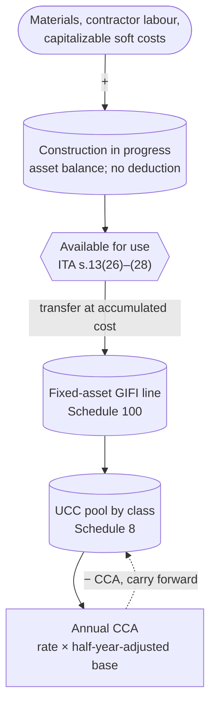
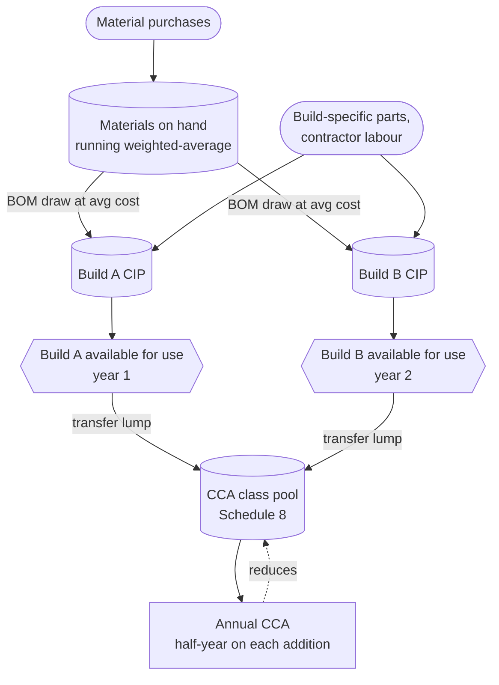

STATUS: AI GENERATED, REVIEW IN PROGRESS

# Materials and Construction in Progress <!-- [done] -->

**Who this is for**:
- Owners of a Canadian-controlled private corporation (CCPC)
- Buy materials, parts, or contractor labour to build one or more fixed assets for the corp's own use (not for resale)
- Need to translate those costs into ledger entries, a year-end balance sheet figure, and an eventual CCA-class transfer

**TLDR**:
- Materials bought to build a fixed asset for the corp's own use are *not* inventory
  - They accumulate in a `Construction in progress` (CIP) general-ledger account during construction
  - CIP is a balance-sheet asset account in the corp's chart of accounts
- CIP produces *no deduction* while construction is underway
  - Not inventory (so no COGS), and not yet available for use (so no CCA)
- On completion *and* available for use (ITA [s.13(26)](https://laws-lois.justice.gc.ca/eng/acts/I-3.3/section-13.html)), the accumulated CIP balance moves
  - It transfers into the appropriate CCA class and becomes the *capital cost* for that class
- From that point on, the cost is deducted year by year through annual CCA claims
  - See [Capital Cost Allowance](Capital-Cost-Allowance/Capital-Cost-Allowance.md) for the half-year rule, UCC mechanics, recapture, and terminal loss
- Building several assets at once from a shared stock of materials:
  - Track the materials in a running weighted-average pool
  - Charge each build's *bill of materials* (BOM) into its own CIP
  - Transfer each build to its CCA class on its own available-for-use date
  - Worked through in [Example 2](#example-2-multiple-builds-from-a-shared-materials-pool)

Limitations:
- Focus is on a typical owner-managed CCPC building one or more tangible fixed assets for its own use
  - A shed, a leasehold improvement, custom equipment
- Capitalizable cost build-up beyond materials and direct contractor labour is mentioned at a high level only
  - Factory overhead, indirect costs, allocated employee salaries on the project
- Soft costs during construction are out of scope
  - Interest under s.18(3.1), property taxes on the construction site, legal and accounting fees on a capital project
- Interest capitalization election under s.21 is out of scope
- Long-term construction contracts (a CCPC building for a customer) are inventory-side rules and not covered here
- Real-estate developer construction of land and buildings held for resale is inventory-side and out of scope
- The following is my understanding as of 2026

## In This Folder

- [Cost Recovery](Cost-Recovery.md): overview of the three cost-recovery channels and concept map
  - Also the shared acquisition-cost / available-for-use / change-of-use rules
- [Inventory](Inventory-And-COGS.md): goods held for resale
- [Capital Cost Allowance](Capital-Cost-Allowance/Capital-Cost-Allowance.md): depreciable property after the CIP transfer

## Two Destinations for Materials

Purchased materials follow one of two paths in a CCPC:
- *Materials held for resale*, or *to be combined into a product for resale*: inventory
  - Cost flows through COGS at sale; no amortization
- *Materials to be combined into a fixed asset for the corp's own use*: not inventory
  - The accumulated cost sits in a `Construction in progress` (CIP) asset account during construction
  - On completion and available-for-use, the cost transfers into the appropriate CCA class
  - From there it amortizes through annual CCA claims

The same lumber can take either path:
- Lumber bought by a furniture-maker CCPC to build chairs for sale:
  - Raw-materials inventory (GIFI 1126)
  - Cost flows to COGS as the chairs are sold
- Lumber bought by a service CCPC to build a shed on the corp's property for its own tool storage:
  - CIP (asset account, typically a sub-account under the relevant fixed-asset line on Schedule 100)
  - On completion the CIP balance transfers into a CCA class
    - Class 6 for a frame shed with no support below ground level, otherwise Class 1

Deduction timing by path:
- Inventory expensed at sale: deduction matches the revenue; no spreading over time
- Depreciable property via CCA: rate-bounded each year and discretionary
  - 10% declining for Class 6, 4% for Class 1
  - Nothing is deducted until the property is *available for use* (ITA [s.13(26)](https://laws-lois.justice.gc.ca/eng/acts/I-3.3/section-13.html))

Available-for-use rule for self-constructed assets:
- A shed under construction sits in CIP and produces no deduction
  - Not inventory (no COGS), not yet available for use (no CCA)
- *Available for use* for the shed follows the building test in s.13(28), not the non-building limbs of s.13(27)
  - The trigger is the earliest of three events
    - Substantially all of the building is first used for its intended purpose
    - The construction is complete
    - The second tax year after the acquisition year begins (the rolling-two-year rule)
- Until that point, accumulated costs sit as a non-deducting asset balance
- See [Cost Recovery — Available for use](Cost-Recovery.md#available-for-use) for the cross-channel framing
  - Including the building variant under s.13(28)

Change of use, finished item from the resale shelf into own use:
- A tool-retailer CCPC pulling a $1,200 saw from inventory into the workshop is a *change in use* event
- On CRA's position (archived IT-102R2) the conversion is not a disposition
  - The book entry transfers the unit's *inventory value* from inventory to a Class 8 fixed asset
  - That value becomes the capital cost
- CCA mechanics apply from the conversion date
- See [Cost Recovery — Change of use](Cost-Recovery.md#change-of-use) for the cross-channel framing
  - Including the contested s.45 / s.13(7) reading
  - Also the HST-side adjustment under ETA s.199(3) / s.200(2)

See [Capital Cost Allowance](Capital-Cost-Allowance/Capital-Cost-Allowance.md) for the half-year rule, UCC mechanics, recapture, and terminal loss.

## Bookkeeping and T2 Schedules

Self-constructed-asset materials are *not* in any of the 1120-series GIFI inventory codes.  
They sit in an asset account that rolls up to a fixed-asset GIFI code.  
Typically that is a `Construction in progress` sub-account within the relevant Schedule 100 fixed-asset line.  

On completion and available-for-use, the CIP balance transfers into the appropriate CCA class line on Schedule 100.  
The cost becomes the *capital cost* (the A element in the s.13(21) UCC formula) for that class on Schedule 8.  

With several builds running at once, each carries its own CIP balance.  
A spreadsheet split that reconciles to one CIP control account works too.  
Any shared `Materials on hand` pool sits in the same fixed-asset section, likewise outside the 1120-series codes.  
See [Multiple builds from a shared materials pool](#multiple-builds-from-a-shared-materials-pool).  

During construction:
- Schedule 100: CIP sits within the fixed-asset section; no inventory line touched
- Schedule 125: no cost-of-sales line touched; the materials never were inventory
- Schedule 8: no CCA class entry yet
- Schedule 1: no adjustment

After transfer:
- Schedule 100 fixed-asset line for the destination CCA class reflects the transferred cost
- Schedule 8 row for that class begins amortizing per the standard CCA mechanics; see [Capital Cost Allowance](Capital-Cost-Allowance/Capital-Cost-Allowance.md)

## CIP Flow

## Multiple Builds from a Shared Materials Pool

The single-build picture above is the base case: materials bought straight into one CIP balance.  
A corp building several fixed assets at once from a common stock of materials splits it into three layers.

*Layer 1, the materials pool*: materials bought before they are assigned to a specific build.  
They sit in a `Materials on hand` asset account, tracked at a running weighted-average cost per material.  
The tracking works exactly as an inventory pool would.  
It is *not* inventory: held to build own-use fixed assets, not for resale.  
So no s.10 valuation, no LCM write-down, and none of the 1120-series GIFI codes apply.

*Layer 2, per-build CIP*: each build is defined by a *bill of materials* (BOM).  
As a build consumes materials, their cost moves from the pool into that build's CIP at the running average.  
Build-specific purchases (a motor bought for one machine) are charged straight to that build's CIP, never pooled.  
Contractor labour and other capitalizable costs join the same CIP.  
Each build's CIP is its own cost balance.

*Layer 3, available-for-use to CCA*: each build transfers its accumulated CIP as a single lump.  
The lump lands in the build's CCA class on its *own* available-for-use date.  
Builds finishing in different years are separate class additions, each subject to the half-year rule in its own year.  
Two builds landing in the same class are two additions to one UCC pool.

Where the averaging lives:
- The weighted-average sits in Layer 1, on the pooled material
  - The pool is drawn down a BOM at a time and each draw needs a cost assigned to it
  - This is the same reason inventory uses a cost-flow assumption
- The Layer 3 transfer is still a lump per build
  - The averaging upstream and the lump transfer downstream are both true, at different layers
- Weighted-average is a reasonable and consistent choice for the pool
  - Unlike inventory there is no s.10(2.1) method-lock, since these materials are not inventory
  - Specific identification is tighter when materials are individually tagged and high-value

Year-end, before a build is available for use:
- Unconsumed pool and in-progress CIP are both non-deducting asset balances
  - No COGS (never inventory), no CCA (not yet available for use)
- The only tax event is a build reaching available-for-use
  - Until then the dollars sit, wherever they happen to be parked

Bookkeeping shortcut: a small corp often skips the separate `Materials on hand` account.  
Every material purchase debits a single `Construction in progress` control account instead.  
A spreadsheet that reconciles to the control balance keeps the per-material running average and the per-build BOM split.  
Both accounts are non-deducting capital-project assets in the same Schedule 100 section, so there is no tax difference.  
The spreadsheet carries the detail either way.  

## Worked Examples

Two walkthroughs: a single self-constructed asset, then several builds drawing from a shared materials pool.

### Example 1: Self-Constructed Shed

Setup: a small commercial-services CCPC builds a wood-frame storage shed on its rented business property.  
The shed houses tools and equipment.  
It has no support below ground level (skids on gravel pad), placing it in CCA Class 6 (10%, declining).  
Construction spans two fiscal years.  
Calendar fiscal year (Jan 1 to Dec 31) is assumed.  
The corp is HST-registered and claims ITCs on all eligible inputs.

Year 1 (2026):

Mar 1 2026, buy $4,000 of lumber + framing hardware:
- Debit `Construction in progress` (asset account; not GIFI 1121) = $4,000
- Debit `HST receivable` = $520
- Credit `Cash` = $4,520

Sep 1 2026, buy $2,000 of roofing materials and fasteners:
- Debit `Construction in progress` = $2,000
- Debit `HST receivable` = $260
- Credit `Cash` = $2,260

Dec 31 2026, shed not yet available for use:
- CIP balance: $6,000
- COGS deduction in 2026: $0 (the materials are not inventory)
- CCA deduction in 2026: $0 (the asset is not available for use)
- Schedule 100: CIP sits within the fixed-asset section; no inventory line touched
- Schedule 125: no purchases line touched; the materials never were inventory
- Schedule 8: no Class 6 entry yet

Year 2 (2027):

Mar 1 2027, buy $3,000 more lumber, $500 windows, $500 door:
- Debit `Construction in progress` = $4,000
- Debit `HST receivable` = $520
- Credit `Cash` = $4,520

Aug 1 2027, pay a contractor $1,500 for labour to finish the build:
- Debit `Construction in progress` = $1,500
- Debit `HST receivable` = $195
- Credit `Cash` = $1,695

Sep 1 2027, available-for-use date (construction complete, shed in service for tool storage).

Transfer entry, Sep 1 2027:
- Debit `Buildings - cost - Class 6` (Schedule 100 fixed-asset line for Class 6) = $11,500
- Credit `Construction in progress` = $11,500

The Schedule 8 figures below use the plain half-year basis.  
This 2027 in-service date actually falls under the reinstated AIIP (enhanced first-year CCA, half-year rule suspended).  
AIIP is covered in [Capital Cost Allowance](Capital-Cost-Allowance/Capital-Cost-Allowance.md).  

Schedule 8 year 2 (2027), Class 6 row:
- Opening UCC: $0
- Cost of additions: $11,500
- Dispositions: $0
- Half-year-adjusted base: $5,750
- Class 6 rate: 10%
- CCA: 10% × $5,750 = $575
- Closing UCC: $11,500 − $575 = $10,925

Schedule 125 year 2 (2027):
- Cost-of-sales section: no entries from the shed project (it never was inventory)
- Operating expenses: `8670 Amortization of tangible assets` reflects the book amortization posted
  - For the shed and any other tangibles
- Schedule 1 then adds back book amortization and deducts CCA (the $575 from Schedule 8)
  - See [Capital Cost Allowance](Capital-Cost-Allowance/Capital-Cost-Allowance.md) for the reconciliation mechanics

Contrast with [Inventory](Inventory-And-COGS.md):
- The same dollars as resale inventory would have flowed through COGS within a year or two
- As own-use construction inputs, the same dollars flow through CCA on the Class 6 geometric tail
  - 10% declining; ~96% of cost expensed by year 30

### Example 2: Multiple Builds from a Shared Materials Pool

Setup: a metal-fabrication services CCPC builds two custom machines for its own workshop.  
Both draw from a shared stock of steel plate.  
Both machines are destined for CCA Class 8 (20%, declining), the catch-all for equipment.  
Construction overlaps and the two finish in different years.  
Calendar fiscal year (Jan 1 to Dec 31) is assumed.  
The corp is HST-registered and claims ITCs on all eligible inputs.  
To keep the focus on the pool and the staggered completions, the Schedule 8 figures below use the plain half-year basis.  
These 2026 and 2027 in-service dates actually fall under the reinstated AIIP.  
AIIP (enhanced first-year CCA, half-year rule suspended) is covered in [Capital Cost Allowance](Capital-Cost-Allowance/Capital-Cost-Allowance.md).  

The corp keeps a `Materials on hand` pool for steel (running weighted-average per kg).  
Each build carries its own separate CIP balance.  

Year 1 (2026):

Jan 10 2026, buy 1,000 kg steel at $5.00/kg = $5,000:
- Debit `Materials on hand` = $5,000
- Debit `HST receivable` = $650
- Credit `Cash` = $5,650
- Pool: 1,000 kg, $5,000, average $5.00/kg

Feb to Mar 2026, Build A's BOM draws 600 kg of steel:
- Debit `Construction in progress - Build A` = 600 × $5.00 = $3,000
- Credit `Materials on hand` = $3,000
- Pool: 400 kg, $2,000, average still $5.00/kg

May 1 2026, buy 600 kg steel at $7.00/kg = $4,200 (supplier price rose):
- Debit `Materials on hand` = $4,200
- Debit `HST receivable` = $546
- Credit `Cash` = $4,746
- Pool: 1,000 kg, $6,200, new average = $6,200 / 1,000 = $6.20/kg

Jun 2026, Build B's BOM draws 500 kg of steel:
- Debit `Construction in progress - Build B` = 500 × $6.20 = $3,100
- Credit `Materials on hand` = $3,100
- Pool: 500 kg, $3,100, average still $6.20/kg

The same steel costs Build A $5.00/kg and Build B $6.20/kg.  
Identical material, different cost, set by when each build drew from the pool.  
This is the averaging the single-shed example never needed.

Aug 2026, pay a contractor $2,000 for Build A labour:
- Debit `Construction in progress - Build A` = $2,000
- Debit `HST receivable` = $260
- Credit `Cash` = $2,260
- Build A CIP: $3,000 steel + $2,000 labour = $5,000

Sep 2026, buy a $1,500 motor specific to Build B (charged straight to the build, not pooled):
- Debit `Construction in progress - Build B` = $1,500
- Debit `HST receivable` = $195
- Credit `Cash` = $1,695
- Build B CIP: $3,100 steel + $1,500 motor = $4,600

Oct 1 2026, Build A complete and available for use:
- Debit `Equipment - cost - Class 8` (Schedule 100 fixed-asset line) = $5,000
- Credit `Construction in progress - Build A` = $5,000

Dec 31 2026, year-end, Build B still under construction:
- `Materials on hand`: 500 kg × $6.20 = $3,100 (non-deducting)
- `Construction in progress - Build B`: $4,600 (non-deducting)
- COGS deduction: $0 (never inventory)
- Build B CCA deduction: $0 (not yet available for use)

Schedule 8 year 1 (2026), Class 8 row:
- Opening UCC: $0
- Cost of additions: $5,000 (Build A)
- Dispositions: $0
- Half-year-adjusted base: $2,500
- Class 8 rate: 20%
- CCA: 20% × $2,500 = $500
- Closing UCC: $5,000 − $500 = $4,500

Year 2 (2027):

Jan to Feb 2027, pay a contractor $2,400 for Build B labour:
- Debit `Construction in progress - Build B` = $2,400
- Debit `HST receivable` = $312
- Credit `Cash` = $2,712
- Build B CIP: $4,600 + $2,400 = $7,000

Mar 1 2027, Build B complete and available for use:
- Debit `Equipment - cost - Class 8` = $7,000
- Credit `Construction in progress - Build B` = $7,000

The 500 kg of steel left in `Materials on hand` ($3,100) carries forward as a non-deducting asset.  
It stays there until a future build consumes it.  

Schedule 8 year 2 (2027), Class 8 row:
- Opening UCC: $4,500 (carried from Build A)
- Cost of additions: $7,000 (Build B)
- Dispositions: $0
- Half-year-adjusted base: $4,500 + ($7,000 − ½ × $7,000) = $8,000
- Class 8 rate: 20%
- CCA: 20% × $8,000 = $1,600
- Closing UCC: $4,500 + $7,000 − $1,600 = $9,900

Two builds, one class, two staggered additions.  
Each is half-year-adjusted in the year it became available for use.  
From year 2 they depreciate together as one Class 8 pool.  
Build B's pre-completion costs produced no deduction in 2026; the trigger was available-for-use, not spend.

On the schedules:
- No cost-of-sales entries in either year (never inventory)
- Schedule 8 carries the Class 8 pool above
- Schedule 1 reconciles book amortization to CCA if the corp keeps full accounting books rather than a tax basis
  - See [Capital Cost Allowance](Capital-Cost-Allowance/Capital-Cost-Allowance.md)

## Out of Scope

- Capitalizable cost build-up beyond direct materials and contractor labour
  - Factory-overhead allocation, employee labour on the project, equipment rental, site preparation
- Soft costs during construction
  - Interest under ITA s.18(3.1), property taxes on the construction site
  - Legal and accounting fees attributable to a capital project
- Interest capitalization election under ITA s.21
- Book-vs-tax impairment differences
  - ASPE Section 3061 and IFRS IAS 36 allow impairment write-downs on CIP that have no tax effect
  - The book write-down is added back on Schedule 1
  - CCA continues from the unimpaired UCC once the asset is available for use
- Long-term construction contracts (a CCPC building for a customer)
  - Percentage-of-completion under s.9, with archived IT-92R2 as guidance
  - Inventory-side rules, not the self-constructed-asset path
- Real-estate developer construction of land and buildings held for resale (inventory-side rules)

## Related

- [Cost Recovery](Cost-Recovery.md)
- [Inventory](Inventory-And-COGS.md)
- [Capital Cost Allowance](Capital-Cost-Allowance/Capital-Cost-Allowance.md)
- [Small Business Tax Overview](../../Overview/Small-Business-Tax.md)
- [HST](../HST/HST.md)
- [Glossary](../../Overview/Glossary.md)

## Citations

- Income Tax Act (R.S.C., 1985, c. 1 (5th Supp.)): https://laws-lois.justice.gc.ca/eng/acts/I-3.3/
  - [s.13(21)](https://laws-lois.justice.gc.ca/eng/acts/I-3.3/section-13.html) - definition of "capital cost" (the A element in the UCC formula)
  - [s.13(26)](https://laws-lois.justice.gc.ca/eng/acts/I-3.3/section-13.html) - available-for-use rule for depreciable property
  - [s.13(27)](https://laws-lois.justice.gc.ca/eng/acts/I-3.3/section-13.html) - rolling-two-year / 357-day deeming rule (non-buildings)
  - [s.13(28)](https://laws-lois.justice.gc.ca/eng/acts/I-3.3/section-13.html) - available-for-use rule for buildings (the 357-day variant; governs the shed)
  - [s.18(1)(b)](https://laws-lois.justice.gc.ca/eng/acts/I-3.3/section-18.html) - exclusion of capital expenditures
    - The rule that pushes self-constructed-asset materials out of COGS and into the CCA path
- CRA T2 SCH 100 - Balance Sheet Information: https://www.canada.ca/en/revenue-agency/services/forms-publications/forms/t2sch100.html
- CRA T2 SCH 8 - Capital Cost Allowance: https://www.canada.ca/en/revenue-agency/services/forms-publications/forms/t2sch8.html
- CRA Income Tax Folio S3-F4-C1 - General Discussion of Capital Cost Allowance: https://www.canada.ca/en/revenue-agency/services/tax/technical-information/income-tax/income-tax-folios-index/series-3-property-investments-savings-plans/series-3-property-investments-savings-plans-folio-4-capital-cost-allowance/income-tax-folio-s3-f4-c1-general-discussion-capital-cost-allowance.html
- CRA Interpretation Bulletin IT-102R2 (archived) - Conversion of property, other than real property, from or to inventory: https://www.canada.ca/en/revenue-agency/services/forms-publications/publications/it102r2.html

## TODO

- Capitalizable costs into CIP: which categories are added to CIP during construction vs staying period expenses
  - Direct materials, contractor labour, allocated employee labour on the project, equipment rental, site preparation
- Soft costs under ITA s.18(3.1)
  - Treatment of interest, property tax, legal and accounting fees attributable to construction of a capital asset
- Interest capitalization election under ITA s.21: when it applies, mechanics, interaction with s.18(3.1)
- Book-vs-tax differences
  - ASPE Section 3061 and IFRS IAS 36 impairment write-downs on CIP and the Schedule 1 tax-side reversal
- More worked examples
  - Leasehold improvement on rented business premises
  - A Class 43 M&P-equipment destination (Class 53 before 2026)
  - Cost overruns mid-project
