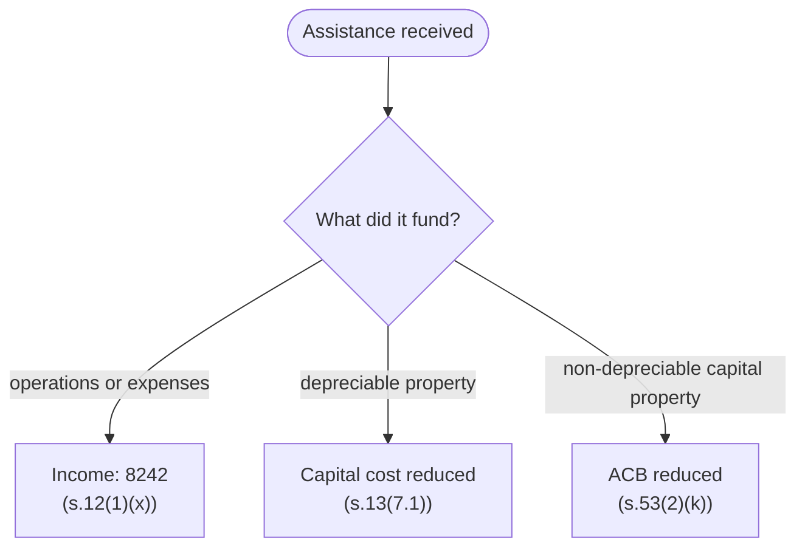

STATUS: AI GENERATED, REVIEW IN PROGRESS

# Government Assistance

**Who this is for**:
- Owners of a Canadian-controlled private corporation (CCPC) receiving a grant, subsidy, training or hiring incentive, or forgivable loan

**TLDR**:
- The same assistance dollar lands in one of three places, decided by what it funded:
  - General or expense-funding assistance: income (`8242` Subsidies and grants), under ITA s.12(1)(x)
  - Assistance toward depreciable property: reduces the capital cost, so CCA shrinks (s.13(7.1))
  - Assistance toward non-depreciable capital property: reduces the ACB (s.53(2)(k))
- A forgivable loan is assistance when *received*, not when later forgiven
- A repayment reverses the treatment: deducted if the amount was income, added back if it reduced a cost base
- Assistance itself normally carries no GST/HST

Limitations:
- Scope is the programs a small corporation actually meets: provincial grants, hiring and training subsidies, digital-adoption programs, forgivable loans
- Scientific research (SR&ED) and investment-tax-credit interactions are out of scope
- Whether a specific program's payment is assistance, a loan, or consideration for services turns on its terms; read the agreement
- The following is my understanding as of 2026

## The Three Destinations

Assistance follows what it funded:

ITA [s.12(1)(x)](https://laws-lois.justice.gc.ca/eng/acts/I-3.3/section-12.html) is the catch-all: grants, subsidies, forgivable loans, deductions from tax, allowances, and any other inducement or assistance received in the course of earning income are included in income when received.  
The cost-base reductions are the carve-outs: an amount that reduced a capital cost or ACB is not also income.  
The result is one taxation of the dollar, at the speed of the thing it funded — immediately for expenses, over the CCA life for equipment, at disposition for land.  

## Assistance Toward Expenses

The default booking, for a $3,000 hiring subsidy received in cash:
- Debit `Cash` (GIFI 1001) = $3,000
- Credit `Subsidies and grants` (GIFI 8242) = $3,000

The gross method above keeps the funded expense on its own line at full cost.  
An election under [s.12(2.2)](https://laws-lois.justice.gc.ca/eng/acts/I-3.3/section-12.html) can instead reduce the outlay or expense the assistance reimbursed; income and expense shrink together.  
Either way the year's net income is the same; pick the gross method unless the accountant prefers otherwise.  

## Assistance Toward Depreciable Property

ITA [s.13(7.1)](https://laws-lois.justice.gc.ca/eng/acts/I-3.3/section-13.html) reduces the property's capital cost by the assistance, so the CCA base shrinks.  

A $20,000 Class 8 machine with a $5,000 provincial equipment grant:
- Capital cost for CCA: $20,000 − $5,000 = $15,000
- The Class 8 addition on Schedule 8 is $15,000, and every year's CCA runs on that reduced base
- In the books, record the asset net so books and tax agree:
  - Debit `Machinery and equipment` (GIFI 1740) = $20,000, Credit `Cash` = $20,000 (the purchase)
  - Debit `Cash` = $5,000, Credit `Machinery and equipment` (1740) = $5,000 (the grant)

See [Capital Cost Allowance](Cost-Recovery/Capital-Cost-Allowance/Capital-Cost-Allowance.md) for the pool mechanics.  
An inducement that would otherwise be s.12(1)(x) income can also be elected against the capital cost of related property ([s.13(7.4)](https://laws-lois.justice.gc.ca/eng/acts/I-3.3/section-13.html)).  

For *non-depreciable* capital property (land, portfolio shares), the same logic runs through the ACB: [s.53(2)(k)](https://laws-lois.justice.gc.ca/eng/acts/I-3.3/section-53.html) reduces it by the assistance, net of repayments.  
The tax arrives at disposition, through a larger capital gain; see [Adjusted Cost Base](../Investments/Adjusted-Cost-Base/Adjusted-Cost-Base.md).  

## Forgivable Loans

A *forgivable loan* is listed as a form of assistance in both s.12(1)(x) and s.13(7.1).  
It is assistance when received — the inclusion or cost-base reduction does not wait for the forgiveness to be earned.  
(The CEBA program's forgivable portion worked this way: income in the year the loan was received.)  

If events turn and the corporation must repay:
- An amount that was income deducts in the year repaid under a legal obligation (ITA [s.20(1)(hh)](https://laws-lois.justice.gc.ca/eng/acts/I-3.3/section-20.html))
- An amount that reduced a capital cost or ACB adds back on repayment (the repayment limbs of s.13(7.1) and s.53(2)(k))

A loan on ordinary repayment terms with no forgiveness feature is just debt; see [Debt and Financing](Debt-And-Financing.md).  

## HST on Assistance

A grant or subsidy given without a supply back to the grantor is not consideration, so no GST/HST attaches to receiving it (CRA Technical Information Bulletin B-067).  
The label does not control: a "grant" that in substance buys deliverables for the grantor is consideration for a taxable supply.  
ITCs on the funded purchases are unaffected — the corporation paid the HST on them either way.  

## Related

- [Debt and Financing](Debt-And-Financing.md)
- [Capital Cost Allowance](Cost-Recovery/Capital-Cost-Allowance/Capital-Cost-Allowance.md)
- [Expense Classification](../Bookkeeping/Expense-Classification.md)
- [Ledger and Accounts](../Bookkeeping/Ledger-And-Accounts.md) (`8242` in the chart of accounts)
- [Adjusted Cost Base](../Investments/Adjusted-Cost-Base/Adjusted-Cost-Base.md)

## Citations

- Income Tax Act (R.S.C., 1985, c. 1 (5th Supp.)):
  - [s.12(1)(x)](https://laws-lois.justice.gc.ca/eng/acts/I-3.3/section-12.html) - inducements and assistance included in income, with the cost-reduction carve-outs
  - [s.12(2.2)](https://laws-lois.justice.gc.ca/eng/acts/I-3.3/section-12.html) - election to reduce the reimbursed outlay or expense instead
  - [s.13(7.1)](https://laws-lois.justice.gc.ca/eng/acts/I-3.3/section-13.html) - assistance reduces the capital cost of depreciable property; repayments add back
  - [s.13(7.4)](https://laws-lois.justice.gc.ca/eng/acts/I-3.3/section-13.html) - election to apply an inducement against capital cost
  - [s.53(2)(k)](https://laws-lois.justice.gc.ca/eng/acts/I-3.3/section-53.html) - assistance reduces the ACB of non-depreciable property, net of repayments
  - [s.20(1)(hh)](https://laws-lois.justice.gc.ca/eng/acts/I-3.3/section-20.html) - deduction for repaying an amount that was included under s.12(1)(x)
- CRA Technical Information Bulletin B-067 - Goods and Services Tax Treatment of Grants and Subsidies: https://www.canada.ca/en/revenue-agency/services/forms-publications/publications/b-067.html

## TODO

- Verify the *excluded loan* carve-out added to s.12(1)(x) (post-2019) and whether it changes the forgivable-loan timing for any current program
- Confirm the B-067 link target and its current administrative status
