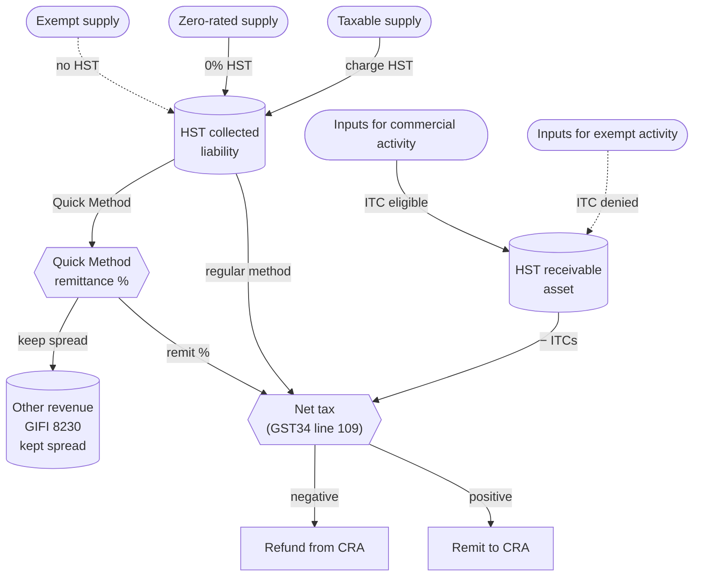

STATUS: AI GENERATED, REVIEW IN PROGRESS

# GST/HST

**Who this is for**:
- Owners of a Canadian-controlled private corporation (CCPC)
- Registered, or considering registering, for GST/HST

**Topics**:
- Registration decision
- Bookkeeping for tax collected and paid
- Periodic GST34 return
- Choice between the regular method and the Quick Method

**TLDR**:
- *Goods and Services Tax / Harmonized Sales Tax* (GST/HST) is a federal *value-added tax* under the *[Excise Tax Act](https://laws-lois.justice.gc.ca/eng/acts/E-15/)* (ETA), administered by CRA but filed separately from the T2 on its own program account
- The *small supplier* threshold is $30,000 of worldwide taxable supplies over a rolling four-quarter window, or in any single calendar quarter (ETA [s.148](https://laws-lois.justice.gc.ca/eng/acts/E-15/section-148.html)); voluntary registration is available below the threshold and is often worthwhile when inputs carry recoverable HST
- *HST provinces*: Ontario (13%), Nova Scotia (14% effective Apr 1 2025; 15% before), New Brunswick (15%), Newfoundland and Labrador (15%), Prince Edward Island (15%); the rest charge 5% GST only, with PST or QST handled separately by the province
- Two filing methods: *Regular method* remits (output tax collected) − (input tax credits claimed); *Quick Method* (RC4058) remits a fixed percentage of GST/HST-inclusive revenue and lets you keep the rest as taxable income, subject to a $400,000 eligibility cap and a list of ineligible professions
- Reporting period is assigned by prior-year taxable supplies: annual ≤ $1.5M, quarterly $1.5M–$6M, monthly > $6M; annual filers with net tax of $3,000 or more also pay quarterly instalments
- Mandatory electronic filing for reporting periods beginning on or after 2024-01-01; remittances of $10,000 or more must be paid electronically

Limitations:
- Focus is on a typical owner-managed CCPC making taxable supplies of goods or services in Canada; the charity, public-service-body, listed-financial-institution, and selected-listed-financial-institution (SLFI) regimes are out of scope
- PST (British Columbia, Saskatchewan, Manitoba) and QST (Quebec) follow similar value-added or single-stage mechanics but are administered separately by each provincial revenue authority; this page touches on them only where they interact with HST cost capitalization
- Real-estate self-supply, the new-housing rebate, place-of-supply rules for digital products and telecommunications, and the imported-services self-assessment under ETA [s.218.1](https://laws-lois.justice.gc.ca/eng/acts/E-15/section-218.1.html) are touched on but not worked through
- Tax information can change (e.g. the Nova Scotia rate dropped from 15% to 14% on 2025-04-01); always verify rates and thresholds against current CRA publications before relying on them
- The following is my understanding as of 2026

## Registration

Registration is mandatory once worldwide *taxable supplies* exceed $30,000:
- Over the immediately preceding four consecutive calendar quarters, *or*
- In any single calendar quarter (the *blow-out* test in ETA [s.148(2)](https://laws-lois.justice.gc.ca/eng/acts/E-15/section-148.html))

Two clocks run once the threshold is crossed, and the effective date depends on which test tripped:
- *Effective date of registration*:
  - Single-quarter blow-out (s.148(2)): the day of the supply that put the corp over $30,000 within the quarter; that supply and every later one are taxable, with no grace period
  - Four-quarter test (s.148(1)): the corp stays a small supplier through the end of the month following the quarter in which it crossed, so the crossing supplies are not taxable; registration takes effect from the end of that grace
- *Filing deadline for the registration application*: 29 days after the day the corp is first required to be registered (ETA [s.240(2.1)](https://laws-lois.justice.gc.ca/eng/acts/E-15/section-240.html))

*Taxable supplies* for this test include zero-rated supplies (such as services to non-residents; see [Zero-rated supplies](#zero-rated-supplies) below) but exclude *exempt* supplies (most financial services, residential rent, basic health and dental care, most child-care and educational services).  
*Associated* corporations' taxable supplies aggregate with the corp's own when applying the test (the *associate* definition is in ETA [s.148(4)](https://laws-lois.justice.gc.ca/eng/acts/E-15/section-148.html)); a group of associated CCPCs cannot stay below the threshold by splitting revenue across entities.  

Voluntary registration is available below the threshold (ETA [s.240(3)](https://laws-lois.justice.gc.ca/eng/acts/E-15/section-240.html)):
- The corp can claim ITCs on inputs from day one of registration, which is the main reason to register voluntarily
- The corp must charge GST/HST on every taxable supply going forward and meet all filing and remittance obligations
- A common pattern: register voluntarily at incorporation when the corp expects to exceed $30,000 within the first year, to avoid a mid-year change-over

Specific situations override the small-supplier rule:
- Taxi and ride-share operators must register regardless of revenue (ETA s.240(1.1))
- Non-resident vendors of digital services to Canadian consumers register under the simplified regime (ETA Subdivision E of Division II); out of scope for a Canada-resident CCPC

How to register:
- *Business Registration Online* (BRO) through CRA: fastest for a new corp that already has a *Business Number* (BN)
- CRA *My Business Account*: for an existing BN, add the `RT` program account
- Form *RC1 Request for a Business Number*: paper fallback

## Rates and Place of Supply

Rate by province as of 2026:
- *Ontario*: 13% HST
- *Nova Scotia*: 14% HST (effective 2025-04-01; 15% before; transitional rules in CRA Notice 342 governed straddling supplies)
- *New Brunswick, Newfoundland and Labrador, Prince Edward Island*: 15% HST
- *British Columbia, Saskatchewan, Manitoba, Yukon, Northwest Territories, Nunavut*: 5% GST only (BC and Manitoba charge 7% PST in addition; Saskatchewan charges 6% PST; territories add no provincial sales tax)
- *Alberta*: 5% GST only
- *Quebec*: 5% GST plus 9.975% QST administered by Revenu Québec

The rate charged on a given supply is set by the *place of supply* rule, not by where the supplier is located (ETA Schedule IX for goods; the New Harmonized Value-added Tax System Regulations, SOR/2010-117 s.13, for services and intangible personal property; CRA GST/HST Memorandum 3-3-2 for provincial guidance):
- *Goods*: rate of the province where the goods are delivered or made available to the recipient
- *Services*: generally the rate of the province where the recipient's business or home address is, with category-specific rules for real-property services, services in respect of tangible property, and so on
- *Intangible personal property* (licences, IP rights, digital content): place of supply turns on where the property can be used and the recipient's business address

PST and QST are not HST:
- PST is a single-stage retail sales tax with no equivalent to the input tax credit; the corp pays PST on inputs and absorbs it into landed cost or capital cost
- QST runs alongside GST under a parallel ITC-equivalent regime called *ITR* (input tax refund); a Quebec-based corp tracks GST and QST separately and files them on a combined Revenu Québec return

## Program Account and CRA Mechanics

GST/HST sits under the `RT` program account, distinct from `RC` for corporate income tax and `RP` for payroll.  
A typical *Business Number* (BN) takes the shape `123456789RT0001`: nine-digit BN, two-letter program identifier, four-digit reference suffix.  
The suffix increments when a corp opens additional GST/HST accounts (rare for an owner-managed CCPC; most run a single `RT0001`).  

The standard filing surface:
- CRA *My Business Account* is the corp-side portal; an *authorized representative* can file on behalf of the corp through *Represent a Client*
- Form *GST34-2* is the personalized return CRA mails (or makes available electronically) to the corp; the access code on it is required for electronic filing under most channels
- Form *GST34-3* is the non-personalized version for registrants without a GST34-2 on file
- Mandatory electronic filing applies to all GST/HST registrants for reporting periods beginning on or after 2024-01-01, with limited exceptions for charities and SLFIs (ETA [s.278.1](https://laws-lois.justice.gc.ca/eng/acts/E-15/section-278.1.html))
- Remittances of $10,000 or more must be paid electronically (ETA [s.278(3)](https://laws-lois.justice.gc.ca/eng/acts/E-15/section-278.html))

## Reporting Periods and Deadlines

Reporting period is assigned automatically based on prior-year *taxable supplies* (ETA [s.245](https://laws-lois.justice.gc.ca/eng/acts/E-15/section-245.html)):
- ≤ $1.5M: *annual* reporting period (default for most owner-managed CCPCs)
- $1.5M to $6M: *quarterly*
- \> $6M: *monthly*

A corp can elect to file more frequently than its assigned period (ETA [s.246](https://laws-lois.justice.gc.ca/eng/acts/E-15/section-246.html)), useful when the corp consistently runs in a refund position because its inputs carry more HST than its sales generate.  

Filing and remittance deadlines:
- *Annual filer*: return and balance due 3 months after fiscal year-end (e.g. Mar 31 for a Dec 31 year-end)
- *Quarterly filer*: return and balance due 1 month after each calendar quarter-end
- *Monthly filer*: return and balance due 1 month after each calendar month-end
- *Annual instalments*: an annual filer with net tax of $3,000 or more must pay quarterly instalments at one-quarter of the instalment base (the lesser of the prior year's net tax and the current year's estimate), with the year-end return reconciling to the actual figure (ETA [s.237](https://laws-lois.justice.gc.ca/eng/acts/E-15/section-237.html))

For the full overview of CCPC filing-deadline cadence including the T2, T4/T5 slips, and payroll source deductions alongside GST/HST, see [Small Business Tax Overview](../Overview/Small-Business-Tax.md#filing-deadlines-and-instalments).

## When Tax Becomes Payable

The rate and place-of-supply rules fix *how much* HST applies; a separate rule fixes *when* the liability arises: the *tax point*.  
HST is payable on the earlier of the day the consideration is paid and the day it becomes *due* (ETA [s.168(1)](https://laws-lois.justice.gc.ca/eng/acts/E-15/section-168.html)).  

Consideration becomes due on the earliest of (ETA [s.152(1)](https://laws-lois.justice.gc.ca/eng/acts/E-15/section-152.html)):
- The earlier of the *date of the invoice* and the day the supplier *first issues* it (s.152(1)(a))
- The day the supplier *would have* issued the invoice but for undue delay (s.152(1)(b))
- The day the recipient must pay under a *written agreement* (s.152(1)(c))

For a service CCPC that bills on completion with no earlier payment and no written due date, the tax point is the *invoice date*.  
Because s.152(1)(a) takes the earlier of the invoice date and the issue date, back-dating an invoice pulls the tax point earlier, and post-dating it cannot defer the tax point past the issue date.  
The undue-delay rule (s.152(1)(b)) stops a registrant from deferring HST by sitting on an invoice for work already complete.  

This tax point dates every entry in the bookkeeping section below: `HST collected` is recognized in the reporting period that contains the tax point, not when the cash arrives.  
For a foreign-currency supply, the same tax-point date sets the rate used to convert the HST to CAD (ETA [s.159](https://laws-lois.justice.gc.ca/eng/acts/E-15/section-159.html)); see [Foreign Currency](../Bookkeeping/Foreign-Currency.md#taxable-usd-supplies-and-hst).  

### Year-End Straddle: Income vs HST Timing

Income tax and HST run on different clocks, so a supply near year-end can fall in two different periods.  
Corporate income is recognized when *earned* (when the amount becomes receivable under ITA [s.9](https://laws-lois.justice.gc.ca/eng/acts/I-3.3/section-9.html) and [s.12(1)(b)](https://laws-lois.justice.gc.ca/eng/acts/I-3.3/section-12.html)), which for completed services is when the work is done.  
The HST tax point follows the s.152 rule above instead.  

Work finished on Dec 31 but invoiced in January is the common case:
- *Income*: belongs to the year the work was done (earned Dec 31), whatever the invoice date
- *HST*: if the invoice is dated and issued in January, the tax point is January and the HST belongs to the next reporting period

Dating the invoice Dec 31 (legitimate when the work was complete that day) collapses both into the earlier year through the s.152(1)(a) invoice-date prong.  
Dating it in January splits them, and the books need a *year-end revenue accrual* to record the income in the year it was earned while the HST stays in the next period:

Dec 31 — accrue the earned revenue; no HST, because the tax point has not arrived:
- Debit `Accrued/unbilled receivable` (GIFI 1480, *Other current assets*) = net fee
- Credit `Trade sales of goods and services` (GIFI 8000) = net fee

January — issue the invoice; reclassify the receivable and add the HST at its own tax point:
- Debit `Accounts receivable` (GIFI 1060) = fee + HST
- Credit `Accrued/unbilled receivable` (GIFI 1480) = net fee
- Credit `HST collected` = HST

The accrual carries *revenue only*; `HST collected` is recognized in January with the invoice, because that is when the tax point occurs.  
`HST collected` is a liability, not income, so moving it between periods changes only which GST34 return reports it — not taxable income in either year.  
There is no dedicated GIFI line for unbilled service revenue: map it to *Other current assets* (1480) to keep it distinct from billed trade AR, or fold it into *Accounts receivable* (1060) when the accrual reverses within days.  
Manufacturing WIP (1125) is a different item — partially completed goods, not earned-but-unbilled service fees.  

## Bookkeeping Accounts

Two ledger accounts run alongside the corp's commercial activity through each reporting period:
- `HST receivable` (asset): every input tax credit (ITC) the corp accrues; closed out against `HST payable` at the period-end net-tax calculation
- `HST collected` or `HST payable` (liability): every dollar of HST the corp charges on a taxable supply; closed out against `HST receivable` at period-end

This account naming is the canonical convention used in the worked examples on [Inventory](Cost-Recovery/Inventory-And-COGS.md), [Capital Cost Allowance](Cost-Recovery/Capital-Cost-Allowance/Capital-Cost-Allowance.md), and [Materials and CIP](Cost-Recovery/Materials-And-CIP.md).  

Posting pattern on a sale to a Canadian customer (HST-registered Ontario corp):
- Debit `Cash` or `Accounts receivable` = sale price + 13% HST
- Credit `Trade sales of goods and services` (GIFI 8000) = sale price (net of HST)
- Credit `HST collected` = 13% × sale price

Posting pattern on a purchase from an HST-registered supplier:
- Debit the expense or asset account = invoice net of HST
- Debit `HST receivable` = HST on the invoice (the future ITC)
- Credit `Cash` or `Accounts payable` = gross invoice

Posting pattern at the close of a reporting period (regular method):
- Debit `HST collected` = closing balance
- Credit `HST receivable` = closing balance
- Credit `HST remittance payable` (or debit `HST refund receivable`) = the net of the two

Under the *Quick Method* the posting pattern differs:
- The corp still charges 13% HST (or the applicable rate) on each sale and posts the full gross amount to `HST collected`
- ITCs on operating inputs are *not* claimed and `HST receivable` carries only ITCs on capital purchases (see [Quick Method](#quick-method) below)
- At period-end, the difference between `HST collected` and the *Quick Method remittance* is credited to `Other revenue` (GIFI 8230) rather than netting through `HST receivable`

## Regular Method and Input Tax Credits

Under the *regular method*, net tax for a reporting period is computed on the GST34 return as:
- Line 101: total revenue from taxable supplies (sales, including zero-rated, excluding HST charged)
- Line 105: total GST/HST collected and collectible
- Line 108: total ITCs claimed
- Line 109: net tax (line 105 − line 108)

ITC eligibility (ETA [s.169](https://laws-lois.justice.gc.ca/eng/acts/E-15/section-169.html)):
- The corp must be a GST/HST registrant at the time the HST became payable on the input
- The input must be acquired for consumption, use, or supply in the corp's *commercial activity* (i.e. supporting taxable supplies, including zero-rated; not supporting exempt supplies)
- The corp must hold supporting documentation that meets the prescribed *documentary requirements* (below)

Documentary requirements escalate with invoice size (ETA Regulations, *Input Tax Credit Information (GST/HST) Regulations*; CRA GST/HST Memorandum 8.4):
- *Under $100*: supplier (or intermediary) name, transaction date, total amount paid
- *$100 to $499.99*: the above plus the supplier's GST/HST registration number, plus an indication of whether HST is included or extra
- *$500 or more*: the above plus the recipient's name, terms of payment, and a description of each supply
- Missing the supplier's registration number on a $100+ invoice is the most common reason CRA disallows an ITC on audit; verify the number against the [GST/HST Registry](https://www.canada.ca/en/revenue-agency/services/tax/businesses/topics/gst-hst-businesses/confirming-a-gst-hst-account-number.html) for any new supplier

Specific limits and denials:
- *Meals and entertainment*: ITC limited to 50% of the HST paid (ETA [s.236](https://laws-lois.justice.gc.ca/eng/acts/E-15/section-236.html)), mirroring the income-tax 50% limit under ITA s.67.1
- *Club memberships and dining/recreational facility fees*: ITC denied (ETA [s.170(1)(a)](https://laws-lois.justice.gc.ca/eng/acts/E-15/section-170.html))
- *Passenger vehicles*: ITC capped at the $39,000 + applicable taxes Class 10.1 ceiling (ETA s.201); see [Capital Cost Allowance](Cost-Recovery/Capital-Cost-Allowance/Capital-Cost-Allowance.md) for the Class 10.1 mechanics that mirror this
- *Capital personal property used partly for personal purposes* (e.g. a vehicle or computer): all-or-nothing under ETA [s.199](https://laws-lois.justice.gc.ca/eng/acts/E-15/section-199.html) — full ITC if business use exceeds 50%, no ITC if 50% or less; this is not a sliding proration (the 10%–90% proration is the capital-*real*-property rule, not the rule for a corporation's capital personal property); for the income-tax side of the same mixed use (per-km allowance, standby charge, shareholder benefits) see [Owner-corporation transactions](../Paying-Yourself/Owner-Corporation-Transactions.md)
- *Property and services acquired for making exempt supplies*: ITC denied (a typical CCPC has no exempt supplies, but residential rent and most financial services are common exempt categories that block ITCs on the related inputs)

Time limits:
- *Most registrants*: 4 years from the due date of the return in which the ITC could first have been claimed (ETA [s.225(4)](https://laws-lois.justice.gc.ca/eng/acts/E-15/section-225.html))
- *Specified persons* (listed financial institutions and registrants with annual taxable supplies over $6M): 2 years on the same basis

Capital property and ITCs:
- Business use over 50%: full ITC on the HST portion at the time of acquisition; the net cost (excluding HST) enters the capital cost for the appropriate CCA class (see [Capital Cost Allowance](Cost-Recovery/Capital-Cost-Allowance/Capital-Cost-Allowance.md))
- Business use 50% or less on personal-use-eligible property (passenger vehicles, residences): ITC denied entirely; the full gross cost including HST enters the capital cost
- A subsequent *change in use* triggers a deemed ITC adjustment under ETA [s.199(3)](https://laws-lois.justice.gc.ca/eng/acts/E-15/section-199.html) / [s.200(2)](https://laws-lois.justice.gc.ca/eng/acts/E-15/section-200.html) (a deemed sale claws back the prior ITC if business use drops to 50% or less; a deemed acquisition grants one if it rises above 50%); capital *real* property follows ETA [s.206](https://laws-lois.justice.gc.ca/eng/acts/E-15/section-206.html) instead, with a sliding proration

## Quick Method

The *Quick Method* (ETA [s.227](https://laws-lois.justice.gc.ca/eng/acts/E-15/section-227.html); CRA RC4058) is a simplification that lets eligible registrants remit a flat percentage of GST/HST-inclusive revenue and skip per-input ITC tracking on operating purchases.  
ITCs on *capital purchases* and on *imports* are still claimable separately under the regular method, even after the Quick Method election.  

Eligibility requires *all* of the following:
- Worldwide *taxable supplies* (including those of associated corps) in the previous fiscal year, plus the HST charged on those supplies, total $400,000 or less; this cap and the Quick Method remittance rates are set by the *Streamlined Accounting (GST/HST) Regulations* (the election framework is ETA [s.227](https://laws-lois.justice.gc.ca/eng/acts/E-15/section-227.html); the cap rose from $200,000 for fiscal years beginning on or after 2013-01-01)
- The corp is not in an ineligible designation (per RC4058):
  - Listed financial institutions
  - Accountants, bookkeepers, tax-return preparers (when supplying those services)
  - Lawyers and notaries
  - Financial consultants and actuaries
  - Municipalities, hospital authorities, school authorities, universities, public colleges, charities, and qualifying non-profits
- The corp is not under an *election to use the Simplified Method for ITCs* (a separate ITC-side simplification, different from the Quick Method)

How to elect:
- File Form *GST74 Election and Revocation of an Election to Use the Quick Method of Accounting*
- The election takes effect on the first day of a reporting period you specify on the form (which need not be the period you file it in)
- Filing deadline (ETA [s.227(2)](https://laws-lois.justice.gc.ca/eng/acts/E-15/section-227.html)):
  - *Annual filer*: file GST74 by the first day of the second fiscal quarter of the year the election first applies to (April 1 for a calendar year; the Minister may allow a later date)
  - *Monthly or quarterly filer*: file by the due date of the return for the first reporting period the election covers
- The election is binding for at least one full year before revocation; after that, file a new GST74 revoking the election

Remittance rate:
- Depends on (a) the corp's province, (b) whether the corp primarily makes supplies of *goods for resale* or of *services*, and (c) the *place of supply* of each sale (the rate matrix in RC4058 has roughly 30 cells)
- *Ontario service business* (the canonical CCPC consulting case) supplying Ontario customers: remit *8.8%* of GST/HST-inclusive revenue on those sales
- *Ontario goods-for-resale business* supplying Ontario customers: remit *4.4%* of GST/HST-inclusive revenue on those sales
- For Quebec, the territories, or any cross-province pattern, look up the cell in the current RC4058 rate table — the matrix changes whenever a province's rate changes (Nova Scotia's 2025-04-01 drop from 15% to 14% bumped the NS-row rates down)
- *1% credit on the first $30,000 of eligible supplies* in each fiscal year, applied as a reduction to the remittance percentage on those supplies (e.g. Ontario service: 8.8% − 1.0% = 7.8% on the first $30,000, then 8.8% on the remainder)

When the Quick Method pays:
- *Service consultants with low input HST*: the kept spread (≈2.7% of GST/HST-inclusive revenue for Ontario services, or ≈3.0% of net revenue, before the extra 1% credit on the first $30,000) usually exceeds the ITCs that would have been claimable under the regular method, because the inputs (rent on a home office, a few SaaS subscriptions, a laptop) generate small ITCs
- *High-input retail or e-commerce*: ITCs on cost of goods sold and on freight-in routinely exceed what the Quick Method would save; stay with the regular method
- *Zero-rated revenue*: corps with mostly zero-rated revenue (e.g. all-US-client consulting) cannot use the Quick Method to advantage — the remittance rate applies to GST/HST-inclusive revenue, and zero-rated supplies have no HST in their consideration, so the Quick Method math collapses to zero remittance on those supplies; the regular method's ITC refund position is better; see [Foreign Currency](../Bookkeeping/Foreign-Currency.md) for the zero-rated-services workflow

Income-tax interaction:
- The kept portion of the HST collected is taxable income to the corp under ITA s.9; book it to `Other revenue` (GIFI 8230) rather than netting it into `HST receivable`
- Quick-Method ITCs that are still claimed (capital purchases, imports) follow the standard regular-method posting

## Zero-Rated Supplies

*Zero-rated* supplies are *taxable supplies* at 0% (ETA Schedule VI).  
The corp charges 0% HST on the sale, the sale still counts toward the $30,000 small-supplier threshold, and ITCs on inputs that support the zero-rated supply remain fully claimable.  

Zero-rated categories most relevant to an owner-managed CCPC:
- *Exports of tangible goods* shipped by the supplier to a destination outside Canada (Schedule VI, Part V, s.12)
- *Services rendered to a non-resident* with no presence in Canada (Schedule VI, Part V, s.7), with carve-outs for services performed for an individual physically in Canada or services in respect of Canadian real or tangible personal property
- *Advisory, professional, or consulting services to a non-resident* (Schedule VI, Part V, s.23): the typical category for an IT, management, or design consultant invoicing US clients
- *Freight transportation services on international shipments* (Schedule VI, Part VII)
- *Basic groceries, prescription drugs, certain medical devices*: relevant only to a CCPC in those industries

For a CCPC with all-non-resident clients, registration is still required once taxable supplies (including zero-rated) cross $30,000.  
Once registered, ITCs on Canadian inputs (rent, software, professional fees) are claimable in full, so the corp typically files for a net refund each reporting period.  
For the full bookkeeping, invoice presentation, and the W-8BEN-E interaction with US-client withholding, see [Foreign Currency](../Bookkeeping/Foreign-Currency.md#zero-rated-gsthst-on-services-to-non-residents).  

## Imports

Import HST on goods:
- Collected by *Canada Border Services Agency* (CBSA) at the point of import on the *Commercial Accounting Declaration* (which replaced Form B3 when CARM became the system of record in October 2024; Customs Notice 24-29), calculated on the duty-paid value of the goods
- If the corp is a GST/HST registrant, the import HST is recoverable as an ITC on the next return; the Commercial Accounting Declaration in the CARM Client Portal (or the broker's statement built from it) is the documentary support
- If the corp is not registered, the import HST is permanent landed cost and is capitalized into inventory or capital cost (see [Inventory](Cost-Recovery/Inventory-And-COGS.md#imported-goods-and-fx) and [Capital Cost Allowance](Cost-Recovery/Capital-Cost-Allowance/Capital-Cost-Allowance.md))

Import HST on services and intangibles:
- *Self-assessed* by the recipient under ETA [s.218.1](https://laws-lois.justice.gc.ca/eng/acts/E-15/section-218.1.html) when an imported service is acquired for use otherwise than exclusively in commercial activity
- For a typical CCPC using imported services entirely in commercial activity (e.g. AWS hosting, a US-based SaaS subscription supporting taxable Canadian supplies), the self-assessment and the offsetting ITC net to zero and no entry is required
- Where the imported service supports exempt supplies, or supports both taxable and exempt supplies, the self-assessment is real and net tax increases; out of scope here

Imports in foreign currency:
- The duty-paid value used by CBSA is in Canadian dollars, converted at the *date of accounting* per the *Customs Act*; this is the dollar figure on the Commercial Accounting Declaration
- Book the ITC at that figure; do not retranslate at the corp's own FX rate

## Capital Purchases

A capital purchase by an HST-registered corp follows one of two paths:
- *Business use over 50% on commercial-activity property*: claim the full ITC on the HST portion at acquisition; capitalize the net cost (excluding HST) as the *capital cost* for the appropriate CCA class
- *Business use 50% or less, or property used in making exempt supplies*: no ITC; capitalize the full gross cost including HST

For a passenger vehicle in Class 10.1, the ITC is additionally capped by the prescribed-amount ceiling under ETA s.201, matching the income-tax capital-cost cap; the formula limits the ITC to the HST that would have applied to the $39,000 ceiling rather than the actual purchase price.  

A change in use (s.199(3) / s.200(2)) triggers a deemed ITC adjustment in the year of change:
- Use drops from over 50% to 50% or less: a deemed sale (s.200(2)) claws back the prior ITC, proportional to the residual fair-market value
- Use rises from 50% or less to over 50%: a deemed acquisition (s.199(3)) grants an ITC, proportional to the residual fair-market value
- Capital *real* property follows ETA s.206 instead, with a sliding 10%–90% proration rather than the over-50% all-or-nothing test

For the per-class CCA mechanics that consume the resulting net capital cost, see [Capital Cost Allowance](Cost-Recovery/Capital-Cost-Allowance/Capital-Cost-Allowance.md).  

## GST/HST Flow

## Worked Examples

Two single-year walkthroughs that share the same revenue and input profile, comparing the regular method and the Quick Method side by side.  
Calendar fiscal year 2026, Ontario-resident CCPC, annual reporting period, all customers in Ontario, opening `HST receivable` and `HST collected` balances of zero.  

### Example 1: Regular Method, HST-Registered Ontario Service CCPC

Setup: single-shareholder IT consulting CCPC.  
Three invoices issued through the year; modest operating inputs.  

Mar 31 — invoice #1 to an Ontario client for $20,000 + HST:
- Debit `Accounts receivable` = $22,600
- Credit `Trade sales of goods and services` (GIFI 8000) = $20,000
- Credit `HST collected` = $2,600

Apr 15 — pay $1,800 + HST = $2,034 for the year's accounting software (SaaS subscription):
- Debit `Software subscriptions` (GIFI 9150) = $1,800
- Debit `HST receivable` = $234
- Credit `Cash` = $2,034

Jul 31 — invoice #2 to an Ontario client for $15,000 + HST:
- Debit `Accounts receivable` = $16,950
- Credit `Trade sales of goods and services` (GIFI 8000) = $15,000
- Credit `HST collected` = $1,950

Sep 1 — buy a $4,000 + HST = $4,520 laptop (Class 50 capital asset; business use 100%):
- Debit `Computer equipment - cost` (GIFI 1774) = $4,000
- Debit `HST receivable` = $520
- Credit `Cash` = $4,520

Oct 15 — pay $600 + HST = $678 for a year of professional liability insurance:
- Debit `Insurance` (GIFI 8690) = $600
- Debit `HST receivable` = $78
- Credit `Cash` = $678

Nov 30 — invoice #3 to an Ontario client for $10,000 + HST:
- Debit `Accounts receivable` = $11,300
- Credit `Trade sales of goods and services` (GIFI 8000) = $10,000
- Credit `HST collected` = $1,300

Year-end ledger balances:
- `HST collected`: $2,600 + $1,950 + $1,300 = $5,850 credit
- `HST receivable`: $234 + $520 + $78 = $832 debit
- `Trade sales of goods and services`: $45,000 credit
- `Net taxable income contribution` (before remaining expenses): $45,000 revenue − $2,400 operating expense (software $1,800 + insurance $600) − whatever CCA the corp elects on the laptop

GST34 annual return for 2026, filed by 2027-03-31:
- Line 101 (sales of taxable supplies, excluding HST): $45,000
- Line 105 (HST collected): $5,850
- Line 108 (ITCs): $832
- Line 109 (net tax): $5,018
- Remit $5,018 to CRA by 2027-03-31

Period-end close entry:
- Debit `HST collected` = $5,850
- Credit `HST receivable` = $832
- Credit `HST remittance payable` (current liability) = $5,018

Schedule 100 at Dec 31 2026: `HST collected` and `HST receivable` are closed; only `HST remittance payable` of $5,018 carries forward, presented under current liabilities.  
On 2027-03-31 the payment clears:
- Debit `HST remittance payable` = $5,018
- Credit `Cash` = $5,018

### Example 2: Quick Method, Same Setup

Same three invoices and same input bills; the corp filed a *GST74* election effective 2026-01-01 to use the Quick Method.  

The invoice-side ledger entries are identical: the corp still charges 13% HST on every taxable supply and `HST collected` still ends the year at $5,850.  

The input-side ledger entries differ:
- Operating inputs (software, insurance) are recorded *gross of HST*; no ITC is claimed
  - Apr 15 software: debit `Software subscriptions` (GIFI 9150) = $2,034; credit `Cash` = $2,034
  - Oct 15 insurance: debit `Insurance` (GIFI 8690) = $678; credit `Cash` = $678
- Capital purchase (laptop) keeps the regular-method posting because the Quick Method does *not* eliminate ITCs on capital purchases:
  - Sep 1 laptop: debit `Computer equipment - cost` = $4,000; debit `HST receivable` = $520; credit `Cash` = $4,520

Quick Method remittance calculation:
- *Eligible supplies* for the Quick Method on this profile: $45,000 + HST = $50,850 of GST/HST-inclusive revenue
- *Ontario service rate*: 8.8% of GST/HST-inclusive revenue
- *1% credit on first $30,000 of eligible supplies*: 7.8% on the first $30,000, 8.8% on the remainder
- Quick Method tax on the supplies: $30,000 × 7.8% + $20,850 × 8.8% = $2,340 + $1,834.80 = $4,174.80
- *Less ITCs on capital purchases*: $520 (the laptop)
- Net tax: $4,174.80 − $520 = $3,654.80

GST34 annual return for 2026, filed by 2027-03-31:
- Line 101: $45,000
- Line 105 (Quick Method tax): $4,174.80
- Line 108 (ITCs on capital): $520
- Line 109 (net tax): $3,654.80
- Remit $3,654.80 to CRA by 2027-03-31

Income-statement effect of the kept spread:
- HST collected through the year: $5,850
- Quick Method tax remitted (gross of capital ITC): $4,174.80
- Kept spread: $5,850 − $4,174.80 = $1,675.20
- Booked at year-end: debit `HST collected` = $5,850; credit `HST receivable` = $520; credit `Other revenue` (GIFI 8230) = $1,675.20; credit `HST remittance payable` = $3,654.80
- The $1,675.20 is taxable income to the corp under ITA s.9 and feeds into ABI

Side-by-side comparison:
- Regular method 2026: $5,018 to CRA, no kept spread, ITCs on operating inputs claimed at $312 total ($234 + $78)
- Quick Method 2026: $3,654.80 to CRA, $1,675.20 of additional taxable income, no operating-input ITCs claimed
- *Cash difference*: Quick Method retains an extra $5,018 − $3,654.80 = $1,363.20 of cash
- *Income-tax cost*: the $1,675.20 kept spread is taxable income, but expensing the operating inputs gross (instead of claiming $312 of ITCs) adds $312 of deductions, so the net extra taxable income is $1,675.20 − $312 = $1,363.20 (the same as the cash saved); tax at the Ontario CCPC ABI rate (≈12.2% on the first $500k) ≈ $166
- *Net of corporate tax*: ~$1,197 better than the regular method on this profile (the cash saving × (1 − 12.2%))

For a consulting CCPC with this input profile, the Quick Method wins.  
The break-even point against the regular method on Ontario services is roughly the ITC level at which operating-input HST equals the kept spread; for $45,000 of Ontario service revenue, that break-even is around $1,675 of recoverable HST on operating inputs (about $13,000 of HST-eligible operating spending), well above what most consulting CCPCs actually run.  

## Edge Cases

- *Late registration*: if the corp crossed $30,000 in a past quarter and never registered, register now with the effective date set to the day it ceased to qualify as a small supplier (the day of the crossing supply under the single-quarter test, or the first supply after the one-month grace under the four-quarter test); the corp owes HST on every taxable supply made since that date and must remit it even if it was not charged to the customer at the time (ETA s.221); collecting it retroactively from customers is usually impractical, so the unbilled HST becomes a cost
- *Multiple commercial activities*: a corp running two distinct lines of business under one BN can keep them under a single `RT0001` account or open a separate `RT0002` etc. (ETA s.239); separate accounts allow different reporting periods or different Quick Method statuses per branch
- *Bad debts*: when an HST-charged invoice is written off as uncollectible, the corp recovers the HST through a *bad-debt adjustment* on a future return (ETA [s.231](https://laws-lois.justice.gc.ca/eng/acts/E-15/section-231.html)); the recovery requires the debt to have been written off in the books and the supply to have been previously taxable
- *Inter-corporate supplies* between closely related corporations: an election under ETA [s.156](https://laws-lois.justice.gc.ca/eng/acts/E-15/section-156.html) zero-rates most supplies between qualifying members of a closely related group; filed jointly on Form RC4616; useful in an opco/holdco structure and out of scope here
- *Voluntary disclosure*: missed past returns or unclaimed ITCs can be corrected through the *Voluntary Disclosures Program* (VDP) if the corp comes forward before CRA initiates contact; penalty relief and partial interest relief are available
- *Shareholder benefit and inventory appropriation*: when a CCPC gives goods to a shareholder or to a related person, the *self-supply* and *change-of-use* rules can trigger GST/HST on the deemed disposition (ETA s.172(2)); see [Inventory](Cost-Recovery/Inventory-And-COGS.md#edge-cases) for the income-tax side
- *Trust account convention*: HST collected is held in a statutory deemed trust for the Crown, separate and apart from the corp's own property (ETA [s.222](https://laws-lois.justice.gc.ca/eng/acts/E-15/section-222.html)); this is stronger than an ordinary debt, so keep the cash segregated from operating funds, especially for a corp on monthly or quarterly reporting

## Related

- [Small Business Tax Overview](../Overview/Small-Business-Tax.md)
- [Foreign Currency](../Bookkeeping/Foreign-Currency.md)
- [Cost Recovery](Cost-Recovery/Cost-Recovery.md)
  - [Inventory](Cost-Recovery/Inventory-And-COGS.md)
  - [Capital Cost Allowance](Cost-Recovery/Capital-Cost-Allowance/Capital-Cost-Allowance.md)
  - [Materials and CIP](Cost-Recovery/Materials-And-CIP.md)
- [Ledger and Accounts](../Bookkeeping/Ledger-And-Accounts.md)
- [Expense Classification](../Bookkeeping/Expense-Classification.md)
- [Receivables and Bad Debts](Receivables-And-Bad-Debts.md) (the income-tax half of the bad-debt adjustment)
- [Deferred Revenue](Deferred-Revenue.md) (tax point on deposits and prepayments)
- [Payment](../Filing-And-CRA/Payment/Payment.md)
- [Glossary](../Overview/Glossary.md)
- [Whole-dollar rounding](../Filing-And-CRA/Whole-Dollar-Rounding.md)

## Citations

- Excise Tax Act (R.S.C., 1985, c. E-15): https://laws-lois.justice.gc.ca/eng/acts/E-15/
  - [s.148](https://laws-lois.justice.gc.ca/eng/acts/E-15/section-148.html) - small-supplier threshold ($30,000 over four quarters or in any single quarter; aggregation across associated corps)
  - [s.152](https://laws-lois.justice.gc.ca/eng/acts/E-15/section-152.html) - when consideration becomes due (earlier of the invoice date and the day the invoice is first issued)
  - [s.156](https://laws-lois.justice.gc.ca/eng/acts/E-15/section-156.html) - election to zero-rate supplies between closely related corporations
  - [s.159](https://laws-lois.justice.gc.ca/eng/acts/E-15/section-159.html) - conversion of foreign-currency consideration to CAD at the tax-point date
  - [s.165](https://laws-lois.justice.gc.ca/eng/acts/E-15/section-165.html) - imposition of GST/HST on taxable supplies, including the rate
  - [s.168](https://laws-lois.justice.gc.ca/eng/acts/E-15/section-168.html) - tax payable on the earlier of payment and consideration becoming due
  - [s.169](https://laws-lois.justice.gc.ca/eng/acts/E-15/section-169.html) - general entitlement to input tax credits
  - [s.170](https://laws-lois.justice.gc.ca/eng/acts/E-15/section-170.html) - denied ITCs (club memberships, dining facilities)
  - [s.199](https://laws-lois.justice.gc.ca/eng/acts/E-15/section-199.html) - all-or-nothing ITC on capital personal property (full ITC if business use exceeds 50%, none if 50% or less); deemed acquisition when business use rises above 50% (s.199(3))
  - [s.200](https://laws-lois.justice.gc.ca/eng/acts/E-15/section-200.html) - deemed sale and ITC claw-back when business use of capital personal property drops to 50% or less (s.200(2))
  - [s.201](https://laws-lois.justice.gc.ca/eng/acts/E-15/section-201.html) - passenger-vehicle ITC ceiling
  - [s.206](https://laws-lois.justice.gc.ca/eng/acts/E-15/section-206.html) - change-in-use deemed ITC adjustments on capital *real* property (sliding 10%–90% proration)
  - [s.218.1](https://laws-lois.justice.gc.ca/eng/acts/E-15/section-218.1.html) - self-assessment on imported services and intangibles
  - [s.221](https://laws-lois.justice.gc.ca/eng/acts/E-15/section-221.html) - obligation of a registrant to collect tax on every taxable supply
  - [s.225](https://laws-lois.justice.gc.ca/eng/acts/E-15/section-225.html) - net-tax computation; 4-year ITC time limit (s.225(4))
  - [s.227](https://laws-lois.justice.gc.ca/eng/acts/E-15/section-227.html) - Quick Method election framework; the $400,000 eligibility cap and the remittance rates are set by the *Streamlined Accounting (GST/HST) Regulations* (SOR/91-51)
  - [s.231](https://laws-lois.justice.gc.ca/eng/acts/E-15/section-231.html) - bad-debt adjustment on a written-off receivable
  - [s.236](https://laws-lois.justice.gc.ca/eng/acts/E-15/section-236.html) - 50% ITC limit on meals and entertainment
  - [s.237](https://laws-lois.justice.gc.ca/eng/acts/E-15/section-237.html) - quarterly instalments for annual filers with net tax of $3,000 or more (base = lesser of prior-year net tax and current-year estimate)
  - [s.238](https://laws-lois.justice.gc.ca/eng/acts/E-15/section-238.html) - filing deadlines by reporting period
  - [s.240](https://laws-lois.justice.gc.ca/eng/acts/E-15/section-240.html) - registration mechanics; voluntary registration (s.240(3)); effective date and 29-day filing window (s.240(2.1))
  - [s.245](https://laws-lois.justice.gc.ca/eng/acts/E-15/section-245.html) - reporting period assignment by prior-year taxable supplies
  - [s.246](https://laws-lois.justice.gc.ca/eng/acts/E-15/section-246.html) - election to file more frequently than the default period
  - [s.278](https://laws-lois.justice.gc.ca/eng/acts/E-15/section-278.html) - $10,000 electronic-payment threshold (s.278(3))
  - [s.278.1](https://laws-lois.justice.gc.ca/eng/acts/E-15/section-278.1.html) - mandatory electronic filing
  - Schedule VI, Part V - zero-rated exports of services and goods (s.12 supplier-shipped goods; s.7 general services to non-residents; s.23 advisory, professional, or consulting services to non-residents)
  - Schedule IX (goods) and the *New Harmonized Value-added Tax System Regulations* (SOR/2010-117) s.13 (services and intangible personal property) - place-of-supply rules
- Income Tax Act (R.S.C., 1985, c. 1 (5th Supp.)):
  - [s.9](https://laws-lois.justice.gc.ca/eng/acts/I-3.3/section-9.html) - income from a business is the profit, recognized when earned (accrual)
  - [s.12(1)(b)](https://laws-lois.justice.gc.ca/eng/acts/I-3.3/section-12.html) - amounts receivable for services rendered included when the account is rendered, or would have been but for undue delay
- *Input Tax Credit Information (GST/HST) Regulations* (SOR/91-45) - prescribed documentary requirements at the $100 and $500 thresholds: https://laws-lois.justice.gc.ca/eng/regulations/SOR-91-45/
- CRA *RC4022 General Information for GST/HST Registrants*: https://www.canada.ca/en/revenue-agency/services/forms-publications/publications/rc4022.html
- CRA *RC4058 Quick Method of Accounting for GST/HST* - eligibility, election mechanics, full province × business-type rate matrix, 1% credit on first $30,000: https://www.canada.ca/en/revenue-agency/services/forms-publications/publications/rc4058.html
- CRA *RC4088 General Index of Financial Information (GIFI)*: https://www.canada.ca/en/revenue-agency/services/forms-publications/publications/rc4088.html
- CRA *GST/HST Memorandum 3.3 Place of Supply*: https://www.canada.ca/en/revenue-agency/services/forms-publications/publications/3-3.html
- CRA *GST/HST Memorandum 8.4 Documentary Requirements for Claiming Input Tax Credits*: https://www.canada.ca/en/revenue-agency/services/forms-publications/publications/8-4/documentary-requirements-claiming-input-tax-credits.html
- CRA *GST/HST Notice 342 Nova Scotia HST Rate Decrease* - transitional rules for the 2025-04-01 rate change from 15% to 14%: https://www.canada.ca/en/revenue-agency/services/forms-publications/publications/notice342/nova-scotia-hst-rate-decrease-questions-answers-general-transitional-rules-personal-property-services.html
- CRA *Form GST34-2 Goods and Services Tax/Harmonized Sales Tax Return* (personalized return; not separately downloadable): https://www.canada.ca/en/revenue-agency/services/tax/businesses/topics/gst-hst-businesses/complete-file-return-business.html
- CRA *Form GST74 Election and Revocation of an Election to Use the Quick Method of Accounting*: https://www.canada.ca/en/revenue-agency/services/forms-publications/forms/gst74.html
- CRA *Form RC1 Request for a Business Number*: https://www.canada.ca/en/revenue-agency/services/forms-publications/forms/rc1.html
- CRA *Form RC4616 Election or Revocation of an Election for Closely Related Corporations and/or Canadian Partnerships*: https://www.canada.ca/en/revenue-agency/services/forms-publications/forms/rc4616.html
- CRA *GST/HST Registry* (verify a supplier's GST/HST number): https://www.canada.ca/en/revenue-agency/services/tax/businesses/topics/gst-hst-businesses/confirming-a-gst-hst-account-number.html
- CRA *Charge and collect the GST/HST – Which rate to charge*: https://www.canada.ca/en/revenue-agency/services/tax/businesses/topics/gst-hst-businesses/charge-collect-which-rate.html
- CBSA *Customs Notice 24-29* - CARM cutover; the Commercial Accounting Declaration replacing the B3: https://www.cbsa-asfc.gc.ca/publications/cn-ad/cn24-29-eng.html

## Links

- Revenu Québec — *GST and QST registration*: https://www.revenuquebec.ca/en/businesses/consumption-taxes/gsthst-and-qst/registering-for-the-gst-and-qst/
- BC government — *Provincial Sales Tax (PST)*: https://www2.gov.bc.ca/gov/content/taxes/sales-taxes/pst
- Saskatchewan — *Provincial Sales Tax*: https://www.saskatchewan.ca/business/taxes-licensing/provincial-sales-tax
- Manitoba — *Retail Sales Tax*: https://www.gov.mb.ca/finance/taxation/taxes/retail.html

## TODO

- Verify the GIFI rollup codes for `HST receivable` and `HST collected` against the current RC4088 and reflect them in the bookkeeping section
- Reproduce or link the current full Quick Method province × business-type rate matrix from RC4058 once the maintainer confirms which subset is worth carrying inline vs deferring to the CRA page
- Verify the s.148(4) aggregation rule for *associated* corps under the small-supplier test against current CRA administrative position (the statute references "associated" but CRA's interpretation in some publications uses a narrower definition than ITA s.256)
- Add a tracking-spreadsheet companion analogous to [Adjusted Cost Base Tracking](../Investments/Adjusted-Cost-Base/Adjusted-Cost-Base-Tracking.md): a per-period log of HST collected and ITCs claimed, with the GST34 line mapping
- Cross-link this page from [Payment](../Filing-And-CRA/Payment/Payment.md) once that page is past the stub phase; this page covers bookkeeping and return preparation, Payment covers the cash-to-CRA mechanics (pre-authorized debit, online banking, instalment scheduling)
- Add GST/HST terms to [Glossary](../Overview/Glossary.md) on a separate maintainer pass: zero-rated, exempt, taxable supply, ITC, Quick Method, small supplier, place of supply, RT program account
