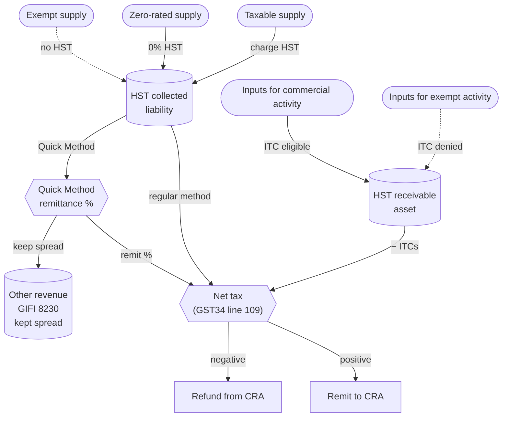

STATUS: AI GENERATED, REVIEW IN PROGRESS

# GST/HST

**Who this is for**:
- Owners of a Canadian-controlled private corporation (CCPC)
- Registered, or considering registering, for GST/HST

**TLDR**:
- *Goods and Services Tax / Harmonized Sales Tax* (GST/HST) is a federal *value-added tax*
  - Under the *[Excise Tax Act](https://laws-lois.justice.gc.ca/eng/acts/E-15/)* (ETA)
  - Administered by CRA but filed separately from the T2 on its own program account
- The *small supplier* threshold is $30,000 of worldwide taxable supplies (ETA [s.148](https://laws-lois.justice.gc.ca/eng/acts/E-15/section-148.html))
  - Over a rolling four-quarter window, or in any single calendar quarter
  - Voluntary registration is available below the threshold
  - Often worthwhile when inputs carry recoverable HST
- *HST provinces*: Ontario (13%), New Brunswick (15%), Newfoundland and Labrador (15%), Prince Edward Island (15%)
  - Nova Scotia is 14% (effective Apr 1 2025; 15% before)
  - The rest charge 5% GST only, with PST or QST handled separately by the province
- Two filing methods
  - *Regular method* remits (output tax collected) − (input tax credits claimed)
  - *Quick Method* (RC4058) remits a fixed percentage of GST/HST-inclusive revenue
    - You keep the rest as taxable income
    - Subject to a $400,000 eligibility cap and a list of ineligible professions
- Reporting period is assigned by prior-year taxable supplies
  - Annual ≤ $1.5M, quarterly $1.5M–$6M, monthly > $6M
  - Annual filers with net tax of $3,000 or more also pay quarterly instalments
- Mandatory electronic filing for reporting periods beginning on or after 2024-01-01
  - Remittances of $10,000 or more must be paid electronically

Limitations:
- Focus is on a typical owner-managed CCPC making taxable supplies of goods or services in Canada
  - Out of scope: the charity, public-service-body, and listed-financial-institution regimes
  - Also the selected-listed-financial-institution (SLFI) regime
- PST (British Columbia, Saskatchewan, Manitoba) and QST (Quebec) are administered separately
  - They follow similar value-added or single-stage mechanics, run by each provincial revenue authority
  - This page touches on them only where they interact with HST cost capitalization
- Several regimes are touched on but not worked through
  - Real-estate self-supply, the new-housing rebate, place of supply for digital products and telecommunications
  - The imported-services self-assessment under ETA [s.218.1](https://laws-lois.justice.gc.ca/eng/acts/E-15/section-218.1.html)
- Tax information can change (e.g. the Nova Scotia rate dropped from 15% to 14% on 2025-04-01)
  - Always verify rates and thresholds against current CRA publications before relying on them
- The following is my understanding as of 2026

## Sub-Pages

This page is an overview; the mechanics live on the sub-pages:
- [HST Registration and Filing](HST-Registration-And-Filing.md): the small-supplier test and registration mechanics
  - Also rates and place of supply, zero-rated supplies, the `RT` program account, and reporting deadlines
- [HST Bookkeeping](HST-Bookkeeping.md): the tax point, the year-end straddle, and the ledger posting patterns
- [HST Regular Method](HST-Regular-Method.md): GST34 net tax, ITC eligibility and documentation, capital purchases, imports
- [HST Quick Method](HST-Quick-Method.md): eligibility, the GST74 election, remittance rates, and when it pays
- [HST Examples](HST-Examples.md): two single-year walkthroughs comparing the two methods side by side

## GST/HST Flow

## Edge Cases

- *Late registration*: if the corp crossed $30,000 in a past quarter and never registered, register now
  - Set the effective date to the day it ceased to qualify as a small supplier
    - The day of the crossing supply under the single-quarter test
    - Or the first supply after the one-month grace under the four-quarter test
  - The corp owes HST on every taxable supply made since that date (ETA s.221)
    - It must remit even if the HST was not charged to the customer at the time
  - Collecting it retroactively from customers is usually impractical, so the unbilled HST becomes a cost
- *Multiple commercial activities*: two distinct lines of business under one BN have a choice (ETA s.239)
  - Keep them under a single `RT0001` account or open a separate `RT0002` etc.
  - Separate accounts allow different reporting periods or different Quick Method statuses per branch
- *Bad debts*: when an HST-charged invoice is written off as uncollectible, the HST comes back
  - The corp recovers it through a *bad-debt adjustment* on a future return (ETA [s.231](https://laws-lois.justice.gc.ca/eng/acts/E-15/section-231.html))
  - The recovery requires the debt written off in the books and the supply previously taxable
- *Inter-corporate supplies* between closely related corporations can be made for *nil consideration* by election
  - The closely-related-group election under ETA [s.156](https://laws-lois.justice.gc.ca/eng/acts/E-15/section-156.html) deems qualifying taxable supplies between members to have been made for no consideration
  - It is not zero-rating: the supplies do not enter Schedule VI, and they stay taxable supplies in character
  - Limits worth knowing: members must be *specified members* of a qualifying group, and sales of real property
    and supplies of property not used exclusively in commercial activity are excluded
  - Filed jointly on Form RC4616; useful in an opco/holdco structure and out of scope here
- *Voluntary disclosure*: missed past returns or unclaimed ITCs can be corrected
  - Through the *Voluntary Disclosures Program* (VDP) if the corp comes forward before CRA initiates contact
  - Penalty relief and partial interest relief are available
- *Shareholder benefit and inventory appropriation*: goods given to a shareholder or a related person
  - The *self-supply* and *change-of-use* rules can trigger GST/HST on the deemed disposition (ETA s.172(2))
  - See [Inventory](../Cost-Recovery/Inventory-And-COGS.md#edge-cases) for the income-tax side
- *Trust account convention*: HST collected is held in a statutory deemed trust for the Crown
  - Separate and apart from the corp's own property (ETA [s.222](https://laws-lois.justice.gc.ca/eng/acts/E-15/section-222.html))
  - This is stronger than an ordinary debt, so keep the cash segregated from operating funds
  - Especially for a corp on monthly or quarterly reporting

## Related

- [Small Business Tax Overview](../../Overview/Small-Business-Tax.md)
- [Foreign Currency](../../Bookkeeping/Foreign-Currency/Foreign-Currency.md)
- [Cost Recovery](../Cost-Recovery/Cost-Recovery.md)
  - [Inventory](../Cost-Recovery/Inventory-And-COGS.md)
  - [Capital Cost Allowance](../Cost-Recovery/Capital-Cost-Allowance/Capital-Cost-Allowance.md)
  - [Materials and CIP](../Cost-Recovery/Materials-And-CIP.md)
- [Ledger and Accounts](../../Bookkeeping/Ledger-And-Accounts.md)
- [Expense Classification](../../Bookkeeping/Expense-Classification.md)
- [Receivables and Bad Debts](../Receivables-And-Bad-Debts.md) (the income-tax half of the bad-debt adjustment)
- [Deferred Revenue](../Deferred-Revenue.md) (tax point on deposits and prepayments)
- [HST for Sole Proprietors](../../Sole-Proprietorship/HST-For-Sole-Proprietors.md) (the unincorporated delta from these pages)
- [Payment](../../Filing-And-CRA/Payment/Payment.md)
- [Glossary](../../Overview/Glossary.md)
- [Whole-dollar rounding](../../Filing-And-CRA/Whole-Dollar-Rounding.md)

## Citations

Topic-specific citations are on the sub-pages; the sources below back this page's edge cases:
- Excise Tax Act (R.S.C., 1985, c. E-15): https://laws-lois.justice.gc.ca/eng/acts/E-15/
  - [s.156](https://laws-lois.justice.gc.ca/eng/acts/E-15/section-156.html) - election to zero-rate supplies between closely related corporations
  - [s.221](https://laws-lois.justice.gc.ca/eng/acts/E-15/section-221.html) - obligation of a registrant to collect tax on every taxable supply
  - [s.222](https://laws-lois.justice.gc.ca/eng/acts/E-15/section-222.html) - statutory deemed trust over HST collected until it is remitted
  - [s.231](https://laws-lois.justice.gc.ca/eng/acts/E-15/section-231.html) - bad-debt adjustment on a written-off receivable
- CRA *RC4022 General Information for GST/HST Registrants*: https://www.canada.ca/en/revenue-agency/services/forms-publications/publications/rc4022.html
- CRA *Form RC4616 Election or Revocation of an Election for Closely Related Corporations and/or Canadian Partnerships*: https://www.canada.ca/en/revenue-agency/services/forms-publications/forms/rc4616.html

## TODO

- Add a tracking-spreadsheet companion analogous to [Adjusted Cost Base Tracking](../../Investments/Adjusted-Cost-Base/Adjusted-Cost-Base-Tracking.md)
  - A per-period log of HST collected and ITCs claimed, with the GST34 line mapping
- Cross-link this page from [Payment](../../Filing-And-CRA/Payment/Payment.md) once that page is past the stub phase
  - This page covers bookkeeping and return preparation
  - Payment covers the cash-to-CRA mechanics (pre-authorized debit, online banking, instalment scheduling)
- Add the remaining GST/HST terms to [Glossary](../../Overview/Glossary.md) on a maintainer pass
  - Taxable supply, RT program account
  - Already there: zero-rated, exempt, ITC, net tax, Quick Method, small supplier, place of supply, registrant, tax point
