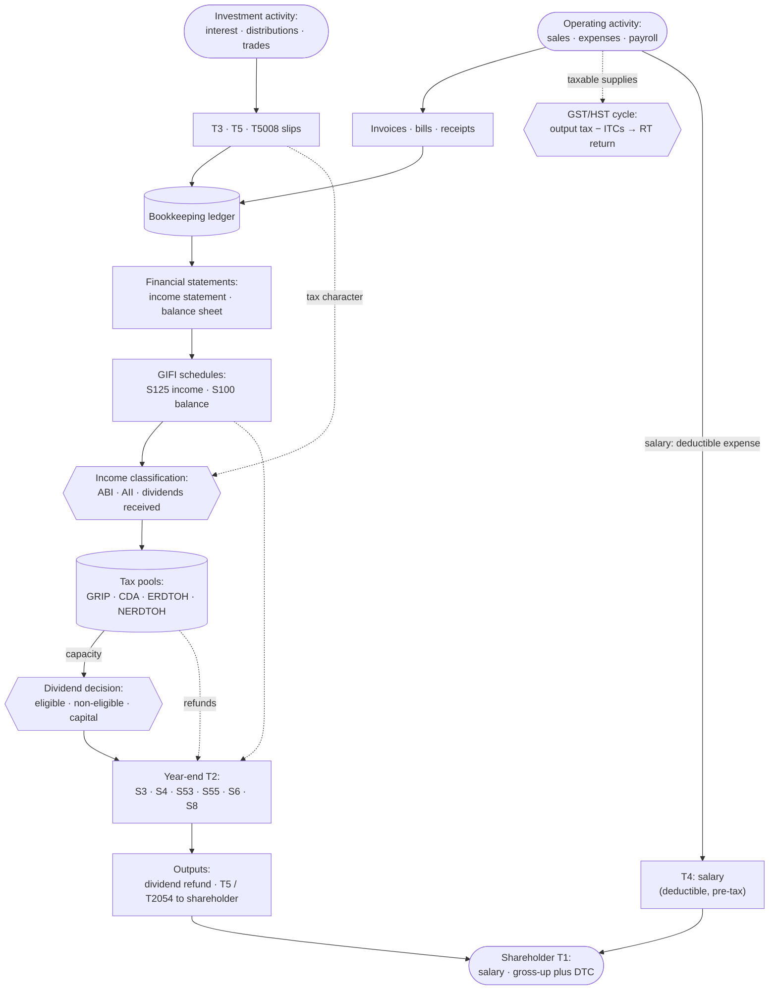
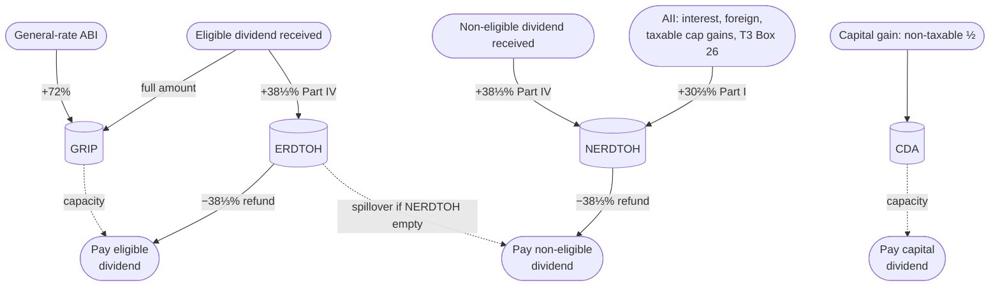
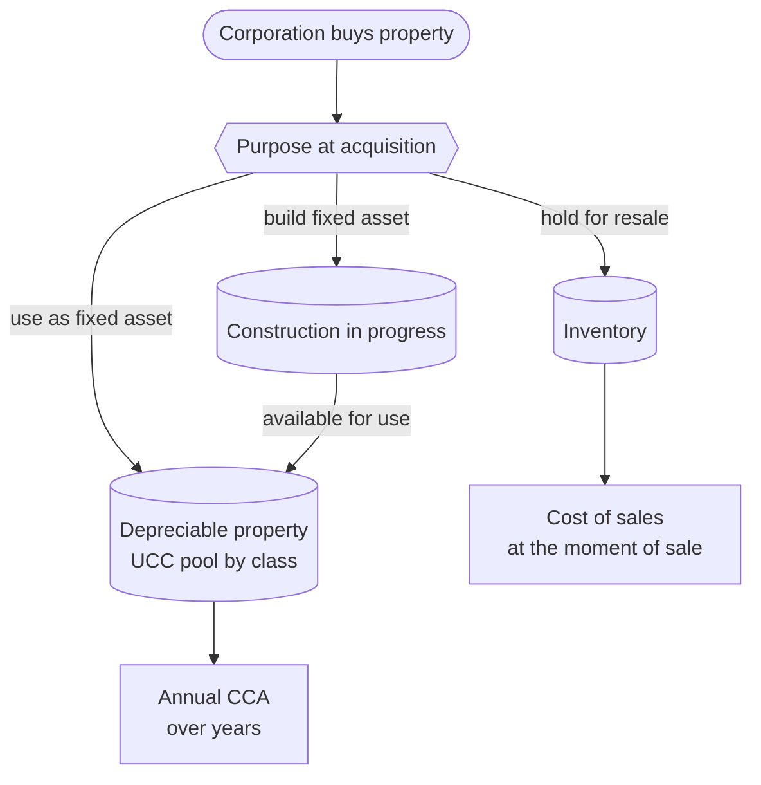
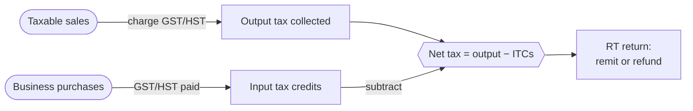

# Concept Map

**Who this is for**:
- Anyone who wants to see how the pieces of this guide fit together before diving into a single topic

**TLDR**:
- Small business tax is presented from five aspects, with most concepts belonging to just one:
  - *Kinds of things* (trees): income, dividends, and purchases each sort into a hierarchy of types
  - *Running balances* (state): pools like GRIP, CDA, ERDTOH, and NERDTOH that carry forward year to year
  - *Events*: the year's transactions — earning income, receiving or paying a dividend, buying or selling an asset
  - *Effects*: the fixed rules mapping each event to the balances it moves
  - *The yearly flow* (a pipeline): slip → bookkeeping → pool → T2 → dividend → personal return

Limitations:
- This is an overview; rates and numbers are illustrative (Ontario, 2026)
- Diagrams are deliberately high-level; they drop edge cases that the detailed pages cover
- The following is my understanding as of 2026

## From Business Activity to Shareholder Return

- Operating activity and investment slips both post to the books
- GST/HST runs alongside in a separate cycle: output tax less input tax credits, on a separate return
- The books roll up into financial statements, then GIFI schedules on the T2
- Classified income fills the tax pools
- Pools drive the year-end return and the dividend decision
- The owner takes money out as salary (deductible, pre-tax) or dividends (after-tax)

Details:
- [Small Business Tax Overview](Small-Business-Tax.md): more detailed flowchart and other references
- [Bookkeeping, the general ledger, and GIFI](Small-Business-Tax.md#bookkeeping-the-general-ledger-and-gifi): books → financial statements → GIFI mapping
- [Ledger and Accounts](../Bookkeeping/Ledger-And-Accounts.md): debits and credits, journal entries, the trial balance, and a full chart of accounts
- [Paying yourself: salary vs dividends](Small-Business-Tax.md#paying-yourself-salary-vs-dividends): the two ways money leaves the corporation
- [GST/HST](../Operations/HST.md): the parallel collect-and-remit cycle  

## Income Classification

How a dollar of corporate income is classified, and which pool it feeds:
- *Active business income* (ABI)
  - First $500K, at the SBD rate → retained earnings
  - Portion at the general rate → GRIP (+72%)
- *Aggregate investment income* (AII)
  - Interest and foreign income → NERDTOH (+30⅔%)
  - Capital gains → taxable ½ to NERDTOH, non-taxable ½ to CDA
- *Dividends received* from other corporations
  - Eligible → GRIP and ERDTOH
  - Non-eligible → NERDTOH

Details: [Small Business Tax Overview — active vs investment income](Small-Business-Tax.md#active-vs-investment-income).  

## Tax Pools: GRIP, CDA, ERDTOH, NERDTOH

GRIP, CDA, ERDTOH, and NERDTOH are:
- *Running balances* the corporation carries forward year to year
- Income or refundable tax adds to them; paying the matching dividend draws them down  

Legend:
- Solid arrows into a pool are what fills it during the year
- Solid arrows out are the refund it releases when a dividend is paid
- Dotted arrows are capacity or spillover (not cash)  

Details:
- [ERDTOH and NERDTOH](../Paying-Yourself/Dividends/ERDTOH-NERDTOH.md)
- [Dividends — GRIP](../Paying-Yourself/Dividends/Dividends.md#grip---capacity-for-eligible-dividends)
- [Capital Dividend Account](../Investments/Capital-Dividend-Account/Capital-Dividend-Account.md)

## Cost-Recovery Channels

Every purchase eventually becomes a tax deduction.  
How that happens depends on why it was purchased: to resell, to use as a long-term asset, or to build into a long-term asset.  

Details: [Cost Recovery](../Operations/Cost-Recovery/Cost-Recovery.md) (full flow with disposition, recapture, terminal loss, and change of use).  

## GST/HST Cycle

GST/HST runs parallel to income tax, on its own account and its own return.
Two methods: the *regular method* (track every ITC) or the *quick method* (remit a flat fraction, keep the rest).  

The regular method nets two tallies over each reporting period, then remits the difference:

Registration is mandatory once taxable supplies pass $30,000 over four quarters; below that it is optional.  

Details: [HST](../Operations/HST.md), [Small Business Tax Overview — HST and other consumption taxes](Small-Business-Tax.md#hst-and-other-consumption-taxes).  

## Remuneration: Salary vs Dividend

Salary and dividends are the two ways an owner-manager takes money out of the corporation.  
Salary is deductible and paid before corporate tax; dividends are paid from after-tax balances.  

| Attribute | Salary | Dividend |
|---|---|---|
| Corporate deduction | yes (reduces ABI) | no (paid from after-tax funds) |
| CRA account | Payroll (RP) | Information returns (RZ) |
| Slip to owner | T4 | T5 (none for a capital dividend) |
| Source deductions | income tax, CPP (both halves); EI usually exempt for a >40% owner | none |
| Builds RRSP room and CPP | yes | no |
| Timing | monthly remittance cadence | declared at will, can straddle year-end |

A common pattern is enough salary to build RRSP room or reach CPP maximum pensionable earnings, then retain or pay the rest out as dividends.  
Splitting dividends to family members is constrained by *TOSI* (tax on split income).  

Details: [Paying yourself: salary vs dividends](Small-Business-Tax.md#paying-yourself-salary-vs-dividends), [Tax Integration](Tax-Integration.md).  

## Dividend Flavours: Eligible, Non-Eligible, Capital

These are the three flavours a corporation can *pay* out to its shareholders.  
Dividends it *receives* (on a T3 or T5) are covered under [Income classification](#income-classification).  

Federal rates shown; a provincial dividend tax credit applies on top:
- Ontario: 10% eligible, 2.9863% non-eligible of the grossed-up amount in 2026

| Attribute | Eligible | Non-eligible | Capital                                                |
|---|---|---|--------------------------------------------------------|
| Source pool | GRIP | SBD-rate retained earnings (default) | CDA                                                    |
| Corp action required | Designation (s.89(14)), at or before payment | None | Election (s.83(2)) on Form T2054, on or before it becomes payable (or first paid, if earlier) |
| Personal gross-up | 38% | 15% | none (tax-free)                                        |
| Federal DTC | 15.0198% of grossed-up | 9.0301% of grossed-up | none                                                   |
| Refund pool drawn | ERDTOH | NERDTOH, then ERDTOH spillover | none                                                   |
| Excess-dividend penalty | Part III.1, 20% (s.185.1) | none | Part III, 60% (s.184(2))                               |
| Slip issued to shareholder | T5 | T5 | none (notify; corporation files T2054)                 |

Details: [Dividends — three flavours](../Paying-Yourself/Dividends/Dividends.md#three-dividend-flavours-eligible-non-eligible-capital), [Tax Integration](Tax-Integration.md) (gross-up and DTC mechanics).  

## Owner-Corporation Transactions

An owner assumes two distinct roles:
- As *employee*: a reimbursement or a reasonable allowance for business use is tax-free to the owner and deductible to the corp (ITA s.6)
- As *shareholder*: a benefit the corporation confers is taxed in the owner's hands with no corporate deduction (ITA s.15(1))

Money taken out that is neither a salary nor a dividend is tracked in a *shareholder loan account*:
- *Due from shareholder*: the owner owes the corporation (e.g. a personal cost run through the corp account)
- *Due to shareholder*: the corporation owes the owner (e.g. a business cost paid personally)
- A *Due from* balance not repaid by the end of the corporation's next tax year is added to the owner's income (ITA s.15(2); the s.15(2.6) exception is lost if repayments form a series)
- A *Due from* balance that is interest-free or below the prescribed rate also imputes an interest benefit for the period outstanding (ITA s.80.4)
- A *Due to* balance can be interest-free, and its repayment to the owner is tax-free

The shareholder loan account is a running balance carried forward, alongside the tax pools and the asset-cost balances.  

Details: [Owner-corporation transactions](../Paying-Yourself/Owner-Corporation-Transactions.md).  

## Event → Pool Effects

A pool is a running balance carried forward year to year: income adds to it, paying the matching dividend draws it down.  
Here's how each event maps to the pool balance changes:
- Columns: the four pools
- Rows: events
- Cells: the delta (blank means no change)

| Event | GRIP          | CDA                            | ERDTOH                    | NERDTOH               |
|---|---------------|--------------------------------|---------------------------|-----------------------|
| Earn general-rate ABI | + 72% of ABI  |                                |                           |                       |
| Earn AII (interest, foreign) |               |                                |                           | + 30⅔% of AII         |
| Realize capital gain |               | + non-taxable ½                |                           | + 30⅔% of taxable ½   |
| Realize capital loss |               | − non-taxable ½ (floored at 0) |                           |                       |
| Receive eligible dividend | + full amount |                                | + 38⅓% Part IV            |                       |
| Receive non-eligible dividend |               |                                |                           | + 38⅓% Part IV        |
| Pay eligible dividend | − amount      |                                | − 38⅓% refund             |                       |
| Pay non-eligible dividend |               |                                | − spillover after NERDTOH | − 38⅓% refund (first) |
| Pay capital dividend |               | − amount                       |                           |                       |

Notes:
- A capital gain's taxable half is part of AII, so it also adds to NERDTOH
- Received dividends from a *connected* corporation differ: Part IV is tied to the payer's own refund
- The 72% factor, 30⅔% Part I rate, and 38⅓% Part IV / refund rate are fixed by statute (see Citations)  

Running balances measuring the corporation's asset costs (separate from the tax pools above).  
Each row pairs an event with the balance it moves:

| Event | Balance | Effect | Details                                                 |
|---|---|---|---------------------------------------------------------|
| Buy security | ACB (per security) | + cost and commissions (trade-date FX) | [ACB](../Investments/Adjusted-Cost-Base/Adjusted-Cost-Base.md)         |
| Return of capital (T3 Box 42) | ACB | − distribution | [ACB](../Investments/Adjusted-Cost-Base/Adjusted-Cost-Base.md)         |
| Sell security | ACB | remove sold units; realize gain or loss | [T5008](../Investments/T5008/T5008.md)                                 |
| Acquire depreciable asset | UCC (per class) | + capital cost (half-year on net additions, currently replaced by AIIP's larger first-year claim) | [CCA](../Operations/Cost-Recovery/Capital-Cost-Allowance/Capital-Cost-Allowance.md)          |
| Claim CCA | UCC | − CCA for the year | [CCA](../Operations/Cost-Recovery/Capital-Cost-Allowance/Capital-Cost-Allowance.md)          |
| Dispose depreciable asset | UCC | − lesser of proceeds or cost; recapture or terminal loss | [CCA](../Operations/Cost-Recovery/Capital-Cost-Allowance/Capital-Cost-Allowance.md)          |
| Buy inventory | Inventory | + landed cost | [Inventory](../Operations/Cost-Recovery/Inventory-And-COGS.md)        |
| Sell inventory | Inventory | − unit cost (to COGS) | [Inventory](../Operations/Cost-Recovery/Inventory-And-COGS.md)        |
| Incur construction cost | CIP | + materials and labour | [Materials and CIP](../Operations/Cost-Recovery/Materials-And-CIP.md) |
| Available for use | CIP → UCC | transfer balance to a CCA class | [Materials and CIP](../Operations/Cost-Recovery/Materials-And-CIP.md) |

A sale is the only event that changes both sets of balances:
- It draws down the cost balance (the ACB or UCC)
- Resulting gain or loss feeds the tax pools above:
  - A security's capital gain splits into CDA and NERDTOH
  - A depreciable asset's recapture or terminal loss runs through income first  

## Loss Carryforwards

A year in which deductions exceed income produces a loss, which the corporation can apply to other years on T2 Schedule 4 (Loss Continuity).  
There are two kinds of running balance:
- *Non-capital loss* (an operating loss): carries back 3 years and forward 20 (ITA s.111(1)(a))
- *Net capital loss* (capital losses beyond the year's capital gains): carries back 3 years and forward indefinitely, usable only against capital gains (ITA s.111(1)(b))

Carrying a loss back recovers tax already paid in a prior year; carrying it forward shelters a future one.  
CCA is discretionary and UCC never expires, so deferring CCA in a loss year avoids deepening a non-capital loss, which does expire after 20 years.  
A realized capital loss also draws down CDA by the non-taxable half it removes (see the event table above).  

Details: [Losses](../Filing-And-CRA/Losses.md), [Capital loss carry forward / back](../Investments/Adjusted-Cost-Base/Adjusted-Cost-Base.md#capital-loss-carry-forward--back--superficial-loss), [Capital Cost Allowance](../Operations/Cost-Recovery/Capital-Cost-Allowance/Capital-Cost-Allowance.md) (loss-year CCA timing).  

## Filing Calendar

Filing a return and paying the tax have separate deadlines; missing either draws interest or penalties.  

Filings:
- *T2 return*: 6 months after year-end
- *T4 and T5 slips*: to CRA and the recipient by the last day of February; late penalty is per filing, not per slip ($10/day, $100 minimum, 100-day cap; ITA s.162(7.01))
- *GST/HST return*: annual, quarterly, or monthly by revenue band
- *Corporate annual return*: to the federal or provincial registry (not a tax filing)

Payments:
- *T2 balance*: 2 months after year-end (3 for an SBD-eligible CCPC)
- *T2 instalments*: monthly or quarterly once both the prior and current year's tax top $3,000
- *Payroll remittance*: source deductions by the 15th of the following month
- *GST/HST remittance*: with the return

The T2 balance is due before the return: the tax must be paid 2 or 3 months after year-end, but the return that computes it is not due until month 6.  
In practice the tax is estimated and paid by the earlier date, and the return is filed by the later one; interest accrues on any unpaid balance from the payment date, not the filing date.  

Details: [Filing deadlines and instalments](Small-Business-Tax.md#filing-deadlines-and-instalments).  

## How the Concepts Relate

- *Categorization* (each sorts an item into one of a few fixed types):
  - Income classification
  - Expense classification (capitalize vs expense, and the GIFI line)
  - Salary vs dividend, then the three dividend flavours
  - Three cost-recovery channels
  - CCA classes
  - Owner-corporation transaction types (benefit · allowance · reimbursement · rent · sale)
  - Active business vs Personal Service Business
  - T-slip and T2-schedule lists
- *Running balances* (carried forward year to year, moved up or down by the year's events):
  - Four tax pools: GRIP, CDA, ERDTOH, NERDTOH
  - Non-capital loss and net capital loss carryforwards
  - Shareholder loan account (Due to / from shareholder)
  - ACB per security
  - UCC per class
  - Inventory
  - Construction in progress
  - Retained earnings
- *Annual tax cycle*: slips → bookkeeping → pools → T2 → salary or dividend → personal return
- *Comparison tables* (each shows how two lists combine):
  - Salary-vs-dividend table
  - Dividend-flavours table
  - Event-to-pool table
- *Cross-cutting concepts*:
  - A non-eligible dividend draws its refund from NERDTOH first, then from ERDTOH once NERDTOH runs out
  - AII fills NERDTOH, shrinks the small-business deduction once adjusted AII (AAII) tops $50,000, and so indirectly fills GRIP
  - The $500,000 business limit is also shared among associated corporations and pared back for a large-CCPC capital base
  - TOSI limits splitting dividends to family members not active in the business
  - GST/HST is a parallel cycle on its own account and return
  - Provincial dividend tax credit, applied on top of every federal one
  - Applicable to most transaction types: currency conversion, HST recoverability, and whole-dollar rounding

## Related

- [Small Business Tax Overview](Small-Business-Tax.md)
- [Corporate Structure](../Corporate-Lifecycle/Corporate-Structure/Corporate-Structure.md)
  - [Share Capital](../Corporate-Lifecycle/Corporate-Structure/Share-Capital.md)
- [Tax Integration](Tax-Integration.md)
- [Dividends](../Paying-Yourself/Dividends/Dividends.md)
- [Capital Dividend Account](../Investments/Capital-Dividend-Account/Capital-Dividend-Account.md)
- [Cost Recovery](../Operations/Cost-Recovery/Cost-Recovery.md)
- [Expense Classification](../Bookkeeping/Expense-Classification.md)
- [Ledger and Accounts](../Bookkeeping/Ledger-And-Accounts.md)
- [Adjusted Cost Base](../Investments/Adjusted-Cost-Base/Adjusted-Cost-Base.md)
- [Owner-corporation transactions](../Paying-Yourself/Owner-Corporation-Transactions.md)
- [Business Acquisition](../Corporate-Lifecycle/Business-Acquisition/Business-Acquisition.md)
- [HST](../Operations/HST.md)
- [Payment](../Filing-And-CRA/Payment/Payment.md)
- [Glossary](Glossary.md)

## Citations

Full citations live on each page; here are the key provisions behind this page:
- Income Tax Act (R.S.C., 1985, c. 1 (5th Supp.)):
  - [s.82(1)](https://laws-lois.justice.gc.ca/eng/acts/I-3.3/section-82.html) - dividend gross-up (38% eligible, 15% non-eligible)
  - [s.83(2)](https://laws-lois.justice.gc.ca/eng/acts/I-3.3/section-83.html) - capital dividend election; [s.184(2)](https://laws-lois.justice.gc.ca/eng/acts/I-3.3/section-184.html) - 60% Part III tax on over-elections
  - [s.89(1)](https://laws-lois.justice.gc.ca/eng/acts/I-3.3/section-89.html) - GRIP and CDA definitions and the 0.72 general-rate factor; [s.89(14)](https://laws-lois.justice.gc.ca/eng/acts/I-3.3/section-89.html) - eligible designation
  - [s.121](https://laws-lois.justice.gc.ca/eng/acts/I-3.3/section-121.html) - federal dividend tax credit (15.0198% eligible, 9.0301% non-eligible)
  - [s.125(5.1)](https://laws-lois.justice.gc.ca/eng/acts/I-3.3/section-125.html) - SBD grind on AAII over $50,000
  - [s.129](https://laws-lois.justice.gc.ca/eng/acts/I-3.3/section-129.html) - dividend refund (s.129(1)); ERDTOH and NERDTOH definitions, 30⅔% Part I on AII, and the 38⅓% pool rates (s.129(4))
  - [s.185.1](https://laws-lois.justice.gc.ca/eng/acts/I-3.3/section-185.1.html) - 20% Part III.1 tax on excessive eligible designations
  - [s.186(1)](https://laws-lois.justice.gc.ca/eng/acts/I-3.3/section-186.html) - 38⅓% Part IV tax on dividends received
  - [s.6](https://laws-lois.justice.gc.ca/eng/acts/I-3.3/section-6.html) - employee benefits and allowances; [s.15(1)](https://laws-lois.justice.gc.ca/eng/acts/I-3.3/section-15.html) - shareholder benefit (no corporate deduction)
  - [s.15(2)](https://laws-lois.justice.gc.ca/eng/acts/I-3.3/section-15.html) - shareholder-loan income inclusion; [s.80.4](https://laws-lois.justice.gc.ca/eng/acts/I-3.3/section-80.4.html) - imputed interest on a low-rate loan
  - [s.111(1)](https://laws-lois.justice.gc.ca/eng/acts/I-3.3/section-111.html) - loss carryovers: non-capital (a) 3 back / 20 forward; net capital (b) 3 back / indefinite
  - [s.120.4](https://laws-lois.justice.gc.ca/eng/acts/I-3.3/section-120.4.html) - TOSI on dividends split to non-active family members
  - [s.125(3)](https://laws-lois.justice.gc.ca/eng/acts/I-3.3/section-125.html) - business-limit sharing among associated corporations; s.125(7) - Personal Service Business definition
  - [s.150(1)](https://laws-lois.justice.gc.ca/eng/acts/I-3.3/section-150.html), [s.157](https://laws-lois.justice.gc.ca/eng/acts/I-3.3/section-157.html) - T2 filing deadline, balance-due dates, and instalments
- Excise Tax Act (R.S.C., 1985, c. E-15) - GST/HST: https://laws-lois.justice.gc.ca/eng/acts/E-15/
