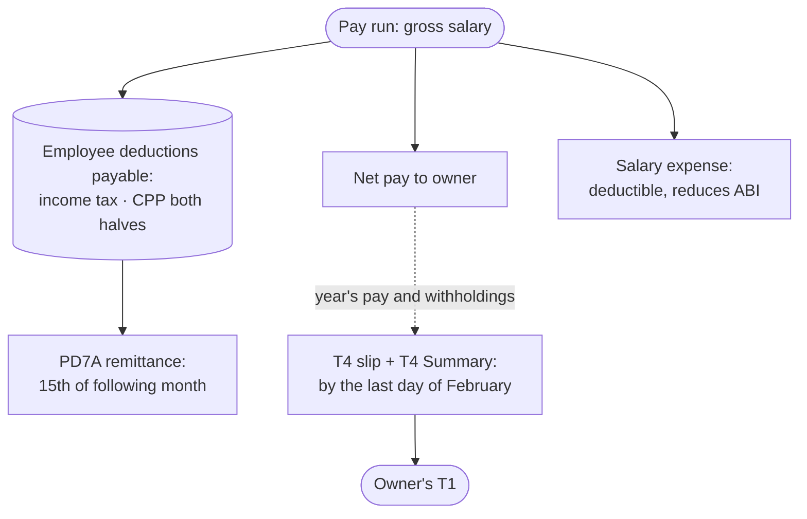

STATUS: AI GENERATED, REVIEW IN PROGRESS

# Payroll

**Who this is for**:
- Owners of a Canadian-controlled private corporation (CCPC)
- Paying themselves (or a family member) a salary from the corporation

**TLDR**:
- Salary is the T4 channel: deductible to the corporation, taxed as employment income in the owner's hands
- Running it means four recurring obligations:
  - An RP payroll program account with CRA
  - *Source deductions* withheld from each pay
  - Remittance to CRA by the 15th of the following month
  - A T4 slip and T4 Summary by the last day of February
- A single owner-manager withholds income tax and the employee CPP half, and remits both CPP halves
  - EI usually does not apply
- Every step posts through three ledger accounts:
  - `Salaries and wages` (`9060`)
  - `Employer's portion of employee benefits` (`8622`)
  - `Employee deductions payable` (`2627`)

Limitations:
- The corporation's only employee is assumed to be a single Canadian-resident owner-manager
  - An arm's-length employee follows the same mechanics
  - Hiring topics (employment contracts, employment standards, EI premiums) are touched on, not worked through
- The salary-vs-dividend remuneration tradeoff (RRSP room, CPP credits, integration) is out of scope
  - It is worked in [Salary vs Dividends](Salary-Vs-Dividends.md)
- Valuing taxable benefits (automobile, home office, personal use of corporate property) is out of scope
  - [Owner-corporation transactions](Owner-Corporation-Transactions.md) covers the valuation; this page covers the
    pay-run entry, the CPP consequences, and the slip reporting once the benefit is valued
- Provincial employer levies (Ontario Employer Health Tax, WSIB) are out of scope beyond the thresholds that say when to look:
  - EHT: eligible private-sector employers pay nothing on the first $1,000,000 of annual Ontario payroll (see TODO)
    - A single owner-manager salary rarely approaches it
  - WSIB: registration turns on industry classification, not headcount; check the classification when hiring a first non-owner worker
  - See [Further Reading](../Overview/Further-Reading.md) for the first-employee boundary
- The owner's personal T1 side (reporting the T4, claiming the CPP credit) is out of scope
  - The T1's filing mechanics are worked in [T1 Filing Basics](../Personal-Tax/T1-Filing-Basics.md)
- Withholding rates and CPP limits change every January; figures below are 2026 and the dollar examples are illustrative
- The following is my understanding as of 2026

## The Payroll Cycle

Each pay splits the gross salary two ways: net cash to the owner and withholdings parked in a liability account.  
The full gross plus the employer CPP half is the corporation's deductible expense.  
The withholdings leave for CRA by the 15th of the following month; the T4 reconciles the whole year in February.  

The pay run itself needs no payroll software at this scale:
- Compute the withholdings with CRA's *Payroll Deductions Online Calculator* (PDOC) or the T4032 tables
- Pay the net amount from the corporate account by cheque, e-transfer, or bill payment
- Post the journal entry (see [Pay-run bookkeeping](#pay-run-bookkeeping))

## RP Program Account

Payroll runs on an `RP` program account under the corporation's business number (format `…RP0001`).  
Register through CRA My Business Account before the first remittance is due.  
The account can be opened at the same time as the RC corporate-tax account or added later.  

Withholding is triggered by *paying* salary, not by accruing it (ITA [s.153(1)](https://laws-lois.justice.gc.ca/eng/acts/I-3.3/section-153.html)).  
A corporation that pays only dividends has no payroll and needs no RP account; see [Dividends](Dividends/Dividends.md).  

## Source Deductions

Three amounts are potentially withheld from each pay; for a single owner-manager only the first two apply.  

*Income tax* (federal and provincial):
- Set by the employee's *TD1* forms (federal and provincial), which claim the basic personal amount and any other credits
- The corporation keeps the completed TD1s on file; they are not sent to CRA
- The per-pay amount comes from PDOC or the T4032 tables for the province of employment

*CPP* (both halves, since the corporation is the employer):
- Employee half: 5.95% of pensionable earnings between the $3,500 basic exemption and the $74,600 YMPE
  - 2026 maximum $4,230.45
- Employer half: matches the employee half dollar for dollar
- *CPP2*: a second contribution at 4% each on earnings between the YMPE and the $85,000 YAMPE (2026 maximum $416 each)
- The exemption prorates per pay period ($291.67 per month)

*EI*:
- An owner controlling more than 40% of the voting shares is not insurable (Employment Insurance Act [s.5(2)(b)](https://laws-lois.justice.gc.ca/eng/acts/E-5.6/section-5.html))
  - No employee premium, no employer premium, and no entitlement to regular EI benefits
- An arm's-length employee is insurable
  - The corporation withholds the employee premium and pays 1.4× as the employer share
- A voluntary opt-in to EI *special* benefits (maternity, parental, sickness) exists for self-employed persons
  - It covers a >40% owner-manager, under Part VII.1 of the Employment Insurance Act
  - Once benefits are drawn the opt-in becomes permanent
  - The same opt-in serves an unincorporated sole proprietor; see [CPP and the T1](../Sole-Proprietorship/CPP-And-The-T1.md#no-ei-unless-you-opt-in)

The withheld amounts are the employee's money held in trust for CRA (ITA [s.227(4)](https://laws-lois.justice.gc.ca/eng/acts/I-3.3/section-227.html)).  
Remitting late or not at all is treated more severely than a late corporate-tax balance (see the penalty note below).  

## Remittance Schedule and PD7A

- *What*: the income tax withheld, plus both CPP halves (and both EI shares, when EI applies), for all pays in the period
- *When*: a *regular* remitter pays by the 15th of the month following the month the salary was paid
  - Due date set by Income Tax Regulations [s.108(1)](https://laws-lois.justice.gc.ca/eng/regulations/C.R.C.,_c._945/section-108.html)
- *Quarterly option*: two separate tests, and a new corporation is on the second one
  - *Established employer*: average monthly withholding amount (AMWA) under $3,000, plus a clean withholding,
    remitting and filing record over the preceding 12 months
  - *New small employer*: a *monthly withholding amount* (MWA) under **$1,000**, with the same clean-record
    requirement, for its first year
  - The $3,000 AMWA figure needs a prior year to average, so a first-year owner-manager who applies it can remit
    monthly deductions late
  - Remit monthly until CRA confirms the assigned frequency on the PD7A
  - See CRA guide T4001 for the current thresholds
- *Voucher*: CRA issues a *PD7A* (Statement of Account for Current Source Deductions) each period
  - Remit against it through My Business Account, an online-banking payee, or a bank's business tax service
  - Payment channels are covered in [Payment](../Filing-And-CRA/Payment/Payment.md)
- *Nil months*: if no salary was paid in a period, report a nil remittance by the due date
  - Report through My Business Account or CRA's TeleReply line; skipping the report draws a follow-up

Late or missing remittances draw a graduated penalty of 3% to 10% of the amount (ITA [s.227(9)](https://laws-lois.justice.gc.ca/eng/acts/I-3.3/section-227.html)), plus interest.  

## Pay-Run Bookkeeping

Three accounts carry the whole cycle:
- `Salaries and wages` (`9060`): expense; the gross salary
- `Employer's portion of employee benefits` (`8622`): expense; the employer CPP half
  - The employer EI share also posts here, when EI applies
- `Employee deductions payable` (`2627`): liability; everything owed to CRA but not yet remitted

Example: $5,000 gross monthly salary, 2026 Ontario, TD1 basic personal amounts only.  
CPP employee half: ($5,000 − $291.67) × 5.95% = $280.15; the corporation matches it.  
Income tax per PDOC: $760.00 (illustrative; the actual figure depends on the TD1 claims).  

Pay run (January 31):

| Account | Debit | Credit |
|---|---|---|
| `Salaries and wages` (`9060`): gross | 5,000.00 | |
| `Employer's portion of employee benefits` (`8622`): employer CPP | 280.15 | |
| `Employee deductions payable` (`2627`) | | 1,320.30 |
| `Deposits` (`1002-1`): net pay | | 3,959.85 |

Remittance (by February 15):

| Account | Debit | Credit |
|---|---|---|
| `Employee deductions payable` (`2627`) | 1,320.30 | |
| `Deposits` (`1002-1`) | | 1,320.30 |

The `2627` balance returns to zero after each on-time remittance.  
A month-end balance larger than the latest pay run's withholdings means a missed or short remittance.  
For the account definitions and the chart of accounts, see [Chart of Accounts](../Bookkeeping/Chart-Of-Accounts.md).  

## Non-Cash Taxable Benefits in the Pay Run

A valued benefit — an automobile, personal use of corporate property, a taxable premium — is not a year-end slip
entry. It joins a pay period and carries payroll liabilities of its own.  

What changes, and what does not:
- *No expense entry*: the corporation already expensed the underlying costs (the CCA, the fuel, the premium)
- *No cash moves* for the benefit itself; the employee receives nothing new in the bank
- *CPP is pensionable on it*: include the benefit in the period's pensionable earnings, deduct the employee's CPP,
  match it as employer CPP, and remit both halves on the ordinary schedule
- *Income tax* is withheld on it in the same period
- *EI* generally does not apply to a non-cash benefit, and an owner-manager controlling more than 40% of the voting
  shares is EI-exempt regardless

The entry adds the benefit to gross pay and takes it straight back out, so net cash is unchanged:

| Account | Debit | Credit |
|---|---|---|
| `Salaries and wages` (`9060`): benefit added to gross | *benefit* | |
| `Salaries and wages` (`9060`): benefit offset (already expensed elsewhere) | | *benefit* |
| `Employee deductions payable` (`2627`): extra employee CPP on the benefit | | *CPP* |
| `Deposits` (`1002-1`): reduced net pay | | *CPP* |

Where cash remuneration in the period is too small to withhold the employee's CPP share, the employer still owes
and remits its own share, and the employee settles the balance on the T1.  
Leaving the benefit out of the pay run entirely is what produces a *PIER* assessment after the T4s are filed: CRA
recomputes CPP from box 26 and bills the difference.  

The valuation itself is on [Owner-corporation transactions](Owner-Corporation-Transactions.md), and the automobile
figures land in T4 boxes 34 and 26.  

## T4 Slip and T4 Summary

After each calendar year the corporation issues a *T4* slip to the employee.  
It files the slip with a *T4 Summary* by the last day of February.  
The Summary totals all slips and reconciles them against the year's remittances; a shortfall is payable with the filing.  

The boxes that matter for an owner-manager:

| Box | Contents |
|---|---|
| 14 | Employment income: salary plus taxable benefits |
| 16 / 16A | Employee CPP / CPP2 withheld |
| 22 | Income tax withheld |
| 24 | EI insurable earnings: 0 for the EI-exempt owner |
| 26 | CPP pensionable earnings |
| 28 | EI-exempt marker |
| 34 | Automobile benefit (see [Owner-corporation transactions](Owner-Corporation-Transactions.md#vehicles)) |
| 40 | Other taxable benefits |
| 45 | Employer-offered dental benefits: code 1 = no coverage offered, codes 2–5 = coverage offered (see below) |

Box 45 has been mandatory on every T4 since the 2023 slip year.  
It reports the dental coverage *offered*, not whether the employee takes it up.  

The box 45 codes:
- 1: no coverage offered
- 2: payee only
- 3: payee, spouse, and dependants
- 4: payee and spouse
- 5: payee and dependants

A corp with no dental plan enters code 1.  
An HSA/PHSP that covers dental counts as coverage offered (see [Owner-corporation transactions](Owner-Corporation-Transactions.md#employee-benefits)).  

Continuing the example:
- Box 14 $60,000.00, box 16 $3,361.80, box 22 $9,120.00
- Box 24 0, box 26 $60,000.00, box 28 EI exempt, box 45 code 1

Filing:
- File through *Web Forms* in My Business Account (enter the slip online, no software needed) or from T2/payroll software
- CRA cross-checks box 16 against the CPP computed from box 26 (the *PIER* review)
  - PIER: pensionable and insurable earnings review
  - A mismatch draws a report and a balance-due notice
- The late-filing penalty applies per return, not per slip, even when no tax is owing (see [Filing deadlines](../Overview/Small-Business-Tax.md#filing-deadlines-and-instalments))

## Owner-Manager Remuneration

*Reasonableness*:
- Deductions must be reasonable in the circumstances (ITA [s.67](https://laws-lois.justice.gc.ca/eng/acts/I-3.3/section-67.html))
- CRA's administrative practice is not to challenge the reasonableness of salary or bonus to an active owner-manager
  - The practice covers a CCPC paying out of its business profits
- Salary to a spouse or child is deductible only to the extent it is reasonable for the work actually performed
  - Keep timesheets or a duties record
- Salary is outside *TOSI* (which targets dividends and similar split income)
  - s.67 reasonableness is the constraint instead

*Year-end bonus accrual*:
- A bonus can be accrued in the fiscal year (deductible then) and paid later; withholding arises only at payment
- Remuneration still unpaid on the 180th day after year-end is deducted only in the year actually paid (ITA [s.78(4)](https://laws-lois.justice.gc.ca/eng/acts/I-3.3/section-78.html))
- This is the common lever for setting the corp's taxable income after year-end results are known
  - The typical use is bonusing down to the SBD limit

*Fiscal vs calendar year*:
- The corporation deducts salary in the fiscal year it is incurred; the T4 reports it in the calendar year it is paid
- For a non-December year-end the two never line up exactly; the mismatch is normal and needs no adjustment

*Cash actually moves*:
- Pay the net salary from the corporate account
  - A salary that is only book-entry against the shareholder loan account must be a genuine, documented set-off
  - See [Owner-corporation transactions](Owner-Corporation-Transactions.md#shareholder-loans)
- Money taken out without a pay run (and without a dividend) lands in the shareholder loan account
  - That carries the s.15(2) inclusion risk

## Related

- [Small Business Tax Overview](../Overview/Small-Business-Tax.md)
- [Payment](../Filing-And-CRA/Payment/Payment.md)
- [Dividends](Dividends/Dividends.md)
- [Owner-corporation transactions](Owner-Corporation-Transactions.md)
- [Ledger and Accounts](../Bookkeeping/Ledger-And-Accounts.md)
- [Expense Classification](../Bookkeeping/Expense-Classification.md)
- [Tax Integration](../Overview/Tax-Integration.md)

## Citations

- Income Tax Act (R.S.C., 1985, c. 1 (5th Supp.)):
  - [s.67](https://laws-lois.justice.gc.ca/eng/acts/I-3.3/section-67.html) - general reasonableness limit on deductions
  - [s.78(4)](https://laws-lois.justice.gc.ca/eng/acts/I-3.3/section-78.html) - remuneration unpaid 180 days after year-end is deductible only when paid
  - [s.153(1)](https://laws-lois.justice.gc.ca/eng/acts/I-3.3/section-153.html) - withholding obligation on salary and wages paid
  - [s.227(4)](https://laws-lois.justice.gc.ca/eng/acts/I-3.3/section-227.html) - withheld source deductions deemed held in trust for the Crown
  - [s.227(9)](https://laws-lois.justice.gc.ca/eng/acts/I-3.3/section-227.html) - graduated penalty on late or deficient remittances
- Income Tax Regulations (C.R.C., c. 945):
  - [s.108](https://laws-lois.justice.gc.ca/eng/regulations/C.R.C.,_c._945/section-108.html) - remittance due dates by remitter category
- Canada Pension Plan (R.S.C., 1985, c. C-8) - employee and employer contributions, basic exemption, YMPE/YAMPE: https://laws-lois.justice.gc.ca/eng/acts/C-8/
- Employment Insurance Act (S.C. 1996, c. 23):
  - [s.5(2)(b)](https://laws-lois.justice.gc.ca/eng/acts/E-5.6/section-5.html) - employment not insurable when the employee controls more than 40% of the voting shares
  - Part VII.1 (s.152.01 and following) - voluntary opt-in to special benefits for self-employed persons
- CRA guides and tools:
  - T4001 - Employers' Guide: Payroll Deductions and Remittances: https://www.canada.ca/en/revenue-agency/services/forms-publications/publications/t4001.html
  - RC4120 - Employers' Guide: Filing the T4 Slip and Summary: https://www.canada.ca/en/revenue-agency/services/forms-publications/publications/rc4120.html
  - Payroll Deductions Online Calculator (PDOC): https://www.canada.ca/en/revenue-agency/services/e-services/digital-services-businesses/payroll-deductions-online-calculator.html
  - T4032 - Payroll Deductions Tables: https://www.canada.ca/en/revenue-agency/services/forms-publications/payroll/t4032-payroll-deductions-tables.html
  - TD1 - Personal Tax Credits Returns: https://www.canada.ca/en/revenue-agency/services/forms-publications/td1-personal-tax-credits-returns.html

## TODO

- Split into sub-pages at parity with `Dividends/` as content grows
  - Source-deduction computation walkthrough (PDOC screenshots)
  - T4 box-by-box with a redacted slip
  - A worked full-year example
- Verify the 2026 CPP figures ($74,600 YMPE, $85,000 YAMPE, $4,230.45 / $416 maximums) against the current T4032/PDOC
  - Also the illustrative $760 withholding
  - Keep consistent with the same figures in [Payment](../Filing-And-CRA/Payment/Payment.md)
- Consider whether to break the employer CPP/EI share out of `8622` into a detail sub-code, or leave it at the rollup
- Verify the quarterly-remitter AMWA thresholds and the new-employer criteria against the current T4001
- Verify the EI special-benefits opt-in description (EIA Part VII.1) and the permanence-once-drawn rule
- Source the CRA administrative position on owner-manager remuneration reasonableness before sign-off
  - Income Tax Technical News No. 22 (archived)
- Confirm the mandatory-electronic-filing slip threshold for T4 returns and add it to the filing section
- Verify the EHT $1,000,000 exemption figure and eligibility (held through 2028 per 2026 summaries) against Ontario's EHT guidance at sign-off
- Settle the boundary with [Payment](../Filing-And-CRA/Payment/Payment.md) as that page grows past the stub
  - This page owns the payroll concepts and bookkeeping; Payment owns the cash-to-CRA mechanics
  - Move or trim the CPP-figure duplication accordingly
