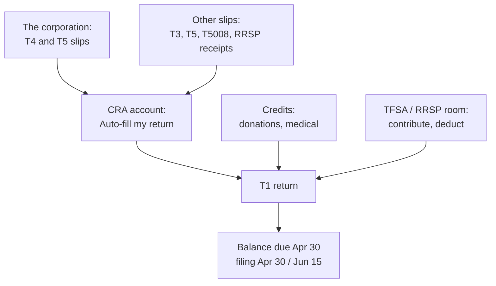

STATUS: AI GENERATED, REVIEW IN PROGRESS

# Personal Tax

**Who this is for**:
- CCPC owners handling their own T1 and the common personal situations around it
- Readers following a personal-side contrast link from one of the corporate pages

**TLDR**:
- This group is side content: the guide's main line is the CCPC
  - These pages work basic common personal situations, not the T1 end to end
- The situations: filing, CRA account access and catch-up, TFSA and RRSP contributions, the two big credits, the home
- The self-employment slice of the T1 is the other side group, [Sole Proprietorship](../Sole-Proprietorship/Sole-Proprietorship.md)
  - June 15, instalments, and Schedule 8 CPP are worked there and cross-linked, not restated
- T1 brackets, employment income at large, and benefit programs stay out

Limitations:
- Basic common situations only; anything beyond them is professional-advice or tax-software territory
- Quebec differences are out of scope
- Ontario is the worked province where provincial rules appear
- The following is my understanding as of 2026

## Where This Sits in the Guide

The guide's main line is the owner-managed CCPC.  
The corporation's slips and dividends land on the owner's T1, and the corporate pages stop at that boundary.  
This group picks up on the personal side of it, for the situations a CCPC owner actually meets.  

The pages stay at the situation level.  
Where a rule is already worked elsewhere (instalments, June 15, corporate giving), the pages link rather than restate.  
The corporate pages remain the guide's centre of gravity.  

## The Year in One Diagram

Salary feeds next year's RRSP room; dividends do not.  
The room track runs on its own calendar (60 days after year-end for the RRSP deduction, January 1 for TFSA room).  

## Sub-Pages

This page is a hub; these are the sub-pages:
- [T1 Filing Basics](T1-Filing-Basics.md): deadlines, slips and Auto-fill, the missing-slip principle, NETFILE and the NOA
- [My Account and Catch-Up Filing](My-Account-And-Catch-Up-Filing.md): the CRA account, registration after a lapse, back years, penalties, relief
- [TFSA and RRSP Contributions](TFSA-And-RRSP-Contributions.md): room, over-contributions, RC243 and T1-OVP, the recontribution trap
- [Donation and Medical Credits](Donation-And-Medical-Credits.md): non-refundable credit mechanics and the two credits worth knowing
- [Home Office and the Principal Residence](Home-Office-And-Principal-Residence.md): the employee deduction, the exemption, the CCA trap

## Related

- [Sole Proprietorship](../Sole-Proprietorship/Sole-Proprietorship.md) (the sibling side group: the self-employment slice of the T1)
- [Overview](../Overview/Overview.md) (the corporate guide's orientation layer)
- [Tax Integration](../Overview/Tax-Integration.md) (how the corporate and personal sides net out)
- [Salary vs Dividends](../Paying-Yourself/Salary-Vs-Dividends.md) (the corp-side decision that shapes the T1)
- [Payroll](../Paying-Yourself/Payroll.md) (the T4's source)
- [Donations](../Operations/Donations.md) (the corporate giving route)
- [CRA Administration](../Filing-And-CRA/CRA-Administration.md) (the corporate side of assessments and relief)

## Citations

- The rules live on the sub-pages, each with its own citations; this page introduces none
