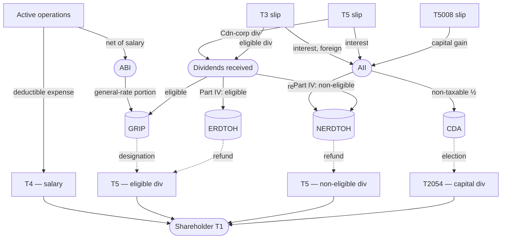

# Small Business Tax Overview

**Who this is for**:
- Entrepreneurs who are curious about bookkeeping and taxes  
- Anyone who wants a high-level picture of how Canadian small-business corporate tax fits together

This page is a primer for the topics covered in the rest of this guide.

**TLDR**:
- A *Canadian-Controlled Private Corporation* (CCPC) files an annual T2 corporate income tax return — separate from the owner's personal T1
- Books are kept in *double-entry*; at year-end the chart of accounts is mapped to *GIFI* codes for Schedules 100 and 125
- Active business income gets a reduced rate (the *Small Business Deduction*, SBD) on the first $500,000 per year
- Investment income (from a corporate brokerage account) is taxed at a much higher rate, but partially refundable when paid out as a dividend
- You can pay yourself either a salary (deductible expense) or dividends (paid out of retained earnings)
- *Integration* means a dollar earned directly or through a CCPC should be taxed roughly equally
- The *Income Tax Act* (ITA) is the primary federal source
  - Other relevant layers include regulations, provincial tax acts, treaties, corporate statutes, and CRA administrative guidance
- *GST/HST* runs alongside income tax — rate and structure vary by province

Limitations:
- Focus is on a typical owner-managed CCPC operating in Canada; other corporate forms (public corps, non-residents) are out of scope
- Unincorporated businesses (sole proprietorship, partnership) and personal T1 mechanics are out of scope
- Tax information can change over time (e.g. the capital gains inclusion rate was going to increase to 2/3, before the proposal was cancelled)
- The following is my understanding as of 2026

## What is corporate tax

A corporation is a separate legal and tax entity from its shareholders.  
Corporations can be used to limit liability and for tax planning.  

There are two types of corporations, federal and provincial:
- They are taxed the same way; the differences are in corporate law (governing statute, registration jurisdiction, name-protection scope, director rules)
- For a single-province owner-managed CCPC, provincial is usually the simpler and cheaper choice
- Federal corporations require extra-provincial registration in each province where the corp operates, which adds annual filings

Corporations can make money from active business or from passive investments (e.g. an ETF).  
Net income (or loss) is calculated as: revenue - expenses (tracked separately for active vs passive).  
For an incorporated consultant who pays themselves a salary, the largest expense is typically that salary plus the employer's share of CPP.  
If the corporation has a positive net income, it pays *corporate income tax*.  

The annual filing is the *T2 Corporation Income Tax Return*:
- The T2 is the corporate equivalent of the personal *T1 Income Tax and Benefit Return*
- It consists of a "jacket" (industry jargon for the main return) plus a list of *Schedules*, each handling a specific calculation
- For example, Schedule 100 is the balance sheet and Schedule 125 is the income statement

After paying corporate income tax:
- The corporation can distribute after-tax earnings to shareholders (typically as a dividend)
- Shareholders pay personal tax on the distribution
- The two layers of tax combine to roughly equal the personal-tax bill that would have applied if the income had been earned directly (see *Integration* below)

Sales tax (GST/HST, plus QST in Quebec) is handled separately:
- Paid when buying most goods and services
- Collected when selling most goods and services
- Remitted periodically (using either the *regular method* or *quick method*)

Most owner-managers prepare the T2 using dedicated software (FutureTax, TaxCycle, ProFile) rather than the paper forms.  

## Bookkeeping, the general ledger, and GIFI

Every line on the T2 traces back to the corporation's *books*: the running record of every financial transaction made during the year.  
For a small CCPC, books are typically kept in accounting software (GnuCash, QuickBooks, Wave, Xero) or a structured spreadsheet, and reviewed annually before the T2 is filed.  

In short:
- *Double-entry*: every transaction posts equal *debits* and *credits* across two or more accounts; the books always balance
- *Chart of accounts*: the corporation's own list of named accounts (cash, accounts receivable, revenue, expenses, retained earnings, etc.); names and structure are your choice
- *Account classification*: every account is one of five types: *asset*, *liability*, *equity*, *revenue*, or *expense*
  - The *accounting equation* Assets = Liabilities + Equity always holds (revenue and expenses roll into equity through retained earnings at year-end)
- *General ledger*: the running list of every posted entry, grouped by account
- *Trial balance*: the year-end sum of all account balances; rolls up into the two financial statements: the *balance sheet* and the *income statement*

Two further conventions govern how transactions are recorded:
- *Accrual accounting* (required) determines *when* a transaction is recorded:
  - For revenue: when you send the invoice (not when cash arrives)
  - For expenses: when you receive the vendor bill (not when you pay)
- *Basis of accounting* determines *how* the amount is measured:
  - The simplest is *tax basis*, where revenue and expenses follow ITA rules so that books exactly match T2 numbers
- The typical small owner-managed CCPC is set up as *accrual + tax basis*
  - Other arrangements are possible, but outside the scope of this guide

A *cash flow statement* and *statement of retained earnings* are not required for the T2.  
A full set of GAAP-compliant statements (*ASPE* for private corporations, *IFRS* for public ones) is only required if a third party (bank, outside shareholder) asks for it.  

*GIFI* (*General Index of Financial Information*) is CRA's standardized chart-of-accounts coding.  
Each account must be mapped to a GIFI code in T2 Schedule 100 (balance sheet) and Schedule 125 (income statement).  
GIFI codes are four-digit numbers organized by financial-statement section — for example, 1001 cash, 3849 retained earnings end-of-year, 8000-series revenue, 9999 net income.  
The full list and mapping rules are in CRA's *RC4088 - General Index of Financial Information*.  
One reasonable account organization convention is presented in this guide.  

See [T3.md](T3/T3.md), [T5008.md](T5008/T5008.md), [Shareholder-Dividends.md](Shareholder-Dividends.md), and [Adjusted-Cost-Base.md](Adjusted-Cost-Base/Adjusted-Cost-Base.md) for concrete worked examples.  
It is recommended to keep books current during the year (monthly is typical); reconstructing past months of activity at year-end is difficult.  

## Types of accounts

The word *account* is used in several different senses across this guide:
- *Ledger account*: a row in the corporation's own chart of accounts (e.g. *Cash*, *Accounts receivable*, *Investment revenue*); see the bookkeeping section above
- *Tax pool account*: a notional running balance maintained for tax purposes only, tracked on dedicated T2 schedules or a private spreadsheet (determines the tax treatment of dividends paid out):
  - *GRIP* (General Rate Income Pool, Schedule 53): capacity to pay eligible dividends
  - *CDA* (Capital Dividend Account) — capacity to pay tax-free capital dividends
  - *ERDTOH* / *NERDTOH* (Eligible / Non-Eligible Refundable Dividend Tax on Hand): refundable tax that flows back when a dividend is paid
  - For full mechanics, see [Shareholder-Dividends.md](Shareholder-Dividends.md), [ERDTOH-NERDTOH.md](ERDTOH-NERDTOH.md), and [Capital-Dividend-Account.md](Capital-Dividend-Account/Capital-Dividend-Account.md)
- *CRA My Business Account*:
  - Website where you can manage your corporate taxes (view, file, communicate, etc.)
  - *CRA My Account* is the personal tax equivalent, you use the same login for both (and can associate any number of businesses) 
- *CRA program account*: tracker that CRA maintains, identified by a *Business Number* (BN) plus a program suffix
  - Common accounts: RC for corporate income tax, RT for GST/HST, RP for payroll, RZ for information returns (e.g. T5)

## CCPC status

A *Canadian-Controlled Private Corporation* (CCPC) is a corporation that is:
- Incorporated in Canada
- Private (not listed on a designated stock exchange)
- Not controlled — directly or indirectly — by non-residents or by public corporations

CCPC status allows several preferential tax treatments:
- The *Small Business Deduction* (SBD)
- The *Lifetime Capital Gains Exemption* (LCGE) on *Qualified Small Business Corporation* (QSBC) shares
- Refundable-tax mechanics on investment income

For a corporation incorporated in Canada and directly owned by Canadian-resident individuals with no public listing, CCPC status usually applies.  

Examples of things that can change the determination of CCPC status:
- The *control in fact* test under ITA [s.256(5.1)](https://laws-lois.justice.gc.ca/eng/acts/I-3.3/section-256.html)
- Certain share arrangements (e.g. options or shareholder agreements that give effective control to a non-resident or public corporation)

## The two buckets of corporate income

Corporate income for a CCPC sorts into two broad buckets, each taxed differently.  
The combined rates below use Ontario as an example for illustration; the federal portion is the same nationally, but provincial rates vary — see [CRA's corporation tax rates page](https://www.canada.ca/en/revenue-agency/services/tax/businesses/topics/corporations/corporation-tax-rates.html) for current rates by province.

Two parts of the *Income Tax Act* drive a CCPC's tax mechanics:
- *Part I tax*: regular income tax on the corporation's net taxable income; covers the SBD, the small-business and general rates, and the AII regime
- *Part IV tax*: separate, *refundable* tax on certain dividends *received* from other corporations; offsets the *s.112* inter-corporate dividend deduction so received dividends can't be used to defer personal tax indefinitely

*Active business income* (ABI): income from carrying on an active business — consulting fees, product sales, services rendered.  
The first $500,000 per year is taxed at the *small-business rate* via the SBD (combined federal + Ontario ≈ 12.2% in 2026); ABI above $500,000 is taxed at the *general rate* (combined ≈ 26.5% in Ontario).  
The $500,000 SBD *business limit* is not always a flat ceiling. It can be reduced by:
- Sharing among *associated corporations* under ITA [s.125(3)](https://laws-lois.justice.gc.ca/eng/acts/I-3.3/section-125.html)
- *Aggregate investment income* (AII) over $50,000 under ITA [s.125(5.1)](https://laws-lois.justice.gc.ca/eng/acts/I-3.3/section-125.html) — the *AII grind*
- A large *taxable capital* base — the *large CCPC* rule

*Aggregate investment income* (AII): income from passive investments held in the corp — interest, foreign income, the taxable portion of capital gains.  
AII is taxed at a high combined rate (~50.2% in Ontario), but a portion is *refundable* — it's parked in the corporation's *NERDTOH* (non-eligible RDTOH) account and refunded when the corporation eventually pays a *non-eligible* dividend to the shareholder.  
The refundable mechanism is what stops the CCPC from being used as an indefinite tax-deferral vehicle for passive investing.  

Dividends *received* from other Canadian corporations (for example, portfolio shareholdings or funds structured as corporations) sit in their own bucket:
- Exempt from Part I tax under *s.112*; the corresponding Part IV tax is recovered when the corp later pays a dividend out
- The Part IV tax is mostly recorded in the corporation's *ERDTOH* (eligible RDTOH) account — the eligible-side counterpart to NERDTOH; see [ERDTOH-NERDTOH.md](ERDTOH-NERDTOH.md) for the full ERDTOH/NERDTOH mechanics

The main T-slips a corporation receives for investment income reporting:
- *T3* (Statement of Trust Income): distributions from trusts, including most Canadian ETFs (which are *mutual fund trusts* rather than corporations); covers interest, capital gains, foreign income, etc.; see [T3.md](T3/T3.md)
- *T5* (Statement of Investment Income): interest and Canadian-corp dividends from securities held *directly* (e.g. bonds, GICs, individual stocks)
- *T5008* (Statement of Securities Transactions): summary of sales used to compute capital gains; see [T5008.md](T5008/T5008.md)

## Integration

*Integration* is the principle linking corporate and personal tax:
- Combined corporate + personal tax on a dollar of income that flows through a CCPC and out to the shareholder should roughly equal the personal tax on the same dollar earned directly
- In effect, dividends received by your corporation and paid out to yourself are not "double-taxed"

For the gross-up + DTC mechanism, the per-flavour breakdown, and the corp-side preference order, see [Tax-Integration.md](Tax-Integration.md).  

## Paying yourself: salary vs dividends

A CCPC owner-manager has two main ways to take money out of the corporation: *salary* (employment income) or *dividends* (a distribution to the shareholder).  

You can use either or both in a mix:
- The choice is a tradeoff that depends on individual facts
- *Integration* makes the tax result roughly equivalent

*Salary* is paid to the owner in their capacity as an *employee*:
- Deductible to the corporation as a business expense — reduces ABI and therefore corporate tax
- Triggers a *T4* slip to the employee and a *T4 Summary* to CRA at year-end
- Requires a CRA *payroll* (RP) account; *source deductions* (federal and provincial income tax, CPP, sometimes EI) are withheld and remitted monthly or quarterly
- Owner-managers controlling more than 40% of voting shares are generally *exempt from EI* but still pay CPP — both the employee and employer halves, since the corp is the employer
- Generates *RRSP contribution room* (18% of earned income, up to the annual cap) and *CPP credits* toward future retirement benefits
- Counts as personal *earned income* for mortgage qualification, child-care expense deductions, and similar tests

*Dividends* are paid to the owner in their capacity as a *shareholder*:
- *Not* deductible to the corporation — paid out of after-tax retained earnings
- Trigger a *T5* slip to the shareholder and a *T5 Summary* to CRA, filed by Feb 28
- No source deductions, no CPP, no EI — dividends are not employment income
- Do not generate RRSP room or CPP credits
- Eligible for the *dividend gross-up and tax credit* on the personal return, per *Integration*
- Can be designated *eligible* (from the GRIP pool), *non-eligible*, or *capital* (from the CDA) — each with its own gross-up and DTC; see [Shareholder-Dividends.md](Shareholder-Dividends.md)

Practical tradeoffs:
- Salary advantages:
  - Builds *RRSP* room
  - Builds *CPP* credits
  - Counts as earned income for personal-finance purposes
- Dividend advantages:
  - More flexible timing: declared at any time (including retrospectively at year-end based on actual results), no monthly source-deduction cadence, and the declared-vs-paid date can straddle a year boundary
  - Allows recovering the corporation's NERDTOH/ERDTOH refundable balances
- A common pattern is enough salary to maximize RRSP room (or to hit the CPP *maximum pensionable earnings*), then top up with dividends as needed for cash flow

The full optimization is personal — it depends on tax bracket, retirement strategy, mortgage plans, and family income-splitting considerations.  
The *TOSI* rules under ITA [s.120.4](https://laws-lois.justice.gc.ca/eng/acts/I-3.3/section-120.4.html) limit splitting through dividends to family members who are not active in the business.  
For dividend mechanics, see [Shareholder-Dividends.md](Shareholder-Dividends.md); for payroll, see [Payment.md](Payment/Payment.md).  

## Income flow

How corporate income is bucketed, parked in dividend pools, and paid out to the shareholder.

Inputs: T-slips received from brokers and trusts (T3, T5, T5008).  
Outputs: T-slips issued by the corp to the shareholder — T4 (salary), T5 (eligible or non-eligible dividend), T2054 (capital-dividend election form; no T5).

## Personal Service Business classification risk

A *Personal Service Business* (PSB) is a CCPC whose owner-operator would reasonably be considered an *employee* of the client but for the corporation in between.  
A CCPC classified as a PSB is less tax-efficient than a regular CCPC or the same individual operating as an unincorporated *sole proprietor*.

The typical case is a consultant indistinguishable from a staff employee except that the corp invoices in between:
- Working full-time for a single client
- On the client's premises
- With the client's equipment
- On the client's schedule

This is a risk for IT contractors, engineers, and other specialists who incorporate to invoice a single long-term client.  

PSB classification (ITA [s.125(7)](https://laws-lois.justice.gc.ca/eng/acts/I-3.3/section-125.html)) removes most of the favourable CCPC tax treatments and applies a less tax-efficient regime:
- No SBD: PSB income is excluded from active business income, so it cannot use the small-business rate
- No *general rate reduction*: taxed at the base federal 28% rather than the 15% general rate
- Plus an *additional 5% federal tax* on PSB income under ITA [s.123.5](https://laws-lois.justice.gc.ca/eng/acts/I-3.3/section-123.5.html), bringing the federal portion to 33% (combined ≈ 44.5% in Ontario)
- Almost no deductions allowed under ITA [s.18(1)(p)](https://laws-lois.justice.gc.ca/eng/acts/I-3.3/section-18.html): only the incorporated employee's salary and benefits, not the usual business expenses (rent, supplies, software, professional fees)

The PSB determination is fact-based, using the same multifactor analysis as the employee-vs-contractor test in personal tax:
- *Control*: does the client direct what, when, and how?
- *Ownership of tools*
- *Chance of profit / risk of loss*
- *Integration* into the client's organization (the employee-vs-contractor factor — different concept from the tax *Integration* above)

There are two statutory safe harbours in the s.125(7) definition:
- The corporation employs more than *five full-time employees* throughout the year
- The services are provided to an *associated corporation*

Neither typically applies to an owner-managed consulting practice.  

PSB risk is then mostly managed through how the work is actually structured:
- Have multiple clients where possible
- Set your own hours and methods
- Use your own tools and equipment
- Carry your own liability insurance
- Document a clear independent-contractor relationship in writing

The more factors that point to an independent business rather than a disguised employment relationship, the lower the PSB risk.  

## HST and other consumption taxes

The *Goods and Services Tax / Harmonized Sales Tax* (GST/HST) regime is a consumption tax on most goods and services sold in Canada.  
It's administered by CRA under the *[Excise Tax Act](https://laws-lois.justice.gc.ca/eng/acts/E-15/)* rather than the *Income Tax Act*, and is filed separately from corporate income tax.  

GST/HST comes in two forms:
- *HST*: a single harmonized system that covers both federal and provincial aspects
- *GST*: the federal portion only, which applies in provinces and territories that don't use HST

By jurisdiction:
- HST: Ontario, New Brunswick, Newfoundland and Labrador, Nova Scotia, Prince Edward Island
- GST + Provincial Sales Tax (PST): British Columbia, Saskatchewan, Manitoba
- GST + Quebec Sales Tax (QST): Quebec (QST administered separately by Revenu Québec)
- GST only: Alberta, Yukon, Northwest Territories, Nunavut

This guide focuses on GST/HST; PST and QST follow similar mechanics but are administered separately by each provincial revenue authority and are out of scope here.  

Registration and filing become mandatory once worldwide *taxable supplies* exceed $30,000 over a rolling 4-quarter window (or $30,000 in any single quarter) — the *small supplier* threshold.  
Sales to non-resident customers (e.g. US clients) are *zero-rated*: 0% GST/HST is charged, but ITCs are still claimable on related inputs, and the sale still counts toward the threshold.  
Below the threshold, voluntary registration is allowed and often worthwhile — it allows ITC refunds even when output tax is small or zero.  

There are two main methods (the *regular method* is the default; the *quick method* requires an election via form GST74, filed through CRA My Business Account):
- *Regular method*:
  - GST/HST charged on sales (the *output tax*)
  - GST/HST paid on inputs claimed back (*input tax credits*, ITCs)
  - The difference remitted to CRA periodically (annually, quarterly, or monthly depending on revenue)
  - More tax-efficient when there are many inputs (e.g. a physical goods business)
- *Quick method*:
  - GST/HST charged on sales (the *output tax*)
  - GST/HST paid on inputs is not tracked
  - A portion of the collected amount is remitted; the rest is kept as taxable revenue
  - More tax-efficient when there are few inputs (e.g. consulting service)

It's a separate filing — separate account number, separate set of mechanics.  
For the practical workflow, see [HST.md](HST.md).  

## Filing deadlines and instalments

These are the dates an owner-manager has to track.  
Missing them triggers interest, penalties, or both — including failure-to-file penalties on slips that apply even when no tax is owed.  

**T2 corporate income tax**:
- *Return*: 6 months after fiscal year-end (ITA [s.150(1)(a)](https://laws-lois.justice.gc.ca/eng/acts/I-3.3/section-150.html))
- *Balance due*: 3 months after year-end for SBD-eligible CCPCs; 2 months for all other corporations (ITA [s.157](https://laws-lois.justice.gc.ca/eng/acts/I-3.3/section-157.html))
  - Balance is due *before* the return: pay the year's tax first, then file within the longer window
- *Instalments*: required when prior-year tax exceeds $3,000; quarterly for eligible CCPCs (last day of each fiscal quarter), monthly otherwise

**Information slips (T4 / T5)**:
- T4 (salary) and T5 (dividends) slips and summaries are due *Feb 28* of the year following the calendar year covered
- Late-filing penalties are calculated *per slip* (not per filing), so a single missed slip can carry a meaningful penalty

**Payroll source deductions** (if paying salary):
- Most owner-managed CCPCs remit *monthly*: income tax + CPP + EI by the 15th of the following month (EI applies only when the employee is EI-insurable, which typically excludes the >40%-share owner-manager)
- Larger employers move to twice-monthly or weekly remittance based on prior-year *AMWA* (average monthly withholding amount)

**GST/HST** (if registered):
- *Annual* (≤ $1.5M revenue): return + payment 3 months after fiscal year-end
- *Quarterly* ($1.5M – $6M): 1 month after each quarter end
- *Monthly* (> $6M): 1 month after each month end
- Annual filers with prior-year net tax over $3,000 also pay quarterly instalments

**Corporate registry** (not a tax filing):
- Federal corporations (CBCA): annual return to [Corporations Canada](https://ised-isde.canada.ca/site/corporations-canada/en/annual-return-business-corporations) within 60 days of incorporation anniversary
- Provincial corporation: varies (e.g. Ontario annual return through the [Ontario Business Registry](https://www.ontario.ca/page/ontario-business-registry) within 6 months of fiscal year-end)
- Missing the annual return repeatedly can lead to administrative dissolution

## Sources of law

When a question gets specific, several layers of authority can apply:

- ***Income Tax Act*** (ITA): primary federal tax statute (R.S.C. 1985, c.1 (5th Supp.)); organized into numbered Parts, each imposing a distinct kind of tax:
  - Part I: main income tax
  - Parts III and III.1: excess-dividend taxes
  - Part IV: inter-corporate dividend tax
  - Part XIII: non-resident withholding
- ***Income Tax Regulations***: federal secondary legislation; same legal force as the ITA, fleshes out operational detail (prescribed rates, prescribed forms, prescribed manner of election)
- **Provincial tax acts**: e.g. Ontario's *Taxation Act, 2007*; provincial corporate rates, provincial DTCs, and provincial credits live here, not in the ITA
- **Tax treaties**: bilateral agreements (e.g. *Canada-US Tax Convention*) that can override the ITA in cross-border situations; the reduced 5% / 15% withholding rates on dividends paid to non-residents come from treaties, not from the ITA itself
- **Corporate statutes**: the *Canada Business Corporations Act* (CBCA) and provincial equivalents (*OBCA*, *ABCA*, etc.); govern whether a corporate action is *legally valid* in the first place — e.g. CBCA [s.42](https://laws-lois.justice.gc.ca/eng/acts/C-44/section-42.html) sets the solvency test for declaring a dividend, and passing every ITA mechanic doesn't help if the dividend was illegal under the corporate statute
- **Case law**: court decisions interpreting disputed tax provisions; binding, and can change how a section applies even when the statutory text hasn't moved
- **CRA administrative position**: *Income Tax Folios* (formerly IT bulletins), CRA guides (T4012, T4015, RC4088), advance rulings, and the actual T2 / Schedule 3 / T5 forms
  - *Not law*, but how CRA reads and administers the ITA in practice
  - CRA's published positions are the practical compliance baseline; not legally binding
  - A taxpayer can challenge an interpretation in Tax Court

## Related

- [Adjusted Cost Base](Adjusted-Cost-Base/Adjusted-Cost-Base.md)
- [Adjusted Cost Base — Tracking](Adjusted-Cost-Base/Adjusted-Cost-Base-Tracking.md)
- [Capital Dividend Account](Capital-Dividend-Account/Capital-Dividend-Account.md)
- [Shareholder Dividends](Shareholder-Dividends.md)
- [ERDTOH and NERDTOH](ERDTOH-NERDTOH.md)
- [T3](T3/T3.md)
- [T3 - Box 26 Other Income](T3/T3-Box-26-Other-Income.md)
- [T5008](T5008/T5008.md)
- [Foreign Currency](Foreign-Currency.md)
- [HST](HST.md)
- [Payment](Payment/Payment.md)
- [Glossary](Glossary.md)

## Citations

- Income Tax Act (R.S.C., 1985, c. 1 (5th Supp.)): https://laws-lois.justice.gc.ca/eng/acts/I-3.3/
  - [s.18(1)(p)](https://laws-lois.justice.gc.ca/eng/acts/I-3.3/section-18.html) - limits on deductions for a Personal Service Business
  - [s.112](https://laws-lois.justice.gc.ca/eng/acts/I-3.3/section-112.html) - inter-corporate dividend deduction (Part I exemption for dividends received from other Canadian corporations)
  - [s.120.4](https://laws-lois.justice.gc.ca/eng/acts/I-3.3/section-120.4.html) - *Tax on Split Income* (TOSI), restricting income splitting through dividends to non-active family members
  - [s.123.5](https://laws-lois.justice.gc.ca/eng/acts/I-3.3/section-123.5.html) - additional 5% federal tax on PSB income
  - [s.125](https://laws-lois.justice.gc.ca/eng/acts/I-3.3/section-125.html) - Small Business Deduction; s.125(3) sharing among associated corporations; s.125(5.1) AII grind and large-CCPC reduction of the business limit; s.125(7) definition of *Personal Service Business* and the five-full-time-employees safe harbour
  - [s.150](https://laws-lois.justice.gc.ca/eng/acts/I-3.3/section-150.html) - T2 corporate return filing deadline (6 months after fiscal year-end)
  - [s.157](https://laws-lois.justice.gc.ca/eng/acts/I-3.3/section-157.html) - balance-due dates and corporate tax instalment rules
  - [s.256(5.1)](https://laws-lois.justice.gc.ca/eng/acts/I-3.3/section-256.html) - *control in fact* test relevant to CCPC status
- Income Tax Regulations (C.R.C., c. 945): https://laws-lois.justice.gc.ca/eng/regulations/C.R.C.,_c._945/
- Excise Tax Act (R.S.C., 1985, c. E-15) - federal statute governing GST/HST: https://laws-lois.justice.gc.ca/eng/acts/E-15/
- Canada Business Corporations Act (R.S.C., 1985, c. C-44): https://laws-lois.justice.gc.ca/eng/acts/C-44/
- Ontario Taxation Act, 2007 (S.O. 2007, c. 11, Sched. A): https://www.ontario.ca/laws/statute/07t11
- CRA T4012 - T2 Corporation Income Tax Guide: https://www.canada.ca/en/revenue-agency/services/forms-publications/publications/t4012.html
- CRA RC4088 - General Index of Financial Information (GIFI): https://www.canada.ca/en/revenue-agency/services/forms-publications/publications/rc4088.html
- CRA Corporation tax rates (current federal and provincial rates by year): https://www.canada.ca/en/revenue-agency/services/tax/businesses/topics/corporations/corporation-tax-rates.html
- CRA Income Tax Folios index: https://www.canada.ca/en/revenue-agency/services/tax/technical-information/income-tax/income-tax-folios-index.html
