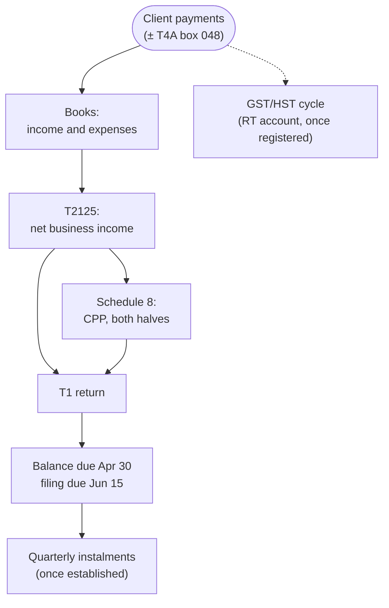

STATUS: AI GENERATED, REVIEW IN PROGRESS

# Sole Proprietorship

**Who this is for**:
- Self-employed individuals (contractors, freelancers, gig workers) operating without a corporation
- CCPC owners following one of the guide's sole-proprietor contrasts to the other side

**TLDR**:
- Sole proprietorship is the default form of business: one taxpayer, no registration event, income on the T1
- This group is side content: the guide's main line is the CCPC
  - These pages keep to the delta from the corporate pages
- The year: books → T2125 → T1 with Schedule 8 CPP → April 30 balance, June 15 filing, instalments once established
- GST/HST runs the same regime as for a corporation, keyed to the individual
- The exit ramp is [Incorporation vs Sole Proprietorship](Incorporation-Vs-Sole-Proprietorship.md), then [Starting Up](../Corporate-Lifecycle/Starting-Up.md)

Limitations:
- Partnerships, employment income, and the broader personal return (credits, benefits) are out of scope
- Ontario is the worked province where provincial rules appear
- The following is my understanding as of 2026

## Where This Sits in the Guide

The guide's main line is the owner-managed CCPC.  
This group serves two readers:
- The not-yet-incorporated contractor, who needs the unincorporated rules themselves
- The corp owner following a contrast link, wanting the other side of a corporate rule

The pages stay at the delta.  
Where a rule is identical to the corporate treatment, they link to the corporate page rather than restate it.  
The corporate pages remain the guide's centre of gravity.  

## The Year in One Diagram

The GST/HST cycle runs in parallel on its own account and returns, exactly as it does for a corporation.  

## Sub-Pages

This page is a hub; these are the sub-pages:
- [Becoming a Sole Proprietor](Becoming-A-Sole-Proprietor.md): default status, the employment-status test, the T4A, the BN, business names, the books
- [T2125 and Expenses](T2125-And-Expenses.md): the statement inside the T1; the deduction gates, business-use-of-home, vehicle, CCA
- [HST for Sole Proprietors](HST-For-Sole-Proprietors.md): the corporate HST delta; registration keyed to the individual, ride-share, the Quick Method
- [CPP and the T1](CPP-And-The-T1.md): both CPP halves via Schedule 8, the EI opt-in, June 15 vs April 30, instalments
- [Incorporation vs Sole Proprietorship](Incorporation-Vs-Sole-Proprietorship.md): the decision page; deferral, PSB, CPP, losses, liability, the LCGE

## Related

- [Overview](../Overview/Overview.md) (the corporate guide's orientation layer)
- [Paying Contractors](../Operations/Paying-Contractors.md) (the payer's side of the T4A)
- [GST/HST](../Operations/HST/HST.md) (the corporate pages these ones delta from)
- [Owner-Corporation Transactions](../Paying-Yourself/Owner-Corporation-Transactions.md) (the corporate mixed-use rules, with the sole-prop contrast)
- [Starting Up](../Corporate-Lifecycle/Starting-Up.md) (incorporating, once decided)
- [Salary vs Dividends](../Paying-Yourself/Salary-Vs-Dividends.md) (the corp-side decision that replaces "it is all yours")

## Citations

- The rules live on the sub-pages, each with its own citations; this page introduces none
