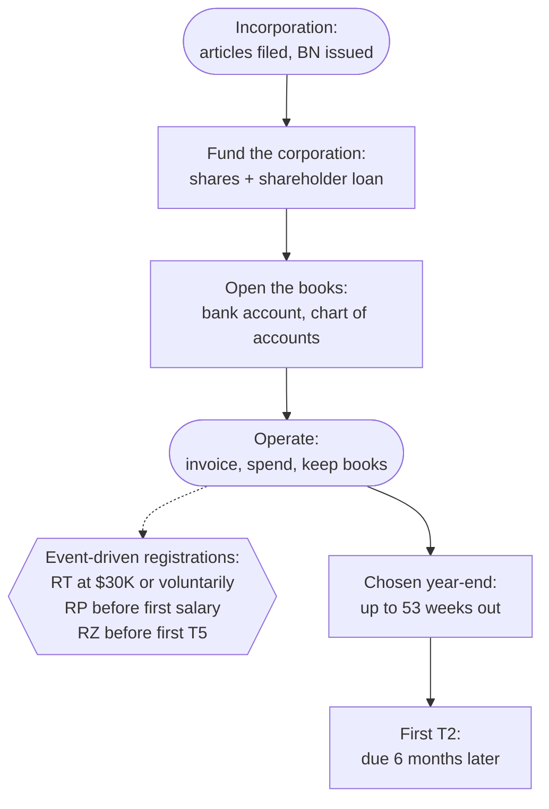

STATUS: AI GENERATED, REVIEW IN PROGRESS

# Starting Up

**Who this is for**:
- Owners about to incorporate a Canadian-controlled private corporation (CCPC), or in its first year
- Setting up the tax accounts, the books, and the first-year decisions that are awkward to change later

**TLDR**:
- Incorporation creates the taxpayer; the *business number* (BN) and program accounts are how CRA sees it
- The first fiscal period can be any length up to 53 weeks; the year-end is chosen simply by filing the first T2 with that date
- Capitalize with nominal share capital plus a shareholder loan: the loan repays tax-free later
- Incorporation costs up to $3,000 are deductible immediately; the excess is Class 14.1
- Assets the owner brings in transfer at fair market value; an appreciated asset can roll in under s.85 instead
- No instalments in year one; the other clocks (HST registration, payroll, slips) start from events, not from incorporation

Limitations:
- Incorporation mechanics (name search, articles, federal vs provincial, the minute book) are in [Corporate Structure](Corporate-Structure/Corporate-Structure.md); this page starts where the corporation exists
- Full s.85 rollover mechanics (elected amounts, boot, share consideration) are out of scope; see [Preferred-share consideration](Business-Acquisition/Preferred-Share-Consideration.md) for the machinery and get professional advice for an incorporation rollover
- The scenario is a new service or consulting CCPC; buying an existing business is [Business Acquisition](Business-Acquisition/Business-Acquisition.md)
- Quebec (Revenu Québec runs its own corporate accounts) is out of scope
- The following is my understanding as of 2026

## From incorporation to the first return

The corporation is a taxpayer from its incorporation date, even with no activity.  
Every year from then on needs a T2 and a corporate-registry annual return, nil or not (see [Filing deadlines](Small-Business-Tax-Overview.md#filing-deadlines-and-instalments)).  

## Business number and program accounts

Incorporating federally (or in most provinces) feeds the corporate registry data to CRA, which issues the nine-digit *business number* and the corporate-tax account automatically.  

The program accounts, and when each is needed (see [Types of accounts](Small-Business-Tax-Overview.md#types-of-accounts)):
- `RC` (corporate income tax): created with the BN; nothing to register
- `RT` (GST/HST): register at the $30,000 small-supplier threshold, or voluntarily from day one — often worthwhile for the ITCs on startup costs (see [HST — Registration](HST.md#registration))
- `RP` (payroll): register before the first salary remittance is due (see [Payroll](Payroll/Payroll.md#rp-program-account))
- `RZ` (information returns): register before filing the first T5 (see [Bookkeeping and information slips](Dividends/Bookkeeping-And-Slips.md))

Register for CRA My Business Account early; assessments, review letters, and most registrations run through it.  

## Choosing the fiscal year-end

The first fiscal period runs from incorporation to any date up to 53 weeks out (ITA [s.249.1](https://laws-lois.justice.gc.ca/eng/acts/I-3.3/section-249.1.html)).  
There is no election form: the year-end is set by the first T2 filed with that date, and after that it is fixed — a change needs CRA's concurrence (s.249.1(7)).  

Considerations, none decisive:
- *December 31*: aligns with the calendar-year T4/T5 slips, the personal T1, and brokerage reporting; the simplest to keep books for
- *An off-calendar date* (e.g. July 31): shifts the T2 season away from the personal-tax crunch, and widens the salary-deferral window (a bonus accrued at a July year-end can be paid up to 180 days later, landing in the owner's next calendar year; see [Payroll — Owner-manager remuneration](Payroll/Payroll.md#owner-manager-remuneration))
- An investment-holding corporation leans December 31: the T3/T5 slips it receives are calendar-year, so any other date forces year-end accruals to split slip income across fiscal years

A deliberately short first year is fine, but it prorates by days:
- The $500,000 SBD business limit (ITA [s.125(5)(b)](https://laws-lois.justice.gc.ca/eng/acts/I-3.3/section-125.html))
- CCA claims (see [CCA — Short fiscal year](Cost-Recovery/Capital-Cost-Allowance/Capital-Cost-Allowance.md#short-fiscal-year))

## Funding the corporation

The standard capitalization for an owner-managed CCPC is nominal share capital plus a shareholder loan:
- *Shares*: a token subscription (e.g. 100 common shares for $100) into `Common shares` (`3500`); this sets the *paid-up capital*, and keeping it nominal is normal (see [Share Capital — PUC](Corporate-Structure/Share-Capital.md#paid-up-capital-puc))
- *Shareholder loan*: the working capital lent in as `Due to shareholder` (`2780`); it repays tax-free at any time, needs no interest, and its mechanics are in [Owner-corporation transactions — Shareholder loans](Owner-Corporation-Transactions.md#shareholder-loans)
- The split matters at the exit, not the start: share capital comes back tax-free only up to PUC, while the loan balance comes back tax-free in full

Opening entries — incorporated May 1, $100 subscription, $10,000 lent in:

| Account | Debit | Credit |
|---|---|---|
| `Cash` (`1001`) | 10,100.00 | |
| `Common shares` (`3500`) | | 100.00 |
| `Due to shareholder` (`2780`) | | 10,000.00 |

## Costs before and around incorporation

*Incorporation costs* (legal fees, name search, registry fees, the minute book):
- The first $3,000 is deductible in the first year (ITA [s.20(1)(b)](https://laws-lois.justice.gc.ca/eng/acts/I-3.3/section-20.html)); any excess is a Class 14.1 addition
- The split and the Schedule 8 row are worked in [CCA Examples — Example 3](Cost-Recovery/Capital-Cost-Allowance/CCA-Examples.md#example-3-class-141-incorporation-expenses)

*Costs the owner paid personally* before the corporate bank account existed:
- Reimburse them through an expense report once the corporation is running: Dr the expense account, Cr `Due to shareholder` (`2780`)
- The corporation deducts them as its own costs when they were incurred for the business it now carries on; keep the receipts in the corporation's records
- Continuing the example, $1,200 of incorporation costs paid personally: Dr `Professional fees` (`8860`) $1,200, Cr `Due to shareholder` (`2780`) $1,200 (fully deductible, under the $3,000 line)

Deductions need a business to deduct against: expenses become deductible once the business has *commenced* (activity directed at earning income — soliciting clients, delivering work), not from some later first-revenue date.  

## Bringing in assets

Equipment the owner already has (a laptop, tools, furniture) can serve the corporation two ways, both covered in [Owner-corporation transactions](Owner-Corporation-Transactions.md#personal-property-used-by-the-business):
- *Owner keeps the asset* and the corporation pays a reasonable rent or usage charge — simplest for anything the owner also uses personally
- *Owner sells it to the corporation at FMV*: the corporation gets a CCA base and the cost credits the shareholder loan; document the transfer (a dated bill of sale and an FMV note)

Selling in at FMV, a $900 laptop:

| Account | Debit | Credit |
|---|---|---|
| `Computer equipment/software` (`1774`) | 900.00 | |
| `Due to shareholder` (`2780`) | | 900.00 |

The Class 50 addition then enters the asset register (see [CCA Tracking](Cost-Recovery/Capital-Cost-Allowance/CCA-Tracking.md)).  

Appreciated property is the exception:
- A sale at FMV triggers the owner's personal gain; an ITA [s.85](https://laws-lois.justice.gc.ca/eng/acts/I-3.3/section-85.html) rollover defers it by electing a transfer price, taking shares back
- The same applies to rolling in a whole sole proprietorship (goodwill, client list, equipment): s.85 is the standard route, and it is professional-advice territory
- On the GST/HST side, the sale of all or substantially all of a business's assets can be relieved by a joint ETA [s.167](https://laws-lois.justice.gc.ca/eng/acts/E-15/section-167.html) election

Personal-tax history does not follow the asset in: the corporation's cost starts at the transfer price, and prior personal use is irrelevant to its books.  

## First-year clocks

- *T2*: due 6 months after the chosen year-end; the balance (if any) is due at 3 months
- *Instalments*: none in the first year — they key off prior-year tax, and there is none (see [Filing deadlines and instalments](Small-Business-Tax-Overview.md#filing-deadlines-and-instalments))
- *GST/HST*: the small-supplier clock counts taxable supplies from the first sale, not from incorporation; registration is required from the quarter the $30,000 rolling threshold is crossed (see [HST — Registration](HST.md#registration))
- *Payroll*: the first remittance is due the 15th of the month after the first salary is paid (see [Payroll](Payroll/Payroll.md))
- *Slips*: the first T4/T5 filings are due the Feb 28 after the first calendar year in which salary or dividends were paid
- *Corporate registry*: the annual-return clock starts at incorporation (federal: within 60 days of each anniversary; Ontario: within 6 months of year-end)

Keeping the books current from day one is cheaper than reconstructing the first year at T2 time; set up the chart of accounts (see [Ledger and Accounts](Ledger-And-Accounts.md)) before the first transaction.  

## Related

- [Corporate Structure](Corporate-Structure/Corporate-Structure.md)
- [Share Capital](Corporate-Structure/Share-Capital.md)
- [Owner-corporation transactions](Owner-Corporation-Transactions.md)
- [Ledger and Accounts](Ledger-And-Accounts.md)
- [Payroll](Payroll/Payroll.md)
- [HST](HST.md)
- [Small Business Tax Overview](Small-Business-Tax-Overview.md)
- [Winding Down](Winding-Down.md)

## Citations

- Income Tax Act (R.S.C., 1985, c. 1 (5th Supp.)):
  - [s.249.1](https://laws-lois.justice.gc.ca/eng/acts/I-3.3/section-249.1.html) - fiscal period: up to 53 weeks; s.249.1(7) - change of fiscal period needs CRA's concurrence
  - [s.125(5)(b)](https://laws-lois.justice.gc.ca/eng/acts/I-3.3/section-125.html) - business limit prorated for a tax year under 51 weeks
  - [s.20(1)(b)](https://laws-lois.justice.gc.ca/eng/acts/I-3.3/section-20.html) - deduction for the first $3,000 of incorporation expenses
  - [s.85](https://laws-lois.justice.gc.ca/eng/acts/I-3.3/section-85.html) - rollover of property to a corporation
  - [s.69(1)](https://laws-lois.justice.gc.ca/eng/acts/I-3.3/section-69.html) - non-arm's-length transfers deemed at fair market value
- Excise Tax Act (R.S.C., 1985, c. E-15):
  - [s.167](https://laws-lois.justice.gc.ca/eng/acts/E-15/section-167.html) - joint election on the sale of a business's assets
  - [s.148](https://laws-lois.justice.gc.ca/eng/acts/E-15/section-148.html) - small-supplier threshold
- CRA - Business number registration: https://www.canada.ca/en/revenue-agency/services/tax/businesses/topics/registering-your-business.html

## TODO

- Verify s.125(5)(b) as the business-limit proration provision and the 51-week trigger wording
- Verify the business-commencement standard (activity directed at earning income) against CRA's position (IT-364, archived) before sign-off
- Verify that provincial incorporation feeds the BN automatically for Ontario (the federal path is automatic; provincial registry integration varies)
- Add a worked first-short-year example (incorporation to Dec 31) tying together the prorated business limit, prorated CCA, and the first T2 dates
- Add My Business Account registration screenshots once available (move to a `Starting-Up/` folder when media lands)
