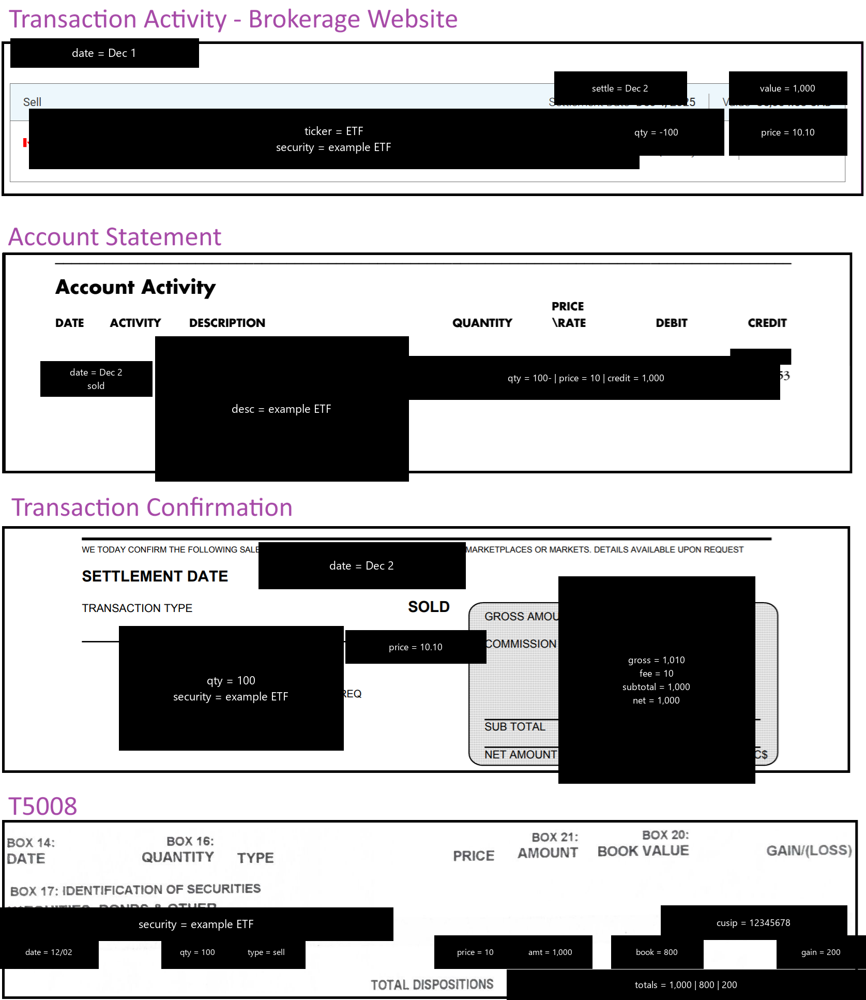
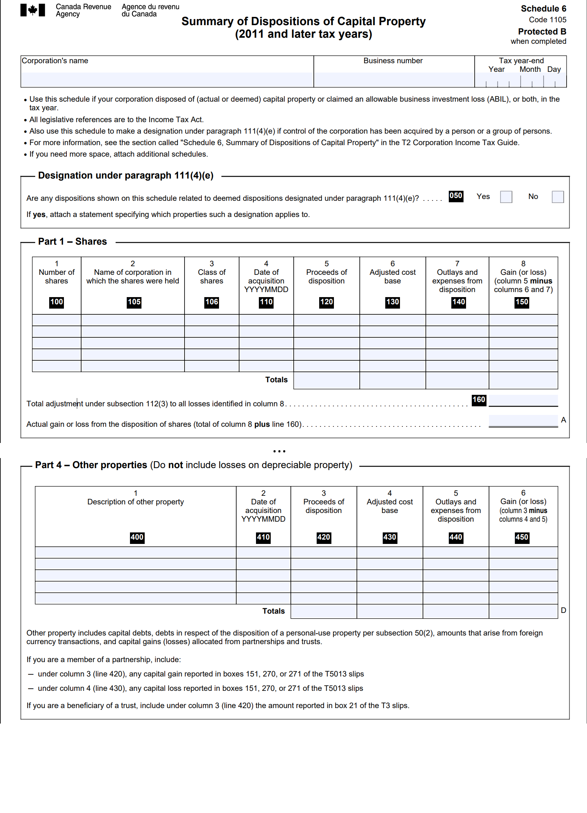

# T5008 Capital gain or loss from selling an investment

**Who this is for**: owners of a Canadian-controlled private corporation (CCPC) who get a T5008 from selling ETF or stock investments.  

Limitations:
- Covers stocks and ETFs sold in a corporate brokerage account; other instruments (real estate, etc.) are out of scope and might have different or additional rules
- Tax information can change over time (e.g. the capital gains inclusion rate was going to increase to 2/3, before the proposal was cancelled)
- The following is my understanding as of 2026

## T5008 boxes

When you sell an investment in a corporate brokerage account, you will see the following:
- Box 16: Quantity of securities
- Box 21: Proceeds of disposition or settlement amount
  - This document assumes the T5008 Box 21 amount is net-of-fees
  - If you're not sure whether the amount is net-of-fees, compare it with the trade confirmation
  - If you see the gross amount (and the trade confirmation has a commission), subtract the commission; it belongs in Schedule 6 (S6) as "Outlays and expenses from disposition", not folded into Box 21
- Box 17: Identification of securities
- Box 20: Cost or book value
- Box 14: Date - not used directly for tax reporting
- Box 15: Type code of securities - optional (might be missing), "SHS" for shares and "UNT" for units

In addition, you will also need the earliest date of continuous ownership of the security (entered in S6 / Part 1): the date of the first purchase that contributed to the current pooled position, tracked in your ACB spreadsheet; see [Adjusted-Cost-Base-Tracking.md](../Adjusted-Cost-Base/Adjusted-Cost-Base-Tracking.md)

## Example

Lifecycle of a sale:
- Enter the order, and see the Sell record in the brokerage website
- See the trade in the monthly statement (can happen before or after following)
- Receive a trade confirmation, possibly as a PDF on a website, this is brokerage-specific
- Receive a T5008 with amounts that should match what was in the prior statements
- Note: sometimes amounts will slightly differ; a plug entry can be used to track the difference

## Relevant general ledger accounts

Example tree of accounts that can be used for T5008 bookkeeping (with account codes aligned with GIFI):
<table>
  <thead>
    <tr><th>Account</th><th>Code</th><th>Description</th></tr>
  </thead>
  <tbody>
    <tr><td>Assets</td><td>2599-valid</td><td></td></tr>
    <tr><td nowrap>&ensp; └ Current Assets</td><td>1599-calc</td><td></td></tr>
    <tr><td nowrap>&ensp; &ensp; └ Cash and deposits</td><td>1000</td><td></td></tr>
    <tr><td nowrap>&ensp; &ensp; &ensp; └ Deposits - investment</td><td>1002-2</td><td>Cash sitting in investment account</td></tr>
    <tr><td nowrap>&ensp; └ Long-term investments</td><td>2300</td><td></td></tr>
    <tr><td nowrap>&ensp; &ensp; └ Canadian shares</td><td>2303</td><td>Investment – Securities</td></tr>
    <tr><td>Revenue</td><td>8299-valid</td><td></td></tr>
    <tr><td nowrap>&ensp; └ Realized gains/losses on disposal of assets</td><td>8210</td><td>Gain/loss or profit/loss on disposal/sale of capital assets</td></tr>
    <tr><td nowrap>&ensp; &ensp; └ Realized gains/losses on sale of investments</td><td>8211</td><td>Profit/loss on disposal of investments or marketable securities</td></tr>
    <tr><td nowrap>&ensp; &ensp; &ensp; └ Disposition of capital property</td><td>8211-1</td><td>Comes from T5008 - Amount minus ACB</td></tr>
  </tbody>
</table>

In the ledger account tree, we want to roll up to the GIFI codes, but can also add granularity where the codes are too coarse-grained.  
The account code is based on the GIFI code, but it can also have a -<suffix> for tracking.  
GIFI codes: https://www.canada.ca/en/revenue-agency/services/forms-publications/publications/rc4088/general-index-financial-information-gifi.html

## Ledger entry

ACB = your own independently calculated Adjusted Cost Base  
Box 20 (cost or book value) might be wrong, in which case it would be different from your calculated ACB.  

"Gain or loss" = Box 21 - ACB, being a gain if zero or positive, and a loss if negative  

Gain example (Box 21 = $1,100, ACB = $1,000):  
Debit: `Deposits - investment` (1002-2) = $1,100  
Credit: `Investment – Securities` (2303) = $1,000  
Credit: `Disposition of capital property` (8211-1) = $100  

Loss example (Box 21 = $900, ACB = $1,000):  
Debit: `Deposits - investment` (1002-2) = $900  
Debit: `Disposition of capital property` (8211-1) = $100  
Credit: `Investment – Securities` (2303) = $1,000  

The cost base decreases by the amount initially spent, and the remainder is a capital gain or loss.  
Your brokerage account should promptly display the new cost base amount (for sales; T3-driven adjustments such as ROC and phantom distributions may lag until March/April; see T3.md).  

When you buy, the brokerage commissions increase ACB; they are capitalized into ACB rather than entered separately on Schedule 6.  
However, when selling, the commissions reduce proceeds of disposition; they are not part of the ACB.  

## T2 - S6

When you sell an investment, you will need to report it in "S6 - Summary of Dispositions of Capital Property" of the T2 (in addition to the above ledger entries).  
Report the ACB from your own records. Do not use T5008 Box 20 (cost or book value), which may differ from your calculated ACB.  
If a disposition occurred but no T5008 was received (rare, but possible), report the sale on S6 using your own trade records and independently calculated ACB.  

Use either "Part 1 - Shares" or "Part 4 - Other properties", depending on the instrument:
- Stocks and corporate class ETFs (like HSAV) belong to "Part 1 - Shares"
- ETFs structured as a Mutual Fund Trust (like XEI) belong to "Part 4 - Other properties"
- You can determine if an investment is a stock or trust by looking at T5008 Box 15 ("SHS" for shares and "UNT" for units)
- Sometimes this is not included, and you can check the prospectus or CDS filing (most Canadian-listed equity ETFs are Trust units)
- If you use the wrong section, the capital gains tax will be the same, but there could be other implications (out of scope for this document) 

S6 requires a "Date of acquisition" (which does not affect the gain calculation itself).  
For pooled securities with averaged ACB, you can use the date of the very first purchase that contributed to the current pool of units being sold; this date convention is conservative in the absence of specific CRA guidance.  
Securities must be priced at the Weighted Average Cost (WAC, not FIFO or LIFO), per ITA [s.47(1)](https://laws-lois.justice.gc.ca/eng/acts/I-3.3/section-47.html).  
For a partial sale (e.g. selling 60 of 100 units), the per-unit ACB is unchanged; only the Remaining Quantity and total ACB decrease by (units sold × per-unit ACB).  

For stocks and corporate class ETFs, use "Part 1 - Shares" and add a row with the following values:
- Column 100: 1 Number of shares = Box 16
- Column 105: 2 Name of corporation in which the shares were held = Box 17
- Column 106: 3 Class of shares = leave blank
- Column 110: 4 Date of acquisition = earliest date of continuous holding of security
- Column 120: 5 Proceeds of disposition = Box 21
- Column 130: 6 Adjusted cost base = ACB from your own calculation, may be different from Box 20

For ETFs that are structured as trusts (most ETFs), use "Part 4 - Other properties":
- Column 400: 1 Description of property = Box 17
- Column 410: 2 Date of acquisition = earliest date of continuous holding of security
- Column 420: 3 Proceeds of disposition = Box 21
- Column 430: 4 Adjusted cost base = ACB from your own calculation, may be different from Box 20

## Related

- [Small Business Tax Overview](../Small-Business-Tax-Overview.md)
- [Adjusted Cost Base](../Adjusted-Cost-Base/Adjusted-Cost-Base.md)
- [Capital Dividend Account](../Capital-Dividend-Account/Capital-Dividend-Account.md)

## Citations

- Income Tax Act (R.S.C., 1985, c. 1 (5th Supp.)):
  - [s.40(1)](https://laws-lois.justice.gc.ca/eng/acts/I-3.3/section-40.html) - capital gain and capital loss formula, including outlays and expenses on disposition
  - [s.47(1)](https://laws-lois.justice.gc.ca/eng/acts/I-3.3/section-47.html) - identical properties: pooled average cost (not FIFO or LIFO)
  - [s.54](https://laws-lois.justice.gc.ca/eng/acts/I-3.3/section-54.html) - definitions of "adjusted cost base" and "proceeds of disposition"
- CRA Form T5008 - Statement of Securities Transactions: https://www.canada.ca/en/revenue-agency/services/forms-publications/forms/t5008.html
- CRA T2 S6 - Summary of Dispositions of Capital Property: https://www.canada.ca/en/revenue-agency/services/forms-publications/forms/t2sch6.html
- CRA RC4088 - General Index of Financial Information (GIFI): https://www.canada.ca/en/revenue-agency/services/forms-publications/publications/rc4088/general-index-financial-information-gifi.html

